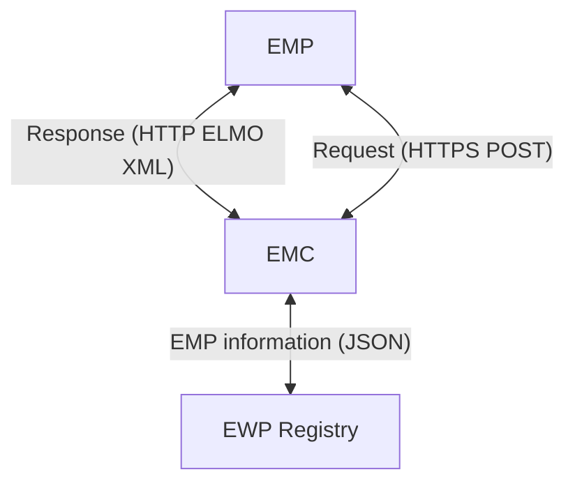

# EMREX: Europese standaard voor gegevensuitwisseling in het onderwijs

[EMREX](https://emrex.eu/) is een gestandaardiseerd Europees netwerk, ontworpen om de uitwisseling van studieresultaten (diploma's, certificaten, etc.) tussen onderwijsinstellingen en andere belanghebbende organisaties te vergemakkelijken. Het speelt een belangrijke rol in het internationale onderwijslandschap, omdat het studenten en onderwijsinstellingen in staat stelt om studiegegevens snel, veilig en betrouwbaar te delen.

<!-- truncate -->

## Achtergrond

Het EMREX-initiatief begon in 2015 als een project gefinancierd door het [Erasmus+ programma](https://www.erasmusplus.nl) van de Europese Unie. Het doel was om de mobiliteit van studenten te ondersteunen door een uniforme oplossing te ontwikkelen voor de overdracht van studieresultaten. Voorheen moesten studenten vaak complexe en tijdrovende procedures doorlopen om hun studieresultaten over te dragen wanneer ze aan een uitwisselingsprogramma deelnamen of van onderwijsinstelling wisselden. Met EMREX is het proces gestroomlijnd en grotendeels geautomatiseerd.

Sinds eind 2023 is EMREX opgenomen in de EU-verordering voor de [Single Digital Gateway](https://www.digitaleoverheid.nl/overzicht-van-alle-onderwerpen/europa/single-digitale-gateway/) naast het [Once Only Technical Systeem (OOTS)](https://ec.europa.eu/digital-building-blocks/sites/display/DIGITAL/Once+Only+Technical+System). De EU schrijft voor dat gegevens tussen lidstaten conform bepaalde semantische en technische regels worden uitgewisseld. Organisaties werkzaam binnen de onderwijssector kunnen in het kader van de verordening EMREX gebruiken. Voor gegevensuitwisseling met andere sectoren heeft de EU [een brug ontwikkeld](https://ec.europa.eu/digital-building-blocks/sites/pages/viewpage.action?pageId=713528198), zodat gegevens ook buiten de onderwijssector benut kunnen worden.

## Werking

EMREX onderkent de volgende 3 componenten:

- **EMP (EMREX Data Provider)**: Een EMP is een koppelvlak (API), waarmee studieresultaten geautomatiseerd kunnen worden opgevraagd. In de meeste gevallen biedt ieder deelnemend land een eigen EMP aan, omdat registratie van studieresultaten, maar ook IAM (identity & access management) van studenten vaak nationaal is geregeld.

- **EMC (EMREX Client)**: Een EMC is een client applicatie waarmee studenten hun eigen studieresultaten kunnen inzien. Met een EMC applicatie kan een student zelf selecteren welke EMP's er geraadpleegd dienen te worden, waarna de student de beschikbare studieresultaten kan selecteren en inzien.

- **EWP Registry**: Het EWP Registry is een centraal register waarin alle beschikbare EMP's en hun locaties worden bijgehouden, zodat EMC applicaties deze makkelijk kunnen vinden. Ook worden hier de public keys van EMP's bijgehouden, waarmee EMC applicaties digitale handtekeningen van documenten kunnen verifiëren.

Het EMP Registry is het enige centrale component, in tegenstelling tot EMC's en EMP's die juist decentraal van aard zijn.

Het proces gaat in de basis als volgt:

1. De student start proces bij organisatie met een EMC die onderwijsgegevens wenst te ontvangen (bijv. inschrijven hoger onderwijs).
1. De EMC raadpleegt het centrale EWP Registry om een lijst van EMPs te tonen.
1. De student kiest de EMP van het land waar de studieresultaten zijn behaald.
1. De EMC raadpleegt de EMP om een overzicht van alle beschikbare studieresultaten op te halen.
1. De student kiest de gewenste studieresultaten.
1. De EMC stuurt een verzoek naar de EMP voor de gekozen studieresultaten, voorzien van een callback URL.
1. De EMP verzamelt de studieresultaten en stuurt deze retour naar de callback URL.
1. De EMC verifieert de digitale handtekening van de ontvangen studieresultaten.

De uitwisseling tussen de EMC en EMP is gestandaardiseerd middels het [ELMO XML formaat](https://github.com/emrex-eu/elmo-schemas) en versleuteld middels standaard TLS-encryptie.

## Nederlandse implementatie

Al sinds 2018 biedt de Dienst Uitvoering Onderwijs (DUO) de Nederlandse EMP-implementatie [Mijn diploma's](https://duo.nl/particulier/extract-of-your-diploma.jsp) aan, welke meer dan 10 miljoen diploma's beschikbaar stelt aan het EMREX netwerk. Deze EMP fungeert als de schakel tussen onderwijsinstellingen in Nederland en die in andere deelnemende landen, en maakt zo de uitwisseling van studieresultaten mogelijk.

Door DUO's deelname aan EMREX kunnen Nederlandse studenten hun gegevens veilig en snel delen met buitenlandse (onderwijs)instellingen. Dit is vooral handig voor studenten die tijdelijk in het buitenland studeren of een buitenlandse studieperiode willen laten erkennen in Nederland. Bovendien helpt het instellingen in het erkennen van in het buitenland behaalde resultaten in een betrouwbaar en uniform formaat, wat de administratieve procedures aanzienlijk vereenvoudigt.

Daarnaast wordt EMREX ook gebruikt voor mobiliteit van werkenden. Werkgevers kunnen hiermee de onderwijsresultaten van sollicitanten verifiëren, wat een krachtig middel is ter voorkoming van diplomafraude.