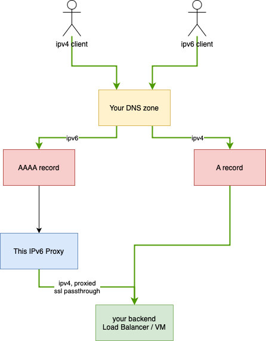

# Generieke IPv6 proxy voor Azure

Azure Kubernetes Service ondersteunt momenteel geen IPv6 als je network policies
wilt gebruiken
([bron](https://learn.microsoft.com/en-gb/azure/aks/configure-kubenet-dual-stack?tabs=azure-cli%2Ckubectl#limitations)).
Om de applicaties die in het AKS-cluster draaien toch beschikbaar te maken via
IPv6, hebben we bij Digilab een generieke IPv6-proxy ontwikkeld. Deze is
gepubliceerd als Terraform-module en eenvoudig om te gebruiken. De module zet
een dual-stack virtuele machine op die te benaderen is via IPv6 en als proxy
fungeert naar een IPv4-bestemming, zoals een load balancer voor een AKS-cluster
of een andere IPv4-bestemming.

<!-- truncate -->

## Achtergrond

Als je een website bezoekt, wordt er op de achtergrond een IP-adres opgezocht
dat hoort bij de server waar de website op staat. Dit adres is uniek en bestaat
uit vier triplets van getallen, gescheiden door punten, bijvoorbeeld
`20.8.247.255`. Dit is een IPv4-adres. Het aantal mogelijke adressen is beperkt
(~4.3 miljard), en daarom is er een nieuw type adres ontwikkeld: IPv6. Dit adres
bestaat uit acht groepen van vier hexadecimale cijfers, gescheiden door dubbele
punten. Het aantal mogelijke adressen is hierdoor veel groter. De Nederlandse
overheid schrijft voor om alle overheidswebsites beschikbaar te maken via IPv6.
Dit is echter niet altijd mogelijk omdat de adoptie van IPv6 nog niet volwassen
is. Daarom heeft het team van Digilab een generieke IPv6 proxy ontwikkeld. Deze
proxy kun je plaatsen voor een IPv4 bestemming, waardoor je website wel via IPv6
bereikbaar is, maar er geen aanpassingen nodig zijn aan je bestaande
infrastructuur.

## Hoe werkt het?

De Terraform-module zet een virtuele machine op die zowel IPv4 als IPv6
ondersteunt. De machine krijgt een publiek bereikbaar IPv6-adres. Je kunt dit
adres gebruiken voor het IPv6 `AAAA` DNS-record. De machine ontvangt een
IPv6-request en maakt vervolgens via IPv4 een request naar de IPv4-bestemming.
Aangezien de machine aan TLS-passthrough doet is de machine niet in staat om het
verkeer te inspecteren.



Op deze manier is je website beschikbaar via IPv6, zonder dat je aanpassingen
hoeft te doen aan je bestaande (IPv4-only) infrastructuur.

## Hoe kan ik het gebruiken?

We gaan er van uit dat je reeds Terraform gebruikt om je Azure infrastructuur te
beheren. Vervolgens kun je met een nieuwe module deze module aanroepen:

```terraform
module "ipv6_proxy" {
  source = "git@gitlab.com:digilab.overheid.nl/ecosystem/terraform-modules/azure-generic-ipv6-proxy.git"

  resource_group_name = "my-ipv6-proxy"
  location            = "my-location"
  backend_ips         = ["1.2.3.4"]
}
```

De module ondersteunt het ook gelijk een `AAAA` DNS-record aan te maken voor het
IPv6-adres dat de proxy toegewezen heeft gekregen. Zie de voorbeelden in de
repository van de module om te kijken hoe dat werkt.

## Limitaties

- doordat er een enkele virtuele machine wordt gebruikt, creëer je een Single
  Point of Failure.
- doordat er een enkele virtuele machine wordt gebruikt, is de oplossing niet
  schaalbaar.
- door de TLS-passthrough (en geen ondersteuning voor SNI), kun je geen backend
  selecteren op basis van de hostname / domeinnaam. Al het verkeer gaat naar
  dezelfde bestemming, en pas daar kan het onderscheid gemaakt worden.

[Bekijk de repo](https://gitlab.com/digilab.overheid.nl/ecosystem/terraform-modules/azure-generic-ipv6-proxy)

---

_Wil je gewoon meer weten over Digilab? Neem
[contact](https://digilab.overheid.nl/contact/) op of log met je Pleio-account
in bij onze [online community](https://digilab.overheid.nl/chat/)._

<!-- prettier-ignore -->
:::note[Dit artikel verscheen eerder op [digilab.overheid.nl](https://digilab.overheid.nl/blog/azure-generieke-ipv6-proxy/)]
:::
