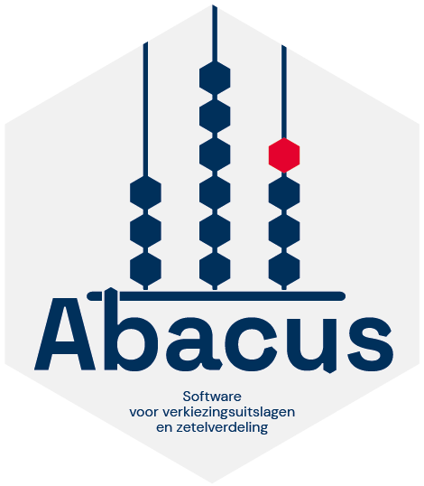

# Deze goede redenen heeft de Kiesraad om Rust te gebruiken

Toen ik kennis maakte met het project [Abacus](https://github.com/kiesraad/abacus) van De Kiesraad was ik direct nieuwsgierig naar hoe de programmeertaal Rust daar bevalt en waarom het goed werkt voor hun project. Daarom toog ik naar Den Haag, waar de Kiesraad huist, om Mark Janssen en Ellen van Leeuwen van Abacus hier eens over uit te vragen.

*Mark Janssen: Lead Developer (links) en Ellen van Leeuwen: Software Developer (rechts)*

<!-- truncate -->

:::success[**TL;DR**]

Rust is voor de Kiesraad een geschikte taal omdat het haar helpt **bugvrije software** op te leveren. Ook is het een expressieve taal met een uitgebreid **typesystem** waardoor je er complexe concepten goed in kan vatten. De tooling om Rust heen is erg hulpvaardig en de linter Clippy geeft handige tips voor het correct gebruik van Rust. Wel is het een taal met een **jong ecosysteem** waardoor je soms specifieke functionaliteiten binnen libraries mist.

:::

## Hoe heb je kennisgemaakt met Rust?
Mark: "In 2021 leerde ik de taal kennen toen ik met een hobbyproject bezig was om mijn slimme meter thuis uit te lezen, ik kende het op zich al langer: uit blogposts en van [hackernews](https://news.ycombinator.com/) bijvoorbeeld, maar ik had er nog nooit iets mee gedaan. Dit projectje was een goed excuus om het eens een keer te proberen. Daarna heb ik er ook de [Advent of Code](https://adventofcode.com/) mee gedaan om er wat dieper in te duiken. Het bleek wel pittig om met een nieuwe taal uitdagende puzzels op te lossen dus ik weet niet of ik dit iedereen zou aanraden, maar het was wel heel leuk en zo ben ik het ook meer gaan gebruiken. Uiteindelijk dus ook voor wat grotere projecten, en nu ook dus bij de Kiesraad."

Ellen: "Ik kwam er ooit mee in aanraking tijdens mijn studie. Ik had in 2015 een studiegenoot die tijdens het vak compilerbouw besloot om niet het aangeboden framework te gebruiken om de compiler te bouwen maar om het helemaal from scratch in Rust te bouwen. Destijds dacht ik, bij hem zit een steekje los. Maar uiteindelijk bleek hij dus zo gek nog niet. Hier bij de Kiesraad kwam ik er pas weer mee in aanraking. In mijn vorige baan gebruikten we Python en JavaScript. Maar omdat ik wel van een uitdaging houd leek het me leuk om een nieuwe taal te leren. En ik hoorde goede dingen over Rust."

### Rustlings in Rustrover
Ellen: "Tijdens mijn eerste maand ben ik begonnen met de standaard Rust oefenomgeving: [Rustlings](https://blog.jetbrains.com/education/2019/12/19/rustlings-course-adaptation/). Deze kan je helemaal doorlopen in [RustRover](https://www.jetbrains.com/rust/). Zo heb ik langzaamaan meer en meer features van de taal leren kennen. Daarnaast leerde ik natuurlijk veel van mijn collega's."

## Over Abacus
[Abacus](https://github.com/kiesraad/abacus) is een applicatie voor het vaststellen van verkiezingsuitslagen. Binnen het proces van de Nederlandse verkiezingsuitslagen is het **papieren proces** leidend. Dit betekent dat er papieren stembiljetten zijn en dat deze met de hand worden geteld op alle stembureaus als de stembussen zijn gesloten. Vervolgens worden ze op een centraal punt in elke gemeente, ter controle opnieuw met de hand geteld. Daarna worden alle optellingen van de stembureaus ingevoerd in Abacus.

### Niet in de cloud: stemmen tellen via een lokaal netwerk
Elke gemeente draait draait één lokale instantie van Abacus. Abacus draait lokaal, en dus niet in de cloud omdat het systeem volledig "air-gapped" dient te blijven. Alle data blijft dus lokaal. Dit is waar Rust om de hoek komt kijken.

### Compilen naar een executable: een voordeel van Rust 
Mark: "Rust stelt je namelijk in staat code gemakkelijk te compilen naar een native executable voor je operating system (in overheidsland veelal Windows) zonder dat je verdere dependencies nodig hebt. Een bekende onhandige dependency die voor veel legacy software nodig is, is de "Java virtual machine". 

Binnen een gemeente heb je bij het tellen een aantal laptops of computers nodig waar mensen de uitslagen op invoeren. Afhankelijk van hoe groot de gemeente is heb je meer of minder computers. Er wordt een lokaal netwerkje opgezet met één server, alle computers verbinden hier mee. Het handige is dat mensen de executable (.exe) die wij ze geven eigenhandig kunnen installeren en verder niets nodig hebben."

## Hoe verschilt Rust ten opzichte van andere talen?
Mark: "Ik heb hiervoor heel veel in Go geprogrammeerd en daarvoor veel Java en wat Python. Dit heeft er toe geleid dat ik een voorkeur voor statisch getypeerde talen heb gekregen. Statisch getypeerde talen kunnen je goed helpen omdat ze meer bugs door je compiler afvangen. Java kan dat al best goed. Maar Python is hierin weer helemaal niet strict. In zo'n taal ben je meer afhankelijk van een goede testcoverage om erachter te komen dat je code geen bugs bevat."

### Statische typechecking
Go is ook een taal met statische typechecking, maar toen ik ermee begon was dit nog wat basic. Rust heeft een heel uitgebreid typesystem, veel uitgebreider dan bijvoorbeeld Java.
Een uitgebreid typesystem geeft je de flexibiliteit om dingen door de compiler af te laten vangen waar dat met andere talen echt moeilijker is.

> "Een uitgebreid typesystem geeft je de flexibiliteit om dingen door de compiler af te laten vangen waar dat met andere talen echt moeilijker is."
>
> — Mark Janssen, De Kiesraad

### Aan Ellen: welke verschillen zie je ten opzichte van Python?

Ellen: "Rust heeft veel handige concepten zoals iterators en dat soort dingen. Ik moest deze concepten dus allemaal leren kennen. Je hebt dus niet alleen maar, for loops en while loops, maar ook andere soorten iterators. Om het goed te leren ga ik vaak met een van de Rust-experts in ons team zitten om naar een Pull Request te kijken en dan mijn code wat meer Rust-achtig te maken. Zodat ik ook de meer echte native Rust dingen leer en ga gebruiken."

### De compiler: eerder bugs aan het licht
"Een voordeel aan Rust wat mij betreft is dat je compile-time type-errors krijgt. Dit voorkomt bugs en over het algemeen kom je er heel snel achter als er een bug in je code zit. Natuurlijk moet je alles goed afdichten met tests."

"Natuurlijk heeft Rust een steilere learning curve dan dynamisch-getypeerde programmeertalen, maar na er bijna een jaar mee gewerkt te hebben kan ik zeggen: het is echt een fijne taal om mee te werken. Het is gewoon minder bug prone dan andere talen."

> "Natuurlijk heeft Rust een steilere learning curve dynamisch-getypeerde programmeertalen. maar na er bijna een jaar mee gewerkt te hebben kan ik zeggen: het is echt een fijne taal om mee te werken. Het is gewoon minder bug prone dan andere talen."
>
> — Ellen van Leeuwen, De Kiesraad

## Jullie zetten de wet direct om in code: is Rust daar specifiek geschikt voor?

Mark: "Ik denk niet dat Rust specifiek extra geschikt is voor deze use-case maar het heeft er wel wat goede eigenschappen voor. Zo is het een expressieve taal waardoor je dingen als de wet wel op een goede manier kan vatten. Ook denk ik dat een goed leesbare taal is dus dat is goed voor de transparantie van de software."

## Is dat iets waar jullie mee bezig zijn; onze code moet transparant zijn voor mensen van buitenaf?
Zeker: we leveren alle features goed gedocumenteerd op en denken goed na over goed opgesplitste, behapbare functies. Wat we heel leuk vinden is dat je dan soms hulp krijgt. Zo hebben we een feature ontwikkeld voor de zetelverdeling. Een paar collega's van onze teamleden van [Tweede Golf](https://tweedegolf.nl/en) (Rust-bureau uit Nijmegen) zijn toen in deze feature gedoken en vonden een aantal bugs. Zo testten ze onze code eigenlijk gratis. Zulke samenwerkingen zijn heel erg leuk."

## Hoe is julie ervaring met Cargo; de Package Manager van Rust?
We zijn erg tevreden met [Cargo](https://github.com/rust-lang/cargo). Het feit dat de package manager wordt meegeleverd met de taal scheelt veel. Het zorgt ervoor dat alle contributies aan package-managers zich concentreren in één package-manager. Dit zorgt voor een goed en duidelijk eco-systeem.

### Het pinnen van versies met hashes
Cargo ondersteunt het pinnen van dependencies. Hierbij wordt er een hash gegenereerd die garandeert dat je dezelfde dependency binnenhaalt als die je hebt vastgezet, wanneer je dependencies opnieuw installeert. Deze hashes worden namelijk gebaseerd op basis van een fingerprint van de code. Als er is gerommeld met de code klopt de hash niet meer en trekt Cargo aan de bel.
 
### Een jonger ecosysteem betekent minder uitgebreide libraries voor legacy standaarden (bijvoorbeeld XML)
In het ecosystem vind je al redelijk wat volwassen libraries, bijvoorbeeld onze [HTTP library](https://github.com/kiesraad/abacus/blob/eaa9d3e3b0e3ac0d484c201085f1a614f33af29f/backend/Cargo.toml#L26).
Ook gebruiken we [typst](https://github.com/kiesraad/abacus/blob/eaa9d3e3b0e3ac0d484c201085f1a614f33af29f/backend/Cargo.toml#L39) voor het maken van pdf-bestanden. 

Een nadeel dat we ondervinden is dat we voor het verwerken van XML nog geen fantastische library hebben. Dit terwijl we dat wel nodig hebben om te publiceren in de Election Markup Language, De Nederlandse standaard voor het publiceren van verkiezingsuitslagen en het uitwisselen ervan. Je merkt dat de meest gebruikte XML library voor Rust ([`quick-xml`](https://github.com/kiesraad/abacus/blob/eaa9d3e3b0e3ac0d484c201085f1a614f33af29f/backend/Cargo.toml#L40)) wel voldoet, maar minder volwassen en uitgebreid is dan wat je in andere talen vindt. Dus in een oudere taal als Java of als.NET. Wel was `quick-xml` volwassen genoeg om bugvrij te zijn.

*Mark Janssen: Lead Developer (links) en Ellen van Leeuwen: Software Developer (rechts)*

## Wat voor IDE en tooling gebruiken jullie?
Ellen: "Ik gebruik Rust Rover, dat is van JetBrains. Dat is in principe een Rust dedicated IDE, maar ondersteunt gelukkig ook TypeScript. Ik kan dus alles in één IDE doen. Rust Rover krijgt ook veel updates en is stabiel."

### Clippy: een behulpzame linter geïnspireerd op de  aimabele assistent van Microsoft Word '97
Mark: "De linter die geshipt wordt met Rust heet Clippy. Deze assistent heeft helaas geen geanimeerd karakter maar doet wel goede code-suggesties. Je ziet alle suggesties netjes in je terminal." Ellen beaamt dat de suggesties van Clippy erg handig zijn: "Dat is echt wel een van de grote voordelen van Rust. Dat het hele goede suggestieve error messages en linter messages heeft. Ook heeft het goede inline suggesties, code completion, renaming en refactoring opties. Clippy zit trouwens ook ingebouwd in RustRover."

### Cargo Test Framework
Cargo test framework, de goto test-suite is onderdeel van de Rust programmeertaal zelf. Waarbij het in andere talen lastig is om te kiezen omdat er legio test-frameworks beschikbaar zijn, hoeft je bij Rust niet te kiezen. Het voordeel is dat iedereen het gebruikt en daardoor is het goed gedocumenteerd. 

### VS Code & Rust-analyzer
Nog een prima optie qua IDE is VS Code met de [rust-analyzer extensie](https://marketplace.visualstudio.com/items?itemName=rust-lang.rust-analyzer). Deze extensie werkt trouwens ook [met Emacs en Vim](https://rust-analyzer.github.io/), voor de wat meer die-hard gebruikers.

### Zed.dev
Nog een leuk (ambitieus) initiatief om te noemen is de [Zed editor](https://zed.dev/). Deze editor is volledig in Rust geschreven en is daardoor erg snel. Inmiddels zit deze editor op versie `v0.177.10` dus het lijkt er wel op dat deze nog eventjes in beta zal blijven. Mark: "Misschien wel een eternal beta".

## Conclusie
Rust is voor de Kiesraad een fijne taal omdat het ze helpt bugvrije software op te leveren. Ook is het een expressieve taal met een uitgebreid typesystem waardoor je er complexe concepten goed in kan vatten. De tooling om Rust heen is erg hulpvaardig en de linter Clippy geeft handige tips voor het correct gebruik van Rust. Wel is het een taal met een jong ecosysteem waardoor je soms specifieke functionaliteiten binnen libraries zou kunnen missen.
 
### ✅ Voordelen van Rust voor de Kiesraad
- Rust geeft de mogelijkheid om makkelijk executables (.exe etc.) to compilen zonder andere dependencies
- Rust is een taal die erg goed performt en zeer efficiënte machinecode genereert
- Rust heeft een uitgebreid typesysteem, waardoor de compiler fouten vroegtijdig detecteert
- Rust linter Clippy geeft hints voor correct gebruik van Rust

### 🤔 De nadelen
- Heeft een steilere learning-curve dan dynamisch-getypeerde talen zoals Python
- Heeft een jonger ecosysteem dus biedt minder mogelijkheden om te werken met legacy-standaarden zoals XML

## Verdiep je verder
- [Onderbouwing van De Kiesraad voor keuze van Rust](https://github.com/kiesraad/abacus/blob/main/documentatie/softwarearchitectuur/overwegingen-talen-en-frameworks.md#gemaakte-keuze-backend-rust)
- [Github van de Kiesraad](https://github.com/kiesraad/)
- [Rustlings.cool](https://rustlings.cool/)