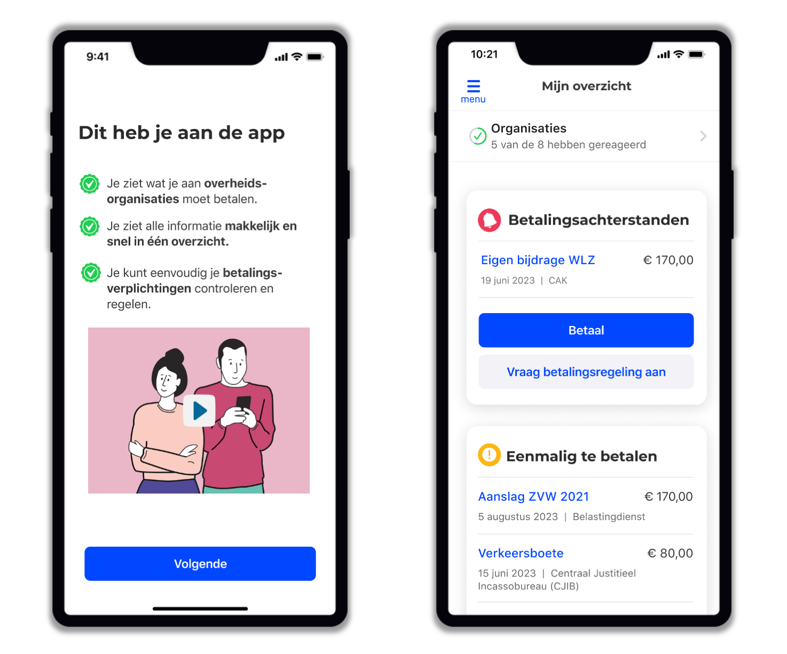
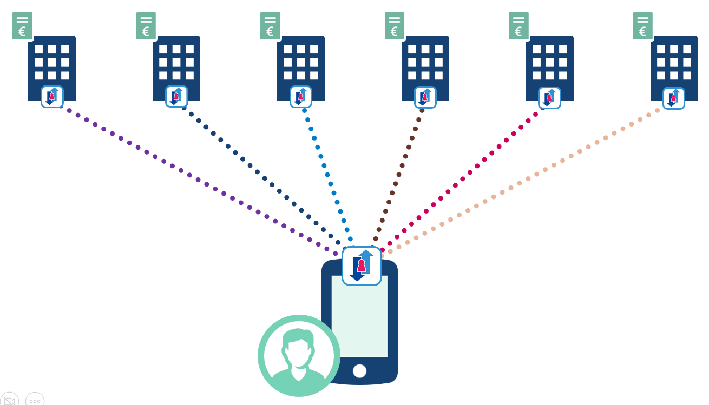

import { Blockquote } from "@rijkshuisstijl-community/components-react";

# VORijk bouwt succesvol een schuldenoverzicht-app dankzij de Common Ground principes

Het team van Vorderingenoverzicht Rijk (VO Rijk) kreeg een interessante opdracht toen ze werd gevraagd een app te bouwen waarin burgers hun openstaande betalingen bij de overheid kunnen inzien. Vanaf de start van het project is de architectuur vormgegeven in lijn met het principe **Data bij de Bron**. Dit betekent dat de data nergens opgeslagen mag worden waar dat niet nodig is, en de data zoveel mogelijk bij de bronorganisatie blijft. In dit geval betekent dat, dat de app van VO Rijk bij acht verschillende overheidsorganisaties data ophaalt als de burgers zijn schuldenoverzicht ververst.

Ook werkt het team volledig volgens de **Common Ground** principes, dat het opknippen van functionaliteit in component-gebaseerde applicaties voorschrijft. In dit artikel lees je hoe deze principes het team helpen om succesvol hun doel te bereiken.

<!-- truncate -->

:::success[**TL;DR**]

- VO Rijk gebruikt het vijf-lagenmodel van Common Ground om haar ecosysteem op te knippen in herbruikbare componenten.
- Dit zorgt ervoor dat bronorganisaties deze componenten makkelijk kunnen hergebruiken, en hun data kunnen ontsluiten naar de app.
- Gebruikersonderzoek is een belangrijke pijler binnen het project, dit zorgt dat er echt waarde voor de burger wordt gecreëerd.  

:::

## Timen Olthof, Software Architect

Timen begon na zijn studies Filosofie en Computerwetenschappen als freelance IT consultant en werkte voor onder andere gemeente Amsterdam, Alliander en nu Centraal Justitieel Incassobureau (CJIB).

Een belangrijke stap in zijn carrière was de overstap naar Common Ground toen dit initiatief nog in de kinderschoenen stond. Common Ground is een initiatief van de Vereniging van Nederlandse Gemeenten (VNG) waarin gewerkt wordt aan een toekomstbestendige architectuurvisie. In deze fase nam hij verschillende rollen op zich:

- Kennishouder/ Adviseur Common Ground voor verschillende gemeenten
- IT-strateeg voor Common Ground

Wat ook leuk is om te weten is dat hij aan de wieg stond van developer.overheid.nl, het mooie platform waar je dit artikel nu op leest!

## Kiske de Leest, Projectleider

Kiske begon zijn carrière bij Unisource, een dochteronderneming van KPN, als projectleider in WAN-techniek. Vanuit zijn rol in de telecommunicatiehoek maakte hij de overstap naar webdevelopment. Na zijn periode in webdevelopment besloot hij als zelfstandig ondernemer aan de slag te gaan. Hij werkte aan projecten in de zorg en in pharmaceutische industrie. Vervolgens raakte Kiske bij VNG Realisatie betrokken bij het project De Blauwe Knop, nu bekend als VO Rijk.

*Timen Olthof (links) en Kiske de Leest (rechts)*

## Introductie

**Tom**: Kunnen jullie uitleggen waar het Vorderingen Overzicht Rijk project over gaat?

**Kiske**: Het Vorderingen Overzicht Rijk is ontstaan vanuit een prototype dat we eerder hadden gemaakt voor een schuldenoverzicht (Blauwe Knop). Dat sloot perfect aan bij het programma "Rijksincasso" bij CJIB. Bij dat programma wordt gekeken hoe we een stap vooruit kunnen maken in de manier waarop de overheid incasso's richting burgers doet. We realiseren ons dat een burger maar één afloscapaciteit heeft en dat de burger de overheid als één geheel ziet. De burger moet ook als zodanig benaderd worden - niet elke week verschillende overheidsinstanties op de stoep. Om schuldenproblematiek te voorkomen en op te lossen, heb je een overzicht nodig van waar je als burger staat. Dat is waar ons project voor zorgt.

## Common Ground principes

**Tom**: Jullie passen de Common Ground filosofie toe in jullie project. Hoe helpt dit de bronorganisaties?

**Timen**: Er zijn twee dingen die belangrijk zijn. Allereerst de Nederlandse API-strategie. Daarin staat niet alleen hoe organisaties onderling gegevens kunnen uitwisselen, maar ook hoe de burger direct informatie moet kunnen opvragen bij organisaties via APIs. Wij geven invulling aan dat stukje door API's voor burgers te maken. Dit creëert een heel ander juridisch en maatschappelijk speelveld. Hierdoor worden allerlei juridische obstakels weggenomen. Op het moment dat burgers zelf om die gegevens vragen, is het een no-brainer dit te verstrekken voor bronorganisaties.

### Component-gebaseerde architectuur voor hergebruik

**Timen**: Het tweede belangrijke principe is component-gebaseerd werken. We hebben vanaf het begin alle onderdelen die nodig zijn om het geheel te laten werken als losse componenten gebouwd. We hebben daarom heel veel kleine repositories op [oss.developer.overheid.nl](https://oss.developer.overheid.nl/repositories?q=vorderingenoverzicht) staan, die allemaal een klein stukje van de puzzel zijn. Die componenten hebben we als referentie-implementaties open source beschikbaar gesteld. Organisaties hebben dan de keuze: ze kunnen al onze referentie-implementaties gebruiken, maar ook kiezen om bepaalde delen zelf te bouwen omdat ze dat misschien al hebben, zoals een database-systeem of een stukje UI in hun medewerkersportaal. Tussen al die componenten hebben we open API-specificaties. Je definieert voor elk component: dit is de vraag die je kan stellen en dit is het antwoord dat eruit moet komen. Of je nu alles wilt herbouwen of stukjes wilt hergebruiken, je kunt het gewoon plug-and-play aan elkaar zetten.

### Common Ground vijf-lagenmodel

**Tom**: In het vijf-lagenmodel heeft elke component zijn eigen verantwoordelijkheid. Liepen jullie tegen dingen aan in de praktijk bij het implementeren hiervan?

**Timen**: Het is inderdaad lastig om de waarde hiervan te zien bij de eerste commit. "Waarom zou ik vijf losse services maken in plaats van één?" is een vraag die ik vaak kreeg. Laat me een voorbeeld geven: je hebt een beheeromgeving (**interactielaag**) voor medewerkers met knoppen voor bepaalde functies, zoals het bewerken van bepaalde data of een proces in gang zetten. Die functionaliteit zit niet in de UI maar wordt via een API aangeroepen bij wat we de **proceslaag** noemen. Je zou kunnen zeggen: die component maakt direct verbinding met een database en schrijft het weg. Maar wij zeggen: maak ook direct een aparte **servicelaag**, een aparte service die de data ontsluit, en daaronder een **datalaag** die het opslaat. In die datalaag bevindt zich veelal de database.

### Flexibel inzetbare componenten voor bronhouders
Dat klinkt als overkill, zeker bij de eerste commit. Maar wat we in de praktijk zien is dat wanneer je met dat hele stapeltje functionaliteit naar een organisatie gaat, je door deze opzet de mogelijkheid biedt om te selecteren welke delen ze willen gebruiken. In onze demo-omgeving gebruiken we PostgreSQL, maar misschien heeft een organisatie al een Oracle-database die ze niet willen vervangen. Dan kunnen ze in hun Oracle-implementatie dezelfde service-interfaces implementeren, en dan werkt dat procescomponent nog steeds met een heel ander databasesysteem. Het betaalt zich uit in dit project, waarin veel partijen uiteindelijk deze componenten in één of andere vorm nodig hebben. Vanuit developers-oogpunt voorkomt het ook dat je fouten maakt door bijvoorbeeld database-specifieke implementaties in je proceslogica op te nemen.

- [Naar de architectuur van Vo Rijk](https://vorijk.nl/docs/architectuur/componenten/)

Diagram: de vijf-lagen architectuur van Common Ground.

## Decentralisatie en bronbevraging

**Kiske**: Wat ik vooral heb geleerd van dit project, is dat je vanuit de principes van Common Ground heel mooie dingen kunt doen met het belang van de burger in gedachten. Aan de achterkant kun je zaken goed organiseren op basis van die principes. Aan de voorkant kun je zorgen dat je de rechtspositie van de burger in acht neemt. Het voornaamste aspect is in ons geval de rechtstreekse bronbevraging door de burger. Alle verwerking vindt plaats bij de burger en bij de bron. En verder nergens. Dat is een fraaie belofte, en je merkt dat dat voor de bronorganisaties steeds belangrijker wordt.

 

<Blockquote
  attribution="— Timen Olthof"
  variation="pink-background"
>
De 5-lagen architectuur betaalt zich uit in dit project, waarin veel partijen uiteindelijk deze componenten in één of andere vorm nodig hebben.
</Blockquote>

 

## Build for Failure

**Timen**: We ontwikkelen ook "for failure". In plaats van te zeggen dat iedereen alles up moet hebben om het geheel te laten werken, hebben we het omgedraaid: als één organisatie niet werkt, dan werken alle anderen nog wel.
Je hebt daardoor minder last van fouten. Als het ergens fout gaat, is het heel duidelijk waar het fout gaat. Als organisatie ben je zelf verantwoordelijk voor je eigen component en kun je het oplossen.

## Datamodel op basis van behoefte gebruiker

**Timen**: Het datamodel van de data die in onze app zit (wat moet je nog betalen, wanneer heb je dingen betaald, wat zijn vervaldatums, etc.) is losgekoppeld van de APIs die het verstrekken. We ontwerpen het model vanuit wat de burger nodig heeft, en niet vanuit wat er wordt opgeslagen. Het maakt ons niet zoveel uit hoe een organisatie de data in zijn interne systeem heeft staan. We kijken alleen naar wat er uit moet komen als een burger wil zien wat er betaald is en wat nog betaald moet worden.

- Bekijk hier het ["datamodel"](https://vorijk.nl/docs/financiele-verplichtingen/document_types/financial_claims_information_document/) voor de financiële data in VO Rijk.

## Belangrijk voor de samenwerking: community-building

**Tom**: Jullie hebben veel bronorganisaties waarmee jullie samenwerken. Welke rituelen en processen zijn jullie met hen doorgegaan om iteratief de componenten te verbeteren?

**Kiske**: Een belangrijk aspect was dat we een aantal partijen hebben kunnen bewegen om gewoon aan de slag te gaan, in plaats van eerst een heel traditioneel watervalproject op te zetten. CJIB is bijvoorbeeld relatief snel aan de slag gegaan met het implementeren van componenten.
We hebben ook een digitale samenwerkingsomgeving (Mattermost), waardoor het makkelijk is voor partijen om laagdrempelig feedback te geven en vragen te stellen. Ons team kan dan aanpassingen doorvoeren aan de componenten, het stelsel en de standaard. Zo polijst je het product steeds verder in co-creatie.

### Thema-dagen ter inpsiratie

**Timen**: Naast de digitale omgeving moet je ook echt een community bouwen en investeren in het activeren van iedereen. We organiseren dagen met thema's zoals tech-inspiratie of gebruiksonderzoek.
We hebben ook een demo-omgeving waar we zelf alles doen wat zij ook moeten doen. De eerste organisatie die de componenten opstart, vindt altijd wel iets wat bij hen net anders is. Dan pakken we dat op en verbeteren we het.

### Bronhouders helpen elkaar onderling
Op onze evenementen houden we altijd een "open space", waarbij we aan de deelnemers vragen: jullie zijn hier naartoe gekomen, dus jullie hebben vast dingen waar je het over wil hebben, vragen of zorgen. Het frappante is dat je dan ziet dat er echt een community ontstaat: ze praten niet meer met ons, maar onderling: "Wij lopen hier tegenaan", "Oh, daar hadden wij deze oplossing voor", "Heb je daar al eens naar gekeken?"

## Gebruikersgerichte ontwikkeling: de burger als middelpunt van het project

**Kiske**: Dit is veruit het gaafste project dat ik in 25 jaar heb gedaan, omdat er zoveel dingen samenkomen. De gebruikersgerichte manier van werken, het technische innovatieve stuk, en vooral het maatschappelijke karakter - de impact die we samen hebben.
De burger zit echt midden in ons project. We hebben niet voor niets een fulltime gebruikersonderzoeker aan boord die vanaf dag één op pad is om te kijken hoe we dit zo kunnen maken dat de gebruiker het ook echt kan gebruiken. Hoe doet een burger dit nu? Met welke paperassen komt ie aanzetten als die bij een financieel steunpunt komt? Wat zijn de stappen die iemand wil doorlopen? Hoe kunnen wij iets maken wat daar zo goed mogelijk bij aansluit?
We kijken niet alleen achteraf of wat we hebben gemaakt gebruikt kan worden, maar ook aan de voorkant: hoe doe je dit nu en kunnen wij iets maken wat daarbij aansluit?

 

<Blockquote
  attribution="— Kiske de Leest"
  variation="pink-background"
>
Dit is veruit het gaafste project dat ik in 25 jaar heb gedaan, omdat er zoveel dingen samenkomen. De gebruikersgerichte manier van werken, het technische innovatieve stuk, en vooral het maatschappelijke karakter - de impact die we samen hebben.
</Blockquote>

## Conclusie
Door het **vijf-lagenmodel** van Common Ground te gebruiken slaagt VO Rijk er in haar ecosysteem op te knippen in kleine herbruikbare componenten. Deze componenten zijn bruikbaar voor de bronhouderogranisaties die het team mee moet krijgen om een bruikbare app voor burgers op te kunnen leveren.

Daarnaast investeert het team veel tijd en energie aan **gebruikersonderzoek** waardoor het goed zicht heeft op waar de doelgroep behoefte aan heeft. Dit zorgt voor een grote positieve maatschappelijke impact en daardoor geeft het veel voldoening om voor het project te werken. 