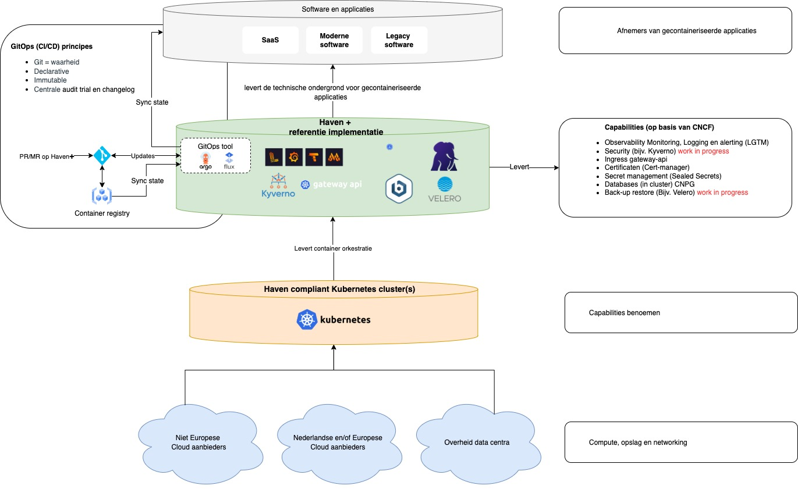

# Digitale Autonomie zonder Amerikaanse cloud met Haven(+)

Door het veranderde huidige geopolitieke klimaat, prijkt het thema Digitale Autonomie ineens overal bovenaan de agenda in overheids-IT-land. Er wordt veel over gesproken, maar over hoe we precies onafhankelijk gaan worden lijkt nog geen consensus te bestaan.

Voor complexe problemen als deze bestaat er nooit een silver bullet. Echter is er wel een project dat je helpt voorsorteren op de (nood)uitgang: de Kubernetes-standaard [Haven](https://haven.commonground.nl/). In dit artikel omschrijf ik welke rol ik voor Haven(+) zie als **oplossing** voor **Digitale Autonomie**. Haven is een standaard die bestaat uit [checks](https://haven.commonground.nl/techniek/checks) voor het correct en secure opzetten van Kubernetes clusters.

<!-- truncate -->

:::success[**TL;DR**]

- Met de Haven-standaard heeft de Nederlandse overheid een praktisch instrument als stap naar Digitale Autonomie.
- Door Kubernetes-clusters volgens de Haven-checks in te richten, wordt migratie naar Europese cloudproviders uiteindelijk eenvoudiger.
- Specifieke AWS/Azure services zoals `Object Storage` en `Databases` kunnen op termijn vervangen worden door open-source [Haven+](https://gitlab.com/commonground/haven/havenplus) alternatieven.
- Hoewel de transitie een cloud-native infrastructuur vereist, biedt Haven een duidelijk pad richting digitale zelfstandigheid.

:::

## De massale migratie naar Amerikaanse cloudproviders

Amerikaanse cloudproviders zijn het afgelopen decennium uitgegroeid tot extreem winstgevende bedrijven, waar inmiddels het grootste deel van het internet op draait. De top 3 grootste public cloud service providers (Amazon Web Services, Microsoft Azure en Google Cloud Platform) hebben momenteel gezamenlijk meer dan 72% van de wereldwijde markt in handen[^1]. Specifieke cijfers over het marktaandeel AWS/Azure/GCP bij de Nederlandse overheid zijn er niet, maar uit een rapport van Autoriteit Consument en Markt naar de gehele Nederlandse cloudprovider-markt (dus het gehele speelveld) blijkt dat Azure de markt voor 40-45% in handen heeft en AWS voor 30-35%. GCP en Oracle hebben na AWS en Azure het grootste marktaandeel met beiden een marktaandeel tussen de 5 en 10 procent.[^2]

Het risico schuilt in de ontstane grote afhankelijkheid van deze Amerikaanse bedrijven. Een actueel voorbeeld hiervan zagen we vandaag: Microsoft blokkeerde zonder pardon het e-mailaccount van Karim Khan van het Internationaal Strafhof (ICC)[^5]. De ICC-arrestatiebevelen tegen premier Netanyahu en oud-minister Gallant voor vermeende oorlogsmisdaden in Gaza vormden de aanleiding voor de sancties. De regering-Trump reageerde door het hof van politieke motieven te beschuldigen en legde ICC-functionarissen bewegingsbeperkende sancties op.

Een heel duidelijk voorbeeld van hoe Amerika druk kan uitoefenen door middel van het opschorten van diensten.

## Politiek draagvlak voor een Europese cloud
Gelukkig klonk er dit jaar in de Nederlandse politiek een nieuw geluid op dit gebied. Zo nam de Tweede Kamer op 13 maart 2025 acht moties aan tijdens een plenair debat over migraties van overheids-ICT naar het buitenland [^3].
De belangrijkste punten die werden [vastgesteld](https://www.tweedekamer.nl/debat_en_vergadering/plenaire_vergaderingen/details/activiteit?id=2025A02077);

1. De Kamer wil onnodige ICT-migraties naar Amerikaanse techreuzen stopzetten. Volgens de motie van Barbara Kathmann (GroenLinks-PvdA) moeten alle geplande verhuizingen van overheids-ICT worden gestopt, tenzij de continuïteit van dienstverlening aan burgers aantoonbaar in gevaar komt (dan is toestemming van de staatssecretaris voor digitalisering nodig).
2. Er moet een Rijkscloud komen in volledig Nederlands beheer, met functionaliteit voor vertrouwelijke communicatie tussen departementen en veilige dataopslag.
3. Het .nl-domein moet weer volledig in Nederlandse handen komen. Recent is besloten dat een beperkt deel naar AWS (Amazon Web Services) mag verhuizen, maar volgens de aangenomen motie moet dit in overleg met SIDN en nationale cloudaanbieders weer terug naar Nederland.
4. Er moet een risicoanalyse en exitstrategie komen voor alle clouddiensten van Amerikaanse techbedrijven. Momenteel beschikt twee derde van de clouddiensten van de overheid hier nog niet over.
5. De regering moet in EU-verband pleiten voor versnelde investeringen in Europese cloudalternatieven, met maximale benutting van Europese begrotingsmiddelen en investeringsfondsen.
6. Als doelstelling moet gelden dat de continuïteit van de Nederlandse digitale overheid niet rechtstreeks afhankelijk is van partijen uit de Verenigde Staten.
7. De VVD vraagt om maatregelen voor het borgen van soevereiniteit, continuïteit en gegevensbescherming in cloudcontracten, in samenwerking met de AIVD en de Autoriteit Persoonsgegevens.
8. De samenwerking tussen de verschillende CIO's van ministeries moet worden verbetert door het huidige Besluit CIO-stelsel aan te passen.
9. Bij aanbestedingen van vitale ICT-diensten moeten Europese bedrijven voorrang krijgen door soevereiniteitseisen te stellen voor de opslag van gevoelige gegevens.

Wat hier de gevolgen van zullen zijn in de praktijk is nog niet helemaal uitgekristalliseerd. Echter is het wel raadzaam hierop voor te sorteren.

*Stadskantoor in Utrecht, onder andere hier wordt de Haven-standaard ontwikkeld. Mede door de gemeente Utrecht. Foto door [Stefan van E](https://www.flickr.com/photos/stefanve/26230670274). [Licentie: Deed - Attribution 2.0 Generic - Creative Commons ](https://creativecommons.org/licenses/by/2.0/deed.en)*

## Nadeel: hyperscalers zijn duur als je veel opschaalt
Voordat er zorgen ontstonden over de omvang van de migratie naar de Amerikaanse cloud, waren er in principe ook al redenen om niet met deze "hyperscalers" in zee te gaan. Zo kunnen de kosten van dergelijke platforms op de lange termijn, wanneer er meer resources nodig zijn, flink uit de klauwen lopen.

Dit is een bewuste strategie die vooral AWS toepast. Beginnen kost niks en wordt je heel gemakkelijk gemaakt. Echter, als je de services opschaalt beginnen de kosten snel te groeien.

## Onbeperkte resources: geen reden tot optimalisatie
Daarnaast is er nog een interessante dynamiek van toepassing. Namelijk dat deze bedrijven je erg goed kunnen helpen bij het sneller maken van software die eigenlijk inefficiënt is. Doordat deze platforms zo goed zijn in schalen is het een peulenschil om meer resources toe te wijzen aan een slecht geoptimaliseerde applicatie. Door deze dynamiek ontstaat een sterke prikkel om de weg van de minste weerstand te kiezen: extra resources toevoegen in plaats van te investeren in fundamentele software-optimalisatie, waardoor technische schuld zich ophoopt terwijl de cloud-factuur gestaag blijft groeien.

## Waarom zijn Amerikaanse cloudproviders zo aantrekkelijk?
Amerikaanse cloudproviders zijn heel goed in één ding: het creëren van een hele goede developer experience. Ze hebben de afgelopen jaren veel geïnvesteerd in het ontwikkelen van services die dagelijkse problemen van developers op een effectieve manier oplossen. Daarnaast heeft de introductie van het pay-as-you-go prijsmodel de toegangsdrempel verlaagd om operationele uitgaven te verruilen voor directe kapitaaluitgaven. De meest populaire clouddiensten zijn op het moment:

**Basisdiensten:**

- Computing: AWS EC2, Azure VMs, Google Compute Engine
- Object storage: AWS S3, Azure Blob Storage, Google Cloud Storage
- Databases: AWS RDS/DynamoDB, Azure SQL/Cosmos DB, Google Cloud SQL

**Groeidiensten:**

- Serverless: AWS Lambda, Azure Functions, Google Cloud Functions
- Containers: AWS EKS/ECS, Azure Kubernetes Service, Google GKE
- AI/ML: AWS SageMaker, Azure ML, Google Vertex AI
- Data analytics: AWS Redshift, Azure Synapse, Google BigQuery

## Azure/ AWS werden de defacto standaard
Door het brede scala aan services en de schaalbaarheid werden Azure en AWS extreem populaire cloudproviders. Doordat deze bedrijven vroeg zijn begonnen met het investeren in deze sector en er in Amerika makkelijk toegang was tot tech-talent hadden ze grote voordelen. Ook hadden deze bedrijven het voordeel dat kapitaal destijds goedkoop voorhanden was en maakten ze slim gebruik van ecosystemen van partner-bedrijven. 

## Strategisch slim?
Doordat Microsoft al jaren dé grote it-leverancier is voor de Nederlandse overheid, was de overstap op Microsoft Azure een logische. Echter rijst nu de vraag: is het handig om strategisch zo afhankelijk te zijn van een Amerikaans bedrijf? Het is bekend dat de Amerikaanse overheid mee mag kijken in de infrastructuur van Amerikaanse bedrijven als zij dat wil, ook als de servers daarvan op Europees grondgebied staan [^4]. Servers op Europees grondgebied zijn dus ook geen oplossing voor dit probleem, zolang het Amerikaanse bedrijven betreft.

## De Haven-checks als handvatten
Dan naar de oplossing. Als je als organisatie toe beweegt naar een situatie waarin je er voor zorgt dat je Kubernetes-clusters allemaal Haven-compliant zijn, werk je toe naar een gestandaardiseerde situatie. Dit zorgt er voor dat het een stuk **makkelijker wordt** om vervolgens later de boel te migreren naar een **Europese cloudprovider**.

## Haven+ als vervanging voor Azure/AWS services
Je hebt inderdaad niet direct vervanging voor je mooie glimmende Azure/AWS services. Maar je kan ze wel langzamerhand gaan vervangen door open source componenten die je zelf opzet. En het mooie is; een aantal van deze open source componenten heeft het Haven-team al voor je beschikbaar gemaakt in de vorm van een project genaamd [**Haven+**](/kennisbank/infra/standaarden/haven/haven-plus).

Dit project bevat misschien nog niet alles wat je nodig hebt als organisatie, maar gelukkig staat niets je in de weg om mee te bouwen aan deze componenten met het Haven team!

*Overzicht van het Haven+ project*

- [Praat mee over Haven+](https://digilab.overheid.nl/chat/digilab/channels/havenplus)
- [Git Haven+](https://gitlab.com/commonground/haven/havenplus/)

## Toegegeven: je infra moet cloud-native zijn
Toegegeven: om gebruik te maken van de Haven standaard moet je infra natuurlijk wel cloud-native zijn. En sommige organisaties zijn nog verre van cloud-native. Er zullen vast nog organisaties zijn die stiekem nog steeds met VPS'en werken, en een infrastructuur hebben die zich her en der verspreidt over de organisatie bevindt.

Feit is dat Kubernetes heden ten dage met goede redenen de marktstandaard is. Dit vanwege de goede schaalbaarheid en de grip op security die je erdoor kunt krijgen. Het is dus sowieso raadzaam om als organisatie te koersen op het omzetten van je infra naar cloud-native.

## Conclusie

Met de Haven-standaard heeft de Nederlandse overheid een praktisch instrument voor het bereiken van digitale autonomie. Door Kubernetes-clusters volgens Haven-criteria in te richten, wordt migratie naar Europese cloudproviders eenvoudiger. Specifieke services zoals `Object Storage` en `Databases` kunnen op termijn vervangen worden door open-source [Haven+](https://gitlab.com/commonground/haven/havenplus)  alternatieven. Hoewel deze transitie een cloud-native infrastructuur vereist, biedt Haven een duidelijk pad richting digitale zelfstandigheid.

## Aan de slag?

Doordat Haven een standaard is voor het redundant opzetten van Kubernetes clusters, is het een uitdaging dit lokaal op te zetten. Wel is het mogelijk om bij [verschillende providers](https://haven.commonground.nl/techniek/aan-de-slag) een cluster af te nemen en in te richten middels de bijbehorende [referentie-implementaties](https://gitlab.com/commonground/haven/haven/-/tree/main/reference?ref_type=heads). 

Deze drempel zet wel aan tot nadenken; in de toekomst zou het mooi zijn als je als overheidsorganisatie laagdrempelig een sandbox-havencluster af zou kunnen nemen. Zo zou je eerst eens kunnen uitproberen of een Haven-compliant oplossing iets voor je organisatie is.

Wil je de Haven+ componenten zelf lokaal draaien? Dit kan met zowel Flux als ArgoCD.
- [Naar de Flux implementatie van Haven+](https://gitlab.com/commonground/haven/havenplus/gitops-flux)
- [Naar de ArgoCD implementatie van Haven+](https://gitlab.com/commonground/haven/havenplus/gitops-argocd)

## Dankwoord

Ik wil graag een paar mensen bedanken die de tijd hebben genomen gesprekken met mij te voeren over dit onderwerp. Zo voerde ik een goed gesprek met **Dian van Heijningen (Product Owner Cloud Engineering)** van **Wigo4it** over hun infrastructuur. Ook hield ik met **Pauline van Rotterdam (Technisch PO)** en **Sander van Thillo (Developer)** van het **Haven** team een interview. Dit interview zal hier later ook gepubliceerd worden.

## Handige links

* [Ons kennisbank artikel over Haven](/kennisbank/infra/standaarden/haven/)
* [Slack-kanaal van Haven](https://samenorganiseren.slack.com/archives/CGCPJE599)
* [Mattermost kanaal van Haven+](https://digilab.overheid.nl/chat/haven/channels/town-square)
* [Naar de lijst met checks van Haven](https://haven.commonground.nl/techniek/checks)
* [Git Haven](https://gitlab.com/commonground/haven/)
* [Git Haven+](https://gitlab.com/commonground/haven/havenplus/)

[^1]: Marktstudie Cloud Services: voortdurende consolidatie, aanhoudende groei (https://www.bdo.nl/nl-nl/actueel/marktstudie-cloud-services-voortdurende-consolidatie-aanhoudende-groei)
[^2]: ACM: aanpassingen in Data Act nodig om concurrentie tussen cloudaanbieders te stimuleren (https://www.acm.nl/nl/publicaties/acm-aanpassingen-data-act-nodig-om-concurrentie-tussen-cloudaanbieders-te-stimuleren)
[^3]: Kamer zet inhaalspurt digitale autonomie in https://ibestuur.nl/artikel/kamer-zet-inhaalspurt-digitale-autonomie-in/
[^4]: De werking van de CLOUD-Act bij dataopslag in Europa https://www.ncsc.nl/actueel/weblog/weblog/2022/de-werking-van-de-cloud-act-bij-dataopslag-in-europa
[^5]: Wake-up call: Microsoft sluit e-mail ICC zonder pardon af https://www.binnenlandsbestuur.nl/digitaal/wake-up-call-microsoft-sluit-e-mail-icc-zonder-pardon-af