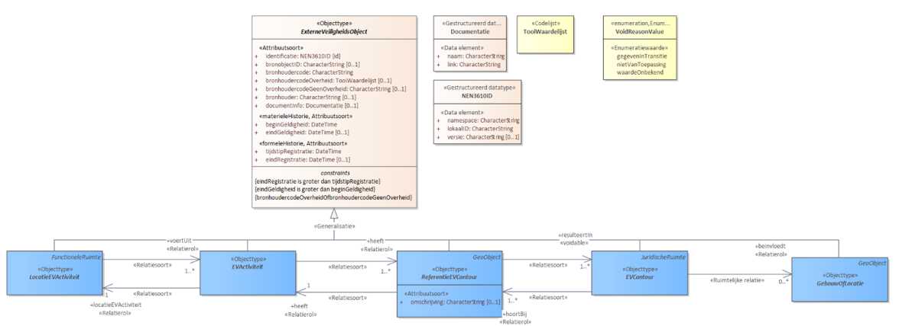
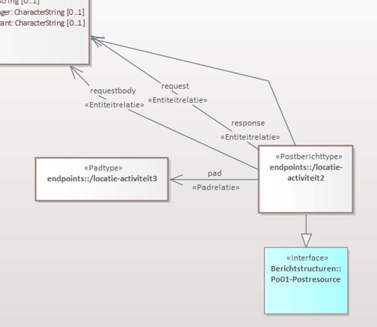

# Ervaringen eerste Geonovum JSON-schema publicatie

Op 31 oktober 2024 publiceerde [Geonovum](https://www.geonovum.nl) voor het eerst een JSON-schema bij een informatiemodel. Het betrof de publicatie van versie 3.0 van het Informatiemodel Externe Veiligheid: [(IMEV)](https://www.geonovum.nl/geo-standaarden/informatiemodel-externe-veiligheid). Daarnaast is er ook een suggestie voor een OpenApi Specificatie (OAS) gepubliceerd. In deze blog worden de ervaringen gedeeld die Geonovum daarmee heeft opgedaan in de hoop dat anderen daar van kunnen leren.

<!-- truncate -->

## Achtergrond

Het Informatiemodel Externe Veiligheid (IMEV) bevat afspraken over de digitale structuur waarin overheden gegevens vastleggen over de opslag, het transport en het gebruik van gevaarlijke stoffen. Al deze gegevens komen bij elkaar in het Register Externe Veiligheidsrisico's (REV) van het ministerie van Infrastructuur en Waterstaat. Op kaarten is vervolgens te zien waar externe veiligheidsrisico’s van toepassing zijn.

Het IMEV wordt gevormd door een [Respec document](https://docs.geostandaarden.nl/imev/imev/) waarin een diagrammen van UML-schema's zijn opgenomen. Deze hebben allemaal de volgende basis UML-structuur:  

***Figuur 1: Voorbeeld UML-diagram uit IMEV***

Op basis van het IMEV wordt het Register Externe Veiligheidsrisico's (REV) gevuld.
Het REV is in opdracht van het ministerie van Infrastructuur en Waterstaat ontwikkeld.
Het beheer van het register valt onder het ministerie van Infrastructuur en Waterstaat (IenW).
Dat staat in artikel 11.8 van het Besluit kwaliteit leefomgeving (Bkl).
Het bevoegd gezag dat verantwoordelijk is voor de gegevensverzameling, levert de gegevens bij het register aan conform het IMEV.

***Figuur 2: REV-pagina: https://www.registerexterneveiligheid.nl/uitleg-rev***

Aanleveringen richting het REV worden gedaan in JSON-formaat via de [REV-API](https://rev-portaal.nl/oas/rev-v5-specification.yaml). Daarvoor is het van belang dat er ook een JSON-schema is op basis waarvan aangeleverde data opgesteld en gevalideerd kunnen worden. Hier wordt vanuit de API-specificatie naar verwezen. Tot voor de verschijning van versie 3.0 van het IMEV werd het schema gemaakt door de softwareleverancier van de REV-API. Vanaf de publicatie IMEV 3.0 maakt Geonovum dit schema in eerste instantie en wordt er ook een suggestie gedaan voor de Open API Specificatie (OAS). Het schema en de OAS behorende bij de API zijn hier zoveel als technisch mogelijk inhoudelijk op aangepast. Om uiteenlopende reden wijken ze toch op bepaalde punten nog af.

## Publicatie

De officiele locatie waarop de laatste versie van het IMEV gepubliceerd wordt is: https://docs.geostandaarden.nl/imev/imev/. De locatie waar verschillende versies van het JSON-schema, voorbeeldbestanden en een voorstel voor de OAS gepubliceerd zijn, is: https://register.geostandaarden.nl/JSONschema/imev/. Inmiddels is versie 3.0.2 gepubliceerd van het [IMEV-model](https://docs.geostandaarden.nl/imev/imev/) en het [JSON-schema](https://register.geostandaarden.nl/JSONschema/imev/3.0.2/IMEV3.0.2_schema.JSON). De laatste versie van het voorstel voor de OAS van Geonovum en de voorbeeldbestanden staan hier: https://register.geostandaarden.nl/JSONschema/imev/3.0.1/

## Het verhaal chronologisch

Begin 2022 werd het duidelijk dat Geonovum op den duur het schema en de OAS moest gaan beheren voor het IMEV. Er heerste eerst nog wel wat scepsis over de vraag of dit iets is dat past bij Geonovum en of de kennis en tools in huis waren om het te gaan doen. Schema's had Geonovum tot dan toe alleen nog maar in XML-format (=XSD) gemaakt maar niet in JSON. Het zou betekenen dat er apart een model gemaakt zou moeten worden van het berichtenverkeer. Dat was 1x eerder gedaan, maar niet in de vorm van een OAS. Daarom is dit ook voorgelegd aan het managementteam. Uitkomst was dat het voorgelegd moest worden aan de architectuurraad van Geonovum en dat ook eerst contact gezocht moest worden met de VNG vanwege hun ervaring op dit gebied.

We zijn begonnen met het maken van een schema in JSON-format. De door Geonovum gebruikte software 'Imvertor' (Plugin op Enterprise Architect) bood hiervoor al functionaliteit, maar het werd duidelijk dat er veel vrijheidsgraden waren voor het maken van een JSON-schema. Ook bleken er grote verschillen tussen wat Imvertor er van maakte en het JSON-schema dat tot dan toe in het IMEV gebruikt werd. Er was behoefte aan een standaard en daarom is er samen met Interactive Instruments begin 2023 een best practice geschreven die inmiddels ook door OGC is geaddopteerd en gepubliceerd onder https://docs.ogc.org/bp/24-017r1.html. Begin 2024 zijn er op basis van deze bestpractice enkele aanpassingen aan Imvertor gedaan. Met deze aangepaste versie is er door Ben Gunnewijk in opdracht van Geonovum een onderzoek gedaan naar de verschillen in het schema van Geonovum en dat van de REV-API. Ook heeft hij samen met de VNG geprobeerd een stuk van het IMEV-berichtenverkeer te modelleren met met Enterprise Architect middels een BSM (Berichten Structuur Model).  

<!--    -->

***Figuur 3: BSM (Berichten Structuur Model) voor 1 GET-request op een object uit het IMEV***  

De bevindingen zijn beschreven in een rapport dat op 23 mei 2024 in Architectuurraad is besproken. De conclusies van de architectuurraad waren:

- Ja, Geonovum zou ook een OAS kunnen beheren;
- Modelleren van berichtenverkeer loont alleen als er vaak iets aan verandert, en dat is eigenlijk niet het geval in IMEV. Handmatig aanpassen van de OAS van de REV-API is dus veel efficiënter dan modelleren.

Op 31 oktober 2024 verscheen de eerste publicatie van [IMEV 3.0](https://docs.geostandaarden.nl/imev/def-im-imev-20241031/) met ook een 1e schema [3.0.0rc1](https://register.geostandaarden.nl/JSONschema/imev/3.0.0rc/). Dit schema week nog steeds sterk af van dat van het [REV-API-schema](https://rev-portaal.nl/oas/imev20-schema.yaml). Tijdens technische sessies met betrokkenen van de oude versie van de REV-API is besproken hoe de schema's dichter bij elkaar zouden kunnen komen. Voor Geonovum was het van belang dat het JSON-schema voldeed aan de bestpractice UML2JSON en dat het overeenkomt met het IMEV. Dan bleven er nog steeds mogelijkheden over om het JSON-schema aan te passen zodat het meer overeenkomt met JSON-schema van de oude REV-API. Een van de aanpassingen was dat het oorspronkelijke Geonovum JSON-schema uitging van GeoJSON en de REV-API ging uit van Plain-JSON. GeoJSON zou voor output vanuit het REV beter zijn, maar voor de input is al lang geleden gekozen voor Plain-JSON. Hier gaat het om input en gelukkig heeft Imvertor ook een optie voor Plain-JSON, dus het was eenvoudig om daarnaar over te stappen. Richting Imvertor zijn enkele wijzigingsverzoeken gedaan om de schema's meer op elkaar te kunnen laten lijken.

Er bleken ook fouten in het JSON-schema te zitten die opgelost moesten worden in de UML in het Enterprise Architect project. Een deel van die fouten kwamen naar boven door het maken van voorbeeldbestanden en door de validatie daarvan op basis van het JSON-schema van Geonovum. Voor deze JSON-schema-validatie is verschillende software getest, want de complexe structuur met veel sup- en supertypes bleek voor veel software niet te werken. Met Visual Studio bleek dit uiteindelijk het beste te gaan. Het laatst door Geonovum gepubliceerde [JSON-schema](https://register.geostandaarden.nl/JSONschema/imev/3.0.2/IMEV3.0.2_schema.JSON) wijkt nog steeds af van de implementatie van de [nieuwste versie van de REV-API-schema](https://rev-portaal.nl/oas/imev30-schema.yaml). Volledige aanpassing aan het JSON-schema van Geonovum bleek voor de implementatie te kostbaar. Vooral op het gebied van de all-off constructie voor het overerven van properties van supertypes bleek het lastig te implementeren. Het is ook niet noodzakelijk gebleken dat de 2 JSON-schema's volledig hetzelfde zijn. Als de inputbestanden en de voorbeeldbestanden maar valideren tegen beide schema's. Er zijn in het JSON-schema voor de implementatie ook nog attributen toegevoegd die niet terug te vinden zijn in het IMEV. Zo is er bv het veld "id" toegevoegd dat een concatenatie is van de elementen uit het NEN3610ID (namespace , localid en versie). Voor software is het daarmee veel makkelijker om naar objecten te verwijzen via dit id en zo is het ook voor de REV-API opgenomen terwijl het niet in het IMEV zit.

## Wat hebben we ervan geleerd

1. Modelleren van berichtenverkeer heeft alleen zin als dat berichtenverkeer veel verandert
1. Validatiesoftware voor JSON-schema's verschilt veel van elkaar en ze kunnen niet allemaal overweg met het overerven van properties.
1. Er kunnen verschillende schema's bestaan voor 1 model: vb. Plain-JSON of GeoJSON
1. Voorbeeldbestanden maken is belangrijk voor begrip en de kwaliteit van het model
1. Implementatie is de beste test
1. Het door Geonovum gepubliceerde [JSON-schema](https://register.geostandaarden.nl/JSONschema/imev/3.0.2/IMEV3.0.2_schema.JSON) is t.b.v. implementatie en kan daarom afwijken van het informatiemodel.
1. Uiteindelijk wijken het [schema](https://rev-portaal.nl/oas/imev30-schema.yaml) en de [OAS](https://rev-portaal.nl/oas/rev-v5-specification.yaml) behorende bij de definitieve implementatie van de REV-API ook nog weer af van [wat door Geonovum is gepubliceerd](https://register.geostandaarden.nl/jsonschema/imev/).

## Tot slot

De eerste stappen met het publiceren van een JSON-schema en een OAS bij het IMEV hebben laten zien dat het proces leerzaam en soms weerbarstig is. Er zijn keuzes gemaakt, fouten ontdekt en verbeteringen doorgevoerd die niet alleen de kwaliteit van het IMEV ten goede komen, maar ook bijdragen aan de kennis binnen Geonovum en daarbuiten. Het is duidelijk dat standaarden zich pas echt bewijzen in de praktijk, waar theorie en implementatie elkaar raken. We hopen dat het delen van deze ervaringen anderen helpt om sneller hun weg te vinden en nodigen iedereen uit om feedback en suggesties te blijven geven, zodat we samen kunnen zorgen voor robuuste en bruikbare standaarden.
