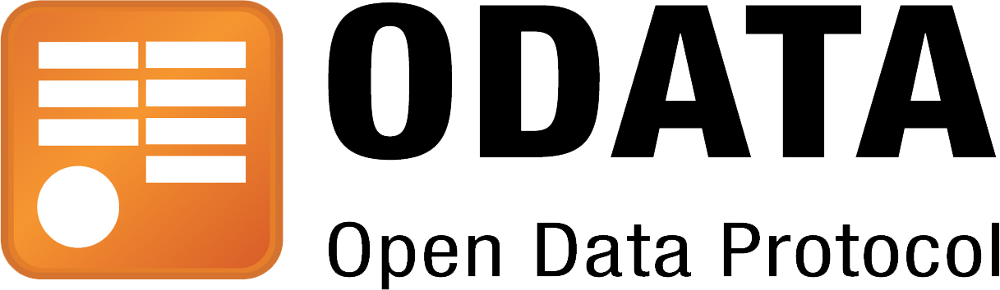

# OData en de NLGov REST API Design Rules: past dat wel?

Binnen de publieke sector groeit de behoefte aan goed gedocumenteerde, interoperabele en toekomstbestendige API's. De [NLGov REST API Design Rules](https://gitdocumentatie.logius.nl/publicatie/api/adr/) vormen daarbij een belangrijk referentiekader: ze stimuleren eenvoud, voorspelbaarheid en brede toepasbaarheid door gebruik te maken van open standaarden.

Regelmatig komt de vraag voorbij of OData, een specificatie ontwikkeld binnen het Microsoft-ecosysteem, een slimme keuze kan zijn voor publieke API's. In dit artikel analyseren we de voor- en nadelen van OData, met nadruk op eenvoud, interoperabiliteit en vendor-neutraliteit. Ook bekijken we hoe OData zich verhoudt tot de NLGov REST API Design Rules, en op welke vlakken deze conflicteren.

<!-- truncate -->

## Wat is OData?

[OData (Open Data Protocol)](https://www.odata.org/) is een open standaard die definieert hoe data via RESTful API's kan worden bevraagd en gemanipuleerd. Het biedt een gestandaardiseerde manier om queries uit te voeren op resources, met parameters als `$filter`, `$expand`, `$select` en `$orderby`.

OData is oorspronkelijk ontwikkeld door Microsoft en gestandaardiseerd via [OASIS](https://www.oasis-open.org/committees/tc_home.php?wg_abbrev=odata) en [ISO/IEC](https://www.oasis-open.org/news/pr/iso-iec-jtc-1-approves-oasis-odata-standard-for-open-data-exchange/), wat betekent dat het formeel gezien niet proprietair is. In de praktijk is de implementatie en tooling echter sterk verweven met Microsoft-technologieën (zoals .NET, Dynamics en Power BI).

## De voordelen van OData

### 1. Gestandaardiseerde querytaal

Middels het [OData protocol](https://docs.oasis-open.org/odata/odata/v4.02/csd01/part1-protocol/odata-v4.02-csd01-part1-protocol.html) kan een client complexe queries uitvoeren (zoals filters, joins en sorteringen) zonder dat de API-beheerder expliciet endpoints of parameters hoeft te definiëren voor elk scenario. In plaats van meerdere, specifieke zoek- en filterendpoints aan te bieden, kan een OData-service via één uniforme syntax (`$filter`, `$expand`, `$select`, `$orderby`, enz.) vrijwel elke denkbare bevraging verwerken.

Dat maakt OData efficiënt bij situaties waarin de aard van de query’s niet vooraf bekend is, bijvoorbeeld bij analytische toepassingen, datawarehouses of BI-rapportages. Daarmee biedt OData een zekere mate van zelfbediening voor dataconsumenten – iets wat in interne dataplatforms of onderzoeksomgevingen vaak als voordeel wordt gezien.

### 2. Rijke semantische laag

OData beschrijft de datastructuur via het [Entity Data Model (EDM)](https://docs.oasis-open.org/odata/odata/v4.02/csd01/part1-protocol/odata-v4.02-csd01-part1-protocol.html#DataModel), vastgelegd in CSDL (Common Schema Definition Language) via [JSON](https://docs.oasis-open.org/odata/odata-csdl-json/v4.02/odata-csdl-json-v4.02.html) of [XML](https://docs.oasis-open.org/odata/odata-csdl-xml/v4.02/odata-csdl-xml-v4.02.html). Dit maakt het mogelijk om data en relaties semantisch te beschrijven.

Clients worden hierdoor in staat gesteld om automatisch metadata te ontdekken en hun gedrag daarop af te stemmen. Een client kan bijvoorbeeld aan de hand van het `$metadata-document` weten welke velden beschikbaar zijn, welke typen of relaties er bestaan en welke query’s toegestaan zijn.

Dit bevordert consistentie en herbruikbaarheid van data binnen een organisatie, en ondersteunt scenario's als automatische codegeneratie, dynamische UI-componenten of semantische validatie. Voor organisaties met sterk gestructureerde domeinmodellen kan dit bijdragen aan uniformiteit en ontwerpdiscipline over verschillende datasets heen.

### 3. Sterke toolingondersteuning (met name in Microsoft-omgevingen)

OData is wijd geïntegreerd in de Microsoft-stack en wordt ondersteund door veelgebruikte producten zoals Excel, Power BI en Azure API Management. In de praktijk betekent dit dat gegevens uit een OData-service direct bruikbaar zijn in rapportage-, analyse- of dashboardomgevingen, met minimale technische inspanning. 

## De nadelen van OData

### 1. Data-georiënteerd in plaats van resource-georiënteerd

OData is in de kern data-georiënteerd: het beschrijft tabellen en entiteiten die rechtstreeks overeenkomen met een onderliggend datamodel.
Daarmee verschilt het fundamenteel van de resource-georiënteerde aanpak die in de NLGov REST API Design Rules wordt voorgestaan, waarin endpoints domeinconcepten representeren (zoals zaak, persoon of vergunning), niet technische datatabellen.

In de praktijk leidt dat tot API-ontwerpen waarin de datastructuur het uitgangspunt vormt, in plaats van het functionele of semantische domein. Dit maakt de API minder begrijpelijk en minder consistent met andere publieke API's die wel volgens de REST-principes zijn ontworpen.

Hoewel OData zich positioneert als RESTful, wijkt het in de praktijk af van gangbare REST-ontwerpprincipes. De query-syntax (voor `$filter`, `$expand`, enz.) introduceert een eigen mini-taal bovenop HTTP. Dit maakt het moeilijker om de API intuïtief te gebruiken en te documenteren volgens de NLGov REST API Design Rules, die juist eenvoud en voorspelbaarheid benadrukken.

### 2. Compatibliteit met de OpenAPI Specification

De NLGov REST API Design Rules vereisen een API-beschrijving conform de [OpenAPI Specification](https://spec.openapis.org/oas/latest.html). Hoewel OData services formeel op die manier kunnen worden beschreven, genereren veel OData-servers primair een eigen `$metadata-document` (CSDL) in plaats van een OpenAPI-document.

Een vertaling van CSDL naar OpenAPI is mogelijk – en zelfs [gestandaardiseerd](https://docs.oasis-open.org/odata/odata-openapi/v1.0/odata-openapi-v1.0.html) – maar niet zonder verlies van semantiek. Wanneer CSDL naar OpenAPI wordt vertaald, gaan de semantische beperkingen en validatieregels van filters en expressies verloren. OpenAPI kan alleen weergeven dat er query parameters zijn, maar niet wat hun gedrag is; dat is tenslotte vastgelegd in externe OData-specifieke standaarden. Dit beperkt de interoperabiliteit met bestaande ontwikkel- en documentatietools.

### 3. Beleidsmatige en interoperabiliteitsoverwegingen

Binnen de publieke sector neemt de behoefte toe aan samenhang tussen open standaarden. De Nederlandse overheid streeft dan ook naar een coherent API-stelsel waar open standaarden, profielen en architectuurprincipes samenkomen. Denk hierbij bijvoorbeeld aan interoperabiliteit tussen initiatieven zoals [DCAT-AP-NL](https://docs.geostandaarden.nl/dcat/dcat-ap-nl30/), [OGC API](https://ogcapi.ogc.org/) en modelleringsstandaarden zoals [MIM](https://docs.geostandaarden.nl/mim/mim/) en [NL-SBB](https://docs.geostandaarden.nl/nl-sbb/nl-sbb/).

OData vormt in dat opzicht een eigen ecosysteem, met een afwijkend query- en metadatamodel (CSDL) en een eigen set tools. Daardoor sluit het minder goed aan op bestaande Nederlandse en Europese API-profielen en beperkt het de mogelijkheid om gemeenschappelijke tooling of documentatie te hergebruiken. Voor organisaties die streven naar maximale interoperabiliteit binnen publieke stelsels is dit een belangrijk aandachtspunt.

### 4. Vendor-afhankelijkheid in tooling en adoptie

OData is strict genomen een open standaard, maar de praktische adoptie concentreert zich sterk binnen het Microsoft-ecosysteem. De meeste volwassen implementaties, libraries en client-SDK's zijn Microsoft-georiënteerd. Buiten deze omgeving is de ondersteuning beperkter: veel open source-projecten zijn verouderd of incompleet, en de community is kleiner dan die rond OpenAPI, JSON Schema of andere relevante standaarden.

Rond de OpenAPI-specificatie bestaat een rijk ecosysteem aan tools – van validators en mockservers tot SDK-generators en testframeworks. Veel daarvan werken echter niet, of slechts beperkt, met OData, omdat een groot deel van de OData-details niet in OpenAPI-formaat kan worden uitgedrukt.

Voor organisaties die streven naar **vendor-neutraliteit** en **technologie-onafhankelijkheid** is dit een belangrijk aandachtspunt. Wie OData kiest, wordt niet formeel _locked-in_ door de standaard zelf, maar wel door de beschikbare tooling, kennis en infrastructuur die vooral door één leverancier wordt gedomineerd. Dit kan migratie, integratie met niet-Microsoft-omgevingen en aansluiting bij bredere open API-ecosystemen bemoeilijken.

### 5. Moeilijk te beheersen expressiviteit

OData biedt krachtige en zeer expressieve querymogelijkheden, waarmee clients complexe filters, sorteringen en uitbreidingen kunnen uitvoeren via `$filter`, `$expand`, `$select` en `$orderby`. Die expressiviteit is aantrekkelijk bij data-analyse, maar brengt in publieke API's aanzienlijke complexiteit met zich mee, zowel aan de server- als aan de clientzijde.

**Aan de serverzijde** betekent dit dat de API elke ontvangen query dynamisch moet kunnen interpreteren en vertalen naar een onderliggende database-query. Daarbij kunnen onverwacht zware of inefficiënte combinaties ontstaan, bijvoorbeeld geneste `$expand`-queries of samengestelde `$filter`-expressies met meerdere `or`- en `any`-operatoren. Om dit te beheersen zijn vaak aanvullende maatregelen nodig, zoals query throttling, expressielimieten, caching, of specifieke middleware die de toegestane querypatronen begrenst. Zonder dergelijke beperkingen kan de server onvoorspelbare performance vertonen of zelfs kwetsbaarheden introduceren, zoals _denial-of-service_-achtige situaties.

**Aan de clientzijde** leidt dezelfde flexibiliteit tot hogere implementatiecomplexiteit. Een OData-client moet de volledige querysyntaxis ondersteunen en correct kunnen omgaan met foutmeldingen, datamodelverwijzingen en dynamische metadata uit het `$metadata`-document. Dat vraagt om specifieke libraries en kennis van de OData-taal zelf, wat de drempel verhoogt ten opzichte van eenvoudigere, parametergebaseerde REST-API's. Zelfs kleine implementatieverschillen tussen OData-versies of servers kunnen tot interoperabiliteitsproblemen leiden.

Voor publieke API's is deze expressieve kracht dus zowel een voordeel als een risico. Het gebruik ervan vraagt om duidelijke ontwerpkeuzes, restricties en beheermaatregelen om de balans te bewaren tussen flexibiliteit en controle.

## OData en de NLGov REST API Design Rules

De NLGov REST API Design Rules zijn gebaseerd op internationale best practices voor REST API's, met nadruk op:

- **Eenvoud**: voorspelbare URL's en parameters
- **Interoperabiliteit**: brede adoptie van OpenAPI
- **Technologische onafhankelijkheid**: geen afhankelijkheid van specifieke leveranciers of frameworks

OData sluit hier deels op aan (open standaard, REST-principes), maar wijkt af in ontwerpfilosofie:

- Het OData-querymodel past minder goed binnen de pragmatische REST-aanpak die de NLGov REST API Design Rules voorstaan.
- De tooling sluit niet naadloos aan op het OpenAPI-ecosysteem.
- De leercurve en complexiteit zijn hoger voor ontwikkelaars die niet binnen het Microsoft-ecosysteem werken.

## Slotadvies

OData kan zinvol zijn binnen gesloten Microsoft-omgevingen of bij interne datasets die veel ad-hoc queryflexibiliteit vereisen, bijvoorbeeld voor analytische doeleinden. Voor publieke, generieke REST API's die dienen te voldoen aan de NLGov REST API Design Rules – waarin eenvoud, interoperabiliteit en technologie-onafhankelijkheid centraal staan – is OData doorgaans niet de meest geschikte keuze.
