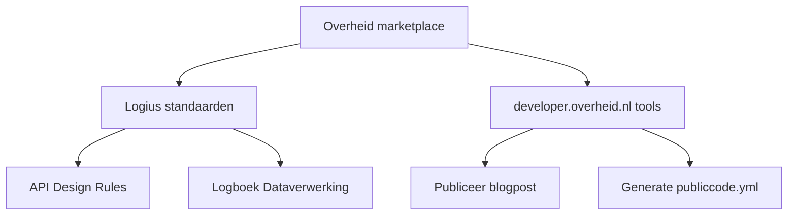

# Wat als je standaarden kon downloaden in je AI-assistant?


"I know kung fu." In The Matrix downloadt Neo een vechtkunst in zijn hoofd en is
klaar om te gaan. In het echt werkt het anders. Als developer moet je allerlei
standaarden en protocollen kennen, en dat kost uren lezen en uitzoeken. Maar je
AI-assistant kan die kennis wel gewoon ingeladen krijgen. Op
developer.overheid.nl experimenteren we met skills die overheidsstandaarden
inladen in je AI-assistant.

<!-- truncate -->

De Nederlandse overheid heeft tientallen standaarden voor softwareontwikkeling.
API Design Rules, Digikoppeling, OAuth NL-profielen, DMARC, DNSSEC, en zo door.
Ze zijn publiek beschikbaar en goed gedocumenteerd. Toch kent bijna niemand ze
allemaal. Er zijn er gewoon te veel, en de afstand tussen een standaarddocument
en je dagelijkse werk is groot. Skills maken die afstand kleiner.

:::warning[Verantwoord experimenteren]

We noemen dit bewust een experiment. Alle skills dragen een CONCEPT-label. De
beschrijvingen zijn informatieve samenvattingen; de
[officiële bronnen](https://www.forumstandaardisatie.nl/open-standaarden) zijn
leidend.

We hebben het experiment getoetst aan de
[Overheidsbrede handreiking voor de verantwoorde inzet van generatieve AI](https://open.overheid.nl/documenten/9c273b71-cebb-4e11-b06f-fa20f7b4b90e/file).
In het
[verantwoordingsdocument](https://github.com/developer-overheid-nl/skills-marketplace/blob/main/docs/verantwoording.md)
staat hoe we omgaan met risico's. Om vendor lock-in te voorkomen testen we
skills met meerdere AI-assistants, waarvan minimaal een open source.

:::

## Wat zijn skills?

Een skill is een Markdown-bestand met instructies en referentiemateriaal voor
een AI-assistant. Denk aan de checklist die een piloot doorloopt voor vertrek.
De piloot kan vliegen, maar de checklist zorgt dat er niets wordt overgeslagen.

Er zit geen code in en je hoeft niets te finetunen. Het is gewoon een
Markdown-bestand met gestructureerde kennis.

Skills activeren op basis van context. Als je een REST API bouwt, laadt je
assistant de API Design Rules. Configureer je een mailserver, dan komen de
DMARC- en DKIM-richtlijnen erbij. Je hoeft als developer niet eens te weten dat
een bepaalde standaard bestaat.

Meerdere skills vormen samen een plugin, en plugins zijn vindbaar via een
marketplace. Het "Agent Skills" formaat is een [open standaard](https://agentskills.io/home)
die inmiddels door meer dan dertig tools wordt ondersteund, waaronder Claude
Code, Opencode, Cursor, GitHub Copilot en Gemini CLI.



_Voorbeeldhiërarchie. Meerdere skills vormen samen een plugin. Plugins kunnen
gevonden worden via marketplaces._

## In actie: de API Design Rules

Je bouwt een REST API voor een overheidsorganisatie en vraagt je AI-assistant om
een opzet. Zonder skill krijg je een generieke API die niet voldoet aan de
[API Design Rules](https://gitdocumentatie.logius.nl/publicatie/api/adr/2.1.0/)
van Logius. Endpoints in camelCase in plaats van kebab-case, foutmeldingen als
vrije tekst in plaats van `problem+json`, geen versienummer in het pad.

Met de [`/ls-api`](https://github.com/developer-overheid-nl/skills-standaarden/blob/main/skills/ls-api/SKILL.md) skill zit dat er anders uit:

**Prompt:**

```md
Maak een OAS die voldoet aan de ADR en verifieer of deze valid is. Het betreft
een CRUD API waarmee men bieren, bierstijlen en brouwerijen kan ophalen. Een
brouwerij heeft een naam, en adres. Een bier heeft een alcoholpercentage,
gekoppelde bierstijl en gekoppelde brouwerij.
```

**Zonder skill:**

```bash
● Write(openapi.yaml)
● Bash(npx @stoplight/spectral-cli lint /openapi.yaml \
  --ruleset https://static.developer.overheid.nl/adr/ruleset.yaml 2>&1)
  ⎿ 16 errors, 1 warning found!
  ⎿  (timeout 30s)

● De spec is niet ADR-compliant — 16 errors, 1 warning.
```

**Met skill:**

```bash
● Skill(standaarden:ls-api)
  ⎿  Successfully loaded skill · 7 tools allowed · claude-sonnet-4-6
● Write(openapi.yaml)
● Bash(npx @stoplight/spectral-cli lint /openapi.yaml \
  --ruleset https://static.developer.overheid.nl/adr/ruleset.yaml 2>&1)
  ⎿  No results with a severity of 'error' found!
  ⎿  (timeout 30s)

● De spec is ADR-compliant — 0 errors, 0 warnings.
```

:::info

Merk op dat de AI-assistant zelf valideert of de gegenereerde code voldoet aan
de ADR door de linter te draaien. Ook deze validatie staat beschreven in de
skill. In het voorbeeld zonder skill heeft de AI-assistant hier geen weet van,
maar om de resultaten te tonen hebben we dit hierbij expliciet aangegeven.

:::

Dit soort details bepalen of je API voldoet aan de standaard op de
['pas toe of leg uit'-lijst](https://www.forumstandaardisatie.nl/open-standaarden/rest-api-design-rules).
De skill bevat verder naamconventies (kebab-case paden, camelCase parameters),
de verplichte OpenAPI-specificatie op `/openapi.json`, security headers, en een
implementatiechecklist van veertien punten. Of, zoals de AI-assistant zelf
aangeeft op de vraag wat het verschil is tussen het uitvoeren van de prompt mét
en zonder skill:

```bash
De skill zorgt ervoor dat ik de ADR-specifieke regels (zoals de verplichte
API-Version header en de problem+json foutstructuur) direct goed toepas,
in plaats van terug te vallen op gangbare REST-conventies die net niet aan
de Nederlandse standaard voldoen.

Wat ik zonder skill fout deed:

┌────────────────────┬──────────────────────────┬──────────────────────────────────┐
│ADR-regel           │Fout zonder skill         │Wat de skill wist                 │
├────────────────────┼──────────────────────────┼──────────────────────────────────┤
│API-Version header  │Vergeten op alle responses│Verplichte header op elke response│
├────────────────────┼──────────────────────────┼──────────────────────────────────┤
│Versie in server URL│/api/v1/... in paden      │Linter checkt server URL          │
├────────────────────┼──────────────────────────┼──────────────────────────────────┤
│Problem details     │Eigen Error schema        │RFC 9457                          │
├────────────────────┼──────────────────────────┼──────────────────────────────────┤
│Query parameters    │brewery_id (snake_case)   │camelCase: brouwerijId            │
└────────────────────┴──────────────────────────┴──────────────────────────────────┘

```

De API Design Rules skill is een van tien skills in de
[standaarden-plugin](https://github.com/developer-overheid-nl/skills-standaarden),
die samen 77 GitHub-repositories en negen domeinen afdekt. Er zijn ook plugins
voor
[internetstandaarden](https://github.com/developer-overheid-nl/skills-internet)
(internet.nl),
[geo-standaarden](https://github.com/developer-overheid-nl/skills-geo)
(Geonovum) en
[NeRDS-richtlijnen](https://github.com/developer-overheid-nl/developer-overheid-nl-agent-skills).

## Waarom standaarden zich hier goed voor lenen

Overheidsstandaarden beschrijven regels en vereisten. Dat soort gestructureerde
kennis past goed in een skill. Ze zijn publiek en open, en veelal met licenties
die dit toestaan. En ze veranderen niet elke week, waardoor skills actueel
blijven. En als ze wel veranderen, dan weten we dat direct omdat we de bronnen
monitoren.

Daarnaast lossen skills een praktisch probleem op. De meeste developers kennen
een handjevol standaarden, terwijl er tientallen relevant zijn voor hun werk.
Met skills zit die kennis in het gereedschap zelf.

## Meedoen

De
[skills marketplace](https://github.com/developer-overheid-nl/skills-marketplace)
is openbaar en bruikbaar. Installeren kan in Claude Code of Cursor, zie de
instructies in de repository.

Feedback is welkom via GitHub issues, zeker als een skill een standaard verkeerd
samenvat. We passen skills aan op basis van feedback.

Je kunt ook zelf skills schrijven. Je hoeft geen developer te zijn; als je de
kennis hebt over een standaard of richtlijn, kun je die structureren in een
Markdown-bestand. De
[handleiding](https://github.com/developer-overheid-nl/skills-marketplace/blob/main/docs/plugin-maken.md)
beschrijft hoe.

## Wat we hopen

We hebben nu zes plugins en tientallen skills, en dat groeit. We willen dat
standaarden beschikbaar zijn in je terminal en editor, terwijl je code schrijft.

De repositories zijn open. Probeer het uit en laat weten wat je ervan vindt!
