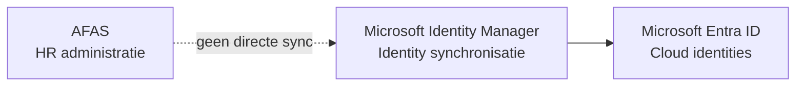
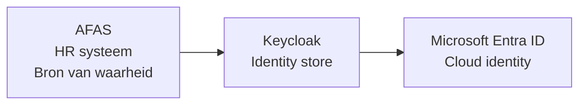
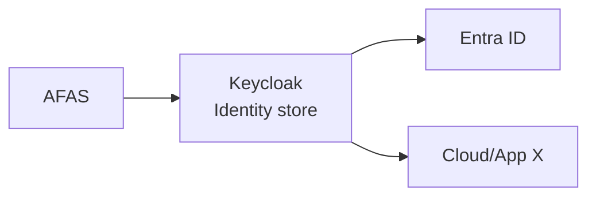
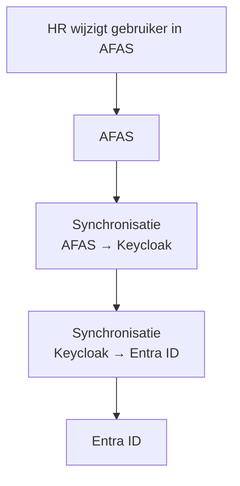

# Van Microsoft Identity Manager naar moderne identity synchronisatie

Identity management — het beheren van wie toegang heeft tot welke systemen — is
een belangrijk onderdeel van elke IT-organisatie. Gebruikers moeten correct
bestaan in HR-systemen, identity platforms en cloudomgevingen.

Veel organisaties gebruiken hiervoor nog legacy oplossingen zoals
**Microsoft Identity Manager (MIM)**. Die werken, maar brengen ook
complexiteit, handmatig werk en afhankelijkheid van één leverancier met zich mee.

Bij WIGO4IT hebben we daarom een migratie uitgevoerd. Het doel:

- één bron van waarheid voor gebruikers
- geen dubbele invoer
- minder beheer
- cloud-onafhankelijkheid
- duidelijke logging en controle

We vervingen Microsoft Identity Manager door een eenvoudige synchronisatie
tussen AFAS, Keycloak en EntraID.

<!-- truncate -->

## Het oorspronkelijke landschap

In de oude situatie bestonden gebruikers op meerdere plekken. HR beheerde
gebruikers in AFAS — het HR-systeem van de organisatie. IT beheerde diezelfde
gebruikers handmatig in Microsoft Identity Manager. Dit leidde tot
inconsistentie en extra beheer.

### Architectuur voor de migratie

AFAS en MIM waren losse systemen zonder automatische koppeling. Wijzigingen
in AFAS — zoals een nieuwe medewerker of een naamswijziging — moesten
handmatig worden overgenomen in MIM.

### Problemen in de oude situatie

- Gebruikers moesten op meerdere plekken worden beheerd
- AFAS en MIM bevatten vaak verschillende gegevens
- Wijzigingen kwamen niet automatisch door
- Beheer kostte veel tijd
- Sterke afhankelijkheid van Microsoft tooling

## Nieuwe architectuur

De nieuwe oplossing gebruikt een duidelijke keten: gegevens stromen automatisch
van het HR-systeem naar de identity store en vervolgens naar de cloud.

**AFAS** wordt de enige bron van waarheid. **Keycloak** fungeert als centrale
identity store — een systeem dat gebruikersidentiteiten opslaat en beheert.
**Entra ID** (voorheen Azure Active Directory) blijft de cloud identity voor
Microsoft-diensten zoals Microsoft 365.

De synchronisatie bestaat uit twee stappen:

1. AFAS naar Keycloak
2. Keycloak naar EntraID

## Waarom Keycloak als tussenlaag

Keycloak is een open source identity platform dat in 2023 is opgenomen in de
[Cloud Native Computing Foundation (CNCF)](https://www.cncf.io/projects/keycloak/) —
de organisatie achter bekende projecten als Kubernetes en Prometheus. Het
beheert gebruikersaccounts en regelt authenticatie — wie mag inloggen en via
welk protocol. Keycloak fungeert hier als schakel tussen het HR-systeem en de cloud.

Voordelen van deze aanpak:

- Centrale opslag van identities: één plek voor gebruikersbeheer
- Open source: geen licentiekosten, geen vendor lock-in
- Cloud-onafhankelijk: werkt naast EntraID maar is er niet van afhankelijk
- Ondersteuning voor standaard protocollen zoals OAuth 2.0 en OpenID Connect —
  dat zijn internationale open standaarden voor veilige toegang en inloggen

## AFAS als bron van waarheid

Een kernprincipe in de nieuwe architectuur: gebruikers bestaan op één plek.
**AFAS**. Alle andere systemen volgen automatisch.

Dit principe dwingt ook datakwaliteit af: onjuiste gegevens in AFAS leiden
direct tot onjuiste identities elders. De synchronisatie valideert bij elke run
of verplichte velden aanwezig zijn, of e-mailadressen het juiste formaat hebben
en of telefoonnummers de verwachte notatie volgen. Ontbreekt een vereist veld?
Dan wordt de gebruiker overgeslagen en ontvangt het verantwoordelijke team
automatisch een melding.

De verantwoordelijkheid voor de juistheid van de data ligt daarmee duidelijk
bij HR, niet bij IT.

## Resultaten van de migratie

### Operationeel

- Geen dubbele gebruikersadministratie meer
- Minder beheerlast voor IT
- Duidelijke verantwoordelijkheden: HR beheert de gegevens, IT beheert de synchronisatie
- Automatische verwerking van nieuwe medewerkers, wijzigingen en uitdiensttreding
- Geautomatiseerde e-mailnotificaties naar de juiste personen bij elke mutatie

### Lifecycle management: wat gebeurt er bij uitdiensttreding?

Een medewerker die uit dienst gaat, moet niet alleen uit het HR-systeem
verdwijnen — ook het Keycloak-account en het Entra ID-account moeten worden
opgeruimd. De synchronisatie regelt dit automatisch op basis van de
uitdiensttredingsdatum in AFAS:

- **Actief** — de medewerker wordt bijgewerkt in Keycloak en EntraID
- **Uitgetreden** — de accounts worden uitgeschakeld in beide systemen
- **Definitief verwijderd** — na een ingestelde periode worden de accounts
  volledig verwijderd uit Keycloak én Entra ID

Dit voorkomt dat verlopen accounts onbeheerd blijven bestaan — een veelvoorkomend
beveiligingsrisico bij handmatig beheer.

### Automatische notificaties

Niet elke mutatie spreekt voor zich. Daarom verstuurt de synchronisatie bij
bijzondere gebeurtenissen automatisch een e-mailbericht naar de betrokkenen.
Dit zijn de situaties die een bericht triggeren:

| Situatie | Ontvanger |
|---|---|
| Nieuwe gebruiker aangemaakt | HR / Beheerteam / Officemanagement |
| Gebruiker verwijderd | HR / Beheerteam |
| Hulpaccount (aux) verwijderd | HR / Beheerteam |
| Profiel onvolledig in AFAS | HR / Beheerteam |
| Aanmaken gebruiker mislukt | HR / Beheerteam |
| Periodiek mutatieoverzicht | HR / Beheerteam |

Het mutatieoverzicht bevat tellingen van alle acties: hoeveel accounts aangemaakt,
bijgewerkt, uitgeschakeld, verwijderd en mislukt. Zo heeft het beheerteam altijd
inzicht zonder zelf de logs te hoeven doorzoeken.

### Technisch

- Open source componenten: geen licentiekosten of afhankelijkheid van één leverancier
- Geen afhankelijkheid van de MIM server
- Eenvoudig te draaien op een server, in een container of als onderdeel van een
  geautomatiseerde deploymentpipeline
- Auditlog: elke synchronisatieactie wordt vastgelegd met tijdstip en resultaat
- JSON-schemavalidatie: de data uit AFAS wordt gevalideerd tegen een schema
  voordat de synchronisatie begint — fouten worden vroegtijdig gevangen

### Beveiliging: vier authenticatiemethoden

De synchronisatie verbindt met Azure-diensten (Key Vault, Microsoft Graph API).
Daarvoor zijn credentials nodig. De oplossing ondersteunt vier methoden, zodat
ze werkt in elke omgeving zonder aanpassingen:

| Methode | Wanneer te gebruiken |
|---|---|
| `azure_cli` | Lokale ontwikkeling, engineer is ingelogd via `az login` |
| `managed_identity` | De applicatie draait op een Azure VM of container met een toegewezen identiteit — geen wachtwoord nodig |
| `workload_identity` | GitHub Actions met OIDC-federatie — geen secrets in de pipeline |
| `client_secret` | Traditionele service principal met client ID en secret |

:::tip Voorkeur voor productie
Gebruik `managed_identity` of `workload_identity` waar mogelijk. Geen secrets
om te roteren, geen risico op lekken in configuratiebestanden.
:::

## Technische duurzaamheid

Een oplossing is pas waardevol als je er over vijf jaar nog mee kunt werken.
We hebben bewust keuzes gemaakt die de langetermijnonderhoudbaarheid borgen.

**Open standaarden**
De synchronisatie maakt gebruik van REST API's en standaardprotocollen zoals
OAuth 2.0 en OpenID Connect. Dit zijn breed gedragen, leverancier-onafhankelijke
standaarden die door vrijwel alle moderne systemen worden ondersteund. Vervang
je ooit Keycloak door een andere identity provider, dan verandert de aanpak
nauwelijks.

**Geen propriëtaire configuratie**
MIM werkte met binaire configuratiebestanden en Windows-specifieke tooling.
De nieuwe oplossing bestaat volledig uit leesbare scripts en JSON-bestanden.
Elke Linux- of DevOps-engineer kan de code begrijpen, aanpassen en overdragen
— zonder speciale tooling of certificeringen.

**Actief onderhouden componenten**
Keycloak wordt actief ontwikkeld door Red Hat en een grote open source
community, en is sinds 2023 een officieel
[CNCF-project](https://www.cncf.io/projects/keycloak/). AFAS en Entra ID worden onderhouden door hun eigen leveranciers.
Geen van de componenten staat stil of is afhankelijk van één persoon.

**Modulaire opzet**
Elke stap in de synchronisatie is een losstaand onderdeel. Verandert de
structuur van de AFAS API? Dan pas je alleen de ophaalfunctie aan. Stapt de
organisatie over naar een andere identity provider? Dan vervang je alleen het
Keycloak-gedeelte. De rest blijft ongewijzigd.

**Testbaarheid**
De synchronisatie is gedekt met **333 geautomatiseerde tests** verdeeld over
beide pipelines en de gedeelde hulpfuncties. Elke use case — nieuwe medewerker,
wijziging, uitdiensttreding, ongeldig profiel — heeft eigen testscenario's.
Daarnaast is er een dry-run modus: die doorloopt de volledige synchronisatie
inclusief authenticatie en datavalidatie, maar voert geen schrijfacties uit.
Zo kun je een wijziging veilig valideren in een productieomgeving voordat je
hem daadwerkelijk uitvoert.

:::info Dry-run in de praktijk
Een dry-run logt precies welke acties er zouden plaatsvinden: welke gebruikers
aangemaakt, bijgewerkt of verwijderd zouden worden, inclusief de volledige
data die verstuurd zou worden. Handig voor acceptatietests en bij het
onboarden van nieuwe beheerders.
:::

## Conclusie

De migratie van Microsoft Identity Manager naar een moderne synchronisatiearchitectuur leverde een eenvoudiger en robuuster identity-landschap op.

Belangrijkste resultaten:

- Één bron van waarheid voor alle identities
- Minder handmatig beheer
- Open architectuur zonder leveranciersafhankelijkheid
- Betere controle en traceerbaarheid

De oplossing bewijst dat identity synchronisatie geen complexe legacy systemen
nodig heeft. Met open source componenten en duidelijke verantwoordelijkheden is
een betrouwbare en onderhoudbare synchronisatie haalbaar voor elke
overheidsorganisatie.
