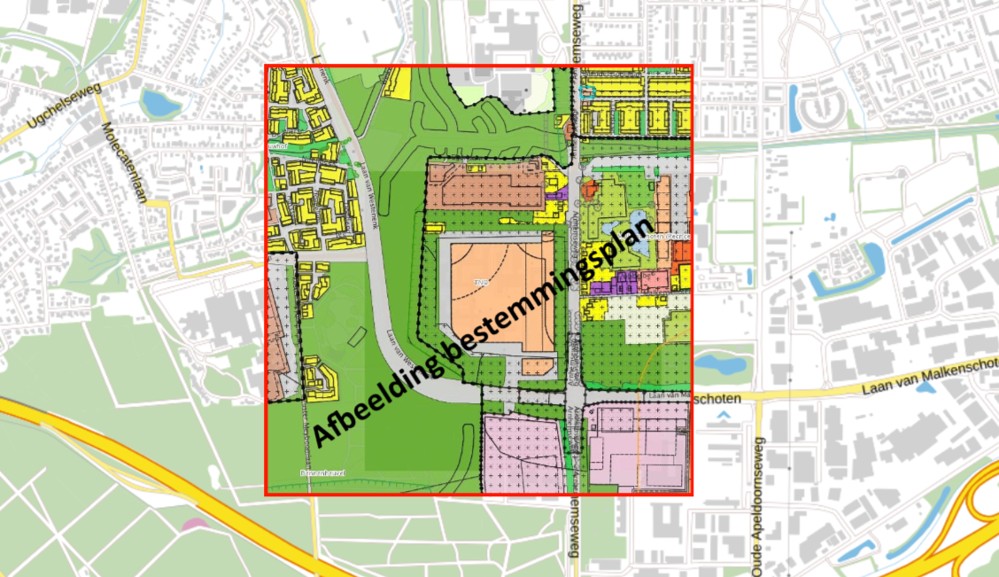

# Kadaster stelt Generieke Geo Componenten open source beschikbaar

Digitale kaartinformatie, ook wel geo-informatie genoemd, is voor een
organisatie als het Kadaster onmisbaar. De eenvoudigste manier om geo-informatie
te bekijken en te gebruiken, is via een online kaartviewer. Diverse
kaartviewers, zoals de [PDOK Viewer](https://app.pdok.nl/viewer), het
[WOZ-waardeloket](https://wozwaardeloket.nl) en de
[BAG Viewer](https://bagviewer.kadaster.nl), zijn door het Kadaster ontwikkeld
om geodata eenvoudig te raadplegen en te gebruiken.

Wat minder zichtbaar is bij het gebruik van deze viewers, is dat ze 'onder de
motorkap' dezelfde componenten gebruiken: de
[Generieke Geo Componenten](https://www.generiekegeocomponenten.nl/).

<!-- truncate -->

## Waarom Generieke Geo Componenten?

Binnen het Kadaster worden veel kaartviewers ontwikkeld voor interne en externe
doeleinden. We hebben ze nooit officieel geteld, maar naar schatting zijn het er
40 à 50. Vaak worden deze viewers ontwikkeld door afzonderlijke ontwikkelteams.

Het BAG-team is bijvoorbeeld verantwoordelijk voor de volledige dienstverlening
rondom de Basisregistratie Adressen en Gebouwen (BAG). Zij zorgen ervoor dat
bronhouders (gemeenten) BAG-data kunnen registreren, dat deze correct wordt
opgeslagen in de landelijke voorziening en dat de gegevens via API's en andere
webservices beschikbaar worden gesteld aan gebruikers. Daarnaast zijn zij ook
verantwoordelijk voor de ontwikkeling en het beheer van de BAG Viewer.

Doordat veel teams op deze manier werkten, ontstond er zo'n tien jaar geleden
een versnipperd landschap aan kaartviewers. De viewers maakten gebruik van
verschillende technieken, zagen er onderling anders uit ondanks dezelfde
huisstijl en voldeden niet altijd aan eisen op het gebied van toegankelijkheid
en responsiveness. Daarbij lag de focus van veel ontwikkelteams vooral op
backends en databases, waardoor het ontwikkelen en beheren van een kaartviewer
er vaak 'bij' werd gedaan. Dit leidde ertoe dat in elk team telkens opnieuw het
wiel werd uitgevonden.

Om dit te doorbreken zijn de Generieke Geo Componenten ontwikkeld: flexibele
softwarebouwstenen waarmee ontwikkelaars, ook zonder veel frontendkennis,
eenvoudig een online kaartviewer kunnen maken. Ze werken met de
geo-informatiestandaarden die PDOK gebruikt voor open geodata en ondersteunen
het principe 'data bij de bron'. Ook voldoen ze, waar mogelijk, aan de
toegankelijkheidsrichtlijnen (WCAG), al geldt voor geo-informatie deels een
uitzondering.

## Waarom open source?

Al vroeg in de ontwikkeling van de Generieke Geo Componenten ontstond het idee
om deze buiten het Kadaster beschikbaar te maken. De componenten zijn namelijk
gebaseerd op open‑sourceframeworks zoals OpenLayers en Angular. Daarnaast zagen
we dat andere overheidsorganisaties tegen vergelijkbare uitdagingen aanliepen,
of juist onvoldoende capaciteit hadden om zelf een kaartviewer te ontwikkelen.
Open software kan bovendien helpen bij het vergroten van de adoptie van open
data en open standaarden.

Toch strandde dit plan eind 2017, na het verschijnen van een
[rapport van Gartner](https://www.kennisopenbaarbestuur.nl/documenten/2017/10/11/onderzoek-open-source-software).
Hierin werd gewezen op mogelijke juridische risico's in het kader van de Wet
Markt en Overheid. De focus verschoof daarom naar intern gebruik, terwijl we
verder werkten aan het verbeteren van de componenten en het stimuleren van het
gebruik binnen het Kadaster.

De ambitie verdween tijdelijk naar de achtergrond, maar bleef bestaan. Inmiddels
zijn zowel het overheidsbeleid als het Kadasterbeleid rond open source
gewijzigd. We zijn dan ook blij dat we tijdens de Open Geodag van 12 mei de
Generieke Geo Componenten alsnog hebben kunnen vrijgeven.

Een bijkomend voordeel is dat de componenten in de tussentijd rijker zijn
geworden in functionaliteit en zich in de praktijk hebben bewezen: ze worden
inmiddels in zo'n 30 applicaties binnen het Kadaster gebruikt.

## Actief samenwerken aan doorontwikkeling

We nodigen iedereen uit om een kijkje te nemen op
[https://www.generiekegeocomponenten.nl](https://www.generiekegeocomponenten.nl).

Hier kun je voorbeelden bekijken, de componenten gebruiken en bijdragen aan de
verdere ontwikkeling. Op de website vind je ook een link naar GitHub en
technische documentatie om de componenten te installeren en te configureren.
Voor het Kadaster is dit een van de eerste serieuze
open‑sourcesoftwarepublicaties. We kijken uit naar de extra dynamiek en
samenwerking die dit oplevert voor de verdere doorontwikkeling van de
componenten.
