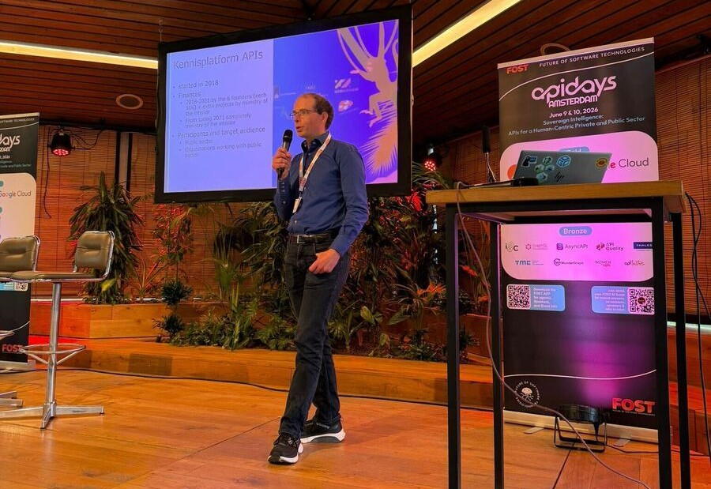
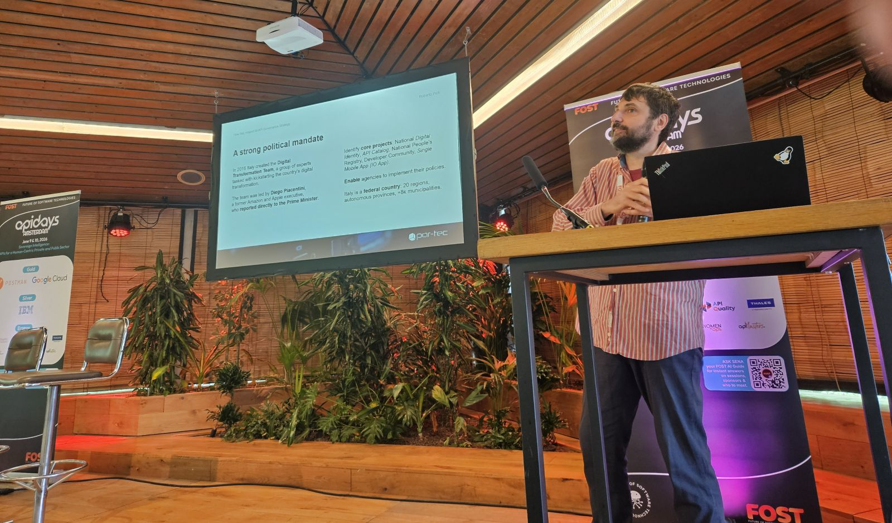
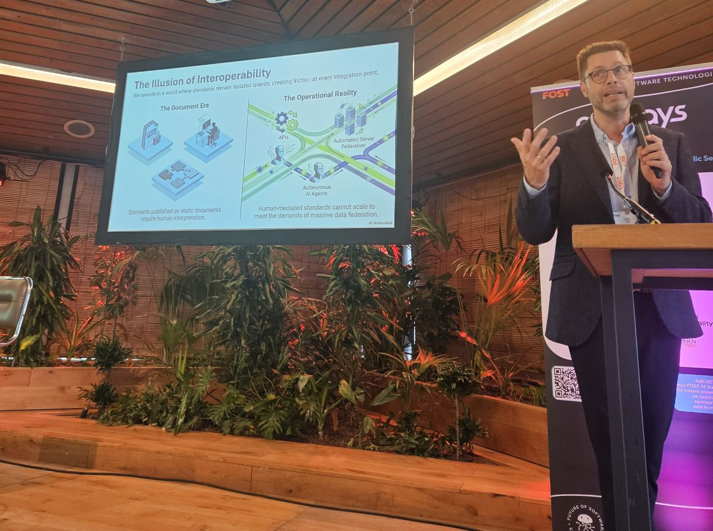
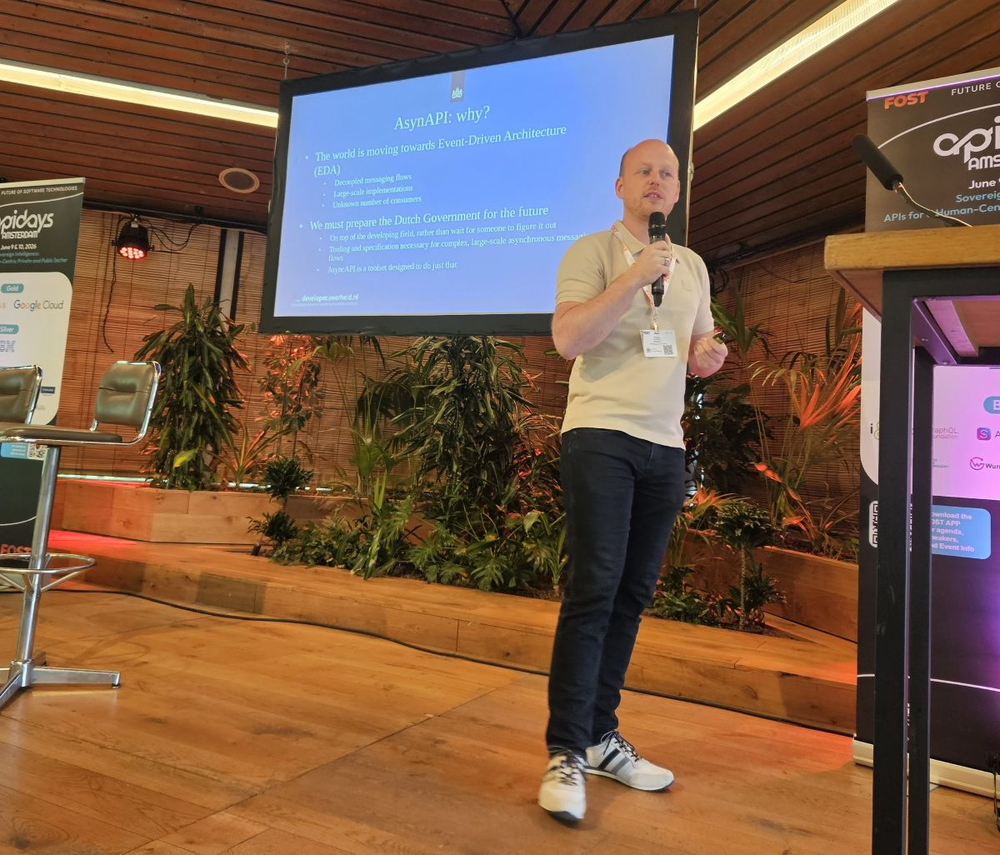
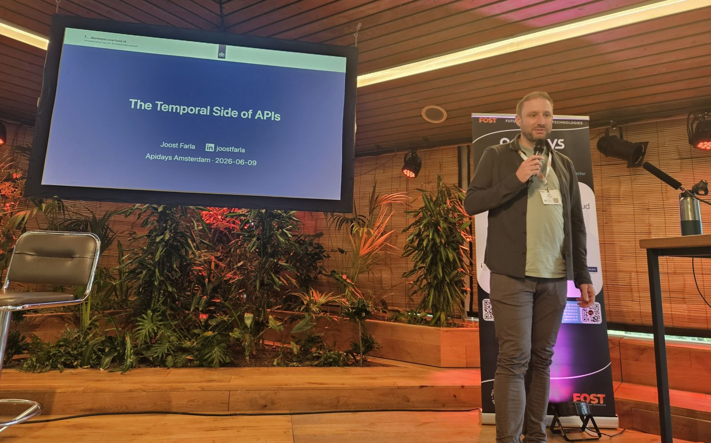
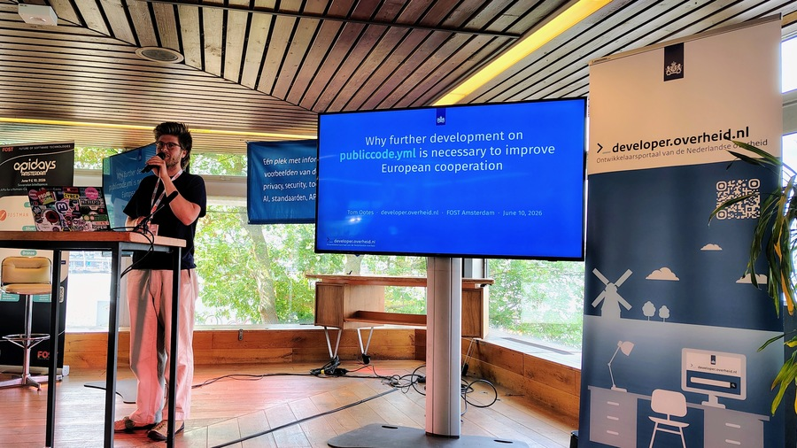

import { Link, Icon } from "@rijkshuisstijl-community/components-react";

# Wij waren op FOST 2026: een terugblik

 _Frank
Terpstra opende de API-track plenair._

Op 9 en 10 juni stonden wij twee dagen op
[FOST](https://www.futureofsoftwaretechnologies.com/) Amsterdam met onze eigen
NL Gov-track. FOST (_Future of Software Technologies_) begon ooit als de
wereldbekende [API Days](https://www.apidays.global/)-conferentie, maar groeide
uit tot een wereldwijd paraplu-event waaronder verschillende miniconferenties
vallen; oprichter Mehdi Medjaoui maakte gekscherend de vergelijking van monoliet
naar microservices. Naast API Days zelf vallen daar onder meer de conferenties
van [OpenAPI](https://www.openapis.org/),
[JSON Schema](https://json-schema.org/), [AsyncAPI](https://www.asyncapi.com/),
[Green IO](https://greenio.tech/) en deze editie dus ook wijzelf onder. Ons
goedbezochte event bestond uit twee onderdelen: een API-track en een open
source-track. Van ons eigen developer.overheid.nl-team betraden Dimitri, Tom,
Frank, Floris en Joost het podium, samen met andere collega's uit binnen- en
buitenland. Een terugblik op twee inspirerende dagen.

<!-- truncate -->

## API-track

### Nationale API-strategie en governance

Hoe bouw je een nationale API-strategie, en hoe krijg je organisaties mee zonder
ze te dwingen? Die vraag liep als een rode draad door meerdere talks.

Dimitri van Hees blikte terug op acht jaar
[developer.overheid.nl](https://developer.overheid.nl). Het ontstond tijdens een
bijeenkomst van de Europese Commissie in Italië, bedoeld om API-kennis tussen
lidstaten uit te wisselen. Hier was Nederland het enige land dat met meer dan
één organisatie aanwezig was; zowel Kadaster, CBS, BZK en de gemeente Amsterdam
waren onafhankelijk van elkaar uitgenodigd om, bij gebrek aan een centrale
IT-organisatie, de Nederlandse digitale overheid te vertegenwoordigen. Op
diezelfde bijeenkomst ontmoetten ze Roberto Polli, wiens team toen al ver was
met een eigen developer portal; developer.overheid.nl is mede op dat voorbeeld
gebaseerd. Wat begon als een simpele lijst van overheids-API's, is inmiddels een
kennisbank voor zowel consumenten als aanbieders. Omdat een formeel mandaat
ontbreekt, werkt het platform via waarde toevoegen: vindbaarheid, gratis
validatietools en beveiligingsscans. Het API-register accepteert alleen API's
met een OpenAPI-specificatie, kent scores toe op basis van de API Design Rules
en ondersteunt lifecyclemanagement. Recent toegevoegd: een Open Source Register
op basis van `publiccode.yml`, notificaties via RSS en Slack, en experimenten
met AI Agent Skills.

Roberto Polli, voorheen van het _Dipartimento per la Trasformazione Digitale_,
was mede-verantwoordelijk voor de totstandkoming van de
[Italiaanse developer portal](https://developers.italia.it/) en API-strategie,
precies het register dat Dimitri als inspiratie noemde. In een van zijn twee
talks liet hij zien hoe die strategie tot stand kwam. Het oude SOAP-framework
werkte prima voor grote instanties, maar met opstartkosten van zo'n 200.000 euro
was het onbetaalbaar voor de meer dan 8.000 kleine gemeenten. De overstap naar
een REST-vriendelijk framework was dus een kwestie van toegankelijkheid. De
lockdown van 2020 maakte de urgentie zichtbaar, en daarna volgde een API Cloud
waarin instanties verplicht hun API's publiceren en handmatige overeenkomsten
zijn vervangen door digitale delegatie. Zijn vier randvoorwaarden voor succes:
politiek commitment, technische expertise in de uitvoering, betrokkenheid bij
internationale standaardisatie, en juristen die in het team zitten in plaats van
op een aparte afdeling.

 _Roberto Polli sprak over de Italiaanse
API-strategie._

Frank Terpstra, die al jaren aan de Nederlandse API-strategie werkt, ging in een
panel in gesprek met Dimitri en Janette Storm (Kadaster). Daar kwam het
spanningsveld scherp naar voren: je moet een standaard eerst laten werken
voordat je die verplicht stelt. Een "wall of shame" werkt averechts, want wie
niet voldoet laat zich liever van de lijst halen dan zich aanpassen. Ook bleek
dat je per doelgroep een andere taal moet spreken: beleidsmakers zoeken
kostenbesparing, productmanagers willen klantcontact verbeteren en developers
kijken naar concrete Design Rules en tooling. Mooie observatie: API's worden
steeds vaker ingezet om het datakopieerprobleem bespreekbaar te maken bij
bestuurders, een thema dat de krantenkoppen haalt. Tot slot klonk de roep om
meer Europese coördinatie.

Tim van der Lippe (Logius) presenteerde de NLgov REST API Design Rules. Elke
regel is gebaseerd op echte beslissingen van overheidsorganisaties waarvan
inmiddels bekend is of ze goed of slecht uitpakten. Door de standaard, het
API-register en analyses van API's in het wild samen te brengen, ontstaat een
levende standaard die gevoed wordt door wat developers daadwerkelijk bouwen.

### Schemas en semantische interoperabiliteit

Verschillende organisaties beschrijven dezelfde entiteit vaak op totaal
verschillende manieren. Vier sprekers lieten zien hoe je daar met schemas en
semantiek grip op krijgt. Over dit thema verschijnt binnenkort een aparte en
uitgebreidere blogpost.

Tom Collins werkt voor de
[DVLA](https://www.gov.uk/government/organisations/driver-and-vehicle-licensing-agency),
de Britse instantie voor rijbewijzen en voertuigen, en beheert gegevens over
zo'n vijftig miljoen voertuigen. Zijn oplossing voor teams die in silo's
dezelfde begrippen anders definiëren, is het Schema Dictionary: een centraal
Git-repository op basis van JSON Schema. De werkwijze is schema-first, het
datamodel wordt via peer-reviews beoordeeld voordat er code is, en vanuit de
centrale schema's worden automatisch code, documentatie, OpenAPI-contracten en
testdata gegenereerd. Inmiddels gebruiken zo'n 450 repositories het systeem; bij
het medische rijbewijsverlengingsproces, dat zes productteams overspant, steeg
het percentage klanten dat het volledig digitaal kon doorlopen van 15 naar 100
procent. Ook hier gold "carrot rather than the stick". De aanpak is bewust puur
structureel: de standaardisatie zit in de schema's zelf, zonder semantische laag
eroverheen.

Dimitri constateerde dat overheids-API's veel meer delen dan ze hergebruiken.
Geïnspireerd door het Schema Dictionary van de DVLA bouwt developer.overheid.nl
daarom zelf aan een nationaal schema-register dat herbruikbare
OpenAPI-componenten en JSON Schemas beschikbaar stelt als bouwstenen, met
bijbehorende schema-ontwerpregels. Hij liet ook zien hoe zijn team eigen tooling
en AI-hulpmiddelen inzet om een complete OpenAPI 3.1-specificatie met ingebedde
JSON Schemas te genereren en valideren.

Ingo Simonis ([Open Geospatial Consortium](https://www.ogc.org/)) draaide het
perspectief om: niet de hoeveelheid data telt, maar de betekenis ervan. Een
AI-agent faalt niet omdat hij data niet kan bereiken, maar omdat hij die niet
betrouwbaar kan interpreteren. Niet-gedeclareerde eenheden, lokale categorieën
en impliciete referentiesystemen zijn stuk voor stuk uitnodigingen om te raden,
en raden op de semantische laag is waar hallucinaties ontstaan. Zijn stelling:
organisaties die de AI-decade winnen, behandelen expliciete kennis als
infrastructuur, niet als documentatie. De semantische gemeenschap lost dit
probleem al dertig jaar op, merkte hij droog op, en de rest van de wereld
arriveert nu pas aan de deur.

 _Ingo Simonis betoogde dat semantiek, niet de
hoeveelheid data, bepaalt of AI-agents informatie betrouwbaar interpreteren._

Op precies die drempel stond de andere talk van Roberto Polli.
[JSON-LD](https://json-ld.org/) bestaat allang; de echte brug zit in iets
kleiners. Door een extensie als `x-jsonld-context` toe te voegen aan een
OpenAPI-document leg je de link tussen een schema en zijn betekenis direct in de
specificatie, en stapt de schema-first wereld door de deur die Ingo schetste.
Elke data-eigenschap krijgt een URI die de exacte betekenis vastlegt, zodat
Italiaanse data automatisch koppelt aan bijvoorbeeld Finse of Nederlandse
standaarden zonder dat de onderliggende systemen veranderen. In Italië is dit al
verplicht voor de publieke sector, ondersteund door centrale tools als
[api.gov.it](https://api.gov.it/) (meer dan 12.000 publieke API's) en
[schema.gov.it](https://schema.gov.it/) (met een real-time conformiteitscore).
De boodschap: maak van de standaard een shortcut, dan omarmen developers die
vanzelf. Inmiddels hebben wij vanuit Nederland vervolggesprekken ingepland met
onze Italiaanse en Britse collega's, het OGC en de Stelselcatalogus, om dit
gezamenlijk aan te pakken.

### Events en notificaties

Met de verschuiving naar Event-Driven Architecture groeit de behoefte aan
standaarden voor ontkoppelde berichtstromen. Twee talks gingen hierop in, beide
voortgekomen uit werkgroepen van het Kennisplatform API's.

Floris Deutekom presenteerde de stand van zaken van de AsyncAPI-werkgroep.
AsyncAPI bouwt voort op OAS, is protocol-agnostisch (Kafka, RabbitMQ, HTTP en
meer) en levert out-of-the-box tooling voor validatie, documentatie en
codegeneratie. In twee praktijkgevallen, de Basisregistratie Ondergrond en Track
& Trace van het Ministerie van Justitie, bleken conversietools betrouwbaarder en
sneller dan handmatig werk. AsyncAPI heeft vooral meerwaarde bij ontkoppelde
architecturen, een onbekend aantal consumenten of een-op-veel-communicatie, en
de combinatie met CloudEvents biedt een uniform kader. Floris is over AsyncAPI
een serie blogposts aan het schrijven, en de eerste staat al online.

<Link href="/blog/authors/floris-deutekom">
  Lees hier alle posts van Floris over AsyncAPI
  <Icon icon="pijl-naar-rechts" />
</Link>

 _Floris Deutekom presenteerde de stand
van zaken van de AsyncAPI-werkgroep._

Danny Greefhorst (BZK/ICTU) plaatste notificaties in de context van een
dataspace voor de Nederlandse overheid, waarin dataproviders en consumenten
rechtstreeks met elkaar interacteren op basis van rulebooks, met data bij de
bron als kernprincipe. De voorkeur gaat uit naar informatie-arme notificaties
die naar de bron verwijzen, wat beveiliging en dataminimalisatie bevordert. Van
de drie patronen, polling, directe notificatie en een event broker, is voor de
Nederlandse overheid met potentieel 1.600 organisaties alleen de broker
schaalbaar genoeg. CloudEvents vormt de standaard voor de metadata, inclusief
een Nederlands profiel. De grootste uitdaging ligt overigens niet in de
techniek, maar in de organisatorische bereidheid om events daadwerkelijk te
delen.

### Updates uit andere werkgroepen

Naast AsyncAPI en notificaties deelden ook andere werkgroepen van het
Kennisplatform API's hun voortgang.

Joost Farla trekt de nieuwe werkgroep Historie, die zich richt op het omgaan met
bitemporaliteit in API's bij de overgang van Nederlandse registraties van EBMS
en StUF naar moderne REST API's. De meeste API's kennen alleen de staat van nu,
terwijl de werkgroep twee tijdlijnen onderzoekt: geldigheidstijd (wanneer was
iets waar in de werkelijkheid) en transactietijd (wanneer is het vastgelegd). Zo
wordt een vraag mogelijk als: wat was de weersverwachting voor zaterdag, zoals
we die gisteren kenden? De werkgroep verkent oplossingsrichtingen als
append-only in plaats van overschrijven, opvragen op tijdcoördinaten met
parameters als `validAt` en `recordedAt`, en idempotentie via idempotency keys.
Er speelt ook een spanning met de AVG, want append-only botst met het recht om
vergeten te worden; een verkende oplossing is crypto-shredding, waarbij niet de
data maar de encryptiesleutel wordt vernietigd. De kernboodschap: historie is
een functionele eis, geen bijproduct. Over dit onderwerp volgt binnenkort een
aparte en uitgebreidere blogpost.

 _Joost Farla sprak namens de nieuwe werkgroep
Historie over bitemporaliteit in API's._

Frank gaf daarnaast een update vanuit de werkgroep rond access control. Binnen
de publieke sector bestaan best practices voor toegangscontrole bij API's, en de
huidige best practice, de module access control van de API Design Rules, is door
de werkgroep herzien. Frank lichtte toe wat er is veranderd en kondigde aan dat
er een publieke consultatie van start gaat. Wie meer wil weten of wil meedenken,
kan via die consultatie bijdragen.

### API's in de praktijk

Drie talks lieten zien hoe overheids-API's op grote schaal in de praktijk
werken.

Janette Storm (Kadaster) liet zien hoe de
[Basisregistratie Adressen en Gebouwen](https://bag.basisregistraties.overheid.nl/)
(BAG), een van de meest gebruikte dataregistraties van de Nederlandse overheid,
meegroeide met de API-wereld. Vóór 2009 had elke gemeente een eigen
adresregistratie, sindsdien is er één centrale registratie waarvan gemeenten het
onderhoud blijven doen. De eerste BAG API verscheen in 2019 bijna per toeval,
uit een proof-of-concept met linked data, en won meteen de Gouden API-award.
Opvallend was het adoptieprofiel: private partijen als TomTom en Esri stapten
snel over, terwijl overheden langer vasthielden aan XML. De slimste zet was het
oplossen van de puzzel voor de gebruiker: in plaats van losse objecten die je
zelf moet samenvoegen, biedt een kant-en-klaar adreseindpunt nu 90 procent van
het gebruik. Binnenkort volgt een overstap naar de PDOK Locatie API met betere
ondersteuning voor historische data.

Die overstap sluit aan bij het verhaal van John Schaap (Kadaster) over
[PDOK](https://www.pdok.nl/) (Publieke Dienstverlening Op de Kaart), het
nationale geodataplatform met meer dan 200 datasets, bijna 300 API's en diensten
en miljoenen requests per dag. De uitdaging: complexe, heterogene geo-data
toegankelijk én bruikbaar maken voor moderne applicaties. Data ontsluiten is
niet genoeg; developers hebben snelle, consistente en intuïtieve API's nodig.
John deelde de ontwerpprincipes achter PDOK's OGC API's en de PDOK Locatie API,
waarmee PDOK evolueerde van traditionele geoservices naar een modern
API-ecosysteem met vector tile-visualisatie en slimme zoekmogelijkheden.

Bart Huijbers (Kadaster) opende ten slotte de motorkap van het
[Digitaal Stelsel Omgevingswet](https://developer.omgevingswet.overheid.nl/)
(DSO). Sinds 1 januari 2024 voegt de Omgevingswet tientallen wetten rond
ruimtelijke ordening, milieu, natuur en water samen, en het DSO is de
ICT-ruggengraat daaronder, van publicatie van regelgeving tot vergunningchecks
en vergunningaanvragen. Naar buiten toe is het één portaal, onder de motorkap
een samenspel van componenten die via een reeks API's data uitwisselen. Aan de
hand van concrete use cases liet Bart zien hoe die API's werken en welke
afwegingen daarin zijn gemaakt.

## Open source-track

De open source-track stipte uiteenlopende thema's aan, van digitale autonomie en
wetgeving tot publiccode.yml en digitale democratie.

### Digitale autonomie begint bij open source

Tom Ootes opende de open source-track plenair met een duidelijke boodschap:
digitale autonomie begint bij open source. Een week voor FOST presenteerde
Europa het Tech Sovereignty Package (3 juni 2026), met onder andere de Cloud and
AI Development Act, Chips Act 2.0 en een nieuwe Europese Open Source Strategie.
Centraal staat het begrip digitale commons: code en infrastructuur die
collectief geproduceerd worden, vrij toegankelijk zijn en in het publiek belang
onderhouden worden, terwijl Europees open source-werk nu nog onevenredig wordt
uitgebuit door grote niet-Europese techbedrijven. Voor de Nederlandse overheid
betekent dat technische volwassenheid: zelf open source kunnen bouwen, hosten en
onderhouden, met platform-engineering als cultuur en samenwerking als norm via
gedeelde design-systems, code.overheid.nl en gedeelde Kubernetes-clusters. Over
AI was Tom scherp: LLM's en agentic AI helpen ons sneller coderen, maar
vibe-coding voor productie keurt hij ten zeerste af en de ethische kant moet nog
worden opgelost. Het goede nieuws: de urgentie en politieke steun zijn er,
OSPO's schieten op binnen de overheid en developers staan te popelen.

 _Tom Ootes opende de open source-track plenair._

### Soevereine infrastructuur en wetgeving

Marlena van Ooijen (Logius) begon met een tegenstelling: sinds 2020 werkt het
Ministerie van Binnenlandse Zaken aan open source-beleid, maar in de praktijk
gebeurt overheidsontwikkeling nog grotendeels op GitHub. Steeds meer
organisaties delen de overtuiging dat échte open source-samenwerking een
gedeelde, soevereine omgeving vereist. Het antwoord is code.overheid.nl, een
overheidsbrede git-forge op basis van Forgejo, nog in de pilotfase, waarvan de
roadmap samen met de gebruikers wordt uitgewerkt.

August Bournique nam ons mee in de Cyber Resilience Act, de Europese wet die
productveiligheid voor digitale producten, software inbegrepen, reguleert en in
2026 en 2027 gefaseerd in werking treedt. Hij gaf een kijkje achter de schermen
bij het ontwikkelen van de eerste productgerichte softwarestandaarden voor de
CRA. De wet is ambitieus en de implementatie nog onzeker; August lichtte de
tijdlijn toe, en stond stil bij openstaande vraagstukken. Een grote misconceptie
die August graag uit de lucht wilde halen was dat open source-contributers ook
verantwoordelijk kunnen gehouden voor productie-implementaties van hun software,
dit is uitdrukkelijk niet zo.

 _August Bournique sprak over de Cyber
Resilience Act._

### publiccode.yml als standaard

Waar Dimitri eerder inzoomde op het API-register, koos Tom voor de open
source-catalogus, die begin dit jaar volledig `publiccode.yml`-first is geworden
en inmiddels meer dan 4.000 repositories van de hele Nederlandse overheid telt.
`publiccode.yml` is een metadatastandaard uit 2018, actief onderhouden door
developers.italia.it en de Europese Commissie. Het is een vlag die je in je
repository plant zodat je project vindbaar wordt, gitforge-agnostisch en
laagdrempelig, met catalogi in Frankrijk, Italië, Duitsland en Nederland. Maar
de standaard schiet nog tekort: hij is ontworpen voor grote, monolithische
applicaties, terwijl het landschap nu draait op REST API's,
cross-organisationele data-uitwisseling en kleinere componenten. Tom riep op om
`publiccode.yml` toe te voegen aan je repositories, een catalogus op te zetten
en issues in te dienen. Dat is makkelijker geworden, want het team heeft een
AI-skill uitgebracht die het bestand voor je genereert.

Valerio Como (Developer Italia) sloot hier mooi op aan met zijn werk aan de
Public Code Editor, die de Italiaanse overheid gebruikt zodat ook
niet-technische mensen eenvoudig een `publiccode.yml` kunnen maken. De
uitdagingen waren herkenbaar: onboarding van nieuwe bijdragers, technische
schuld wegwerken, betrouwbaarder releasen en het ontwikkelproces opschalen.

 _Frank Terpstra en
Valerio Como, die de Public Code Editor van Developer Italia toelichtte._

### Digitale democratie

Twee talks gingen over open source-platformen voor digitale democratie.

[Consul Democracy](https://consuldemocracy.org/), toegelicht door Lucía
Luzuriaga, ondersteunt participatieprocessen als consultaties, participatief
begroten en gezamenlijk beleid maken, en wordt wereldwijd door overheden
ingezet. Open source maakt transparantie mogelijk, maar brengt ook uitdagingen
mee rond het onderhouden van bijdragen, governance en technische duurzaamheid.
Lucía benadrukte waarom een sterke, internationale civic tech-community
onmisbaar is.

Raoul Kramer vertelde het verhaal achter [Polis](https://polisnl.org/), een open
source participatieplatform dat gelijktijdige digitale discussies tussen
duizenden mensen mogelijk maakt, met stellingen als vertrekpunt. Zijn talk ging
over de weg naar een bruikbare tool: welke ontwerpkeuzes zijn nodig om Polis
geschikt te maken voor de Nederlandse overheid? Aan het einde deelde hij het
blijde nieuws dat Polis onder een nieuwe internationale samenwerking verdergaat:
[Voxit](https://www.voxit.org/).

### Open source-beheer in de praktijk

Tot slot bracht Thomas Steenbergen ([OSSYN](https://ossyn.com/)) zijn OSS Review
Toolkit (ORT) voor het voetlicht. Het opzetten van open source-beheerprocessen
is complex, met tientallen programmeertalen, build-tools en afleveringsmethoden,
en commerciële tools sluiten zelden goed aan op wat Open Source Program Offices
nodig hebben. Meerdere OSPO's bouwden daarom samen ORT. Thomas demonstreerde hoe
het een volledige FOSS-review doorloopt: van het scannen van broncode op
componenten, licenties en kwetsbaarheden, via het oplossen van issues, tot het
genereren van attributiedocumenten en CycloneDX- en SPDX-SBOMs. Wie FOSS-beleid
wil automatiseren via Policy as Code en reviewtijd wil besparen, heeft er een
kant-en-klare oplossing aan.

## Tot slot

Twee dagen FOST leverden een rijk palet aan inzichten op, van nationale
strategieën en schemas tot digitale autonomie en democratie. Wat ons betreft was
de rode draad helder: standaarden werken het best als ze het makkelijker maken
om het goed te doen dan om het fout te doen. We kijken terug op een geslaagde
editie en danken alle sprekers. Houd onze blog in de gaten voor de
aangekondigde, uitgebreidere posts over schemas en bitemporaliteit!
