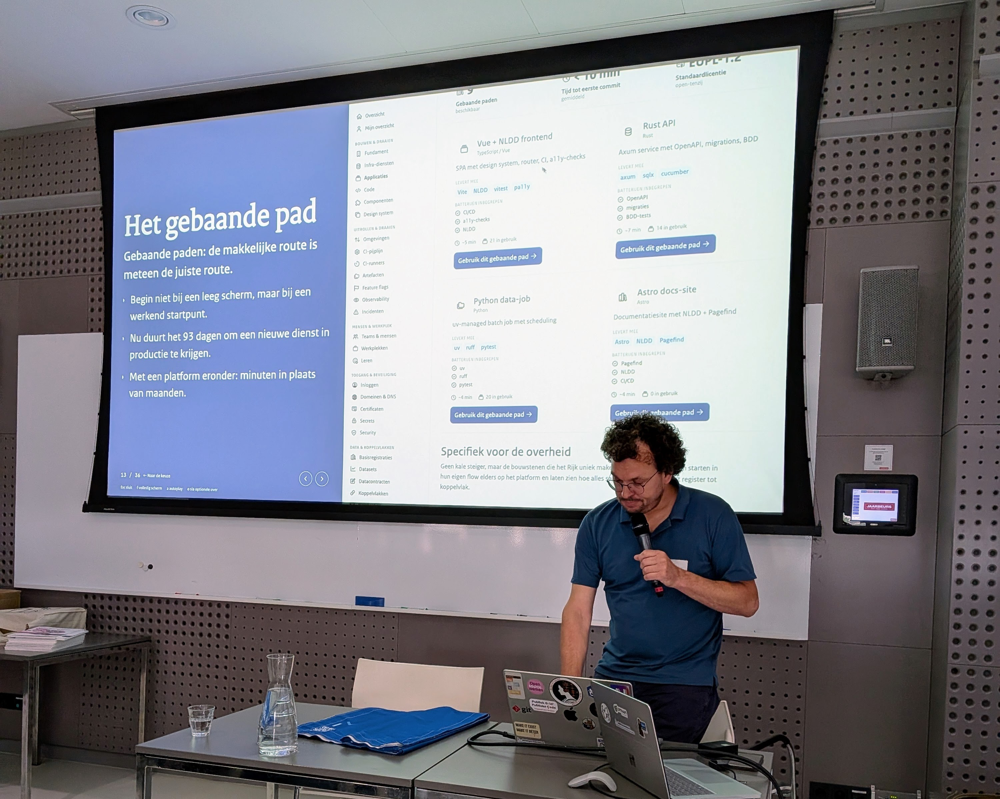
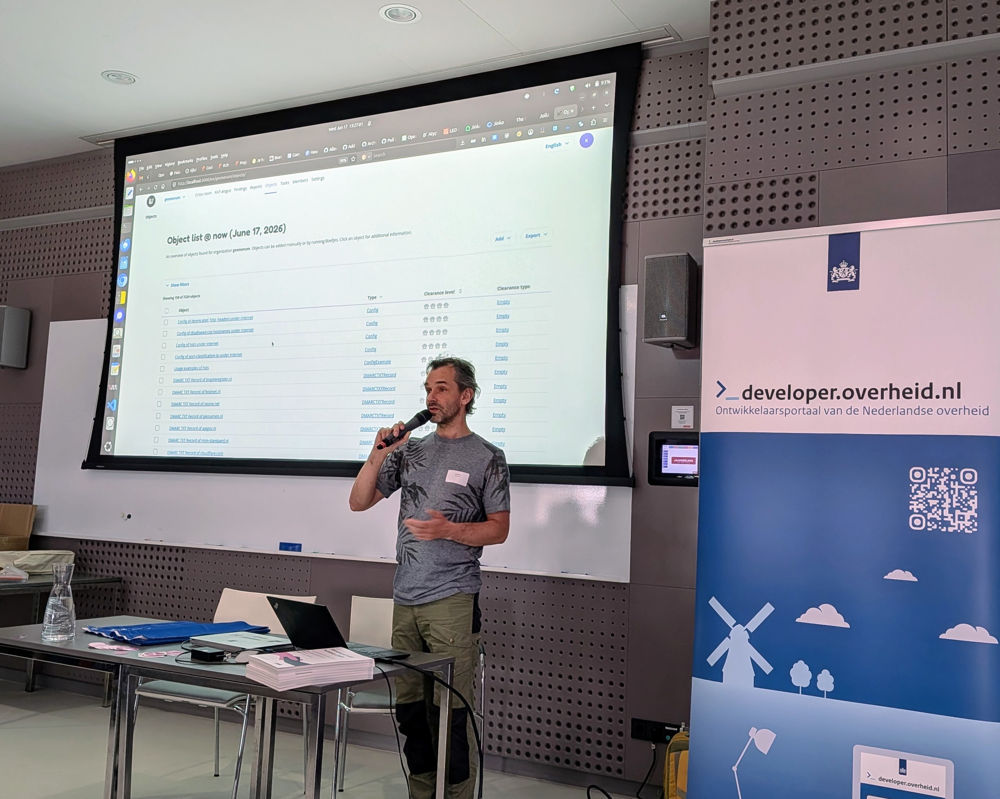

# Volle zaal, scherpe vragen: een terugblik op meetup #2

Hij zit er weer op, de tweede editie van onze meetup! Wat een mooie middag: een
volle zaal met developers, scherpe vragen, goede gesprekken en ook nog een
gezellige borrel bij Ruig achteraf. Graag delen we een korte terugblik met je
van de sessies.

<!-- truncate -->

:::success[**Datum volgende editie bekend**]

De volgende meetup zal plaatsvinden op **15 december**. Noteer hem in je agenda
en houd opensourcewerken.nl in de gaten, daar zal het event te zijner tijd
verschijnen.

:::

### Anne Schuth: Platform engineering

Anne Schuth opende met een prikkelende stelling: de Nederlandse overheid is
misschien wel het grootste softwarebedrijf van Nederland, waarom organiseert ze
zich dan nog niet zo? Hij liet zien hoe platform engineering developers kan
ontlasten, hoe je standaarden by design kunt afdwingen en hoe beleid letterlijk
onderdeel kan worden van je code, inclusief verwijzingen naar wetsartikelen.

_Anne Schuth tijdens zijn talk over platform engineering._

<Link href="https://bg.rijks.app/?present=1&slide=1&tour=keten">
  Naar de demo van Anne
  <Icon icon="pijl-naar-rechts" />
</Link>

### Dimitri en Tom: features live demo

Onze collega’s Dimitri van Hees en Tom Ootes lieten aan de hand van een live
demo zien welke verbeteringen aan onze producten er allemaal zijn doorgevoerd.
Dimitri liet zien hoe je een API bouwt met behulp van de
[AI-Skills van developer.overheid.nl](https://github.com/developer-overheid-nl/skills-developer-overheid-nl)
en de [OAS-generator](https://github.com/developer-overheid-nl/oas-generator/)
tool die direct voldoet aan de API Design Rules. In de tweede fase van de demo
maakte Tom de repository klaar voor open source gebruik. Hij deed dit met behulp
van een bijbehorende
[AI-Skill](https://github.com/developer-overheid-nl/skills-repo-docs-generator)
en de
[repo-docs-generator tool](https://developer-overheid-nl.github.io/repo-docs-generator).

<Link href="https://github.com/developer-overheid-nl/oas-generator/">
  OAS Generator
  <Icon icon="pijl-naar-rechts" />
</Link>

 
 

_{" "}_

### Johan Groenen: code.overheid.nl

Johan Groenen nam ons mee in code.overheid.nl: de nieuwe gedeelde gitomgeving
voor de overheid, gebouwd op Forgejo. Niet alleen een alternatief voor GitHub,
maar vooral een plek waar overheidsdevelopers samen kunnen werken aan open
source software, een stap richting digitale soevereiniteit.

_Johan Groenen tijdens zijn talk over code.overheid.nl._

<Link href="/slides/slides_johan.pdf">
  Download de slides van Johan
  <Icon icon="pijl-naar-rechts" />
</Link>

### Jan Klopper: OpenKAT

Jan Klopper liet zien wat OpenKAT mogelijk maakt: een open source securitytool,
ontstaan bij VWS tijdens de coronacrisis en inmiddels gedragen door een actieve
community. Met slimme plugins, de zogenoemde boefjes, breng je het
aanvalsoppervlak van je organisatie feitelijk en forensisch geborgd in kaart.

 _Jan Klopper
tijdens zijn talk over OpenKAT._

<Link href="https://openkat.nl/">
  Meer over OpenKAT
  <Icon icon="pijl-naar-rechts" />
</Link>

## Vervolg

Wil je zelf aan de slag? Er volgen workshops waarin we dieper ingaan op de
tools, standaarden en toepassingen die tijdens de middag voorbij kwamen. Houd
hiervoor onze website in de gaten.

## Zet in je agenda

Belangrijk nieuws: de datum voor de volgende editie is ook al bekend. Dat zal
namelijk **15 december** zijn. Noteer hem in je agenda en houd
opensourcewerken.nl in de gaten, daar zal het event tzt verschijnen.

Verder willen we graag alle sprekers en developers bedanken voor hun bijdragen,
vragen en ideeën. Tot de volgende keer!
