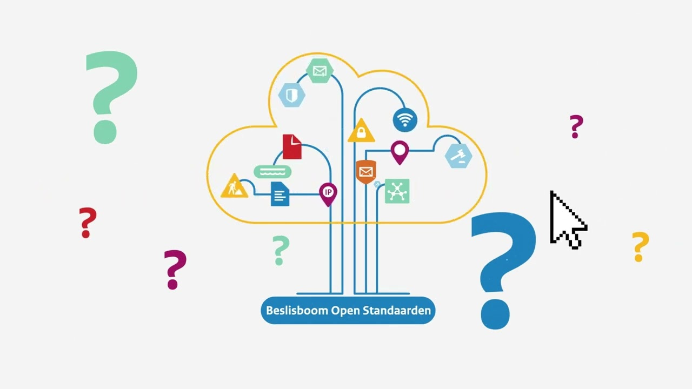

# De Beslisboom Open Standaarden: welke standaarden gelden voor jouw project?

Je bouwt aan een nieuwe applicatie, koppelt systemen via API's of werkt aan een
voorziening voor de overheid. En ergens onderweg komt de vraag langs: welke open
standaarden moet ik hier nu eigenlijk toepassen? Ze zijn niet vrijblijvend. Voor
publieke organisaties zorgen open standaarden voor interoperabiliteit,
leveranciersonafhankelijkheid, veiligheid, datakwaliteit en toegankelijkheid.
Precies de dingen die bepalen of jouw software straks soepel samenwerkt met de
rest van het overheidslandschap.

<!-- truncate -->

Het lastige is alleen: de standaarden zíjn er, de afspraken zíjn helder, maar
uitzoeken wélke gelden voor jouw specifieke applicatie kost tijd die je liever
in code steekt. Daardoor blijft de toepassing in de praktijk achter, niet uit
onwil maar uit gedoe.

## De Beslisboom Open Standaarden

Voor dat moment is er de Beslisboom Open Standaarden van Forum Standaardisatie.
In zes stappen kom je tot een gerichte selectie van de standaarden die voor jouw
project relevant zijn. Je loopt de vragen door en ziet meteen welke standaarden
ertoe doen.

Het resultaat is geen afvinklijstje, maar een onderbouwde set die je direct kunt
vertalen naar je ontwerp, je backlog of je gesprek met de architect of
leverancier. Een paar minuten werk aan het begin scheelt later een hoop
refactoren en discussie.

[Bekijk de video Beslisboom Open Standaarden →](https://www.forumstandaardisatie.nl/video-beslisboom-open-standaarden)

## Handig om bij de hand te hebben

- **Informatieveiligheid**: veel overheidsorganisaties passen de BIO toe
  (gelijkwaardig aan ISO 27001/27002). De
  [ICO Wizard](https://www.bio-overheid.nl/ico-wizard/) van het CIP helpt je de
  juiste veiligheidsnormen tijdig in beeld te krijgen, zodat ze niet achteraf in
  je eisen hoeven te worden gepropt.
- **Voorbeelden uit de praktijk**: in de
  [Monitor Open Standaarden](https://www.forumstandaardisatie.nl/metingen/monitor)
  zie je hoe andere projecten standaarden hebben toegepast. Die data is ook
  ontsloten via de
  [NORA](https://www.noraonline.nl/wiki/Monitor_Open_Standaarden).

## Van afspraak naar code

Standaarden afspreken is één ding; ervoor zorgen dat ze nageleefd worden in je
software is een vak apart. Gebruik daarom de beslisboom om uit te vinden welke
standaarden van toepassing zijn op jouw project, en check welke tooling er
beschikbaar is voor welke standaard.

[Direct naar de Beslisboom →](https://www.forumstandaardisatie.nl/beslisboom/beslisboom-open-standaarden)
