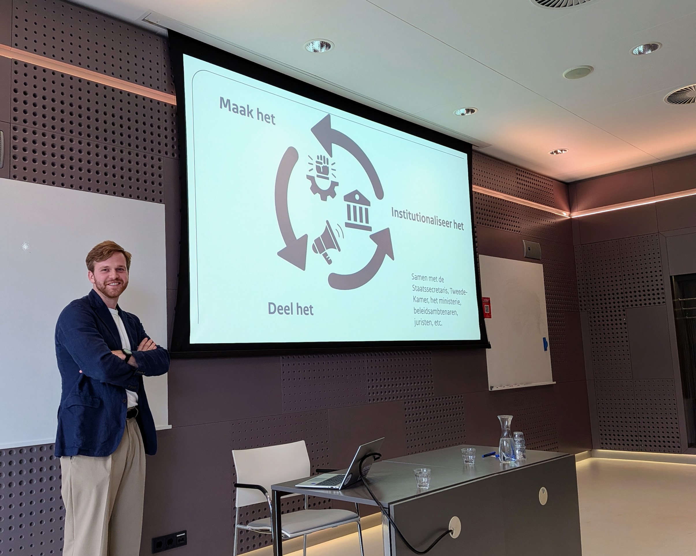

import { Blockquote } from "@rijkshuisstijl-community/components-react";

# Eindelijk meer over de Nederlandse Digitale Dienst

_Kees Keulemans van Bureau Architectuur (Ministerie van Binnenlandse Zaken)_

Lang wisten we weinig over de Nederlandse Digitale Dienst (NDD). Het bleef een
in nevelen gehuld initiatief waarvan de verwachtingen hoog gespannen waren.
Gelukkig waren wij aanwezig bij de meetup van Digilab in Utrecht, waar Kees
Keulemans van Bureau Architectuur meer vertelde over waar het team nu staat, en
hoe het van plan is te opereren.

<!-- truncate -->

## Een rapport door Kamercommissie Digitale Zaken

Voor het ontstaan van de NDD moeten we terug naar het rapport "Ons Digitaal
Fundament" dat geschreven werd door de Kamercommissie Digitale Zaken. Hier
ontstond het idee van "Een centrale Digitale Dienst", die zou moeten zorgen voor
"samenhang tussen beleid, infrastructuur en uitvoering".

Het voorstel beklijfde in de bestuurlijke kringen: het kwam uiteindelijk terecht
in het coalitieakkoord. Daardoor werd het bij het aantreden van staatssecretaris
Digitale Economie en Soevereiniteit, Willemijn Aerdts, meteen een aandachtspunt.

## Achterliggende analyse

De analyse die Kees schetst en waar de NDD uit voortkomt is de volgende:

- Binnen de overheid zit er te vaak geen technische kennis aan tafel.
- Aannames die er zijn worden te laat getoetst.
- Er wordt veel gepraat, en oplossingen blijven abstract.

Ook wordt er nog te veel lineair gewerkt, in de vorm van de ouderwetse
watervalmethode, terwijl het in de IT gebruikelijk is om in korte iteraties snel
deelproducten op te leveren om te kijken of het werkt. Andere problemen die
worden genoemd zijn risicoavers gedrag, externe inhuur om het kennisgat te
vullen en het gebrek aan autoriteit om keuzes te maken en zo het algemene belang
te behartigen.

## Terug naar het coalitieakkoord

Als op 30 januari 2026 het coalitieakkoord vermeldt dat er een Digitale Dienst
komt, blijkt er geen budget voor gereserveerd te zijn. Dat dwong de medewerkers
van Bureau Architectuur tot samenwerking: Digilab, Forum Standaardisatie en
Bureau Architectuur bundelen hun krachten en zullen uiteindelijk opgaan in de
Digitale Dienst.

In de beginfase werden er snel eerste ideeën uitgewerkt als voorbereiding voor
het gesprek met de staatssecretaris. De vraag was: hoe zet je iets neer waar
zoveel van wordt verwacht? Het initiatief moet gaan laten zien hoe je binnen de
overheid met technische mensen werkt.

## Doorbraakprojecten

Om snel van start te gaan is er gekozen om vier projecten te markeren als
"doorbraakprojecten". Dit zijn projecten die veel potentie hebben en waar vanuit
de dienst aan gewerkt wordt. Dit zijn:

- [Het Fundament](https://github.com/fundament-oss) (Private Cloud, volledig
  open source en op eigen hardware)
- [MijnOverheid Zakelijk](https://github.com/MinBZK/MijnOverheidZakelijk)
  (MijnOverheid voor bedrijven)
- [RegelRecht](https://github.com/MinBZK/regelrecht) (Wetten als uitvoerbare
  code)
- AI-assisted programming

<Blockquote
  attribution="~ Kees Keulemans"
  variation="pink-background"
>
De Digitale Dienst geeft elke drie weken een demo
voor de staatssecretaris. Het credo geldt: bring the demo not the memo!
</Blockquote>

## Uitgangspunten

Dan vervolgt Kees zijn verhaal met de uitgangspunten waar de Digitale Dienst op
leunt. De dienst:

- is snel en compact
- heeft een makersmentaliteit, met een focus op testen
- heeft zelf technisch bekwaam personeel
- heeft een directe lijn met de staatssecretaris
- is zelf geen opdrachtnemer
- werkt samen met technici van andere organisaties

Leuk detail is dat het team naar goede scrumtraditie elke drie weken een demo
houdt voor de staatssecretaris. Het credo geldt: bring the demo not the memo!

## Eindelijk ook een website!

Een andere belangrijke horde is genomen, want deze presentatie blijkt ook direct
de launch van de officiële website van de NDD. Deze is vanaf heden te bezoeken
op [digitaledienst.overheid.nl](https://digitaledienst.overheid.nl). De website
bevat nu alleen nog een tijdlijn, maar op termijn vind je hier meer informatie.

## De toekomst

Het team groeit: inmiddels bestaat het uit zo'n 45 mensen. De continuïteit is
ondertussen geborgd en er is voldoende budget om in 2027 door te draaien. Ook
zijn er veel cruciale debatten in aantocht waaruit misschien weer werk voortkomt
voor de NDD.
