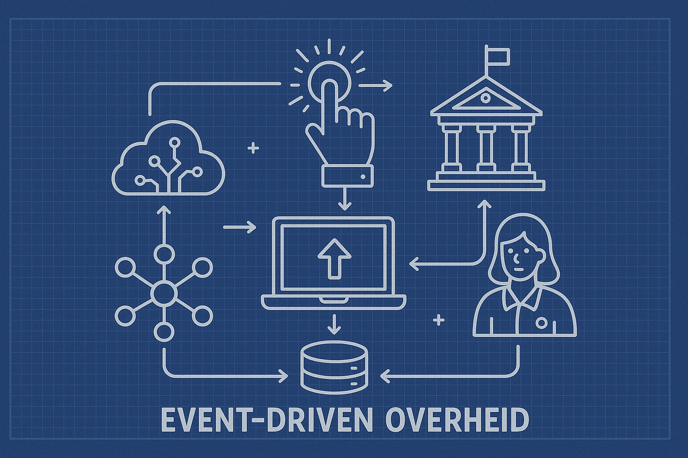

import { Blockquote } from "@rijkshuisstijl-community/components-react";

# De toekomstige API Architectuur is Event Driven Architecture


*Schematisch beeld van de Event Driven Overheid*

> Steeds meer overheidsorganisaties stappen over naar event-driven architecturen (EDA). Waarom? Omdat het beter schaalbaar is, sneller reageert op veranderingen en beter past bij een moderne digitale overheid waarin systemen onderling proactief samenwerken op basis van gebeurtenissen, in plaats van reactieve vraag-antwoordstructuren. In dit artikel duiken we in de kern van EDA binnen de Nederlandse overheid en bespreken we Stelsels, Standaarden en Voorzieningen als CloudEvents, DigiLevering, DigiMelding, en Webhooks zoals die terugkomen in de NL API Strategie.

<!-- truncate -->

# EDA

Todo

- [ ] API Architectuur pagina
- [ ] cloudevents pagina kennisbank
- [ ] webhooks pagina kennisbank
- [ ] event driven architecture pagina kennisbank

---

> Artikel GPT

# **Event-Driven Architecture bij de overheid: van CloudEvents tot Webhooks**

Steeds meer overheidsorganisaties stappen over naar **event-driven architecturen (EDA)**. Waarom? Omdat het beter schaalbaar is, sneller reageert op veranderingen en beter past bij een moderne digitale overheid waarin systemen onderling samenwerken op basis van gebeurtenissen, in plaats van logge vraag-antwoordstructuren. In dit artikel duiken we in de kern van EDA binnen de Nederlandse overheid en bespreken we standaarden als **CloudEvents**, **DigiLevering**, **DigiMelding**, en **Webhooks** zoals die terugkomen in de **NL API Strategie** en de **eDelivery API-standaard**.

---

## **Wat is Event-Driven Architecture?**

Event-driven architectuur is een patroon waarbij systemen reageren op gebeurtenissen (“events”) in plaats van dat ze actief moeten opvragen of “polling” gebruiken. Denk aan:

- “Een pasgeborene wordt ingeschreven in de BRP”
- “Een bedrijf wijzigt zijn vestigingsadres”
- “Een vergunning wordt verleend”

In plaats van dat een systeem constant moet vragen: *“Is er iets veranderd?”*, kan het nu **actief geïnformeerd worden wanneer er iets gebeurt**.

Net als API's zijn events ook te typeren. Vaak wordt bij de overheid gesproken over life events, gebeurtenissen die in het leven van een burger kunnen voorkomen en vaak voorspelbaar zijn. Naast life events zijn er ook transactionele of processing events. Je schaft een paspoort aan dan krijg je die pas al de uitgever het event van de betaalprovider heeft ontvangen dat de aanvrager heeft betaald voor het product. Ook weet je op basis het creëren van de resource paspoort dat het paspoort ook weer verloopt of kan worden aangemerkt als vermist of gestolen. Kortom events die volgen uit een initiële transactie.

------

## **CloudEvents: gestandaardiseerd eventformaat**

Een belangrijke ontwikkeling is de standaardisering van eventformaat via [**CloudEvents**](https://cloudevents.io/). CloudEvents is een CNCF-standaard die beschrijft hoe events uniform verpakt kunnen worden — onafhankelijk van bron of transportprotocol.

CloudEvents specificeert onder andere:

- De **bron** van het event
- Het **type** event (bijvoorbeeld nl.basisregistratie.persoon.geboorte)
- De **tijdstip** en **ID**
- Optioneel: een payload met aanvullende gegevens

Deze standaard speelt een steeds grotere rol in het **federatief datastelsel** (zoals benoemd in de NL Digitaal-strategie), waarin verschillende overheidslagen interoperabel met elkaar communiceren via gebeurtenissen.

📚 Zie ook de uitleg op [developer.overheid.nl: CloudEvents bij de overheid](https://developer.overheid.nl/standaarden/cloudevents).

------

## **DigiLevering en DigiMelding: eventgedreven binnen Logius**

Binnen het overheidsdomein bestaan al eventgedreven stelsels:

- **DigiLevering** stuurt meldingen wanneer gegevens in een basisregistratie zijn gewijzigd.
- **DigiMelding** maakt het mogelijk om fouten in gegevens (bijv. in de BRP) automatisch te melden aan de beheerder van de registratie.

Beide werken op basis van events, maar zijn nog grotendeels **bericht-georiënteerd via WUS/ebMS**. De trend is dat deze interfaces op termijn herzien worden richting **API-first** en **eventgedreven interfaces** — bij voorkeur op basis van CloudEvents en REST hooks.

------

## **Webhooks in de NL API Strategie**

De **NL API Strategie** (onder beheer van Logius) adviseert overheden om webhooks aan te bieden voor eventnotificaties. Dit maakt het mogelijk om een API niet alleen als *pull-interface*, maar ook als *push-mechanisme* in te zetten. Bijvoorbeeld:

```
x-webhooks:
  personRegistered:
    post:
      summary: Nieuwe persoon geregistreerd
      requestBody:
        content:
          application/json:
            schema:
              $ref: "#/components/schemas/PersonEvent"
```

Het opnemen van x-webhooks in OAS (OpenAPI Specification) maakt het mogelijk dat afnemers zich kunnen abonneren op gebeurtenissen en **automatisch geïnformeerd worden wanneer die plaatsvinden**.

👉 Zie voor meer uitleg: [NL API Strategie: Webhooks](https://developer.overheid.nl/standaarden/nl-api-strategie/#webhooks)

------

## **Webhooks in de eDelivery API-standaard**

De [**eDelivery API-standaard**](https://developer.overheid.nl/standaarden/edelivery) maakt gebruik van webhooks om verzend- en ontvangstnotificaties aan te bieden. Bijvoorbeeld:

- Een gemeente ontvangt een *Webhook* wanneer een burger een aanvraag indient via MijnOverheid.
- Een organisatie krijgt een *Webhook* wanneer een bericht via eDelivery succesvol is afgeleverd.

Door **webhooks in te bouwen in berichtenstandaarden**, ontstaat er een hybride vorm van messaging en EDA — waarin events niet alleen reacties zijn op inkomende berichten, maar ook als op zichzelf staande notificaties functioneren.

------

## **Events als reactie op berichten vs. events als registratiegebeurtenissen**

Er is een belangrijk onderscheid in soorten events:

### **1.** 

### **Events als reactie op een bericht (message)**

Bijvoorbeeld:

- Een gebruiker stuurt een aanvraag → het systeem stuurt een “aanvraag ontvangen”-event.
- Een notificatie over de status van verwerking (“verzonden”, “afgewezen”)

➡️ Dit is een soort *event-after-request*: de gebeurtenis is een gevolg van een actieve handeling.

### **2.** 

### **Events als registratiegebeurtenis**

Bijvoorbeeld:

- Iemand verhuist, en de BAG registreert een adreswijziging.
- Een geboorte wordt vastgelegd in de BRP.

➡️ Hier is het event een **feitelijke mutatie in een authentieke registratie**, onafhankelijk van wie het weet of vraagt. Dit is cruciaal voor stelselvoorzieningen, en vereist vaak juridische borging van authenticiteit en volledigheid.

Deze tweede categorie events vormt de kern van het **federatief datastelsel**: betrouwbare, tijdige en juridisch correcte gegevensdeling tussen basisregistraties en ketenpartners.

------

## **Tot slot: de toekomst van eventgedreven overheidsarchitectuur**

De beweging naar event-driven werken is onomkeerbaar. Nieuwe generaties API’s combineren REST + Webhooks + CloudEvents. Denk aan:

- Een **basisregistratie die CloudEvents uitzendt bij mutaties**
- Een **stelselvoorziening met een publish-subscribe mechanisme**
- Een **API-ecosysteem met embedded webhooks in OpenAPI**

Om dat goed te laten werken, zijn afspraken nodig over:

- **Standaardisatie** (zoals CloudEvents profielen voor overheden)
- **Beveiliging** van webhooks (OAuth, retry-strategieën, verificatie)
- **Beheer** van abonnementen

------

## **Verder lezen**

- [NL API Strategie – Webhooks en Events](https://developer.overheid.nl/standaarden/nl-api-strategie/#webhooks)
- [CloudEvents Specificatie](https://cloudevents.io/)
- [eDelivery API Standaard](https://developer.overheid.nl/standaarden/edelivery)
- [Federatief Datastelsel | Federatief.Datastelsel.nl](https://federatief.datastelsel.nl/)
- [DigiLevering en DigiMelding | Logius](https://logius.nl/diensten)

------

💡 **Tip voor developers**: experimenteer eens met CloudEvents in combinatie met een [local webhook listener zoals webhook.site](https://webhook.site/), of gebruik [ngrok](https://ngrok.com/) om een publieke endpoint te creëren voor test-events uit overheidsdomeinen.

Wil je sparren over hoe jouw organisatie events kan inzetten? Of heb je een vraag over implementatie in je API? Deel je ervaringen op [developer.overheid.nl/community](https://developer.overheid.nl/community).

------

*Door Martin van der Plas – API-specialist en redacteur developer.overheid.nl*

# Mail Rob Berentsen

---

>  eerdere correspondentie:

Asynchrone verwerking heeft inderdaad nog te weinig de aandacht gekregen. Er zijn al wel ontwikkelingen geweest maar er is meer behoefte aan eenduidigheid in dit speelveld en uiteraard praktische afspraken en best practices. Hierbij alvast een korte samenvatting van de ontwikkelingen:
- De nieuwe OpenAPI Specificatie versie 3.1 ondersteund ook de mogelijkheid om webhooks te definieren. zie o.a. https://spec.openapis.org/oas/latest.html#callback-object . Dit was één van de redenen dat ik OAS3.1 als nieuwe versie heb aangemeld bij het Buro Forum Standaardisatie. De nieuwe versie is echter nog niet op de lijst opgenomen omdat adoptie hiervan bij leveranciers achterloopt. zie ook https://openapi.tools
- VNG heeft in 2022 een Nederlands profiel opgesteld voor cloud events. Zie ook https://github.com/Logius-standaarden/NL-GOV-profile-for-CloudEvents . Dit profiel is door ons bij Logius in beheer genomen en wacht op verdere doorontwikkeling en toepassing.
- vanuit Digilevering en Digimelding is er interesse om meer met api's te gaan doen en hierbij is ook zeker aandacht voor cloud events, event driven architecture en webhooks
- vanuit het kennisplatform is event driven design al een aantal keer onder de aandacht geweest:

- ook zijn er in de design visie wel verwijzingen naar webhooks en websub maar nog geen verdere uitwerking.
- https://www.asyncapi.com is bezig om 1 standaard te maken waarmee event drive api's kunnen worden gedefinieerd voor verschillende protocollen.
- bij de BRK notificaties bewust gekozen voor een pull mechanisme met een api. zie ook https://www.kadaster.nl/zakelijk/registraties/basisregistraties/brk/brk-notificaties

Verder zijn de best practices erg afhankelijk van de use case die je voor ogen hebt. hierin zou je moeten adresseren:
- is het echt realtime of mag er een vertraging zijn en wat is dan acceptabel?
- wie bepaald het tempo van verwerking van events (provider of client)
- is er wel of geen garantie van aflevering nodig?
- hoe vind interne verwerking van events vervolgens plaats bij provider en of client?
- welke eisen zijn er aan interne verwerking en standaarden / patronen zoals JMS / Kafka / mq amqp

Dit is wat ik zo even kan aanreiken en aanraden.

# eerdere opzet gpt
> Event-Driven Architecture en de NL API Strategie: CloudEvents, Webhooks en OAuth

In de snel evoluerende digitale wereld zijn **real-time interacties** en **schaalbare systemen** essentieel voor moderne applicaties. **Event-Driven Architecture (EDA)** is een belangrijk architectuurprincipe dat **asynchrone**, **losgekoppelde** en **schaalbare** oplossingen mogelijk maakt. In deze blog onderzoeken we hoe **CloudEvents, Webhooks en OAuth** een rol spelen binnen EDA en hoe ze aansluiten op de **Nederlandse API Strategie (NL API Strategie)**.

---

## Wat is Event-Driven Architecture (EDA)?  
**Event-Driven Architecture** (EDA) is een software-architectuur waarin systeemcomponenten communiceren door **events** uit te zenden en erop te reageren, in plaats van directe, synchrone verzoeken te versturen. In vergelijking met traditionele **request-response** architecturen biedt EDA de volgende voordelen:

✅ **Schaalbaarheid** – Systemen kunnen grotere belastingen aan door componenten los te koppelen.  
✅ **Veerkracht (Resilience)** – Storingen in één component hebben geen directe impact op het gehele systeem.  
✅ **Flexibiliteit** – Nieuwe functies kunnen worden toegevoegd zonder bestaande services te wijzigen.  

🔗 *Meer over EDA:*  
- [Event-Driven Architecture uitgelegd (AWS)](https://aws.amazon.com/event-driven-architecture/)  
- [Wat is Event-Driven Architecture? (Red Hat)](https://www.redhat.com/en/topics/integration/what-is-event-driven-architecture)  

---

## CloudEvents: Een gestandaardiseerd event-formaat  
Een uitdaging in event-gedreven systemen is het gebrek aan een uniforme standaard voor event-structuren. **CloudEvents**, een project van de CNCF (Cloud Native Computing Foundation), lost dit probleem op door een **gestandaardiseerd event-formaat** te definiëren. Hierdoor kunnen services events beter begrijpen en verwerken.  

🔹 **Belangrijke voordelen van CloudEvents:**  
- Gestandaardiseerde metadata-structuur voor events.  
- Verbeterde interoperabiliteit tussen verschillende platforms.  
- Betere observeerbaarheid en debugging.  

🔗 *Meer informatie:*  
- [CloudEvents officiële documentatie](https://cloudevents.io/)  

---

## Webhooks: Real-time event notificaties  
**Webhooks** zijn een van de meest gebruikte methoden om EDA te implementeren. Ze maken **real-time notificaties** via **HTTP** mogelijk. In plaats van constant een API te polleren op updates, ontvangen consumenten automatisch een notificatie zodra een event plaatsvindt.  

🔹 **Waarom Webhooks gebruiken?**  
✅ **Vermindert API-verzoeken** – Geen constante polling nodig.  
✅ **Real-time updates** – Events worden direct doorgegeven.  
✅ **Lichtgewicht** – Eenvoudig te implementeren met HTTP POST-verzoeken.  

🔗 *Meer over Webhooks:*  
- [Webhooks gids (Zapier)](https://zapier.com/page/webhooks/)  
- [Webhooks uitgelegd (GitHub)](https://docs.github.com/en/webhooks)  

---

## OAuth in Event-Driven Architectures  
Beveiliging is een cruciaal aspect in EDA, vooral bij het **exposeren van event-driven API’s**. **OAuth 2.0** en **OpenID Connect (OIDC)** zijn de meest gebruikte standaarden voor **authenticatie en autorisatie** in event-gedreven interacties.  

🔹 **Hoe OAuth EDA beveiligt:**  
- Zorgt ervoor dat alleen geautoriseerde services events kunnen publiceren of consumeren.  
- Biedt veilige API-toegang via **tokens** in plaats van API-sleutels.  
- Ondersteunt **fijnmazige toegangscontrole** via **scopes**.  

🔗 *Nuttige bronnen:*  
- [OAuth 2.0 Framework (OAuth.net)](https://oauth.net/2/)  
- [OAuth Best Practices (Auth0)](https://auth0.com/docs/security/oauth-2.0)  

---

## Event-Driven Architecture en de NL API Strategie  
De **Nederlandse API Strategie (NL API Strategie)** stimuleert het gebruik van **open en veilige API’s** om digitale transformatie te ondersteunen. EDA sluit hier goed op aan, omdat het:  

🔹 **Standaardisatie bevordert** – CloudEvents zorgt voor een uniforme event-structuur.  
🔹 **Beveiliging verbetert** – OAuth en OIDC zorgen voor veilige API-toegang in event-gedreven omgevingen.  
🔹 **Interoperabiliteit vergroot** – Webhooks maken real-time communicatie mogelijk tussen publieke en private sectoren.  

🔗 *Bekijk de officiële NL API Strategie:*  
- [Nederlandse API Strategie (NL overheid)](https://api-strategy.nl/)  

---

## Conclusie  
**Event-Driven Architecture** verandert moderne API-ecosystemen door **schaalbare, real-time en losgekoppelde** interacties mogelijk te maken. Door gebruik te maken van **CloudEvents, Webhooks en OAuth** kunnen organisaties robuuste event-gedreven oplossingen ontwikkelen die naadloos aansluiten op de **Nederlandse API Strategie**.  

💡 **Meer leren?** Bekijk de gelinkte bronnen en begin vandaag nog met het bouwen van event-gedreven API’s! 🚀  

# WG

>  Vormen van Notificeren patronen
> content op:

https://github.com/Geonovum/KP-APIs/blob/master/overleggen/Werkgroep%20Notificeren/documenten/vormen_notificeren.md

# Vormen van Notificeren

## Stelsel based Notificeren:

- binnen een stelsel zijn afspraken gemaakt over de groep van organisaties die berichten uitwisseld en notificaties/events/statusinformatie wil ontvangen over de uitgewisselde berichten. Denk hierbij aan Digipoort / Digilevering / Peppol
- Om te kunnen werken moet en organisatie conformeren aan de gebruikte standaarden en technieken (bijv. PKIO Diginetwerk, OIN en Digikoppeling)
- Notificaties worden op organisatieniveau met elkaar uitgewisseld en kunnen aan 1 adres worden gestuurd. routering van notificaties en duplicatie worden binnen de organisatie geregeld
- Om het stelsel operationeel te houden zijn centrale afspraken nodig en vaak ook centrale voorzieningen voor functies zoals adressering, routering, identificatie

## Message based Notificeren:

- Er is geen vastgestelde status van een stelsel. Op elk moment kunnen partijen besluiten om zelf mee te gaan doen. (dynamic registration)
- De initiele message heeft alle metadata in zich om verdere notificaties af te handelen zoals shared secrets (of asymetrische versleuteling) en callback uri's
- Notificaties worden op basis van de initiele message naar 1 of meerdere eindpoints gedeeld. (bij voorkeur op basis van webhooks - wellicht moet mail ook kunnen)
- Notificaties zijn in deze opzet altijd een afgeleide van een message. De aanbieder van de service (waard de message wordt afgeleverd) biedt de notificatie functie als aanvullende dienst aan. Merk op dat deze aanvullende notificatie functie gelijk kan zijn aan de notificatie functie binnen het stelsel.

# Vragen marktpartijen

> Gert Jan van der Kooij

Mooie stap en hulde aan het project Notificatieservices dat in de zomer van 2022 in mijn ogen te vroeg werd beeindigd. In de uitvoering en uitwerking een mooi voorbeeldproject voor andere Common Ground initiatieven. Alle lof voor de projectleden destijds 👏

Een ding moet me echter van het hart ... waarom is er na het vaststellen van de berichtstandaard en het adresseren van openstaande punten nog niet doorgepakt op enkele taaie(re) onderdelen?

Standaarden en afspraken over inderdaad het Abonneren, maar ook over bv.:

➡️ Het concept Gebeurtenis; wat is nu een gebeurtenis, welke richtlijnen hanteren om die per bron te identificeren/benoemen?

➡️ Hoe omgaan met privacy-gevoelige gebeurtenissen als adoptie of geslachtswijziging; deze te maskeren via niet herleidbare aliassen?

➡️ Is het altijd Gegevensarm notificeren of zijn er usecases waarbij je niet ontkomt aan Gegevensrijk notificeren? Zoja, hoe dan omgaan met gegevensautorisatie per afnemer?

➡️ Hoe omgaan met filtering van Notificaties naar doelgroep; bv. als een afnemer alleen notificaties mag ontvangen van personen in een bepaalde leefdtijdsgroep?
