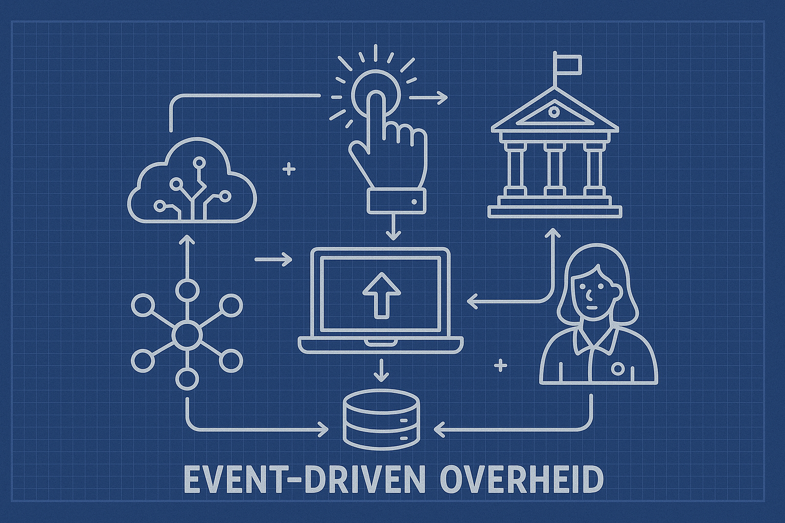

import { Blockquote } from "@rijkshuisstijl-community/components-react";

# De toekomst van de overheid is event-driven


*Schematisch beeld van de event-driven overheid*

Steeds meer overheidsorganisaties stappen over naar [event-driven architecturen (EDA)](/kennisbank/apis/architectuur/eda). Waarom? Omdat het beter schaalbaar is, sneller reageert op veranderingen en beter past bij een moderne digitale overheid waarin systemen onderling proactief samenwerken op basis van gebeurtenissen, in plaats van reactieve vraag-antwoordstructuren. In dit artikel duiken we in de kern van EDA binnen de Nederlandse overheid en bespreken we Stelsels, Standaarden en Voorzieningen als [CloudEvents](/kennisbank/apis/architectuur/cloudevents), [Webhooks](/kennisbank/apis/architectuur/webhooks) DigiLevering en DigiMelding.

<!-- truncate -->

## Voordelen van EDA

Event-driven architectuur is een patroon waarbij systemen reageren op gebeurtenissen (“events”) in plaats van dat ze actief moeten opvragen of “polling” gebruiken. Denk aan:

- “Een pasgeborene wordt ingeschreven in de BRP”
- “Een bedrijf wijzigt zijn vestigingsadres”
- “Een vergunning wordt verleend”

In plaats van dat een systeem constant moet vragen: *“Is er iets veranderd?”*, kan het nu **actief geïnformeerd worden wanneer er iets gebeurt**.

Net als API's zijn events ook te typeren. Vaak wordt bij de overheid gesproken over **life events**, gebeurtenissen die in het leven van een burger kunnen voorkomen en vaak voorspelbaar zijn.

Naast life events zijn er ook transactionele of **processing events**. Je schaft een paspoort aan maar je krijgt die pas als de gemeente het event van de betaalprovider heeft ontvangen dat de aanvrager heeft betaald. Ook weet je op basis het creëren van de resource paspoort dat het paspoort ook weer verloopt of kan worden aangemerkt als vermist of gestolen. Kortom events volgen ook uit een **transactie**.

## Context - Huidige situatie

Event-driven architectuur is niet nieuw, in 2021 heeft VNG in opdracht van MinBZK al een project gestart om te komen tot een Notificatiestandaard. In dit project is ervoor gekozen om te focussen op de CloudEvents specificatie die in 2019 was ontwikkeld. Uiteindelijk heeft dit geleid tot een Nederlands profiel op de specificatie die in beheer is genomen bij Logius.

<Blockquote
  variation="pink-background"
  attribution="— Forum Standaardisatie"
>
Op 25 september 2025 heeft het Forum Standaardisatie ingestemd met het advies aan het OBDO om het **NL GOV profile for CloudEvents** verplicht te stellen (“Pas toe of leg uit”). Daarnaast is het predicaat *‘Uitstekend beheer’* toegekend voor deze standaard.
</Blockquote>

### **CloudEvents: gestandaardiseerd event formaat**

Een belangrijke ontwikkeling is de standaardisering van het event formaat via [**CloudEvents**](https://cloudevents.io/). CloudEvents is een CNCF-standaard die beschrijft hoe events uniform verpakt kunnen worden, onafhankelijk van bron of transportprotocol. CloudEvents specificeert onder andere:

- De **bron** van het event
- Het **type** event (bijvoorbeeld nl.basisregistratie.persoon.geboorte)
- Het **tijdstip** en **ID**
- Optioneel: een payload met aanvullende gegevens
  
Deze standaard speelt een steeds grotere rol in het **federatief datastelsel** (zoals benoemd in de Nederlandse Digitaliseringsstrategie), waarin verschillende overheidslagen interoperabel met elkaar communiceren via gebeurtenissen.
> Zie ook de webhooks pagina op de Kennisbank van [developer.overheid.nl](/kennisbank/apis/architectuur/webhooks).

### Webhooks in de NL API Strategie

De **NL API Strategie**  adviseert overheden om webhooks aan te bieden voor eventnotificaties. Dit maakt het mogelijk om een API niet alleen als **pull-interface**, maar ook als **push-mechanisme** in te zetten. Bijvoorbeeld via een HTTP POST:

```JSON
POST /webhooks/payment HTTP/1.1
Host: api.example.com
Content-Type: application/cloudevents+json
User-Agent: cloudevents/1.0
Authorization: Bearer secret_token_123
X-Signature: sha256=5d41402abc4b2a76b9719d911017c592
X-Event-Type: payment_succeeded
X-Request-ID: evt_123456789
Date: Fri, 26 Sep 2025 14:00:00 GMT

{
  "id": "evt_123456789",
  "type": "salaris betaald",
  "data": {
    "amount": 12345.67,
    "currency": "EUR",
    "hrm_id": "hr_987654321"
  }
}
```

Het opnemen van Webhooks in OAS (OpenAPI Specification) maakt het mogelijk dat afnemers zich kunnen abonneren op gebeurtenissen en **automatisch geïnformeerd worden wanneer die plaatsvinden**

> Zie ook de cloudevents pagina op de Kennisbank van [developer.overheid.nl](/kennisbank/apis/architectuur/cloudevents)

### Webhooks in de eDelivery API-standaard

De eDelivery API-standaard maakt gebruik van webhooks om verzend- en ontvangstnotificaties aan te bieden. De lessons learned zijn toegepast in de REST API Design Rules.

> *Meer informatie zie :*  - [issue 468 van het Kennisplatfrom API's](https://github.com/Geonovum/KP-APIs/issues/468)  

### **DigiLevering en DigiMelding: eventgedreven GDI bouwstenen**

Binnen het overheidsdomein bestaan al event gedreven stelsels:

- **DigiLevering** stuurt meldingen wanneer gegevens in een basisregistratie zijn gewijzigd.
- **DigiMelding** maakt het mogelijk om fouten in gegevens (bijv. in de BRP) automatisch te melden aan de beheerder van de registratie.

Beide werken op basis van events, maar zijn nog grotendeels **bericht-georiënteerd via WUS/ebMS**. De trend is dat deze interfaces op termijn herzien worden richting **API-first** en **eventgedreven interfaces** — bij voorkeur op basis van CloudEvents en Webhooks.

> *Meer informatie zie :*  - [De Gegevensuitwisseling diensten van Logius](https://www.logius.nl/onze-dienstverlening/gegevensuitwisseling)

## Best practices

In de snel evoluerende digitale wereld zijn real-time interacties en schaalbare systemen essentieel voor moderne applicaties. Event-Driven Architecture is een belangrijk architectuurprincipe dat **asynchrone**, **losgekoppelde** en **schaalbare** oplossingen mogelijk maakt.

- De nieuwe OpenAPI Specificatie versie 3.1 ondersteund ook de mogelijkheid om webhooks te definiëren. zie o.a. [Openapis.org](https://spec.openapis.org/oas/latest.html#callback-object). Deze nieuwe versie is aangemeld bij het Forum Standaardisatie. De nieuwe versie is echter nog niet op de lijst opgenomen. zie ook [OpenAPI.tools](https://openapi.tools) om de adoptie van OAS 3.1, 3.2 en verder te volgen.
- VNG heeft in 2022 [een Nederlands profiel opgesteld voor cloud events.](https://github.com/Logius-standaarden/NL-GOV-profile-for-CloudEvents). Dit profiel is bij Logius in beheer genomen en wacht op verdere doorontwikkeling en toepassing.
- vanuit Digilevering en Digimelding is er interesse om meer met api's te gaan doen en hierbij is ook zeker aandacht voor cloud events, event driven architecture en webhooks.
- Vanuit het kennisplatform is event driven design al een aantal keer onder de aandacht geweest. Zie ook het [gebruikerswensen document](https://docs.geostandaarden.nl/api/API-Strategie-gebruikerswensen/).
- [AsyncAPI](https://www.asyncapi.com) is bezig om 1 standaard te maken waarmee event drive api's kunnen worden gedefinieerd voor verschillende protocollen.
- Bij de BRK notificaties is bewust gekozen voor een pull mechanisme met een api. zie ook [de BRK pagina van het Kadaster](https://www.kadaster.nl/zakelijk/registraties/basisregistraties/brk/brk-notificaties).
- in de Strafrechtketen wordt al gewerkt met Cloudevents om tussen Justitie organisaties events uit te wisselen.

Verder zijn de best practices erg afhankelijk van de use case die je voor ogen hebt. Hierin zou je moeten adresseren:

- Is het echt realtime of mag er een vertraging zijn en wat is dan acceptabel?
- Wie bepaald het tempo van verwerking van events (provider of client)?
- Is er wel of geen garantie van aflevering nodig?
- Hoe vind interne verwerking van events vervolgens plaats bij provider en of client?
- Welke eisen zijn er aan interne verwerking en standaarden en patronen zoals JMS, Kafka, MQTT of AMQP?

> Tip voor developers: experimenteer eens met CloudEvents in combinatie met een local webhook listener zoals [webhook.site](https://webhook.site/), of gebruik [ngrok](https://ngrok.com/) om een publieke endpoint te creëren voor test-events .

Wil je sparren over hoe jouw organisatie events kan inzetten? Of heb je een vraag over implementatie in je API? Deel je ervaringen op [developer.overheid.nl/community](https://developer.overheid.nl/community).

### Soorten Events

Er is een belangrijk onderscheid in soorten events:

#### Events als reactie op een bericht (request based event)

De meest bekende en voor de hand liggende soort events zijn events die volgen als reactie op een request:

- Events worden op basis van het initiële request naar 1 of meerdere endpoints gedeeld. (bij voorkeur op basis van webhooks - wellicht moet mail ook kunnen).
- Events zijn in deze opzet altijd een afgeleide van een message. De aanbieder van de service (waar de message wordt afgeleverd) biedt de event functie als aanvullende dienst aan.
- De initiële message heeft alle metadata in zich om verdere notificaties af te handelen zoals shared secrets (of asymmetrische versleuteling) en callback uri's.

Bijvoorbeeld:

- Een gebruiker stuurt een aanvraag → het systeem stuurt een “aanvraag ontvangen” event.
- Een notificatie over de status van verwerking (“verzonden”, “afgewezen”)

Dit is een soort *event-after-request*: de gebeurtenis is een gevolg van een actieve handeling.

#### Events als registratiegebeurtenis (object based event)

In Nederland kennen we een Stelsel van Basis registraties. afhankelijk van de regelgeving hebben overheden recht op gegevens uit dit stelsel. Naast toegang tot de gegevens is ook onderkend dat de overheidsorganisaties geinformeerd moeten wordenover wijzigingen in de basisregistraties. Kortom, Stelsel gebaseerde events:

- Binnen een stelsel zijn afspraken gemaakt over de groep van organisaties die berichten uitwisselt en notificaties / events /statusinformatie wil ontvangen over de objecten en berichten. Denk hierbij aan Digipoort / Digilevering / Peppol en de BRP.
- Om te kunnen werken moet een organisatie conformeren aan de gebruikte standaarden en technieken (bijv. PKIO Diginetwerk, OIN en Digikoppeling)
- Events worden op organisatieniveau met elkaar uitgewisseld en kunnen aan 1 adres worden gestuurd. Routering van Events en duplicatie worden binnen de organisatie geregeld
- Om het stelsel operationeel te houden zijn centrale afspraken nodig en vaak ook centrale voorzieningen voor functies zoals adressering, routering, identificatie

Bijvoorbeeld:

- Iemand verhuist, en het Kadaster registreert een nieuwe eigenaar van de woning.
- Een geboorte wordt vastgelegd in de BRP.

Hier is het event een **feitelijke mutatie in een authentieke registratie**, onafhankelijk van wie het weet of vraagt. Dit is cruciaal voor stelselvoorzieningen, en vereist vaak juridische borging van authenticiteit en volledigheid.

### Soorten event-verwerking

Afhankelijk van de doelen kan EDA verschillende manieren van event-verwerking ondersteunen, zoals:

- Zelfstandige gebeurtenissen verwerking: Hierbij gaat het om gebeurtenissen die niet aan andere gebeurtenissen zijn gerelateerd en zelfstandig kunnen worden afgehandeld. Bijvoorbeeld een plaatsgevonden publicatie van een bericht op een social media platform.
- Event-stream verwerking: Hierbij is sprake van een stroom ('stream') aan gerelateerde events. Bij verwerking moet rekening worden gehouden met eerdere events. Bijvoorbeeld als het events betreft met informatie over de wijziging van een verblijfsadres van een persoon waarbij de volgorde van verwerking van belang is.
- Complexe event verwerking: hierbij kunnen op basis van een reeks events bepaalde patronen worden herkend. Bijvoorbeeld op basis van events afkomstig van een passantensensor signaleren dat zich te veel mensen in een gebiedszone bevinden.

### Events gebruiken als Notificatie

Events en Notificaties worden vaak als synoniem gezien maar met een 'notificatie' bedoelen we vaak het bericht met gegevens die bij notificeren worden verstrekt. Een notificatie kan allerlei soorten informatie bevatten. Op basis van de opgenomen informatie is onderscheid te maken in notificaties over een:

- 'Seintje': er wordt een signaal afgegeven wanneer er iets is gebeurd. Deze vorm van notificatie is gebruikelijk in de wereld van sensoren (IoT), maar komt minder vaak voor binnen administratieve omgevingen.
- Gegevensmutatie: deze notificaties zijn gericht op het doorgeven van oude en nieuwe gegevens na een verandering ('was-wordt'). De aanleiding en context ontbreekt vaak, waardoor de gebruiker zelf moet afleiden welke gebeurtenis er heeft plaatsgevonden. Dit kan leiden tot foute conclusies en onjuiste acties.
- Gegevensmutatie + Aanleiding: naast de gegevensmutatie wordt ook de aanleiding voor de gebeurtenis meegegeven. Gebruikers begrijpen beter wat er precies is gebeurd en kunnen er beter op reageren.
- Gebeurtenis + Gegevens: In plaats van een aantal 'was-wordt gegevens' worden relevante gegevens over de plaatsgevonden gebeurtenis verstrekt. Afnemers weten op basis hiervan precies wat er is gebeurd. Als alle relevante gegevens zijn verstrekt ('informatierijke notificatie') kunnen consumers daarmee passende actie(s) uitvoeren.
- Gebeurtenis + Identificatie: Bij zo'n 'informatiearme notificatie' worden minimaal gebeurtenisgegevens verstrekt. Met behulp van verstrekte identificerende gegevens kan een consumer eventueel aanvullende gegevens gaan opvragen.

### Webhooks: Real-time event notificaties  

**Webhooks** zijn een van de meest gebruikte methoden om EDA te implementeren. Ze maken **real-time notificaties** via **HTTP** mogelijk. In plaats van constant een API te pollen op updates, ontvangen consumenten automatisch een notificatie zodra een event plaatsvindt.  

**Waarom Webhooks gebruiken?**  

- **Vermindert API-verzoeken** – Geen constante polling nodig.  
- **Real-time updates** – Events worden direct doorgegeven.  
- **Lichtgewicht** – Eenvoudig te implementeren met HTTP POST-verzoeken.  

> *Meer over Webhooks:*  - [Webhooks uitgelegd (GitHub)](https://docs.github.com/en/webhooks)  

### OAuth in Event-Driven Architectures  

Beveiliging is een cruciaal aspect in EDA, vooral bij het **exposeren van event-driven API’s**. **OAuth 2.0** en **OpenID Connect (OIDC)** zijn de meest gebruikte standaarden voor **authenticatie en autorisatie** in event-gedreven interacties.  

**Hoe OAuth EDA beveiligt:**  

- Zorgt ervoor dat alleen geautoriseerde services events kunnen publiceren of consumeren.  
- Biedt veilige API-toegang via **tokens** in plaats van API-sleutels.  
- Ondersteunt **fijnmazige toegangscontrole** via **scopes**.  

> *Meer over OAuth:*  - [OAuth 2.0 Framework (OAuth.net)](https://oauth.net/2/)  

## Toekomstige situatie en ontwikkelingen

De beweging naar event-driven werken is onomkeerbaar. Nieuwe generaties API’s combineren REST + Webhooks + CloudEvents. Denk aan:

- Een **basisregistratie die CloudEvents uitzendt bij mutaties**
- Een **stelselvoorziening met een publish-subscribe mechanisme**
- Een **API-ecosysteem met embedded webhooks in OpenAPI**

Om dat goed te laten werken, zijn afspraken nodig over:

- **Standaardisatie** (zoals CloudEvents profielen voor overheden)
- **Beveiliging** van webhooks (OAuth, retry-strategieën, verificatie)
- **Beheer** van abonnementen

**Event-Driven Architecture** verandert moderne API-ecosystemen door **schaalbare, real-time en losgekoppelde** interacties mogelijk te maken. Door gebruik te maken van **CloudEvents, Webhooks en OAuth** kunnen organisaties robuuste event-gedreven oplossingen ontwikkelen die naadloos aansluiten op de **Nederlandse API Strategie**.

## Verder lezen

Verder over de Standaarden, Stelsels en Voorzieningen kan op:

- [NL API Strategie – Webhooks en Events](https://developer.overheid.nl/standaarden/nl-api-strategie/#webhooks)
- [CloudEvents Specificatie](https://cloudevents.io/)
- [eDelivery API Standaard](https://developer.overheid.nl/standaarden/edelivery)
- [Federatief Datastelsel | Federatief.Datastelsel.nl](https://federatief.datastelsel.nl/)
- [DigiLevering en DigiMelding | Logius](https://logius.nl/diensten)
- [Event-Driven Architecture uitgelegd (AWS)](https://aws.amazon.com/event-driven-architecture/)  
- [Wat is Event-Driven Architecture? (Red Hat)](https://www.redhat.com/en/topics/integration/what-is-event-driven-architecture)  
- [Vormen van Notificeren](https://github.com/Geonovum/KP-APIs/blob/master/overleggen/Werkgroep%20Notificeren/documenten/vormen_notificeren.md)
