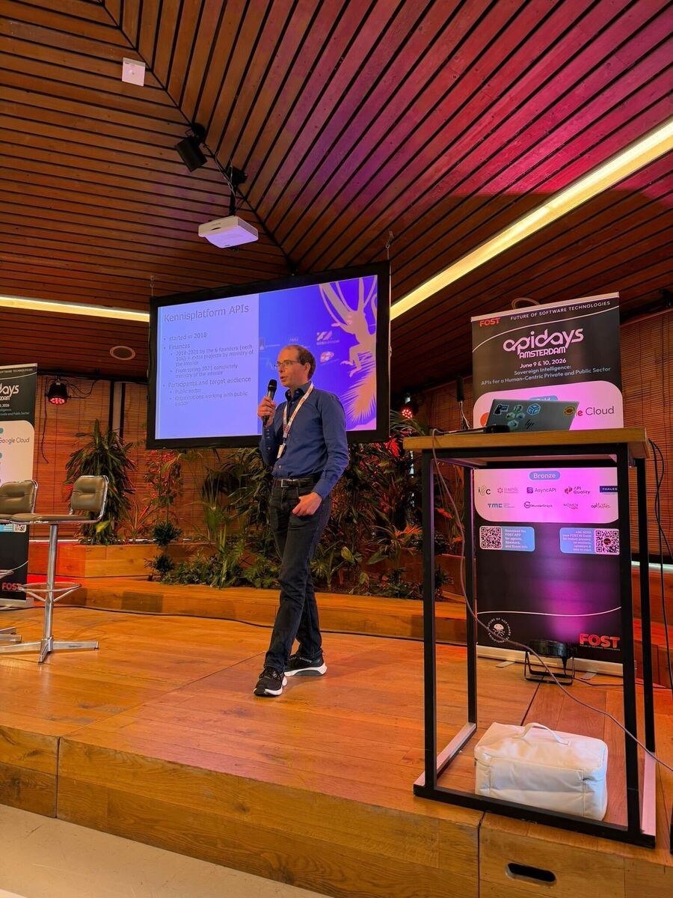
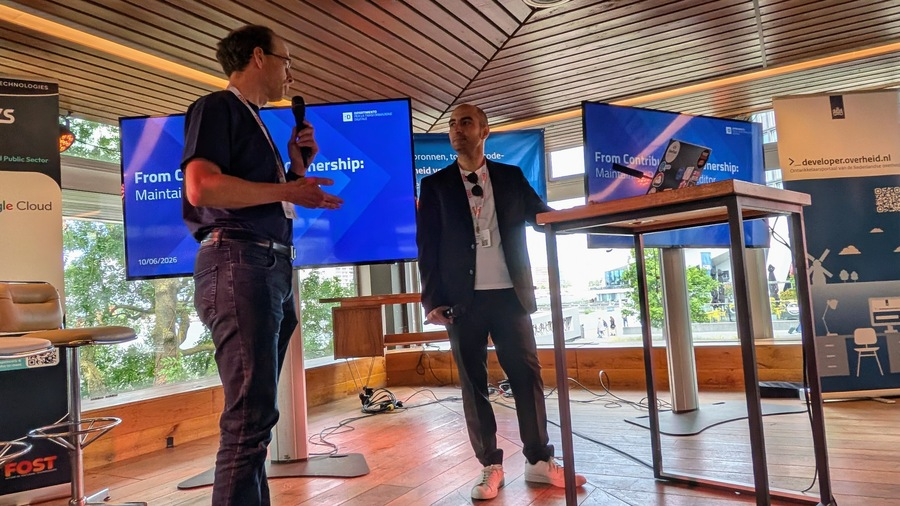
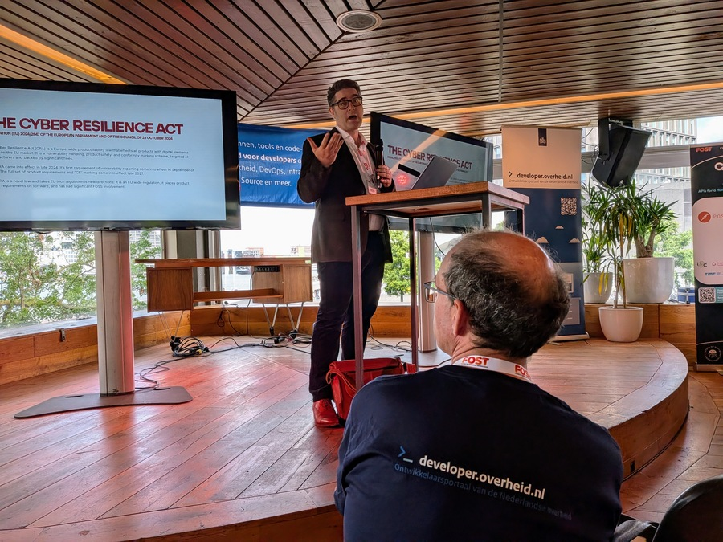

import { Link, Icon } from "@rijkshuisstijl-community/components-react";

# Wij waren op FOST 2026

9 en 10 juni stonden wij twee dagen op FOST Amsterdam met onze govtrack. Het was
een geslaagd event met veel interessante talks, en mede door het internationale
karakter was de kwaliteit van de sprekers hoog. Naast de inhoud was het sociale
component ook erg nuttig; we spraken er oude bekenden en deden nieuwe contacten
op. Onze govtrack bestond uit twee aparte onderdelen: een API-track en een
OpenSource-track. Voor beide thema's nodigden we (internationale) sprekers uit
om hun ervaringen met ons te delen.

<!-- truncate -->

## API-track

### Plenaraire opening door Frank Terpstra

Onze collega Frank timmert al jaren aan de weg als het gaat om de Nederlandse
API-strategie. Mooi was het daarom te zien dat er wat betreft API's zoveel bij
elkaar kwam. Zowel de weerbarstige praktijk kwam aan bod, middels een talk van
Janette Storm van Kadaster over de BAG, als interessante vergezichten, in de
vorm van Robberto Polli (IT) met een JSON-LD koppeling in Open API
specificaties.

 _Frank
Terpstra tijdens de plenaire opening._

### Janette Storm: BAG

De
[Basisregistratie Adressen en Gebouwen](https://bag.basisregistraties.overheid.nl/)
(BAG) is een van de meest gebruikte dataregistraties van de Nederlandse
overheid. Janette Storm liet zien hoe deze registratie heeft meegegroeid met de
API-wereld.

Vóór 2009 hadden gemeenten elk hun eigen adresregistratie, circa dertig in
totaal, die onderling niet aansloten. Sindsdien is er één centrale registratie.
Gemeenten blijven zelf verantwoordelijk voor het onderhoud: nieuwe gegevens,
zoals bouwvergunningen, moeten binnen vier dagen verwerkt zijn. De centrale
organisatie bewaakt de kwaliteit maar beheert de data zelf niet.

De eerste BAG API verscheen in 2019 bijna per toeval, als resultaat van een
proof-of-concept met linked data. Die API was direct een groot succes en won de
**Gouden API**-award. Opvallend was het adoptieprofiel: private partijen als
TomTom en Esri stapten er snel op, terwijl overheidsinstanties langer
vasthielden aan de bestaande XML-standaarden.

De slimste stap in de API-strategie was het oplossen van de puzzel voor de
gebruiker. Het oude datamodel verdeelde een adres in losse objecten (straat,
nummer, woonplaats) die gebruikers zelf moesten samenvoegen. De nieuwe aanpak
biedt kant-en-klare adreseindpunten. Dat enkelvoudige eindpunt is nu
verantwoordelijk voor **90% van het gebruik**.

Binnenkort volgt een grote update: een overstap naar de **PDOK Locatie API**,
met samenvoeging van adreseindpunten en betere ondersteuning voor historische
data. BAG ID's worden ook steeds vaker als referentie gebruikt in andere
databases, zoals die voor energielabels en de Sociale Verzekeringsbank.

### Dimitri van Hees: developer.overheid.nl

Dimitri van Hees blikte terug op acht jaar
[developer.overheid.nl](https://developer.overheid.nl). Het begon klein: een
lijst van beschikbare overheids-API's. De aanleiding was een pijnlijk moment
tijdens een bijeenkomst in Italië, waar vier Nederlandse partijen (het CBS, het
Kadaster, het Ministerie van Binnenlandse Zaken en de gemeente Amsterdam)
tegelijk dachten verantwoordelijk te zijn voor de nationale API-strategie.

Drie jaar geleden werd het platform herontwikkeld van een catalogus naar een
kennisbank voor zowel **consumenten** (developers die bouwen op overheids-API's)
als **aanbieders** (organisaties die hun API's publiceren). Omdat er geen
formeel mandaat bestaat om organisaties te verplichten API's aan te melden,
werkt het platform via waarde toevoegen: vindbaarheid, gratis validatietools en
beveiligingsscans zijn de voornaamste argumenten.

Een fundamentele drijfveer achter het platform is **data bij de bron**. Centrale
vindbaarheid voorkomt dat organisaties lokale kopieën van data aanleggen, wat in
het verleden tot incidenten heeft geleid.

Technisch accepteert het register alleen API's die beschreven zijn met de
**OpenAPI-specificatie**. Elke API krijgt een score op basis van de **API Design
Rules**. Lifecycle management werkt via extensies: API's zijn `active`,
`deprecated` of `retired`. Verwijderen doet het platform bewust niet, om
bestaande koppelingen te beschermen.

Recente toevoegingen: een **Open Source Register** gebaseerd op de Public
Code-standaard, notificaties via RSS of Slack, en experimenten met **AI Agent
Skills** als validators. De komende periode ligt de focus op uitbreiding van
monitoring, een JSON-schema en componentenregister, en meer workshops.

### Panel: adoptie zonder dwang

Het panelgesprek tussen Dimitri en Janette legde een terugkerend spanningsveld
bloot: hoe krijg je organisaties mee met standaarden zonder een dwangmatig
klimaat te creëren?

Janette was helder: je moet een standaard eerst laten werken voordat je die
verplicht stelt. Een "wall of shame" werkt averechts. Organisaties die niet
voldoen, laten zich liever van lijsten verwijderen dan hun gedrag aanpassen.
Ondersteuning en concrete voorbeelden zijn effectiever. Een plek op de lijst van
verplichte standaarden is een startpunt voor een gesprek, geen eindpunt.

Voor een brede API-strategie moet je ook de juiste taal spreken per doelgroep.
**Beleidsmakers** zoeken kostenbesparing en politieke doelen.
**Productmanagers** willen zien hoe API's helpen bij klantcontact.
**Developers** kijken direct naar concrete Design Rules en tooling.

Een treffende observatie: API's worden binnen de Nederlandse overheid steeds
vaker ingezet om het **datakopieerprobleem** bespreekbaar te maken bij
bestuurders. Dat is een probleem dat beleidsmakers herkennen, omdat het
zichtbaar is voor burgers en regelmatig de krantenkoppen haalt. Door API's als
technologische oplossing voor dit maatschappelijke probleem te presenteren,
krijgt het thema ineens veel meer politiek draagvlak.

Tot slot: er is behoefte aan meer **Europese coördinatie**. Developers die aan
vijftig verschillende nationale API-strategieën moeten voldoen worden er niet
vrolijker van.

### Tom Collins (DVLA, VK): schema-first werken

Tom Collins werkt voor de **DVLA**, de Britse instantie voor rijbewijzen en
voertuigen, en beheert gegevens over circa vijftig miljoen voertuigen. Hij
beschreef een herkenbaar probleem: teams in silo's waarbij dezelfde informatie
op tientallen manieren wordt gedefinieerd. Zelfs teams in hetzelfde gebouw
gebruikten andere termen voor hetzelfde concept.

De oplossing: het **Schema Dictionary**, een centraal Git-repository op basis
van JSON Schema. De werkwijze is schema-first: het datamodel wordt ontworpen en
via peer-reviews beoordeeld voordat er code wordt geschreven. Vanuit de centrale
schema's worden automatisch code (Java, TypeScript, Ruby), documentatie,
OpenAPI-contracten en testdata gegenereerd. Teams bouwen voort op elkaars
modellen: het adres-model is het meest gebruikte model in de organisatie.

Inmiddels gebruiken circa **450 repositories** dit systeem. Meest indrukwekkend:
het medische rijbewijsverlengingsproces, een traject dat zes productteams
overspant. Dankzij de gedeelde schema's steeg het percentage klanten dat dit
digitaal kon doorlopen van **15% naar 100%**.

Collins benadrukte een aanpak die ook in het Nederlandse speelveld herkenbaar
is: **"carrot rather than the stick"**. Teams worden verleid door de voordelen
van de tooling, niet gedwongen door regels. Een concreet resultaat: een
aggregaat-API voor de Britse overheids-app werd door één persoon in één maand
gebouwd, omdat alle bouwstenen al beschikbaar waren.

### Roberto (Italië): JSON-LD

Roberto, voorheen bij het Italiaanse digitale transformatieteam, besprak een
probleem dat iedereen in de overheid kent: verschillende organisaties
beschrijven dezelfde entiteit op totaal verschillende manieren. De definitie van
een "familie" verschilt tussen de belastingdienst en de gemeentelijke
basisadministratie, omdat de wet de "business logica" is en die per context
wisselt.

De Italiaanse aanpak: **JSON-LD** als semantische laag bovenop bestaande API's.
Elke data-eigenschap krijgt een URI die de exacte betekenis vastlegt. Zo kan
Italiaanse data automatisch worden gekoppeld aan Finse of Nederlandse
standaarden, zonder dat de onderliggende systemen hoeven te worden aangepast. In
de praktijk worden semantische keywords als `x-jsonld-context` direct toegevoegd
aan de OpenAPI-specificaties, die in Italië verplicht zijn voor de publieke
sector.

Het voornaamste voordeel: bestaande systemen hoeven niet volledig herbouwd te
worden. Je annoteert ze met semantische tags en ze worden begrijpelijk voor
andere instanties.

Ter ondersteuning biedt Italië centrale tools:
**[api.gov.it](https://api.gov.it/)** (meer dan 12.000 publieke API's) en
**[schema.gov.it](https://schema.gov.it/)** (een design-tool met een real-time
conformiteitscore). Roberto's boodschap over governance sloot aan bij die van de
andere sprekers: maak van de standaard een shortcut. Als een tool het
makkelijker maakt om correct te zijn dan niet, omarmen developers de standaard
vanzelf.

### Roberto (Italië): van SOAP naar REST

In een tweede presentatie blikte Roberto terug op de bredere digitale
transformatie van Italië. De kernopdracht: publieke diensten bereikbaar maken
via een **mobile-first** aanpak, met een nationale digitale identiteit, de
**IO-app** als één centrale app voor alle overheidsdiensten, en het **Once
Only**-principe waarbij burgers hun gegevens één keer opgeven en instanties ze
daarna onderling delen.

Het technische knelpunt was het bestaande SOAP-framework. Prima voor grote
instanties, maar de opstartkosten voor SOAP-interconnectie bedroegen al snel
**200.000 euro**. Voor meer dan 8.000 kleine gemeenten was dat onbetaalbaar. De
overstap naar een REST-vriendelijk framework was ingegeven door
toegankelijkheid, niet door technische voorkeur.

De doorbraak kwam in 2020: de lockdown maakte de urgentie van digitale
dienstverlening voor de hele samenleving zichtbaar. Daarna volgden regelgevende
wijzigingen die het nationale dataplatform omzetten naar een **API Cloud**:
instanties zijn verplicht hun API's te publiceren, handmatig ondertekende
overeenkomsten zijn vervangen door een digitaal delegatiesysteem, en kleine
gemeenten worden gestimuleerd gezamenlijk te ontwerpen en hosten.

Roberto sloot af met vier randvoorwaarden voor succes: sterk politiek
commitment, technische expertise bij de uitvoering, actieve betrokkenheid bij
internationale standaardisatie, en juristen die direct in het team zitten in
plaats van als aparte afdeling.

### Floris Deutekom: AsyncAPI

Floris Deutekom presenteerde de stand van zaken van de **AsyncAPI-werkgroep**
binnen het Kennisplatform API's. De aanleiding: een wereldwijde verschuiving
naar Event-Driven Architecture en groeiende behoefte aan tooling voor
ontkoppelde berichtstromen waarbij het aantal consumenten vooraf onbekend is.

**AsyncAPI** bouwt voort op OAS, is protocol-agnostisch (Kafka, RabbitMQ, HTTP
en meer) en biedt out-of-the-box tooling voor validatie, documentatie en
codegeneratie.

De werkgroep onderzocht twee praktijkgevallen. Bij de **Basisregistratie
Ondergrond** (BRO) werd een bestaande OAS-mapping handmatig omgezet naar
AsyncAPI: goed te doen, maar tijdrovend. Een leerpunt: oudere versies van
AsyncAPI documenteren vanuit de zender, nieuwere versies vanuit de ontvanger.
Bij **Track & Trace** (Ministerie van Justitie) werd een volledige
EDA-architectuur op basis van Kafka gedocumenteerd met conversietools, die
betrouwbaar en sneller bleken dan handmatig werk.

De werkgroep is helder over wanneer AsyncAPI meerwaarde heeft: bij ontkoppelde
architecturen, een onbekend aantal consumenten of één-op-veel communicatie. Voor
eenvoudige gevallen voegt het onnodige complexiteit toe. De combinatie met
**CloudEvents** (al een "pas toe of leg uit"-standaard) biedt een uniform kader
voor zowel de vorm als de inhoud van events.

De volgende stap: bepalen wanneer AsyncAPI verplicht gesteld moet worden en de
overgang naar een "pas toe of leg uit"-standaard voorbereiden. De werkgroep
onderzoekt ook een specifiek **Nederlands profiel** en integratie met NLX voor
beveiliging.

<Link href="/blog/authors/floris-deutekom">
  Lees hier alle posts van Floris over AsyncAPI
  <Icon icon="pijl-naar-rechts" />
</Link>

### Danny Greefhorst: notificaties in dataspaces

Danny Greefhorst (BZK/ICTU) plaatsten notificaties in de context van een
**dataspace** voor de Nederlandse overheid: een model waarbij dataproviders en
consumenten rechtstreeks met elkaar interacteren op basis van afspraken in
rulebooks, met data bij de bron als kernprincipe.

De voorkeur gaat uit naar **informatie-arme notificaties**: de notificatie bevat
weinig data en verwijst naar de bron. Zo haalt de ontvanger alleen op wat nodig
is, wat beveiliging en dataminimalisatie bevordert.

Greefhorst onderscheidde drie basispatronen: polling, directe notificatie, en
een **event broker** als tussenpersoon. Voor de Nederlandse overheid, met
potentieel 1.600 organisaties, is de broker-aanpak noodzakelijk voor
schaalbaarheid.

**CloudEvents** is de standaard voor metadata bij notificaties, inclusief een
Nederlands profiel. Voor aflevergaranties zijn afspraken nodig over
"at-least-once"-levering en foutafhandeling met exponential back-off. Bestaande
subscription-standaarden als Webhooks en WebSub voldoen nog niet volledig aan
alle eisen.

De grootste uitdaging ligt niet in de techniek, maar in de **organisatorische
bereidheid** om events daadwerkelijk te gaan delen.

### Joost Farla: bitemporaliteit in REST API's

Joost Farla besprak de overgang van Nederlandse publieke registraties van EBMS
en StUF naar moderne REST API's. De uitdaging: de oude stack bood goede
oplossingen voor bitemporale data, gegevenscorrecties en berichtbetrouwbaarheid.
Die functionaliteiten moeten mee in een moderne HTTP-context. Hiervoor is een
werkgroep gestart binnen het Kennisplatform API's.

De meeste huidige API's kennen alleen de staat van "nu". Farla pleit voor twee
tijdlijnen:

- **Geldigheidstijd** (valid time): wanneer was een waarde waar in de
  werkelijkheid?
- **Transactietijd** (recorded time): wanneer is deze informatie vastgelegd in
  de database?

Dit **bitemporale model** maakt vragen mogelijk als: "Wat was de
weersverwachting voor aanstaande zaterdag, zoals we die gisteren kenden?"

De werkgroep werkt aan drie patronen. Ten eerste **append-only**: geen PUT
(overschrijven), maar toevoegen. Elke wijziging krijgt een eigen URI.
Verwijderen is "beëindigen", correcties zijn nieuwe records die het vorige
vervangen. Ten tweede **opvragen op tijdcoördinaten**: parameters als `validAt`
en `recordedAt` maken resultaten herhaalbaar en cachebaar. Ten derde
**idempotentie**: omdat exactly-once delivery onmogelijk is met HTTP, zorgen
idempotency keys ervoor dat dubbele verzoeken worden genegeerd.

Er is ook een spanning met de **AVG**: het append-only-principe botst met het
recht om vergeten te worden. Aangedragen oplossing: **crypto-shredding**,
waarbij bij een vergeetverzoek de encryptiesleutel wordt vernietigd in plaats
van de data.

De centrale boodschap: **historie is een functionele eis, geen bijproduct**.
API-contracten moeten expliciet omgaan met tijdsdimensies.

### Ingo Simonis: expliciete kennis als AI-infrastructuur

Ingo Simonis (Open Geospatial Consortium) stelde de AI-decade centraal vanuit
een ongewone invalshoek: niet de hoeveelheid data, maar de betekenis ervan. Een
AI-agent faalt niet omdat hij data niet kan bereiken, maar omdat hij die data
niet betrouwbaar kan interpreteren. Niet-gedeclareerde eenheden, lokaal
gedefinieerde categorieën, impliciete referentiesystemen: elke aanname die
mensen vanzelfsprekend vinden, is een uitnodiging voor een agent om te raden. En
raden op de semantische laag is waar hallucinaties ontstaan.

Zijn stelling: organisaties die de AI-decade winnen, behandelen **expliciete
kennis als infrastructuur**, niet als documentatie. Wanneer data aankomt met
context, herkomst en constraints expliciet meegeleverd, stopt een agent met
infereren en begint hij met verifiëren. Dat is het verschil tussen AI in een
chatbot en AI in een complianceworkflow of publieke dienst.

De praktische voordelen zijn concreet: integratiekosten dalen, compliance wordt
inspecteerbaar in plaats van declaratief, en vendor lock-in verzwakt omdat
betekenis met de data meebeweegt. Simonis sloot af met een scherpe observatie:
de semantische gemeenschap lost dit probleem al dertig jaar op. De rest van de
wereld arriveert nu pas aan de deur.

### Bart Huijbers: de API's achter de Omgevingswet

Bart Huijbers (TBO-Kadaster) opende de motorkap van het **Digitaal Stelsel
Omgevingswet (DSO)**. Sinds 1 januari 2024 is de Omgevingswet van kracht: een
wet die tientallen wetten op het gebied van ruimtelijke ordening,
infrastructuur, milieu, natuur en water samenvoegt. Het DSO is de
ICT-ruggengraat die de bijbehorende processen ondersteunt, van publicatie van
juridische regelgeving tot vergunningschecks en -aanvragen.

Naar buiten toe presenteert het DSO zich als één geïntegreerd portaal. Onder de
motorkap is het een samenspel van componenten die via een reeks API's data
uitwisselen. Huijbers liet aan de hand van concrete use cases zien hoe die API's
werken en welke afwegingen daarin zijn gemaakt.

### Tim van der Lippe: NLgov REST API Design Rules in de praktijk

Tim van der Lippe (Logius) presenteerde de **NLgov REST API Design Rules**, de
Nederlandse standaard voor het ontwerpen van overheids-API's. De standaard is
niet in een vacuüm geschreven: elke regel is gebaseerd op historische
beslissingen van overheidsorganisaties, waarvan inmiddels bekend is of ze goed
of slecht uitpakten.

Centraal stond het samenspel tussen drie elementen: de standaard zelf, het
API-register en analyses van echte API's in het wild. Door te kijken naar hoe
overheids-API's er in de praktijk uitzien, kan de werkgroep bepalen welke regels
werken, welke te streng zijn en waar de standaard nog tekortschiet. Het
resultaat is een levende standaard die gevoed wordt door wat developers
daadwerkelijk bouwen.

### Dimitri van Hees: een nationaal schema-register voor herbruikbare API-componenten

Dimitri van Hees constateerde een patroon in overheids-API's: ze delen veel meer
dan ze hergebruiken. Zijn oplossing is een **nationaal schema-register** dat
herbruikbare OpenAPI-componenten en JSON Schemas beschikbaar stelt als
bouwstenen voor nieuwe API-ontwerpen.

De talk introduceerde het register én de bijbehorende **schema-ontwerpregels**
om standaardisatie verder te trekken. Van Hees liet ook zien hoe zijn team eigen
tooling en AI-hulpmiddelen inzet om een complete OpenAPI 3.1-specificatie met
ingebedde JSON Schemas te genereren en valideren. Hergebruik wordt daarmee geen
goede intentie, maar een onderdeel van de dagelijkse ontwerppraktijk.

### Roberto Polli: self-explaining APIs

In een tweede sessie ging Roberto Polli dieper in op een concreet probleem bij
API-integratie over domeingrenzen heen: data heeft in verschillende contexten
een andere betekenis. Wat betekent "temperatuur" in een healthcare-API, en in
welke eenheid? Welke valuta hanteert een financiële API?

Zijn antwoord is een strategie voor **semantische interoperabiliteit** die drie
lagen combineert: een API-catalogus (OAS 3.0) en een schema-catalogus (RDF),
specificaties om RDF-metadata te koppelen aan OAS 3.0-definities en JSON
Schema-datamodellen, en tooling om API-ontwerp en -validatie te ondersteunen
volgens de Italiaanse nationale interoperabiliteitsrichtlijnen. Het resultaat
zijn API's die hun eigen betekenis meedragen, zodat consumers niet hoeven te
raden wat een veld inhoudt.

### John Schaap: PDOK op nationale schaal

John Schaap (Kadaster) nam de zaal mee in de praktijk van **PDOK** (Publieke
Dienstverlening Op de Kaart), het nationale geodataplatform van de Nederlandse
overheid. Met meer dan 200 datasets, bijna 300 API's en diensten, en miljoenen
requests per dag vormt PDOK een kritieke ruggengraat voor geo-datagebruik in
Nederland.

Die schaal en diversiteit creëren een duidelijke uitdaging: hoe maak je
complexe, heterogene geo-data toegankelijk én bruikbaar voor moderne
applicaties? Schaap betoogde dat het niet genoeg is om data te ontsluiten:
developers hebben snelle, consistente en intuïtieve API's nodig, gecombineerd
met hoogwaardige visualisatietechnieken.

Hij deelde de ontwerpprincipes en lessen achter PDOK's **OGC API's** en de
**PDOK Locatie API**, met nadruk op bruikbaarheid, performance en
interoperabiliteit. De rode draad: een API-first en op standaarden gebaseerde
aanpak waarmee PDOK evolueerde van traditionele geoservices naar een modern
API-ecosysteem, waarbij gestandaardiseerde OGC API's, vector tile-visualisatie
en slimme zoekmogelijkheden samenkomen.

## OpenSource-track

De opensource-track stipte verschillend thema's aan. Zo waren er twee talks over
directdemocracy-platformen: Polis en Consul, kwam code.overheid.nl aan bod, en
bracht Thomas Steenbergen zijn OpenSource Software Review Toolkit (kortweg ORT)
voor het voetlicht.

**[DINSDAG 9 JUNI]**

### Marlena van Ooijen: code.overheid.nl

Marlena van Ooijen (Logius) begon haar praatje met een tegenstelling: sinds 2020
werkt het Ministerie van Binnenlandse Zaken aan open source-beleid voor de
overheid, maar in de praktijk vindt software-ontwikkeling bij de overheid nog
altijd veelal plaats op Github.

Steeds meer overheidsorganisaties delen de overtuiging dat échte open
source-samenwerking een gedeelde, soevereine omgeving vereist. Het antwoord is
**code.overheid.nl**, een overheidsbrede git-forge gebouwd op basis van
**Forgejo**. Het platform bevindt zich nog in een de pilotfase: de definitieve
roadmap en functionaliteiten liggen nog niet vast en deze worden samen met de
gebruikers uitgewerkt.

### Thomas Steenbergen (OSSYN): OSS Review Toolkit

Het opzetten van open source-beheerprocessen is complex: organisaties gebruiken
tientallen programmeertalen, build-tools en afleveringsmethoden. Commerciële
tools sluiten zelden goed aan op wat Open Source Program Offices (OSPO's)
daadwerkelijk nodig hebben. Meerdere OSPO's werkten daarom samen aan een open
source-oplossing voor hun gedeelde behoeften: de **OSS Review Toolkit (ORT)**.

Steenbergen demonstreerde hoe ORT een volledige FOSS-review doorloopt: van het
scannen van broncode op softwarecomponenten, licenties en
beveiligingskwetsbaarheden, via het oplossen van gevonden issues, tot het
genereren van attributiedocumenten en **CycloneDX- en SPDX-SBOMs**. Wie
FOSS-beleid wil automatiseren via Policy as Code en reviewtijd wil besparen,
heeft met ORT een kant-en-klare oplossing.

### Lucía Luzuriaga (Consul Democracy): over Consul

**Consul Democracy** is een platform dat participatieprocessen ondersteunt zoals
consultaties, participatief begroten en gezamenlijk beleid maken, en wordt
wereldwijd ingezet door overheden.

Open source maakt transparantie mogelijk, maar brengt ook praktische uitdagingen
met zich mee: het onderhouden van bijdragen, governance en technische
duurzaamheid zijn geen vanzelfsprekendheid. Luzuriaga deelde lessen uit de
praktijk en benadrukte waarom een sterke, internationale civic tech-community
onmisbaar is om digitale democratie verder te brengen.

### Raoul Kramer (Beta Break): over Polis

Raoul Kramer sloot de dag af met het verhaal achter **Polis**, een open source
participatieplatform dat gelijktijdige digitale discussies mogelijk maakt tussen
duizenden mensen. Het platform neemt stellingen als vertrekpunt en wordt ingezet
om beleidsvraagstukken en maatschappelijke kwesties aan te kaarten.

Zijn talk ging over de weg naar een bruikbare tool: welke ontwerpkeuzes en
strategieën zijn nodig om Polis geschikt te maken voor gebruik binnen de
Nederlandse overheid?

Raoul deelde aan het einde van zijn presentatie het blijde nieuws dat Polis
onder een nieuwe internationale samenwerking verder gaat: Voxit.

**[WOENSDAG 10 JUNI]**

### Plenaire opening: digitale autonomie begint bij open source

De afgelopen twaalf maanden is het debat rond digitale autonomie in Nederland
echt losgebarsten. En op het moment van FOST had Europa net een week eerder het
**Tech Sovereignty Package** gepresenteerd (3 juni 2026), met onder andere de
Cloud and AI Development Act, Chips Act 2.0 en een nieuwe **Europese Open Source
Strategie**. Het centrale frame van die strategie is het begrip **digitale
commons**: code en infrastructuur die collectief geproduceerd worden, vrij
toegankelijk zijn voor alle partijen en in het publiek belang onderhouden moeten
worden. Niemand mag alle waarde eruit halen of de toegang controleren. Een bos
is het metafoor.

Die strategie heeft ook een prijskaartje: **€2 miljard over zeven jaar**,
inclusief een Open Source Maintenance Instrument, startup-accelerators en steun
voor OSPO's. Dat staat niet op zichzelf: fondsen zoals het NLnet NGI Zero
Commons Fund (€21,6 miljoen) en het Sovereign Tech Fund (van €1M in 2022 naar
~€19M in 2025) laten zien dat de investering in open source structureel groeit.

Het probleem is dat het open source-werk van Europa onevenredig wordt uitgebuit
door grote niet-Europese techbedrijven, die Europese open source-projecten
verpakken in winstgevende platforms. Digitale autonomie betekent dat we daar een
antwoord op moeten formuleren.

Voor de Nederlandse overheid vertaalt dat zich naar **technische
volwassenheid**: organisaties die zelf open source-software kunnen bouwen,
configureren, hosten en onderhouden. Maar het niveau varieert enorm. De weg
vooruit ligt in platform-engineering als cultuur en samenwerking als norm:
gedeelde design-systems, **code.overheid.nl** als gezamenlijk platform, en
gedeelde Kubernetes-clusters voor iedereen met een goed idee. Daarvoor is ook
een open source-mindset nodig: productowners die developers ruimte geven om aan
afhankelijkheden te werken, organisaties die bereid zijn kwetsbaar te zijn en
projecten te publiceren.

En dan de hot take: **LLM's zijn onderdeel van de revolutie**. Agentic AI helpt
ons sneller coderen. Gebruik het om digitale autonomie te bereiken. Maar
vibe-coding voor productie keur ik ten zeerste af, en de ethische kant moet ook
opgelost worden.

Het goede nieuws: de urgentie en politieke steun zijn er, OSPO's schieten op
binnen de overheid, Europa zet grote stappen, en developers staan te popelen. We
komen er.

### Valerio Como (Developer Italia): over Public Code Editor

Valerio Como deelde zijn ervaringen bij zijn werk aan de **Public Code Editor**,
deze editor wordt gebruikt door de Italiaanse overheid zodat niet technische
mensen toch gemakkelijk een publiccode.yml kunnen maken.

De uitdagingen waren herkenbaar: onboarding van nieuwe bijdragers, het wegwerken
van technische schuld, het verbeteren van de betrouwbaarheid van releases en het
opschalen van het ontwikkelproces. Centraal stond de vraag hoe je
schaalbaarheid, bruikbaarheid en community-bijdragen structureel maakt.

 _Frank Terpstra en
Valerio Como._

### August Bournique: de Cyber Resilience Act

De **Cyber Resilience Act** is de Europese wetgeving die productveiligheid voor
digitale producten, inclusief software, reguleert. In 2026 en 2027 treedt de wet
gefaseerd in werking. August gaf een kijkje achter de schermen van zijn werk aan
de eerste productgerichte softwarestandaarden voor de CRA te ontwikkelen.

De wet is ambitieus en de implementatie nog onzeker. Bournique lichtte de
tijdlijn toe en stond stil bij openstaande vraagstukken: attestaties,
multifunctionele producten, remote dataverwerking en de integratie van FOSS. Hij
pleitte ervoor dat developers niet alleen de wetgeving begrijpen, maar ook de
standaarden die eronder liggen, en wees op concrete manieren waarop de
aanwezigen nog konden bijdragen aan de conceptstandaarden.

 _August Bournique sprak over de Cyber
Resilience Act._

### Tom Ootes: over publiccode.yml

Deze talk begon persoonlijk. Tijdens de COVID-crisis werkte ik voor het
ministerie van Volksgezondheid aan de contacttraceringsapplicatie. Een gedurfd
project: software zelf bouwen, een engineeringcultuur die in rap tempo ontstond.
Maar ik miste iets structureels: geen interne documentatie, geen antwoorden op
vragen over kwaliteit, toegankelijkheid, beveiliging of standaardencompliancy.
Als die antwoorden er waren geweest, hadden we betere diensten kunnen bouwen
voor alle burgers. Dat inzicht bracht me uiteindelijk bij developer.overheid.nl.

Het platform biedt een kennisbank, een API-catalogus en een **open
source-catalogus** die begin dit jaar volledig publiccode.yml-first is geworden.
Die catalogus telt inmiddels meer dan 4.000 repositories van de gehele
Nederlandse overheid.

**publiccode.yml** is een metadatastandaard die in 2018 is ontstaan, actief
onderhouden wordt door developers.italia.it en de EU-Commissie, en elke vier
maanden een updatecyclus doorloopt. Het is een vlag die je in je repository
plant zodat je project vindbaar en verkenbaar wordt voor anderen.
Gitforge-agnostisch, laagdrempelig. Er zijn al catalogi actief in Frankrijk,
Italië, Duitsland en Nederland.

Maar de standaard schiet nog tekort. Hij is oorspronkelijk ontworpen voor grote,
monolithische applicaties, terwijl het huidige landschap draait op REST API's,
cross-organisationele data-uitwisseling, software-bibliotheken en kleinere
componenten. De standaard loopt achter op de werkelijkheid.

Mijn oproep: voeg publiccode.yml toe aan jullie repositories, moedig je
organisatie aan ermee te starten, draai een catalogus op, geef feedback en dien
issues in. Het toevoegen is bovendien makkelijker geworden: we hebben een
**AI-skill** uitgebracht die het bestand voor je genereert. Samen kunnen we
overheidsdiensten drastisch verbeteren en stappen zetten richting digitale
autonomie.

 _Tom Ootes sprak over de publiccode.yml metadata
standaard voor open source projecten._
