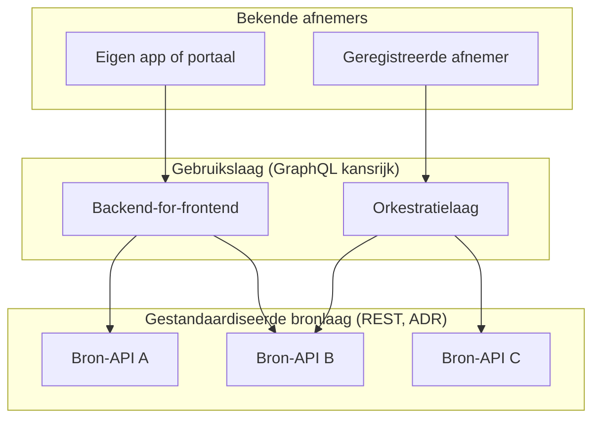

# GraphQL onder de loep (deel 4): wanneer wel, en wanneer niet?

In de eerste drie delen van deze serie hebben we GraphQL leren kennen als een
getypeerde querytaal met een fundamenteel ander model dan REST
([deel 1](/blog/draft/graphql-1-introductie)), zagen we dat de flexibele
bevraging zowel de grote kracht als een serieuze beheeropgave is
([deel 2](/blog/draft/graphql-2-flexibiliteit-en-limieten)) en liepen we
zes ontwerpuitdagingen langs die in de praktijk bepalen hoeveel werk een
GraphQL-API werkelijk kost
([deel 3](/blog/draft/graphql-3-schema-ontwerp)). <!-- TODO: links bijwerken
na publicatie -->

In dit slotdeel komen we bij de vraag waar het allemaal om draait: wanneer
is GraphQL een passende keuze, en wanneer ben je met REST beter af? Zoals in
de hele serie geldt ook hier: er is geen goed of fout. Wel zijn er
omstandigheden waarin het ene model aantoonbaar beter past dan het andere.

<!-- truncate -->

<!-- TODO bij publicatie: alle drie de links omzetten naar de definitieve
URL's (deel 1 t/m 3 zijn dan al verschenen) -->

:::info[GraphQL onder de loep]

Dit artikel is deel 4 van een vierdelige serie:

1. [Een kennismaking](/blog/draft/graphql-1-introductie)
2. [Flexibel bevragen, en wat dat kost](/blog/draft/graphql-2-flexibiliteit-en-limieten)
3. [Zes uitdagingen bij schema-ontwerp](/blog/draft/graphql-3-schema-ontwerp)
4. Wanneer wel, en wanneer niet? (dit deel)

:::

:::success[TL;DR]

De keuze voor GraphQL of REST hangt af van vijf factoren: wie je clients
zijn, hoe je datamodel eruitziet, hoeveel beheercapaciteit je hebt, hoe
belangrijk caching is en in welke standaardencontext je opereert. GraphQL is
sterk bij veel diverse, bekende clients op een samenhangend datamodel; REST
is sterk bij publieke API's met anonieme afnemers, zware cachingbehoeften en
een verplichting aan de REST API Design Rules. Voor Nederlandse
overheidsorganisaties is GraphQL daarmee vooral kansrijk als aanvullende
laag rond de gestandaardiseerde API-laag, bijvoorbeeld als
backend-for-frontend of als orkestratielaag over bestaande registraties, en
(nog) niet als vervanger van publieke REST-API's onder de ADR.

:::

## Het afwegingskader

De uitdagingen uit deel 2 en 3 zijn geen argumenten tegen GraphQL, maar
kostenposten. De vraag is per situatie of daar voldoende baten tegenover
staan. Vijf assen helpen bij die afweging:

| Factor | Wijst richting GraphQL | Wijst richting REST |
| --- | --- | --- |
| **Clients** | Veel diverse, bekende clients (mobiel, meerdere frontends, partnerteams) met uiteenlopende databehoeften | Anonieme of onbekende afnemers, publieke open data, machine-to-machine-koppelingen |
| **Datamodel** | Sterk samenhangende graaf met veel relaties die per scherm anders doorlopen wordt | Overzichtelijke, afgebakende resources met voorspelbare toegangspatronen |
| **Beheersing** | Capaciteit en volwassenheid om cost analysis, field-level autorisatie en monitoring per operatie in te richten | Behoefte aan een eenvoudig te beveiligen en te begrenzen API-oppervlak |
| **Caching** | Caching vooral aan de clientkant, of via persisted queries te organiseren | Zwaar leunen op HTTP/CDN-caching, zoals bij veelbevraagde open-data-API's |
| **Standaarden** | Interne context waarin eigen conventies volstaan | Verplichting of wens om aan te sluiten op de ADR en het OpenAPI-ecosysteem |

Twee observaties bij deze tabel. Ten eerste: de linkerkolom beschrijft in de
kern één situatie, namelijk een organisatie die veel verschillende
*bekende* afnemers bedient vanuit één samenhangend datamodel en bereid is
daar een platform voor in te richten. Ten tweede: de kolommen sluiten elkaar
niet uit. GraphQL en REST kunnen naast elkaar bestaan, elk voor het deel van
het landschap waar ze sterk zijn.

## Hoe grote aanbieders kiezen

Dat de afweging echt twee kanten op kan vallen, laat de praktijk van grote
API-aanbieders zien.

**Shopify** ging volledig over:
[de REST Admin API is sinds oktober 2024 legacy](https://www.shopify.com/partners/blog/all-in-on-graphql)
en nieuwe publieke apps in de App Store
[moeten sinds april 2025 GraphQL gebruiken](https://shopify.dev/changelog/starting-april-2025-new-public-apps-submitted-to-shopify-app-store-must-use-graphql).
Shopify past exact in de linkerkolom: duizenden bekende, geregistreerde
app-ontwikkelaars met sterk uiteenlopende databehoeften op één samenhangend
commerce-datamodel, en de schaal om cost-based rate limiting (zie deel 2) als
platformvoorziening aan te bieden.

**Netflix** draait intern
[federated graphs over ruim tweehonderd services](https://www.infoq.com/articles/federated-GraphQL-platform-Netflix/):
supergraphs, samengesteld uit de deelschema's van evenzoveel teams. Ook dit
is de linkerkolom, met de kanttekening dat het om *interne* API's gaat, met
volledige controle over alle clients.

**GitHub** biedt al jaren
[REST en GraphQL naast elkaar aan](https://docs.github.com/en/rest/about-the-rest-api/comparing-githubs-rest-api-and-graphql-api)
en adviseert afnemers te kiezen wat bij hun gebruik en ervaring past: REST
vanwege de vertrouwde HTTP-conventies, GraphQL wanneer één query het werk
van meerdere REST-requests moet doen.

Tegelijk klinkt er ook kritiek uit de praktijk. Matt Bessey vatte in
[Why, after 6 years, I'm over GraphQL](https://bessey.dev/blog/2024/05/24/why-im-over-graphql/)
samen waarom hij na zes jaar GraphQL voor nieuw werk weer een
OpenAPI-gebaseerde REST-API adviseert: het beveiligings- en
performance-oppervlak uit deel 2 bleek in de praktijk duurder dan de
flexibiliteitswinst. Marc-André Giroux, die jarenlang aan de API-platformen
van GitHub en Netflix werkte, komt in
[Why, after 8 years, I still like GraphQL sometimes in the right context](https://magiroux.com/eight-years-of-graphql)
tot een oordeel dat aansluit bij de tabel
hierboven: GraphQL loont bij veel bekende clients en een rijk datamodel, en
is overkill daarbuiten.

Wie deze vier verhalen naast elkaar legt, ziet geen tegenspraak maar
hetzelfde patroon: de uitkomst volgt uit de context, niet uit de
technologie.

## De Nederlandse overheidscontext

Voor overheidsorganisaties speelt naast de technische afweging een
standaardenafweging.

De [REST API Design Rules](/kennisbank/api-ontwikkeling/standaarden/api-design-rules)
staan sinds 2020 op de
['pas toe of leg uit'-lijst](https://www.forumstandaardisatie.nl/open-standaarden/rest-api-design-rules)
van het Forum Standaardisatie (sinds eind 2025 in versie 2.0) en zijn
expliciet gescoped op REST-API's. De
[API Strategie van de Nederlandse overheid](https://docs.geostandaarden.nl/api/API-Strategie/)
noemt GraphQL hooguit zijdelings als mogelijke query style, zonder er
richting aan te geven. Er bestaat geen NLGov-profiel, geen toetsingskader en
geen vastgestelde set conventies voor GraphQL, terwijl deel 3 liet zien dat
juist conventies (paginering, filtering, foutafhandeling) bij GraphQL niet
vanzelf meekomen. Wat de ADR voor REST-API's dichtregelt, zou voor
GraphQL-API's per organisatie opnieuw uitgevonden worden, met alle
interoperabiliteitsrisico's van dien. De vraag hoe de ADR zich verhouden
tot alternatieven zoals GraphQL staat binnen het
[Kennisplatform API's](https://github.com/Geonovum/KP-APIs/issues/537)
overigens al langer op de agenda, en werd in juni 2026 opnieuw opgepakt. Het
[API-register](/blog/2025/06/18/het-nieuwe-api-register)
op deze site is om die reden REST-only: GraphQL heeft potentie, maar
verdient pas een eigen plek bij bredere adoptie en standaardisatie.

Naast het API-ontwerp is er de verbindingenkant:
[FSC](/kennisbank/devops/standaarden/fsc) (Federated Service Connectivity),
verplicht onderdeel van het
[Digikoppeling REST API-profiel](https://gitdocumentatie.logius.nl/publicatie/dk/restapi/),
sinds april 2026 in versie 2.0.
Technisch past GraphQL daar prima op: de
[FSC-specificatie](https://gitdocumentatie.logius.nl/publicatie/fsc/core/2.0.0/)
definieert een service als "An HTTP API offered to the Group" en stelt
geen eisen aan de API-stijl. Inhoudelijk wringt de granulariteit. Contracten
autoriseren een service als geheel en het
[transactielog](https://gitdocumentatie.logius.nl/publicatie/fsc/logging/1.1.0/)
registreert per request alleen wie welke service bevroeg; de
informatiewaarde hangt dus af van hoe betekenisvol het landschap in services
is opgeknipt. Een REST-landschap laat zich opdelen per resource of
gegevensdomein; een GraphQL-API is in de praktijk één service, tenzij het
schema bewust over meerdere endpoints wordt verdeeld, wat ongebruikelijk
is. Contracten worden daarmee alles-of-niets en de vraag welke gegevens
zijn ingezien is alleen nog in de GraphQL-laag zelf te beantwoorden
(voorloper
[NLX](https://gitlab.com/commonground/nlx/nlx) had hiervoor nog
gestandaardiseerde, optionele doelbindings-headers). De autorisatieopgave uit deel 3
krijgt er in federatief verband dus een verantwoordingsopgave bij: wie
GraphQL over FSC aanbiedt, organiseert die fijnmazigheid zelf.

```text
REST-landschap op FSC          GraphQL op FSC
├─ vergunningen (contract A)   └─ graphql (één contract:
├─ dossiers     (contract B)      alles-of-niets)
└─ documenten   (contract C)
```

## Waar GraphQL wél past binnen de overheid

Betekent dit dat GraphQL binnen de overheid geen plaats heeft? Nee. Het
betekent wel dat GraphQL vooralsnog niet de gestandaardiseerde, publieke
API-laag zelf vervangt, maar kansrijk is in de lagen daaromheen: erachter,
erbovenop of ernaast, steeds voor bekende afnemers. Schematisch:



Concreet zien we vier varianten:

- **Backend-for-frontend (BFF):** een GraphQL-laag die voor de eigen
  portalen en apps data uit meerdere (REST-)bronnen aggregeert. De clients
  zijn bekend en in eigen beheer, waardoor het aanvalsoppervlak uit deel 2
  grotendeels wegvalt; de performance-opgave (N+1, monitoring) blijft, maar
  is binnen één team beheersbaar. De publieke API-laag blijft intussen
  ADR-conform.
- **Orkestratie over bestaande bronnen:** een bevragingslaag die gegevens
  uit meerdere bestaande API's (REST of anderszins) in samenhang aanbiedt,
  zonder die bronnen te vervangen. Een Nederlands voorbeeld is
  [IMX](https://federatief.datastelsel.nl/kennisbank/imx/) van Geonovum:
  model-gedreven orkestratie waarbij een doelmodel (het informatieproduct)
  wordt gemapt op bestaande bronregistraties, en de open-source engine
  [imx-orchestrate](https://github.com/imx-org/imx-orchestrate) de gegevens
  realtime bij de bronnen ophaalt. GraphQL zit hier vooral onder de
  motorkap: het georkestreerde informatieproduct kan behalve als
  GraphQL-API ook als REST-API of in een andere vorm worden ontsloten, en
  de bronnen zelf kunnen gewone, ADR-conforme REST-API's of OGC API's
  blijven. IMX is beproefd in Digilab als bouwsteen voor het
  [Federatief Datastelsel](https://federatief.datastelsel.nl/), waarvan het
  afsprakenstelsel begin 2026 is vastgesteld, en laat goed zien dat GraphQL
  en REST elkaar eerder aanvullen dan uitsluiten.
- **Interne datalandschappen:** organisaties met veel interne afnemers op
  een samenhangend gegevensmodel, waar de federated aanpak van Netflix als
  voorbeeld kan dienen.
- **Dataportalen met bekende afnemers:** omgevingen waarin afnemers zich
  registreren en ad-hoc bevragingen doen op rijke datasets, vergelijkbaar
  met de analytische use cases die we eerder bij
  [OData](/blog/2025/10/21/odata-en-de-rest-api-design-rules)
  zagen.

Voor publieke API's met anonieme afnemers, open data met zware caching en
alles wat onder de ADR valt, blijft REST de logische keuze.

## Vooruitblik

De standaardisatie rond GraphQL beweegt, en dat is relevant voor deze
afweging op langere termijn. Wie de afweging over een of twee jaar opnieuw
maakt, kan op deze signalen letten:

- De [GraphQL over HTTP-specificatie](https://graphql.github.io/graphql-over-http/)
  wordt definitief: daarmee ligt het transportgedrag vast en wordt
  ondersteuning door gateways en tooling betrouwbaarder.
- De [RFC voor persisted operations](https://github.com/graphql/graphql-over-http/blob/main/rfcs/PersistedOperations.md)
  landt in die specificatie: dan is er één gestandaardiseerde vorm voor het
  begrenzen én cachen van bevragingen, nu nog per implementatie anders
  (deel 2).
- IBM's [cost-directives](https://ibm.github.io/graphql-specs/cost-spec.html)
  groeien uit tot een gedeelde taal voor querykosten, zodat limieten
  interoperabel worden in plaats van servereigen.
- De [Composite Schemas-werkgroep](https://github.com/graphql/composite-schemas-spec)
  levert een leveranciersneutrale federatiestandaard op, relevant voor
  orkestratie over organisatiegrenzen.
- En dichter bij huis: de eerdergenoemde discussie binnen het Kennisplatform
  API's leidt tot een standpunt of profiel, en GraphQL-API's verschijnen in
  relevante aantallen in het API-register.

Naarmate deze punten worden afgevinkt, verschuift de balans: een deel van
wat je nu zelf moet ontwerpen en bewaken, wordt dan door standaarden en
tooling gedragen. Het is dezelfde ontwikkeling die REST in de afgelopen
tien jaar heeft doorgemaakt, met de ADR als resultaat. Binnen de overheid
is zo'n verkenningsproces overigens niet nieuw: voor asynchrone API's
doorloopt de
[werkgroep AsyncAPI](/blog/2026/05/28/asyncapi-1-tot-nu-toe) op dit moment
een vergelijkbaar traject.

## Slotadvies

GraphQL is een volwassen technologie die een reëel probleem oplost: het
flexibel bedienen van veel verschillende, bekende clients vanuit één
samenhangend datamodel. Wie in die situatie zit en bereid is de bijbehorende
beheer- en ontwerpopgave serieus te nemen, heeft aan GraphQL een krachtig
instrument, ook binnen de overheid, bijvoorbeeld als backend-for-frontend of
in een intern datalandschap.

Voor publieke overheids-API's ligt dat anders. Daar wegen de sterke punten
van REST (eenvoud, HTTP-native caching, resource-gebaseerde autorisatie,
content negotiation) zwaar, en bieden de ADR een vastgesteld, getoetst
kader dat voor GraphQL vooralsnog ontbreekt. Niet omdat GraphQL slechter
is, maar omdat de context er (nog) niet naar is. Voor een publieke API
binnen de Nederlandse overheid is REST vanwege de pas-toe-of-leg-uit-status
van de ADR het uitgangspunt; afwijken vraagt om een expliciete motivering.
Voor het bedienen van de eigen frontends is GraphQL een serieuze optie om
te verkennen. En wie over een paar jaar opnieuw kijkt, treft mogelijk een
standaardenlandschap dat de afweging opnieuw de moeite waard maakt.
