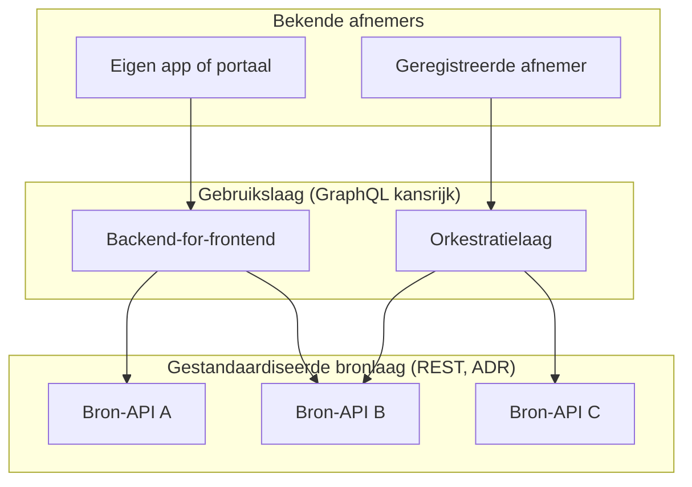

# GraphQL onder de loep (deel 4): wanneer wel, en wanneer niet?


In de eerste drie delen van deze serie hebben we GraphQL leren kennen als een
getypeerde querytaal met een fundamenteel ander model dan REST
([deel 1](/blog/2026/07/30/graphql-1-introductie)), zagen we dat de flexibele
bevraging zowel de grote kracht als een serieuze beheeropgave is
([deel 2](/blog/2026/08/05/graphql-2-flexibiliteit-en-limieten)) en liepen we
zes ontwerpuitdagingen langs die in de praktijk bepalen hoeveel werk een
GraphQL-API werkelijk kost ([deel 3](/blog/draft/graphql-3-schema-ontwerp)).

<!-- TODO: link naar deel 3 bijwerken na publicatie -->

In dit slotdeel komen we bij de vraag waar het allemaal om draait: wanneer is
GraphQL een passende keuze, en wanneer ben je met REST beter af? Er zijn
omstandigheden waarin het ene model aantoonbaar beter past dan het andere.

<!-- truncate -->

<!-- TODO bij publicatie: de link naar deel 3 omzetten naar de definitieve
URL -->

:::info[GraphQL onder de loep]

Dit artikel is deel 4 van een vierdelige serie:

1. [Een kennismaking](/blog/2026/07/30/graphql-1-introductie)
2. [Flexibel bevragen, en wat dat kost](/blog/2026/08/05/graphql-2-flexibiliteit-en-limieten)
3. [Zes uitdagingen bij schema-ontwerp](/blog/draft/graphql-3-schema-ontwerp)
4. Wanneer wel, en wanneer niet? (dit deel)

:::

:::success[TL;DR]

De keuze hangt af van zeven factoren: wie je afnemers zijn, of je in een context
werkt waar een vastgesteld kader telt, hoe belangrijk HTTP-caching is, hoe je
datamodel eruitziet, hoeveel verschillende bevragingen je verwacht, hoeveel
beheercapaciteit je hebt en hoe omkeerbaar de keuze moet zijn. Bij publieke
overheids-API's wijzen die vaak dezelfde kant op en is REST het uitgangspunt. De
ADR gelden alleen als je REST aanbiedt: kies je GraphQL, dan mis je een
vastgesteld kader en een toetsing, en hoef je tegelijk niets uit te leggen. Voor
Nederlandse overheidsorganisaties is GraphQL vooral kansrijk waar de afnemers
bekend zijn: als laag boven de bronnen, bijvoorbeeld een backend-for-frontend of
een orkestratielaag, of als toegang tot een intern of afgeschermd model. Kies je
ervoor, dan is de lijst aan het eind van dit artikel wat je zelf inricht en
vastlegt.

:::

## Het afwegingskader

De uitdagingen uit deel 2 en 3 vormen de opgave die GraphQL met zich meebrengt.
De vraag is per situatie of die opgave in verhouding staat tot wat je ervoor
terugkrijgt. Zeven factoren helpen bij die afweging. Sommige gaan over
omstandigheden die je niet zelf in de hand hebt, andere over hoeveel werk je
erin wil stoppen; hoe zwaar ze wegen, hangt van je situatie af.

| Factor             | Wijst richting GraphQL                                                                                                                                                | Wijst richting REST                                                                            |
| ------------------ | --------------------------------------------------------------------------------------------------------------------------------------------------------------------- | ---------------------------------------------------------------------------------------------- |
| **Afnemers**       | Clients waarmee je direct kunt afstemmen en die hun vragen zelf samenstellen: eigen apps en portalen, teams in de eigen organisatie, een besloten groep ontwikkelaars | Anonieme of onbekende afnemers, publieke open data, en formele koppelingen tussen organisaties |
| **Kader**          | Interne of afgebakende context waarin eigen conventies volstaan                                                                                                       | Ketenverkeer of een landelijke voorziening, waar een vastgesteld kader telt                    |
| **Caching**        | Caching aan de clientkant, of via persisted queries met `GET` te organiseren                                                                                          | Zwaar leunen op HTTP- en CDN-caching, zoals bij veelbevraagde open data                        |
| **Datamodel**      | Sterk samenhangende graph met veel relaties die per scherm anders doorlopen wordt                                                                                     | Overzichtelijke, afgebakende resources met voorspelbare toegangspatronen                       |
| **Bevragingen**    | Talrijk, snel wisselend en door de clientteams zelf bedacht                                                                                                           | Een stabiele, overzichtelijke set gegevensvragen                                               |
| **Beheersing**     | Capaciteit om cost analysis, autorisatie per veld of per operatie en monitoring per operatie te doen                                                                  | Behoefte aan een eenvoudig te beveiligen en te begrenzen API-oppervlak                         |
| **Omkeerbaarheid** | Eén team of domein, waar een latere migratie te overzien is                                                                                                           | Lange levensduur, meerdere leveranciers, wisselend opdrachtnemerschap                          |

De kolommen sluiten elkaar niet uit. GraphQL en REST kunnen naast elkaar
bestaan, elk voor het deel van het landschap waar ze sterk zijn. Bij publieke
overheids-API's wijzen de eerste drie rijen vaak dezelfde kant op, en dan is
REST het uitgangspunt. Vaak is niet altijd: bedien je clients waarmee je direct
kunt afstemmen, buiten het ketenverkeer en zonder cachingafhankelijkheid, dan
komt de afweging er anders uit, en blijven de vier andere rijen te beantwoorden.

Vier rijen verdienen een toelichting.

**Afnemers.** Het beheersapparaat uit deel 2 gaat uit van afnemers die je kunt
identificeren: kostenbudgetten per afnemer, vooraf geregistreerde operaties,
monitoring per client. Bij anonieme afnemers vervalt die aanname en moeten de
generieke limieten al het werk doen, zonder onderscheid tussen een afnemer die
zich vergist en een afnemer die het erom doet.

Bekend is hier niet hetzelfde als gecontracteerd. Ook ketenverkeer loopt tussen
bekende partijen, bijvoorbeeld via FSC, maar daar liggen de koppelingen vast in
afspraken per organisatie, gaat het om een stabiele set gegevensvragen en hoort
er een verantwoordingsplicht bij. Die situatie wijst richting REST, zoals de
sectie over de overheidscontext hieronder uitwerkt. Deze rij gaat over afnemers
met wie je in hetzelfde ontwikkelritme zit en die hun vragen zelf willen
samenstellen.

**Kader.** Hier speelt een misverstand. Het functioneel toepassingsgebied van de
[REST API Design Rules](/kennisbank/api-ontwikkeling/standaarden/api-design-rules)
is "het aanbieden van REST API's", en Forum Standaardisatie stelt er expliciet
bij dat de standaard "niet het gebruik van REST-API's verplicht". Kies je
GraphQL, dan val je dus buiten het toepassingsgebied: je mist een vastgesteld
kader en de bijbehorende toetsing, zoals de
[ADR Checker](/kennisbank/api-ontwikkeling/tools/api-design-rules-linter) die
een OpenAPI-document tegen de regels houdt, en hoeft tegelijk niets uit te
leggen. Voor een API die je eigen frontend bedient is dat weinig bezwaar; in
ketenverkeer of als landelijke voorziening is het de kern van de afweging.

**Bevragingen.** Tel je bevragingen, en vraag wie ze definieert. Een stabiele
set gegevensvragen laat zich prima als toegesneden endpoints of
informatieproducten aanbieden, en dat is standaardconform. Een generiek
querymechanisme betaalt zich terug wanneer de vragen talrijk zijn, snel wisselen
en door de clientteams zelf worden bedacht. Zet je die vragen vervolgens vast
als geregistreerde operaties (de persisted queries uit deel 2), dan heb je
feitelijk weer endpoints, met dit verschil: de clientteams definiëren ze zelf,
zonder wijziging aan de backend.

**Omkeerbaarheid.** Deze ontbreekt in de meeste afwegingen en is voor de
overheid juist relevant. Deel 3 liet zien dat het dialect voor filtering en
sortering per framework verschilt en daarmee in je publieke contract landt, en
dat custom scalars server en client aan dezelfde library binden. Het contract
erft daarmee eigenschappen van de implementatie, wat een latere migratie of
leverancierswissel duurder maakt. Houd je schema daarom technologieneutraal en
laat het dialect niet naar buiten lekken. Dat is ook waar de leidraad
[Gebruik open standaarden](/kennisbank/leidraad/open-standaarden) op aandringt:
leveranciersonafhankelijkheid begint bij een contract dat niet aan één
implementatie vastzit.

## Hoe grote aanbieders kiezen

Dat de afweging echt twee kanten op kan vallen, laat de praktijk van grote
API-aanbieders zien.

**Shopify** ging volledig over:
[de REST Admin API is sinds oktober 2024 legacy](https://www.shopify.com/partners/blog/all-in-on-graphql)
en nieuwe publieke apps in de App Store
[moeten sinds april 2025 GraphQL gebruiken](https://shopify.dev/changelog/starting-april-2025-new-public-apps-submitted-to-shopify-app-store-must-use-graphql).
Duizenden bekende, geregistreerde app-ontwikkelaars met sterk uiteenlopende
databehoeften op één samenhangend commerce-datamodel, en de schaal om cost-based
rate limiting (zie deel 2) als platformvoorziening aan te bieden.

**Netflix** draait intern
[federated graphs over ruim tweehonderd services](https://www.infoq.com/articles/federated-GraphQL-platform-Netflix/):
supergraphs, samengesteld uit de deelschema's van evenzoveel teams, met
volledige controle over alle clients.

**GitHub** biedt al jaren
[REST en GraphQL naast elkaar aan](https://docs.github.com/en/rest/about-the-rest-api/comparing-githubs-rest-api-and-graphql-api)
en adviseert afnemers te kiezen wat bij hun gebruik en ervaring past: REST
vanwege de vertrouwde HTTP-conventies, GraphQL wanneer één query het werk van
meerdere REST-requests moet doen.

Tegelijk klinkt er ook kritiek uit de praktijk. Matt Bessey vatte in
[Why, after 6 years, I'm over GraphQL](https://bessey.dev/blog/2024/05/24/why-im-over-graphql/)
samen waarom hij na zes jaar GraphQL voor nieuw werk weer een OpenAPI-gebaseerde
REST-API adviseert: het beveiligings- en performance-oppervlak uit deel 2 bleek
in de praktijk duurder dan de flexibiliteitswinst. Marc-André Giroux, die
jarenlang aan de API-platformen van GitHub en Netflix werkte, komt in
[Why, after 8 years, I still like GraphQL sometimes in the right context](https://magiroux.com/eight-years-of-graphql)
tot een voorwaardelijk ja: GraphQL loont bij veel bekende clients en een rijk
datamodel, en is overkill daarbuiten.

Deze verhalen spreken elkaar niet tegen: de uitkomst volgt telkens uit de
context, niet uit de technologie. Belangrijk is dan wel welke context dat is.
Het zijn platformen met duizenden geregistreerde ontwikkelaars op één
commercieel datamodel, met een platformteam dat limieten en schemabeheer als
product aanbiedt. Geen van hen is een publieke registratie met een wettelijke
taak en een verantwoordingsplicht over inzage. En binnen de Nederlandse overheid
is de bewijsbasis dun: breed gedeelde ervaringsverhalen zijn er nauwelijks. Weeg
deze casussen dus op overdraagbaarheid naar jouw situatie, niet op autoriteit.

## De Nederlandse overheidscontext

Voor overheidsorganisaties speelt naast de technische afweging een
standaardenafweging.

De
[REST API Design Rules](/kennisbank/api-ontwikkeling/standaarden/api-design-rules)
staan sinds 2020 op de
['pas toe of leg uit'-lijst](https://www.forumstandaardisatie.nl/open-standaarden/rest-api-design-rules)
van het Forum Standaardisatie en zijn expliciet gescoped op REST-API's. De
[API Strategie van de Nederlandse overheid](https://docs.geostandaarden.nl/api/API-Strategie/)
noemt GraphQL alleen zijdelings als mogelijke query style. Er is dus geen
NLGov-profiel, geen toetsingskader en geen vastgestelde set conventies: wat de
ADR voor REST-API's dichtregelen, zou per organisatie opnieuw worden
uitgevonden, met interoperabiliteitsrisico's van dien, terwijl deel 3 liet zien
dat juist die conventies (paginering, filtering, foutafhandeling, en zelfs het
ankerpunt voor autorisatie) bij GraphQL niet vanzelf meekomen. De vraag hoe de
ADR zich verhouden tot alternatieven zoals GraphQL staat binnen het
[Kennisplatform API's](https://github.com/Geonovum/KP-APIs/issues/537) al langer
op de agenda, en werd in juni 2026 opnieuw opgepakt. Het
[API-register](/blog/2025/06/18/het-nieuwe-api-register) op deze site is om die
reden REST-only: GraphQL heeft potentie, maar verdient pas een eigen plek bij
bredere adoptie en standaardisatie.

Naast het API-ontwerp is er de verbindingenkant:
[FSC](/kennisbank/devops/standaarden/fsc) (Federated Service Connectivity),
verplicht onderdeel van het
[Digikoppeling REST API-profiel](https://gitdocumentatie.logius.nl/publicatie/dk/restapi/),
sinds april 2026 in versie 2.0. De
[FSC-specificatie](https://gitdocumentatie.logius.nl/publicatie/fsc/core/2.0.0/)
definieert een service als "An HTTP API offered to the Group" en stelt geen
eisen aan de API-stijl, dus technisch kan GraphQL erop, maar inhoudelijk wringt
de granulariteit. Contracten autoriseren een service als geheel en het
[transactielog](https://gitdocumentatie.logius.nl/publicatie/fsc/logging/1.1.0/)
registreert per request welke service is bevraagd. Een REST-landschap laat zich
opdelen per resource of gegevensdomein; een GraphQL-API is in de praktijk één
service. Contracten worden daarmee alles-of-niets, en de vraag welke gegevens
zijn ingezien is alleen in de GraphQL-laag te beantwoorden. Die
verantwoordingsopgave organiseer je dus zelf, en het per-operatie-anker uit deel
3 is daarvoor de kansrijkste route: een vastgezette set geregistreerde operaties
laat zich per stuk autoriseren en loggen, met het
[Logboek Dataverwerkingen](/kennisbank/data/standaarden/logboek-dataverwerkingen)
als kader voor de vastlegging. Dat gebeurt dan wel buiten de contracten en het
transactielog van FSC om.

```text
REST-landschap op FSC          GraphQL op FSC
├─ vergunningen (contract A)   └─ graphql (één contract:
├─ dossiers     (contract B)      alles-of-niets)
└─ documenten   (contract C)
```

## Waar GraphQL wél past binnen de overheid

Betekent dit dat GraphQL binnen de overheid geen plaats heeft? Nee. Het betekent
wel dat GraphQL vooralsnog niet de gestandaardiseerde, publieke API-laag zelf
vervangt, maar kansrijk is waar de afnemers bekend zijn, want dan valt het
aanvalsoppervlak uit deel 2 grotendeels weg: als laag boven de bronnen, of als
toegang tot een intern of afgeschermd model. Het eerste schematisch:


```mermaid
flowchart TB
  subgraph clients["Bekende afnemers"]
    app["Eigen app of portaal"]
    partner["Geregistreerde afnemer"]
  end
  subgraph gebruik["Gebruikslaag (GraphQL kansrijk)"]
    bff["Backend-for-frontend"]
    ork["Orkestratielaag"]
  end
  subgraph bron["Gestandaardiseerde bronlaag (REST, ADR)"]
    a["Bron-API A"]
    b["Bron-API B"]
    c["Bron-API C"]
  end
  app --> bff
  partner --> ork
  bff --> a
  bff --> b
  ork --> b
  ork --> c
```

Concreet zien we twee patronen:

- **Een laag boven bestaande bronnen.** In de kleinste vorm een
  backend-for-frontend: een GraphQL-laag die voor de eigen portalen en apps data
  uit meerdere (REST-)bronnen samenbrengt, met clients die bekend zijn en in
  eigen beheer. In de bredere vorm een orkestratielaag die gegevens uit meerdere
  API's in samenhang aanbiedt aan meerdere afnemers, zonder die bronnen te
  vervangen. Het Nederlandse voorbeeld daarvan is
  [IMX](https://federatief.datastelsel.nl/kennisbank/imx/) van Geonovum:
  model-gedreven orkestratie waarbij een doelmodel (het informatieproduct) wordt
  gemapt op bestaande bronregistraties. GraphQL zit daar vooral onder de
  motorkap: het georkestreerde informatieproduct kan ook als REST-API worden
  ontsloten, en de bronnen blijven gewone, ADR-conforme REST-API's of OGC API's.
- **Toegang tot één samenhangend model.** Veel bekende afnemers die
  uiteenlopende en wisselende vragen stellen: interne teams in een groot
  datalandschap, waar de federated aanpak van Netflix als voorbeeld kan dienen,
  of externe afnemers die zich registreren en verkennende, analytische
  bevragingen doen op rijke datasets, vergelijkbaar met de analytische use cases
  waar we bij [OData](/blog/2025/10/21/odata-en-de-rest-api-design-rules)
  dezelfde grens trokken: onderzoek en zelfbediening op datasets, niet het
  primaire kanaal voor wettelijke gegevensverstrekking. Hier is GraphQL niet de
  laag boven de bronnen maar de toegang tot het model zelf, en gelden de rijen
  Bevragingen en Beheersing uit het afwegingskader in volle omvang.

Bij het eerste patroon hoort een voorbehoud: een extra laag is een extra
contractvlak. Betekenis, autorisatie en logging moeten daar opnieuw worden
waargemaakt, en bij model-gedreven orkestratie is de mapping zelf de plek waar
semantiek kan sneuvelen. Wat je wint aan gemak voor de afnemer, organiseer je
erbij aan beheer. Dat is niet nieuw en niet GraphQL-specifiek: we schreven
eerder over
[de uitdagingen bij API-orkestratie](/blog/2023/11/28/de-uitdagingen-bij-api-orkestratie).

Voor publieke API's met anonieme afnemers, open data met zware caching, en voor
ketenverkeer, landelijke voorzieningen en andere ontsluiting waar de conventies
tussen organisaties vast moeten liggen, blijft REST de logische keuze.

## Wat de keuze voor GraphQL vraagt

Valt de afweging naar GraphQL, dan is dit de inrichting die deel 2 en 3
opleveren. Omdat er geen profiel is dat dit voor je regelt, is dezelfde lijst
ook wat je zelf vastlegt en publiceert, richting je eigen architectuurboard, je
security review en je afnemers.

| Wat                        | Waarom                                                                       |
| -------------------------- | ---------------------------------------------------------------------------- |
| Depth en amount limits     | Voorkomt dat een paar regels querytekst miljoenen rijen raakt (deel 2)       |
| Query cost analysis        | Maakt de zwaarte van een request begrensbaar in plaats van onbekend          |
| Geregistreerde operaties   | Begrenst, maakt cachebaar en maakt autorisatie per operatie mogelijk         |
| Ankerpunt voor autorisatie | Per veld of per operatie, plus de gegevensafhankelijke checks eronder        |
| Monitoring per operatie    | Zonder dit is optimaliseren en uitfaseren blind werk                         |
| Cachingstrategie           | Client, server of persisted queries met `GET`, maar wel een expliciete keuze |
| Eigen conventies, publiek  | Paginering, filtering, fouten en scalars vastleggen en documenteren          |
| Technologieneutraal schema | Houdt het framework-dialect uit je publieke contract                         |

Deze acht punten zijn het minimum, geen bewijs dat GraphQL past. Ze maken je
eigen API beheersbaar, maar interoperabiliteit vraagt conventies die je met
anderen deelt, en die komen uit een profiel dat voor GraphQL niet bestaat. Die
vraag beantwoordt het afwegingskader hierboven. Autorisatie laat zich daarbij
het minst goed achteraf toevoegen, omdat het elk veld en elk pad door de graph
raakt (deel 3).

## Vooruitblik

De standaardisatie rond GraphQL beweegt, en dat is relevant voor deze afweging
op langere termijn. Wie de afweging over een of twee jaar opnieuw maakt, kan op
deze signalen letten:

- De
  [GraphQL over HTTP-specificatie](https://graphql.github.io/graphql-over-http/)
  wordt definitief: daarmee ligt het transportgedrag vast en wordt ondersteuning
  door gateways en tooling betrouwbaarder.
- De
  [RFC voor persisted operations](https://github.com/graphql/graphql-over-http/blob/main/rfcs/PersistedOperations.md)
  landt in die specificatie: dan is er één gestandaardiseerde vorm voor het
  begrenzen, cachen en autoriseren van bevragingen, nu nog per implementatie
  anders (deel 2 en 3).
- IBM's [cost-directives](https://ibm.github.io/graphql-specs/cost-spec.html)
  groeien uit tot een gedeelde taal voor querykosten, zodat limieten
  interoperabel worden in plaats van servereigen.
- De
  [Composite Schemas-werkgroep](https://github.com/graphql/composite-schemas-spec)
  levert een leveranciersneutrale federatiestandaard op, relevant voor
  orkestratie over organisatiegrenzen en voor de omkeerbaarheid uit het
  afwegingskader.
- En dichter bij huis: de eerdergenoemde discussie binnen het Kennisplatform
  API's leidt tot een standpunt of profiel, en GraphQL-API's verschijnen in
  relevante aantallen in het API-register.

Naarmate deze punten worden afgevinkt, verschuift de balans: een deel van wat je
nu zelf moet ontwerpen en bewaken, wordt dan door standaarden en tooling
gedragen. Het is dezelfde ontwikkeling die REST in de afgelopen tien jaar heeft
doorgemaakt, met de ADR als resultaat.

Het kan ook anders lopen. De RFC voor persisted operations ligt er al jaren, de
transportspecificatie is nog altijd een working draft, en het OpenAPI-ecosysteem
staat evengoed niet stil. Reken dus niet op standaardisatie die er nog niet is:
de afweging die je vandaag maakt, moet standhouden op wat vandaag vastligt.

## Werkgroep GraphQL

Op die standaardisatie hoeft de overheid niet passief te wachten. Voor
asynchrone API's doorloopt de
[werkgroep AsyncAPI](/blog/2026/05/28/asyncapi-1-tot-nu-toe) op dit moment een
verkenningstraject; een vergelijkbare werkgroep voor GraphQL zou nu al aan de
slag kunnen.

De eerste taak is dan niet het schrijven van regels, maar het definiëren van het
toepassingsgebied, en dat is minder triviaal dan het lijkt. De ADR gelden voor
"het aanbieden van REST API's" en de OAS voor "het beschrijven/specificeren van
een REST API": beide zijn gescoped op de techniek. Daarmee regelen ze hoe je
iets bouwt zodra de keuze gemaakt is, en niet wanneer die keuze passend is. Een
GraphQL-profiel met "het aanbieden van GraphQL API's" als toepassingsgebied
herhaalt die cirkel, en dan valt de keuze tussen de twee opnieuw tussen de
kaders in. Wie dat wil doorbreken, moet het toepassingsgebied formuleren in
termen van de opgave in plaats van de technologie: naar het soort afnemers, of
naar het soort ontsluiting. Dat is precies de vraag die bij het Kennisplatform
op de agenda staat, en ze is lastiger dan het opschrijven van conventies.

Pas daarna komen de regels in beeld, en die inhoudsopgave ligt in deze serie al
klaar: van limieten en caching in deel 2 tot paginering, foutafhandeling en het
ankerpunt voor autorisatie in deel 3, precies de onderdelen waar de ADR dit voor
REST-API's al regelen.

## Slotadvies

GraphQL is een volwassen technologie die een reëel probleem oplost: het flexibel
bedienen van veel verschillende, bekende clients vanuit één samenhangend
datamodel. Wie in die situatie zit en bereid is de bijbehorende beheer- en
ontwerpopgave serieus te nemen, heeft aan GraphQL een krachtig instrument, ook
binnen de overheid, bijvoorbeeld als backend-for-frontend of in een intern
datalandschap.

Voor publieke overheids-API's ligt dat anders. Daar wegen de sterke punten van
REST (eenvoud, HTTP-native caching, de route als ankerpunt voor autorisatie,
content negotiation) zwaar, en bieden de ADR een vastgesteld, getoetst kader dat
voor GraphQL vooralsnog ontbreekt. Niet omdat GraphQL slechter is, maar omdat de
context er (nog) niet naar is. De ADR maken die keuze niet voor je, want ze
gelden alleen als je REST aanbiedt. Wie GraphQL kiest hoeft dus niets uit te
leggen, maar stapt wel buiten een vastgesteld kader en belegt de acht punten
hierboven zelf. Voor het bedienen van de eigen frontends is GraphQL een serieuze
optie om te verkennen. En wie over een paar jaar opnieuw kijkt, loopt de zeven
factoren nog eens langs: staat er dan een profiel, dan verandert vooral de rij
"Kader", en dat is het echte nieuws.

Een compacte referentie over GraphQL, met de status binnen de overheid en de
belangrijkste specificaties, staat in de
[kennisbank](/kennisbank/api-ontwikkeling/standaarden/graphql).
