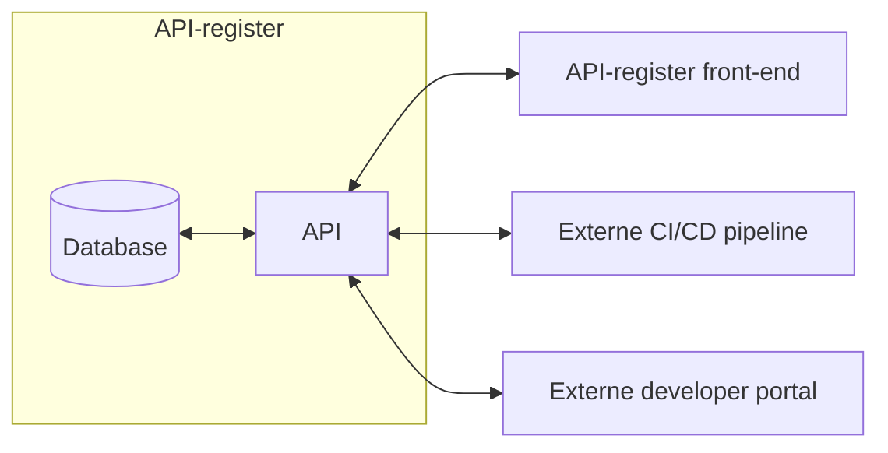
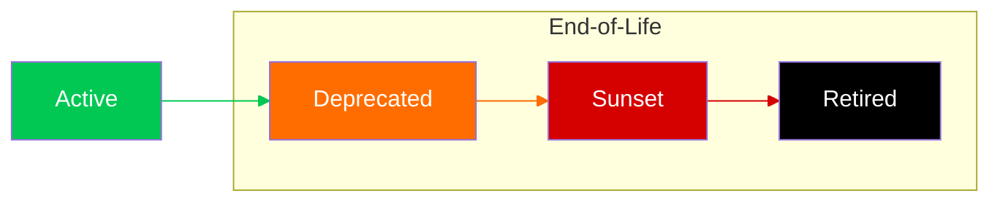

# Het nieuwe API-register: REST-only en OpenAPI-first voor maximale Developer Experience

Het [API-register](https://apis.developer.overheid.nl/apis) krijgt een flinke upgrade. We kiezen bewust voor een REST-only en OpenAPI-first aanpak, zodat we optimaal kunnen profiteren van moderne standaarden en tooling. Dit levert niet alleen voordelen op voor ontwikkelaars, maar zorgt ook voor een eenvoudiger, consistenter en toekomstbestendig register. In deze blog lees je welke keuzes we maken, waarom we daarvoor kiezen en welke nieuwe mogelijkheden het API-register straks biedt.

<!-- truncate -->

## REST-only

Het overgrote deel van het API-register bestaat uit REST/JSON (113) en REST/XML (27) API's. Omdat API's zowel JSON als XML terug kunnen geven, kunnen deze worden samengevoegd tot simpelweg "REST". Daarnaast zijn er enkele OData API's (4), die ondanks hun eigen protocol in essentie RESTful en bovendien goed te beschrijven zijn met een OpenAPI Specification (OAS). Ook deze voegen we dus toe aan het REST-cluster.

### Geoservices

Voor geoservices zien we dat traditionele standaarden als WFS (3) en WMS (1) steeds vaker worden vervangen door [OGC API](https://ogcapi.ogc.org/), dat de voorkeur krijgt boven de oudere services. [PDOK](https://www.pdok.nl/) is bijvoorbeeld bezig om alle geo-datasets als OGC API aan te bieden. Het mooie aan OGC API is dat het volledig RESTful is en dus goed past binnen onze nieuwe aanpak.

### Uitzonderingen

Naast deze dominante groepen zijn er nog enkele uitzonderingen: GraphQL (1), CKAN (1), Atom (1) en Socrata (1). Het flexibel houden van het hele API-register voor deze vier overige typen weegt niet op tegen de voordelen van een REST-only register. Daarom hebben we besloten dat er voorlopig geen plek meer is voor deze enkele uitzonderingen. GraphQL heeft zeker potentie, maar verdient pas een eigen plek als het breder geadopteerd wordt. Tot die tijd houden we ons aan de pas-toe-leg-uit lijst, waarbij REST API's in combinatie met de verplichte standaarden [OAS](https://www.forumstandaardisatie.nl/open-standaarden/openapi-specification) en [REST-API Design Rules (ADR)](https://www.forumstandaardisatie.nl/open-standaarden/rest-api-design-rules) veel kunnen bijdragen aan de Developer Experience van zowel API-consumers als API-providers.

## OpenAPI-first

Omdat alle API's in het nieuwe register met OAS te beschrijven zijn, kunnen we maximaal voordeel halen uit alle tooling die er voor OpenAPI beschikbaar is. Tevens wordt OAS dé bron voor informatie die wij aan kunnen bieden in het register.

Laten we eens kijken wat we van de huidige metadata kunnen verplaatsen naar OAS:

|Eigenschap|OpenAPI equivalent|
|-|-|
|Naam|De naam van een API wordt uitgedrukt in OAS. Het daarvoor bedoelde veld `info.title` is zelfs verplicht binnen de OAS standaard, dus we gaan er vanuit dat deze altijd ingevuld is.|
|Omschrijving|Het veld `info.description` kan gevuld worden met de omschrijving van de API. Deze is weliswaar niet verplicht, maar vanuit het API-register moedigen we wel aan de informatie hierin op te nemen. We sluiten overigens ook niet uit dat dit in een toekomstige versie van ADR wél een verplicht veld wordt.|
|Type|Komt te vervallen. We hebben zojuist geconcludeerd dat het register REST-only wordt.|
|Contact|Momenteel vragen we om optionele contactgegevens (email, telefoon, url), maar vanaf ADR 2.1 is het `info.contact` object van OAS verplicht in te vullen. ADR schrijft voor dat `name`, `email` en `url` worden ingevuld, en wel met relevante informatie. Dus niet het algemene e-mailadres van de klantenservice en de website van de organisatie, maar de contactgegevens van het team dat verantwoordelijk is voor de API met idealiter een link naar bijvoorbeeld een issue tracker om direct issues te kunnen rapporteren.|
|Authenticatie|Net zoals een API zowel XML als JSON terug kan geven, kan een API verschillende endpoints op verschillende manieren beveiligd hebben. In OAS wordt dit uitgedrukt met het `securitySchemes` object, dus die zullen we hier ook voor gaan gebruiken. Saillant detail: vanaf OpenAPI 3.1 wordt ook `mutualTLS` ondersteund.|
|Omgevingen|Momenteel kunnen er (maximaal) drie verschillende endpoints worden opgegeven voor productie, acceptatie en demo. In de praktijk kunnen dit er meer of minder zijn, die mogelijk ook anders heten. OAS heeft hier het `servers` object voor in het leven geroepen.|
|Documentatie-URL|Een link naar functionele documentatie kan in het `externalDocs` object geplaatst worden.|
|Gebruiksvoorwaarden|Uit de statistieken blijkt dat de gebruiksvoorwaarden bijna altijd op de default waarde staan ingesteld. Dat wil bijvoorbeeld zeggen dat iedere API in het register claimt 99,5% beschikbaarheidsgarantie te hebben. Hoewel er in OAS, afgezien van een link naar `termsOfService`, geen manier is om verdere details uit te drukken, is er wel een werkgroep bij [Kennisplatform API's](/communities/kennisplatform-apis/) die dit onderzoekt en wil standaardiseren. Daarom hebben wij besloten aan te haken bij deze werkgroep en te wachten op een gestandaardiseerde manier om SLA's voor overheids API's vast te leggen, die we middels een link vanuit `termsOfService` of mogelijk eigen extensies kunnen opnemen in OAS.|
|Referentie-implementatie|Dit veld geeft momenteel de mogelijkheid om aan te geven op welke referentie-implementatie een API is gebaseerd. Omdat dit nog nooit is ingevuld laten we dit voorlopig achterwege.|

### Koppeling met organisatie

Een belangrijke wijziging ten opzichte van het huidige API-register is de koppeling met de organisatie. Momenteel is de bijbehorende organisatie hard gekoppeld aan het [Register van Overheidsorganisaties (ROO)](https://organisaties.overheid.nl/). Op het moment dat een organisatie, zoals [Gouden API winnaar SURF](https://www.geonovum.nl/nieuws/gouden-api-award-voor-open-onderwijs-api-van-surf), niet in dit register voorkomt, kan deze geen API's toevoegen. Daarnaast is het aanmeldproces momenteel volledig open, wat wil zeggen dat iedereen namens een organisatie API's kan toevoegen. Dit is, net als dat een Gouden API niet in het API-register kan staan, onwenselijk, dus gaan we dit aanpassen.

#### Nieuwe situatie

De identificatie van een organisatie zal voortaan via API credentials gaan. Op deze manier ligt de verantwoordelijkheid van het toevoegen en beheren van een API in het API-register volledig bij de organisatie die de API aanbiedt. Wij zullen deze credentials handmatig gaan uitgeven aan organisaties, waardoor we ook uitzonderingen kunnen maken voor organisaties die wel actief zijn in het publieke domein, maar niet voorkomen in het register van overheidsorganisaties.

#### Koppeling met TOOI

Organisaties die wél voorkomen in ROO zullen we koppelen aan [TOOI](https://standaarden.overheid.nl/tooi) (Thesauri en Ontologieën voor Overheidsinformatie), waar de linked data identifiers voor overheidsorganisaties zijn vastgelegd. Voorbeeld:

1. URI van "Directoraat-generaal Belastingdienst": https://identifier.overheid.nl/tooi/id/oorg/oorg12368.
1. Door deze URI te gebruiken kunnen er eenvoudig links gelegd worden tussen het API-register en andere pagina's; zo kan iemand direct alle API's van een organisatie ophalen zonder onze interne identifiers te weten.
1. Via de TOOI API is er extra informatie over deze organisatie te vinden, zoals `alternatieveNaam` of `afkorting`. Hierdoor kunnen we gewoon "Belastingdienst" tonen in plaats van "Directoraat-generaal Belastingdienst". Resource van de TOOI API: https://api.standaarden.overheid.nl/v1/overheidsorganisaties/https%3A%2F%2Fidentifier.overheid.nl%2Ftooi%2Fid%2Foorg%2Foorg12368.

## API-first

Voor het nieuwe API-register hanteren we een API-first approach. Dit betekent dat de hele applicatie via een API te "bedienen" is, waar we een aparte front-end tegenaan laten praten om het gemakkelijker te maken voor menselijke bezoekers. Deze aanpak maakt het makkelijker om automatische synchronisatie met bijvoorbeeld CI/CD pipelines in te richten, eigen front-ends te bouwen, of het register te integreren in bestaande portals. Als de Belastingdienst of een gemeente een overzicht van al hun API's op hun eigen portals willen tonen, inclusief alle benefits die het API-register biedt, dan kan dat door onze API te raadplegen en te filteren op de betreffende organisatie. Bovendien wordt onze codebase door de scheiding met de front-end kleiner en dus behapbaarder om te delen met andere organisaties die een eigen API-register willen hebben en willen bijdragen aan de codebase.



### API's beheren

Zodra een organisatie API credentials heeft, kan de bovenstaande API gebruikt worden om nieuwe API's toe te voegen of te updaten. Met een eenvoudige `POST` request met de OAS-locatie kan een nieuwe API toegevoegd worden aan het register. Daarna zal het API-register dagelijks checken of er een wijziging in de OAS heeft plaatsgevonden. Als dat zo is wordt het register bijgewerkt met de laatste informatie en wordt de ADR-score opnieuw bepaald.

#### API updaten

Uiteraard is het ook mogelijk om een wijziging te forceren door een `PUT` request met de OAS-locatie naar de API te sturen. Hiermee wordt het register direct bijgewerkt en wordt ook de ADR-score opnieuw bepaald.

#### API verwijderen

Mocht er per abuis een verkeerde API in het register terecht komen, dan kunnen wij deze op verzoek verwijderen. Het is echter niet mogelijk om een API geautomatiseerd te verwijderen uit het register. Reden hiervoor is dat het "verwijderen" van een API eigenlijk een wijziging is in de API-lifecycle; als een API uitgefaseerd wordt is dit vaak omdat er een (nieuw) alternatief is, zoals een nieuwe versie. Bestaande gebruikers van de API zijn hier niet altijd van op de hoogte en willen graag weten of de API uit de lucht is, of dat het aan hen ligt dat ze geen response meer krijgen. Een API die niet meer beschikbaar is zal door ons behandeld worden als *Retired*, en met die status vindbaar blijven in het API-register.

## API-lifecycle status

Eén van de nieuwe features is dus het communiceren van de API-lifecycle status. Hoewel de volledige API-lifecycle vaak begint met design, development, validation, evaluation, etc. focussen we hier op de zogenaamde *end-of-life-phase*:



- **Active**: de API is actief en volledig operationeel.
- **Deprecated**: de API is verouderd en wordt niet doorontwikkeld. Support is beperkt, maar alles werkt nog naar behoren. Meestal gaat dit gepaard met een nieuwe versie van de API die op dat moment *Active* is.
- **Sunset**: de API wordt uit de lucht gehaald, het advies is om zo snel mogelijk een alternatief te implementeren. Na de *Sunset* datum zal de API uit de lucht gehaald worden en *Retired* worden.
- **Retired**: de API is offline en derhalve niet meer operationeel.

### Uitdrukken in OAS

Omdat er nog [altijd geen consensus is](https://github.com/Geonovum/KP-APIs/issues/649) over hoe we dit standaardiseren in de Nederlandse API strategie, introduceren we speciaal voor het API-register een nieuwe OAS extensie. Met de velden `info.x-deprecated` en `info.x-sunset` weten wij in welke fase van de API-lifecycle de API zich bevindt:

```yaml
openapi: 3.0.3
info:
  version: 1.2.3
  x-deprecated: 2025-10-10 # toekomst of verleden
  x-sunset: 2027-11-11     # altijd in de toekomst
```

- **x-sunset**: indien afwezig dan is de API *Active* of *Deprecated*. Indien aanwezig dan is dit de datum dat de API offline gehaald zal worden.
- **x-deprecated**: indien afwezig dan is de API *Active* of *Sunset*. Indien aanwezig dan is dit de datum vanaf wanneer de API *Deprecated* is of zal worden.

## Nieuwe features

Naast het tonen van API-lifecycle informatie staan de volgende nieuwe en gewijzigde features op de planning.

### Abonneren op API

Door te abonneren op een API kunnen we gebruikers of andere geïnteresseerden op de hoogte houden van wijzigingen aan de API. Zo kunnen we direct communiceren dat er een wijziging aan de API-lifecycle is gedetecteerd, dat er nieuwe functionaliteit is toegevoegd, etc. Ook voor API providers kan dit inzicht geven in het gebruik van/interesse in hun API's.

### Integratie discourse forum

We gaan het discourse forum integreren zodat elke API een eigen topic heeft waar consumers en providers met elkaar in gesprek kunnen over de betreffende API. Denk hierbij aan vragen, opmerkingen, downtime, gepland onderhoud, etc.

### OpenAPI 3.1 ondersteuning

Hoewel OpenAPI 3.1 nog niet op de pas-toe-leg-uit lijst staat, zullen we de momenteel verplichte 3.0.x variant automatisch converteren naar een 3.1 versie. Op die manier kunnen we nog meer OpenAPI tooling gebruiken om de Developer Experience zo hoog mogelijk te maken. Zo kunnen we tijdens het omzetten ook JSON Schema's extraheren en hieruit Typescript types, Java classes, etc. genereren.

### Software Development Kits (SDK's)

Andere code die we automatisch kunnen genereren zijn SDK's. Dit zijn stukjes code in verschillende programmeertalen, die ontwikkelaars in hun eigen applicatie kunnen implementeren om eenvoudig met de API te communiceren.

Naast SDK's voor clients zijn er ook voor verschillende programmeertalen generators beschikbaar om op basis van OAS een complete API te genereren. De business-logic en de koppeling met de database etc. zul je dan zelf nog moeten toevoegen, maar de basis applicatie met o.a. routering naar de verschillende API operaties kunnen we hiermee op een presenteerblaadje aanleveren.

Uiteindelijk willen we toe naar een eigen generator, waarmee we op dezelfde wijze een volledig ADR-compliant API applicatie kunnen genereren en eventueel automatisch (inclusief een valide [publiccode.yaml](/kennisbank/open-source/standaarden/publiccode-yml) bestand) in een repository kunnen plaatsen.

### Mocking

Als de OAS goedgevulde `example` velden heeft, kunnen we automatisch mock data of services aanbieden. Dit maakt het mogelijk om de API eenvoudig uit te proberen op een nep-endpoint met nep-data. Vanaf OpenAPI 3.1 wordt het bovendien mogelijk om meerdere `examples` toe te voegen, wat een realistischer beeld van de echte API responses kan geven.

### Thema's

Om API's beter vindbaar te maken gaan we de mogelijkheid bieden om ze te koppelen aan thema's. Hierbij sluiten we aan bij de thema's uit TOOI, die ook op [data.overheid.nl](https://data.overheid.nl) gebruikt worden.

### Front-end beschikbaar als (web)components

De front-end van het nieuwe API-register zal worden opgebouwd door middel van verschillende herbruikbare componenten. Deze componenten zullen voldoen aan de toegankelijkheidseisen, en zijn gezamenlijk of los inzetbaar. Bijvoorbeeld om zelf een ADR-compatible OAS te renderen of een complete whitelabel van het API-register aan te kunnen bieden.

### ADR-scores

De ADR-scores, die de mate van ADR compliancy weergeven, zullen berekend worden door middel van de generieke engine die we aan het ontwikkelen zijn voor o.a. de [OAS Checker](https://github.com/developer-overheid-nl/oas-checker). Afwijkingen aan het API design worden gedetecteerd en opgevolgd met "How-to-fix" links. Als `info.contact` netjes is ingevuld, kunnen wij de providers automatisch een mail sturen dat er een afwijking is gevonden én hoe het opgelost kan worden. We willen de checker doorontwikkelen om niet alleen fouten te detecteren, maar ook al correcties door te voeren in het OAS document. Hiermee kunnen we automatisch een diff genereren waar de afwijkingen al uit zijn gehaald.

### Groeperen van API's

Het wordt mogelijk om verschillende API's te groeperen, zodat samenhangende API's in één oogopslag zichtbaar zijn. Dit is handig voor bijvoorbeeld hackathons en fieldlabs, maar ook voor ketens waarin verschillende API's samenwerken. Denk hierbij aan API's van het Digitaal Stelsel Omgevingswet (DSO), waarbij output van de ene API als input dient voor de andere in het proces om een vergunning aan te vragen. Met [Arazzo](https://www.openapis.org/arazzo-specification), een nieuwe standaard van het OpenAPI Initiative, kan de samenhang tussen API's op een gestandaardiseerde manier beschreven worden. Zodra er Arazzo tooling beschikbaar is zullen we dit uiteraard ook gaan ondersteunen.

## Het nieuwe API-register uitproberen?

Momenteel zijn we volop bezig met de ontwikkeling van het nieuwe API-register. Om dit goed te kunnen testen zijn we op zoek naar organisaties die wij aan kunnen sluiten op onze testomgeving. De gemeente Amsterdam doet al mee, maar het zou mooi zijn als we meer testcases hebben. Interesse om samen met ons het volgende API-register uit te proberen? Laat het weten in de comments of stuur een mailtje naar [developer.overheid@geonovum.nl](mailto:developer.overheid@geonovum.nl)!
