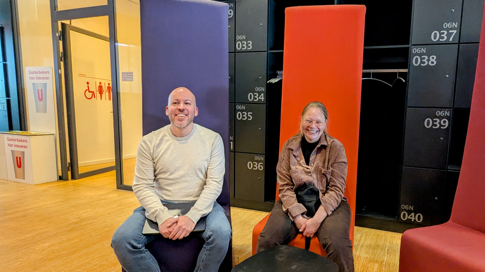
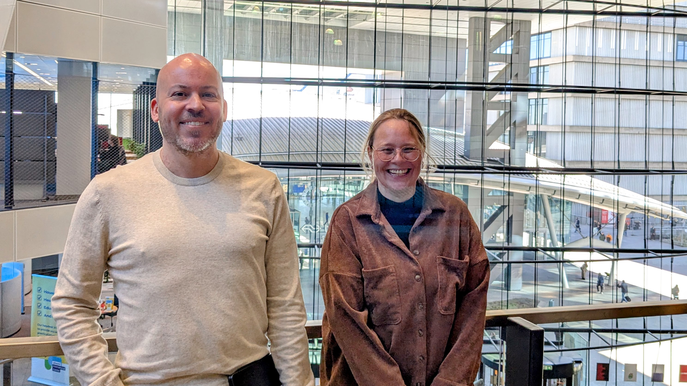

import { Blockquote } from "@rijkshuisstijl-community/components-react";

# Het team achter Haven+: "Onze exit-strategie weg van Big Tech"

Werk jij in de publieke sector aan IT en ben je benieuwd hoe je concreet kan toewerken naar digitale soevereiniteit? In dit interview met **Pauline van Rotterdam** en **Sander van Thillo** van team [Haven](/kennisbank/infra/standaarden/haven), kom je er achter hoe je [Haven+](/kennisbank/infra/standaarden/haven/haven-plus) gebruikt om minder afhankelijk te worden van Big Tech bedrijven als Microsoft (Azure) en Amazon (AWS).

<!-- truncate -->

:::success[**TL;DR**]

- Haven+ toont aan dat Nederlandse overheidsinstellingen niet afhankelijk hoeven te blijven van Amerikaanse hyperscalers. Door open source technologie, best practices uit de CNCF-community en Nederlandse innovatie te combineren, ontstaat een platform dat zowel vendor lock-in voorkomt als de snelheid van cloud-native development mogelijk maakt.
- Met Haven+ heb je een set aan services tot je beschikking om af te komen van de services van Azure/ AWS. Met bewezen implementaties bij gemeente Utrecht en groeiende adoptie door andere organisaties, bewijst Haven+ dat digitale soevereiniteit niet ten koste hoeft te gaan kwaliteit en snelheid.

:::

## Introductie

### **Pauline van Rotterdam**
 heeft sinds 2008 een carrière in de IT-Operations. Ze begon bij een hosting provider waar ze verschillende rollen vervulde en uiteindelijk solution-architect en projectmanager werd. Sinds 2016 raakte ze begeistert door Kubernetes en leidde ze de productontwikkeling van Managed Kubernetes bij de eerder genoemde hosting provider.

#### Technisch Product Owner
Nu werkt ze als technisch product owner bij de gemeente Utrecht, waar ze zich ontfermt over de infrastructuur voor Common Ground - specifiek de Haven-clusters. In haar rol combineert ze twee werelden: aan de ene kant het technische aspect waarin ze nadenkt over de randvoorwaarden die infrastructuur moet hebben, aan de andere kant is ze bezig met productmanagement. Dus met prioriteren en het scherp houden van de langetermijnvisie.

### Sander van Thillo
heeft een gemengde achtergrond die begon met een studie scheikunde, waar hij ook leerde programmeren. Na de beslissing om niet verder te gaan in de scheikunde, rolde hij de IT in. Deed daar verschillende dingen: van websites ontwikkelen tot applicatie developer. Hij maakte carrière bij KPN Telfort als software architect en werd uiteindelijk zelfs enterprise architect.

#### Van developer naar DevOps en infra
De startup-wereld trok hem aan, waar hij als software developer begon. Na een periode als freelancer, waarin hij vooral in de commerciële wereld werkte - waaronder een grote cloud migratie bij Mollie - kwam hij via een goede vriend terecht bij team Haven.

#### DevOps engineer bij Haven
Nu heeft Sander een veelzijdige rol: hij werkt als DevOps-engineer aan de Common Ground clusters waar meerdere projecten op draaien, en werkt daarnaast aan Digilab (de proeftuin van BZK). Namens beide teams werkt hij aan het Haven+ project.

---

## Van Utrecht naar landelijke standaard

Het verhaal van Haven+ begint bij de gemeente Utrecht, die op het gebied van infrastructuur een voorsprong had opgebouwd ten opzichte van andere gemeenten. "Al die gemeenten kwamen bij ons aankloppen. Hoi gemeente Utrecht, hoe hebben jullie dat gedaan? Hoe doe je dat? Wat voor keuzes maak je erin? Waarom?" vertelt Pauline. 

Deze stroom van vragen, gecombineerd met de observatie dat andere gemeenten moeite hadden om goed uit de startblokken te komen, leidde tot het voorstel om bij Digilab een project te starten om de Utrecht-aanpak tot een landelijke standaard op te werken. Dit is het project dat uiteindelijk [Haven+](/kennisbank/infra/standaarden/haven/haven-plus) is geworden.

*Sander van Thillo en Pauline van Rotterdam van Team Haven in het Stadskantoor in Utrecht.*

## Wat is Haven+?

Haven+ is de tussenlaag die het gat opvult tussen de basis-infrastructuur en de applicatie zelf. Deze tussenlaag bestaat uit een set aan componenten die een aantal problemen voor je oplost.

Sander legt het helder uit: "Als jij een applicatie in de cloud wil hebben, dan is de onderste laag een Kubernetes cluster. Maar daartussen heb je nog heel veel services nodig als je die applicatie wilt kunnen neerzetten."

De Haven-standaard zorgt voor een compliant Kubernetes cluster, maar Haven+ voegt daar essentiële services aan toe:

- **Observability stack**: logging, monitoring en metrics
- **Security**: certificaatmanagement, secret management, identity management, monitoring
- **Networking**: DNS-beheer, ingress en traffic management
- **Data management**: database services en backup-oplossingen
- **Development tools**: release management en deployment automation

"Het is dus heel breed. Al deze services hebben hun eigen taak in een cluster, maar met Haven+ bepaal je dus ook hóé je deze zaken inregelt," benadrukt Pauline.

## Het wiel dat al is uitgevonden

Een concreet voorbeeld illustreert de waarde van Haven+ voor ontwikkelteams. Wanneer een developer een Python applicatie wil uitrollen en netjes logging heeft geregeld via een library, ontstaat al snel de vraag: hoe krijg ik die logs vanuit mijn app naar bijvoorbeeld Grafana?

"Voor die vraagstukken hebben wij een kant-en-klare oplossing. Het aggregeren van je logs en het vervolgens inzichtelijk maken daarvan, die tooling krijg je met de Haven+ componenten," legt Sander uit. "Dan heb je dat dus al, dus hoef je dat niet nog een keertje zelf uit te vinden, dat wiel."
Dit bespaart teams aanzienlijke tijd en expertise. "Waarschijnlijk was je op hetzelfde uitgekomen. Alleen dan had je dat weer een paar weken gekost. Misschien heb je de expertise niet in je team om dat in het cluster te deployen. Want dat is vaak meer een systeembeheeractiviteit. En wij hebben dat nu al voor je uitgevonden," aldus Sander.

Sander benadrukt daarbij: "Het is overigens niet dat wij hier hele nieuwe dingen aan het doen zijn. We pakken de best practices die er zijn, die we kennen vanuit de CNCF, plus de ervaring die we hebben."

<Blockquote
  attribution=" — Sander, DevOps Engineer Team Haven"
  variation="pink-background">
"Het is overigens niet dat wij hier hele nieuwe dingen aan het doen zijn. We pakken de best practices die er zijn, die we kennen vanuit de CNCF, plus de ervaring die we hebben."
</Blockquote>

### Praktische voordelen

De voordelen van Haven+ manifesteren zich op verschillende niveaus:

**Voor gemeenten**: Delta 10, een bekende Common Ground leverancier, kan met de Haven-tooling binnen een paar dagen clusters optuigen. Dit hebben ze bijvoorbeeld gedaan bij een gemeente zoals Den Bosch. "En zelfs binnen één dag is het gewoon prima mogelijk neer te zetten," aldus Pauline.

**Voor inkopers**: De Haven standaard biedt ook een fijn referentiekader voor inkopers. In een offerte kan bijvoorbeeld worden aangegeven dat een applicatie moet kunnen landen op een Haven cluster. Ook kan bij het offreren van clusters aangegeven worden dat de wens een Haven-compliant Kubernetes cluster is.

**Voor leveranciers**: De standaard elimineert veel uitzoekwerk. "Er zit heel veel uitzoekwerk in. Platform specifieke dingen zitten er al in. Zo hoef je dat niet zelf een keertje uit te vinden," legt Sander uit.

**Voor applicatieteams**: Ontwikkelaars hoeven alleen maar na te denken over hun applicatie, niet over de onderliggende infrastructuur. "Want alle andere randvoorwaarden, die hoeven ze dan niet opnieuw zelf uit te vinden," benadrukt Sander.

## Randvoorwaarde: containerized applicaties

Een randvoorwaarde om applicaties te laten landen op een Haven cluster is dat ze containerized zijn opgezet en dat de codebase Helm-charts bevat. Je bent dan al op het niveau dat je deze applicatie gemakkelijk met de hand zou kunnen opzetten. Haven helpt je om je release-management naar een hoger niveau te tillen.

Hierover zegt Pauline: "Haven is volledig infra-as-code opgezet, zo zorgen we ervoor dat de uitrol van applicaties automatisch gaat. Door hierin een standaard te zetten helpen we je bij het automatisch uitrollen van je applicaties op een cluster."

## Nederlandse cloud-onafhankelijkheid

Een cruciaal aspect van Haven+ is het bieden van een exit-strategie van Amerikaanse hyperscalers. "Het is een volledige exit strategie," stelt Pauline. Door die extra abstractielaag is de discussie weg van: “ja maar die cloud provider of hyperscaler biedt nog die functionaliteit”. Dat hebben we allemaal niet meer nodig. "We zitten in een agnostisch ecosysteem en de componenten die wij aanbieden kan je kwijt op elk Haven-compliant Kubernetes cluster."

Er zijn al Nederlandse alternatieven beschikbaar. Previder is bijvoorbeeld Haven-compliant en staat in het lijstje met de grote hyperscalers als alternatief die je een compliant cluster in Nederland kan bieden, volgens Europese regelgeving. "Er staat niks in de weg om hier direct mee aan de slag te gaan," concludeert Sander.

<Blockquote
  attribution=" — Pauline, Technisch Product Owner gemeente Utrecht"
  variation="pink-background">
"Het is een volledige exit strategie. Door die extra abstractielaag is de discussie weg van: “ja maar die cloud provider of hyperscaler biedt nog die functionaliteit”. Dat hebben we allemaal niet meer nodig."
</Blockquote>

## Common Ground applicaties in productie

Haven+ is geen theoretisch project - er draaien al diverse Common Ground applicaties op Haven-clusters:

- **OpenZaak**: De complete ZGW-stack (Zakengericht Werken)
- **Signalen**: Het bekende open source project voor meldingen
- **Open Formulieren**: Voor digitale formulieren
- **Atlas**: Geografische applicaties
- **G-Zac**: Zaakafhandel componenten

Bij gemeente Utrecht zorgt Pauline dat alles wat wordt ge-onboard op een Haven-cluster terecht komt. "Alles wat wij onboarden staat op een havencluster," bevestigt ze.

*Sander van Thillo en Pauline van Rotterdam van Team Haven in het Stadskantoor in Utrecht.*

## Security en monitoring

Haven+ neemt security serieus met een gelaagde aanpak:

- **Container security**: Tools zoals Trivy voor container image scanning en runtime monitoring.
- **Intrusion detection**: Falco voor het detecteren van anomalieën in gebruik en verkeer.
- **Policy enforcement**: Automatische controles die voorkomen dat non-compliant containers überhaupt landen op het cluster.

"Je gaat veel vaker monitoren als je je infra goed opzet. Je doet dit dan gedurende de hele life cycle van een applicatie," legt Pauline uit. Dit gebeurt tijdens ontwikkeling, release én tijdens de runtime van applicaties.

## Uitdagingen en toekomst

Het grootste knelpunt voor Haven+ is momenteel tijd. "Het grootste probleem zit nu gewoon in tijd. Omdat we het er allemaal wel bij doen," erkent Pauline. Zowel zij als Sander hebben primair andere rollen en werken aan Haven+ op best-effort basis.

Er zijn wel ontwikkelingen gaande binnen GDI (Generieke Digitale Infrastructuur) om het project mogelijk te adopteren, wat zou zorgen voor meer structurele financiering en resources.

Voor hosting providers zou het aanbieden van Haven-compliance geen grote stap zijn. "Voor de meeste providers zou het niet een hele grote stap zijn om daar ook te komen," stelt Pauline. Het team praat ook actief met de Dutch Cloud Community om deze stap te zetten.

## Conclusie

Haven+ toont aan dat Nederlandse overheidsinstellingen niet afhankelijk hoeven te blijven van Amerikaanse hyperscalers. Door open source technologie, best practices uit de CNCF-community en Nederlandse innovatie te combineren, ontstaat een platform dat zowel vendor lock-in voorkomt als de snelheid van cloud-native development mogelijk maakt.

Met Haven+ heb je een set aan services tot je beschikking om af te komen van de services van Azure/ AWS. Met bewezen implementaties bij gemeente Utrecht en groeiende adoptie door andere organisaties, bewijst Haven+ dat digitale soevereiniteit niet ten koste hoeft te gaan kwaliteit en snelheid.

"We pakken de best practices die er zijn, die we kennen vanuit de CNCF, plus de ervaring die we hebben van wat ook echt goed werkt," vat Sander de werkwijze samen.