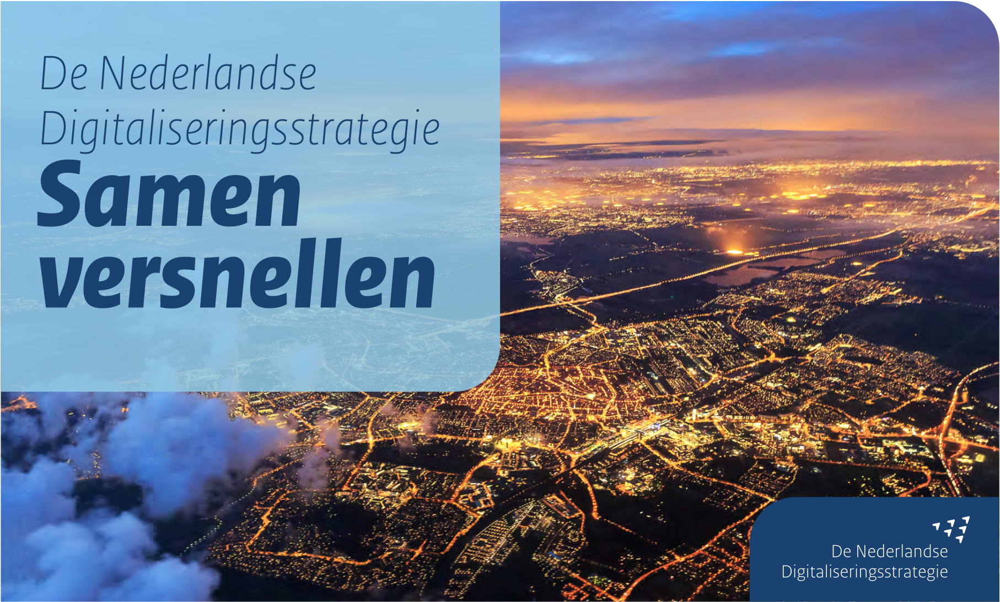

import { Blockquote } from "@rijkshuisstijl-community/components-react";

# De gevolgen van de Nederlandse Digitaliseringsstrategie (NDS) voor developers

*Cover van de gepubliceerde Nederlandse Digitaliseringsstrategie (NDS)*

> Nederland staat voor grote maatschappelijke opgaven in een sterk veranderende omgeving – en digitalisering is één van de belangrijkste sleutels tot oplossingen. Daarom is investeren in onze digitale basis urgent en belangrijk voor Nederland en de grote opgaven waar de samenleving voor staat. De overheid is één van de grootste afnemers van digitale diensten en daarmee tegelijkertijd aanjager van digitale ontwikkelingen die essentieel zijn voor een weerbare samenleving en een welvarende, toekomstgerichte en productieve economie.

Althans, zo staat het omschreven in de [recent gepubliceerde NDS](https://open.overheid.nl/documenten/51bf0136-69cc-4d37-90c9-64d7ed3d9a5c/file). De Nederlandse Digitaliseringsstrategie (NDS) is een overheidsbrede strategie met zes prioriteiten om alle overheidsorganisaties als één overheid te laten samenwerken.

In deze blogpost werken we verder uit wat de NDS precies is, en wat de genoemde zes prioriteiten voor gevolgen zullen hebben voor IT-professionals binnen de overheid.

<!-- truncate -->

## Wat is de NDS?

De NDS is één van de pijlers van het kabinetsbeleid op digitalisering. De NDS vormt samen met de Strategie Digitale Economie en de Nederlandse Cybersecurity Strategie (NLCS) het fundament van het digitaliseringsbeleid van het kabinet. Het kabinetsbeleid kent de volgende uitgangspunten:

- *Nederland moet de kansen die digitalisering biedt pakken. Met de NDS moeten we vernieuwen en blijven **investeren in ons digitaal fundament** om onze grote maatschappelijke opgaven in bijvoorbeeld de zorg, ruimtelijke ordening en arbeidsmarkt te laten slagen.*
- *Nederland focust (samen met de EU) op de eigen **strategische autonomie**, ook in de digitale wereld. Dat betekent niet dat we alles zelf gaan doen, maar wel dat we onze kritieke processen en gegevens beter onder controle krijgen.*
- *Nederland zoekt intensiever de **samenwerking met het bedrijfsleven**, de wetenschap en kennisinstituten om de digitale economie en overheid op elkaar aan te sluiten en samen te werken aan de doelen van de NDS.*
- *Nederland zal waar nodig bestaande **overheidsprocessen herontwerpen** om de kansen van digitalisering volledig te benutten; in plaats van papieren processen digitaal te maken. Hierbij hoort ook de transitie om echt datagedreven te gaan werken als één overheid.*

Kortom, vernieuwen, blijven investeren, focus op strategische autonomie, samenwerken, processen herontwerpen en datagedreven werken als één overheid.

<Blockquote
  variation="pink-background"
  attribution="— Uit NDS"
>
Afgesproken is dat de Rijksoverheid, provincies, gemeenten, waterschappen en publieke dienstverleners als één overheid gaan werken aan zes met elkaar samenhangende prioriteiten om daarop te versnellen.
</Blockquote>

## De zes prioriteiten

1. **Cloudtechnologie**  
We werken aan [soevereine clouddiensten](https://developer.overheid.nl/blog/tags/digitale-autonomie) en een centrale overheidsmarktplaats voor cloudtechnologieën om publieke data veilig en gezamenlijk te beheren op basis van standaarden en Europese ervaringen. [externe link](https://www.digitaleoverheid.nl/nederlandse-digitaliseringsstrategie-nds/6-prioriteiten-voor-een-overheid/prioriteit-1-cloud/)

2. **Data delen**  
We werken overheidsbreed datagedreven via een [federatief datastelsel](https://developer.overheid.nl/communities/federatief-datastelsel) met bindende afspraken, om data verantwoord te delen en knelpunten collectief op te lossen. [externe link](https://www.digitaleoverheid.nl/nederlandse-digitaliseringsstrategie-nds/6-prioriteiten-voor-een-overheid/prioriteit-2-data/)

3. **AI**  
We benutten [AI](https://developer.overheid.nl/blog/tags/ai) op verantwoorde wijze door een centrale regieaanpak, gedeelde infrastructuur en inzet van open taalmodellen voor maatschappelijke en dienstverleningsdoelen. [externe link](https://www.digitaleoverheid.nl/nederlandse-digitaliseringsstrategie-nds/6-prioriteiten-voor-een-overheid/prioriteit-3-artificiele-intelligentie/)

4. **Burgers en ondernemers centraal**  
We zorgen dat burgers en ondernemers de overheid als één geheel ervaren, met proactieve, toegankelijke en afgestemde [dienstverlening op basis van hun behoeften](https://developer.overheid.nl/kennisbank/leidraad/behoefte-gebruiker/). [externe link](https://www.digitaleoverheid.nl/nederlandse-digitaliseringsstrategie-nds/6-prioriteiten-voor-een-overheid/prioriteit-4-de-overheid-stelt-burgers-en-ondernemers-centraal-in-digitale-dienstverlening/)

5. **Weerbaarheid en autonomie**  
We versterken onze digitale weerbaarheid en autonomie met gezamenlijke [security](https://developer.overheid.nl/kennisbank/security/), minder afhankelijkheid van leveranciers en voorbereiding op digitale crisissituaties. [externe link](https://www.digitaleoverheid.nl/nederlandse-digitaliseringsstrategie-nds/6-prioriteiten-voor-een-overheid/prioriteit-5-versterken-digitale-weerbaarheid-en-autonomie-van-de-overheid/)

6. **Digitaal vakmanschap**  
We investeren in digitaliseringskennis en moderne werkomgevingen voor ambtenaren, zodat zij effectief en datagedreven kunnen werken binnen een gedeelde digitale overheid. [externe link](https://www.digitaleoverheid.nl/nederlandse-digitaliseringsstrategie-nds/6-prioriteiten-voor-een-overheid/prioriteit-6-digitaal-vakmanschap-en-een-moderne-werkomgeving/)

<Blockquote
  variation="pink-background"
  attribution="— Uit NDS"
>
De kracht van de NDS zit in het centraal afspreken en decentraal uitvoeren. Geen vrijblijvendheid meer. De overheid kiest voor collectieve standaarden, architectuurprincipes en een gemeenschappelijk uitvoeringsprogramma. 

</Blockquote>

## Aan de slag
Hoe kan je als developer nu al concreet invulling geven aan de digitaliseringstrategie?

### 📑 Adopteer standaarden
Adopteer de standaarden van projecten zoals [Haven plus](https://developer.overheid.nl/kennisbank/infra/standaarden/haven/) (VNG), [SURFCumulus](https://www.surf.nl/en/services/procurement-distribution/surfcumulus) (SURF).

### 🤝 Zoek de samenwerking op
Zoek de samenwerking op en draag bij aan de [overheidsbrede herbruikbare bouwstenen](https://oss.developer.overheid.nl/). Een interessant voorbeeld hiervan is het [MijnServices](https://vng.nl/omnichannel) project, die een ecosysteem aanbiedt van services die je aan elkaar kunt knopen.

### 🔮 LLM's
Ga gezamenlijk aan de slag om AI te ontwikkelen en gebruik [GPT-NL](https://gpt-nl.nl/) (of andere open taalmodellen).

### 🎨 Hergebruik overheidsbrede ontwerpprincipes
Hergebruik overheidsbrede ontwerpprincipes, bijvoorbeeld het [NL Design System](https://developer.overheid.nl/kennisbank/front-end/nl-design-system/).

### 🔗 Ontwerp organisatie-overstijgend
Zorg dat als je systemen gaat ontwerpen je organisatie-overstijgend denkt. Applicaties worden bruikbaarder voor de burger als verschillende organisaties samen werken om gezamenlijk hun informatie/ data aanbieden. Een mooi voorbeeld van een project dat op deze manier werkt is Vorderingen Overzicht Rijk. Lees het blog over [hoe VO Rijk dit precies doet](https://developer.overheid.nl/blog/2025/04/17/interview-vorijk). 

### 🏗️ Doorontwikkeling overheidsbrede portalen
Focus op de doorontwikkeling van de Generieke Digitale Infrastructuur-portalen en overheidsbreed gebruikte interactiediensten. [Volg hierbij onze leidraad](https://developer.overheid.nl/kennisbank/leidraad/).

### 🛡️ Security, ga monitoren 
Houd rekening met cyberveiligheidsbouwstenen zoals [quantumveilige encryptie](https://www.ncsc.nl/documenten/publicaties/2023/november/8/factsheet-postquantumcryptografie) van verbindingen en data.

### 🔌 Deel je API's
Vergeet niet je API's te delen op het centrale [API Register van Developer.overheid.nl](https://apis.developer.overheid.nl/apis).

### Verder lezen?

- [het rapport “Maak Waar!” van de Studiegroep Informatiesamenleving en overheid](https://www.kennisopenbaarbestuur.nl/documenten/rapporten/2017/04/18/maak-waar)
- [Europa’s digitale decennium: doelstellingen voor 2030](https://commission.europa.eu/strategy-and-policy/priorities-2019-2024/europe-fit-digital-age/europes-digital-decade-digital-targets-2030_nl)
- [Online versie van de Strategie op digitaleoverheid.nl](https://www.digitaleoverheid.nl/nederlandse-digitaliseringsstrategie-nds/)
- [Tijdlijn totstandkoming Nederlandse Digitaliseringsstrategie (NDS)](https://www.digitaleoverheid.nl/nederlandse-digitaliseringsstrategie-nds/tijdlijn-nds/)

