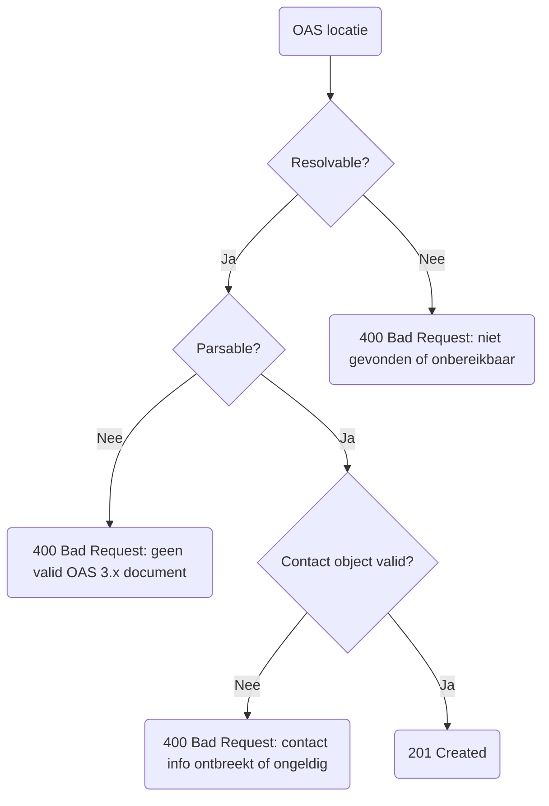
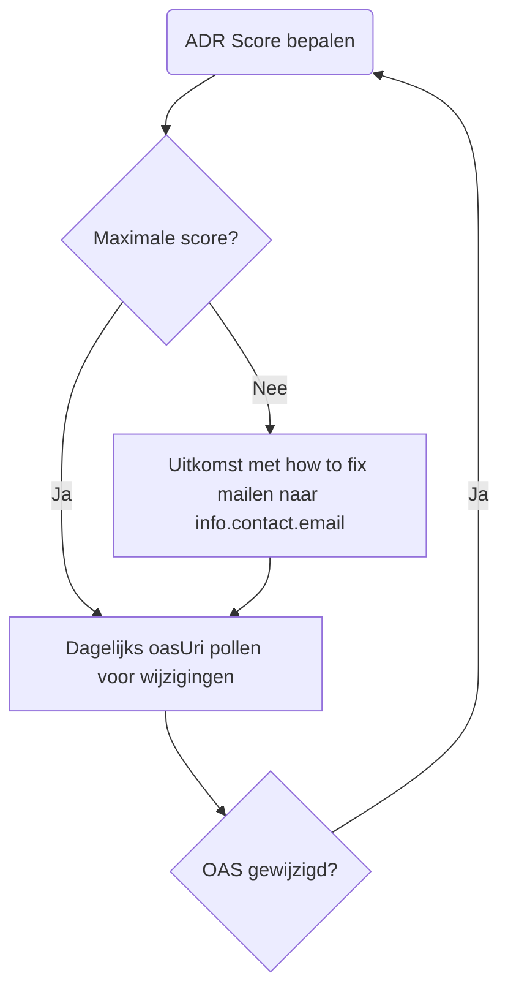

# Nieuwe aanleverprocedure

Zoals gezegd kunnen API's straks alleen nog worden toegevoegd middels onze eigen API. Nadat een organisatie credentials heeft ontvangen kunnen er calls gemaakt worden naar onze API. Omdat het OpenAPI-first is, zouden we genoeg moeten hebben aan alleen de OAS locatie. Een API toevoegen zou dan als volgt moeten gaan:
<!-- truncate -->
<details>
  <summary>Vervolgens zal de API de volgende beslisboom volgen:</summary>


</details>

- Als de URL niet resolvable is kunnen we er niks mee. Het `openapi.json` bestand móet open beschikbaar zijn.
- Als het `openapi.json` niet parsable is kunnen we er ook niks mee. Hiervoor kijken we of het een valide OpenAPI 3.0.x bestand is. Zitten hier fouten in of is het een andere type bestand zoals Swagger (OpenAPI 2.0.x) of een PDF, dan zullen we een foutmelding teruggeven.
- Als het `info.contact` object niet (correct) is ingevuld, zal er eveneens een foutmelding terugkomen. Een correct `info.contact` object bevat een `name`, geldige `url` en een geleid `email`-adres.

import Tabs from "@theme/Tabs";
import TabItem from "@theme/TabItem";

<Tabs>
  <TabItem value="request" label="POST request">

    ```json
    // POST https://api.developer.overheid.nl/api-register/v1/apis HTTP/1.1
    // Content-Type: application/json

    {
      "oasUri": "https://api.standaarden.overheid.nl/v1/openapi.json"
    }
    ```
  </TabItem>
  <TabItem value="400" label="400 Bad Request response">

  ```json title="HTTP/1.1 400 Bad Request; Content-Type: application/problem+json"
  // HTTP/1.1 400 Bad Request
  // Content-Type: application/problem+json

  {
    "type": "https://apis.developer.overheid.nl/12345/spec#400",
    "title": "Bad Request",
    "status": 400,
    "detail": "Contact info kan niet uit OAS gehaald worden",
    "invalidParams": [
      {
        "name": "contact.name",
        "reason": "Ontbreekt"
      },
      {
        "name": "contact.email",
        "reason": "Ontbreekt"
      },
      {
        "name": "contact.url",
        "reason": "Ontbreekt"
      },
    ]
  }
  ```
  </TabItem>
  <TabItem value="pogin2" label="Post poging 2">
  Omdat `info.contact` pas verplicht is vanaf ADR 2.1 bieden we de mogelijkheid om deze informatie bij de initiële request alsnog mee te sturen:

```json
// POST https://api.developer.overheid.nl/api-register/v1/apis HTTP/1.1
// Content-Type: application/json

{
  "oasUri": "https://api.standaarden.overheid.nl/v1/openapi.json",
  "contact": {
    "name": "DON API Team",
    "email": "developer.overheid@geonovum.nl",
    "url": "https://github.com/developer-overheid-nl/issues"
  }
}
```
  </TabItem>
  <TabItem value="201" label="201 Created response">


    ```json
    // HTTP/1.1 201 Created
    // Content-Type: application/json
    // Location: https://api.developer.overheid.nl/apis/12345

    {
      "id": "12345",
      "oasUri": "https://api.standaarden.overheid.nl/v1/openapi.json",
      "title": "DON API",
      "description": "Dit is de DON API",
      "contact": {
        "name": "DON API Team",
        "email": "developer.overheid@geonovum.nl",
        "url": "https://github.com/developer-overheid-nl/issues"
      }
      "adrScore": null
    }
    ```
  </TabItem>
</Tabs>


Zodra de API succesvol is toevoegd geven we een `201 Created` terug:


Merk op dat de `adrScore` (de score van de API Design Rules) hier `null` is. Dit komt omdat de initiële validatie in een asynchroon proces afgetrapt wordt. Dit gebeurt er na het toevoegen van een API:



### Wijziging forceren

```json
// PUT https://api.developer.overheid.nl/apis/12345 HTTP/1.1
// Content-Type: application/json

{
  "oasUri": "https://api.standaarden.overheid.nl/v1/openapi.json",
}
```

## `oasUri` is unieke identifier van de API

- `oasUri` bevat het endpoint inclusief major version (ADR `/core/publish-openapi`)
- `oasUri` wijzigen: nieuwe API toevoegen en oude API verwijderen

## Uit de wandelgangen

- Veel problemen met publiek toegankelijk maken `/openapi.json`
- Alternatief: `servers` verplicht stellen:

```yaml
openapi: 3.0.3
info:
  servers:
    - title: "Productie"
      url: "https://api.developer.overheid.nl/api-register/apis/v1"
      default: true
    - title: "Testomgeving"
      url: "https://test.api.developer.overheid.nl/api-register/apis/v1"
```