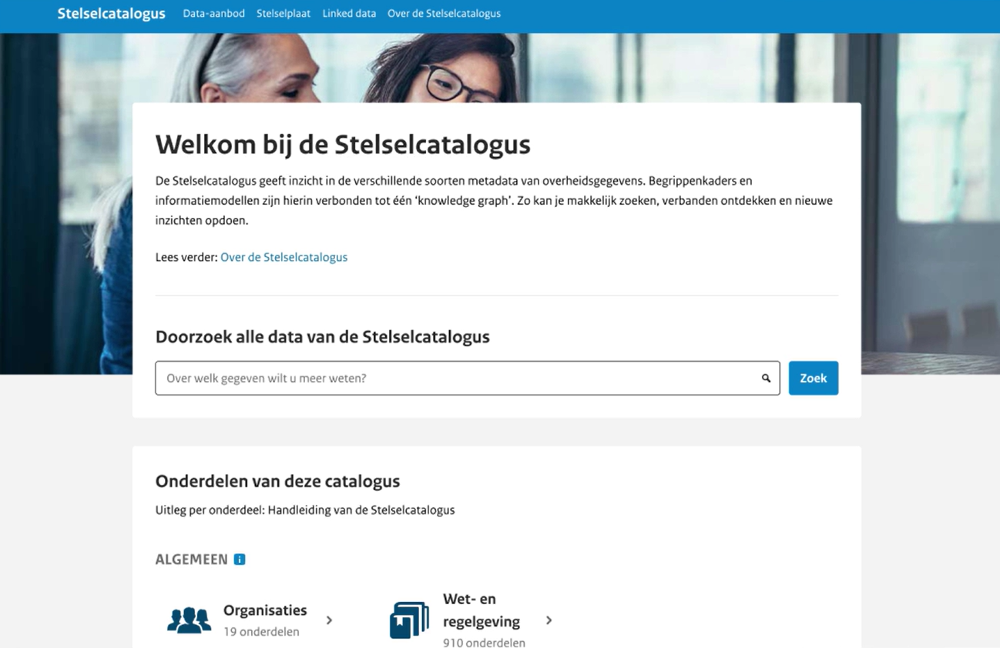

# De Stelselcatalogus is vernieuwd

De vernieuwde Stelselcatalogus is nu live via
[www.stelselcatalogus.nl](https://www.stelselcatalogus.nl)! De omgeving is
gebruiksvriendelijker, actueler en beter voorbereid op de toekomst. Niet alleen
de techniek en interface zijn vernieuwd, ook het onderliggende informatiemodel
is verbeterd. Hierdoor kunnen onder meer specifieke relaties tussen gegevens
worden gelegd.

<!-- truncate -->

Wie met data werkt voor maatschappelijke vraagstukken, weet hoeveel tijd gaat
zitten in het vinden, verkrijgen en begrijpen van gegevens. Juist daarom zijn
toegankelijke catalogi onmisbaar en is er in het
[Federatief Datastelsel](https://federatief.datastelsel.nl/) (FDS) een
catalogusfunctie voorzien.

Met behulp van metadata biedt de Stelselcatalogus inzicht in gegevens, begrippen
en informatiemodellen, en in de relaties daartussen. Dat helpt om bestaande
datasets beter te gebruiken bij analyse en het oplossen van maatschappelijke
vraagstukken.

## Wat is er nieuw?

De technologie achter de catalogus is vernieuwd en sluit beter aan op moderne
webstandaarden. De zoekfunctie en interface zijn verbeterd, zodat gebruikers
sneller de juiste informatie vinden. De catalogus bevat nu naast
informatiemodellen ook begrippenkaders. De vernieuwde structuur legt een stevige
basis voor verdere uitbreiding en betere aansluiting op het Federatief
Datastelsel.

<video controls preload="metadata" style={{width: '100%'}}>

  <source src="https://www.stelselcatalogus.nl/cms/uploads/Explainer_full_v1_81f8560d75.mp4" type="video/mp4" />
  Je browser ondersteunt geen ingesloten video.
</video>

## Onderdeel van een groter geheel

In de vernieuwde Stelselcatalogus vind je informatie over begrippen en
informatiemodellen. Metadata van datasets en dataservices vind je via
[data.overheid.nl](https://data.overheid.nl) en
[developer.overheid.nl](https://developer.overheid.nl). Gezamenlijk vormen deze
voorzieningen de ingang tot overheidsdata.

De Stelselcatalogus geeft overzicht in gegevens die binnen de overheid worden
gebruikt, zoals gegevens uit Basisregistratie Personen (BRP), het
Handelsregister en de Basisregistratie Kadaster (BRK). Bij ieder gegeven staat
extra uitleg over betekenis, herkomst en registratie. Dat helpt beleidsmakers,
architecten, data-analisten en uitvoeringsorganisaties om gegevens beter te
begrijpen, te gebruiken en waar mogelijk te hergebruiken.

Zo draagt de vernieuwde Stelselcatalogus bij aan een overheid waarin data beter
vindbaar, begrijpelijk en toepasbaar is. Meer informatie is te vinden op
[www.stelselcatalogus.nl](https://www.stelselcatalogus.nl).

Wij komen graag in contact met onze stakeholders. Via
LogiusContactStelselcatalogus@logius.nl kun je met ons in contact komen.
