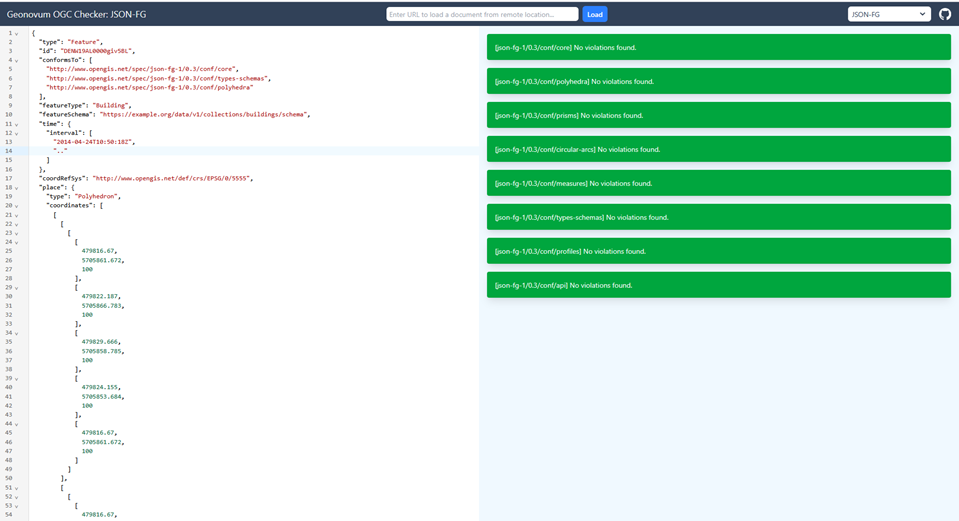
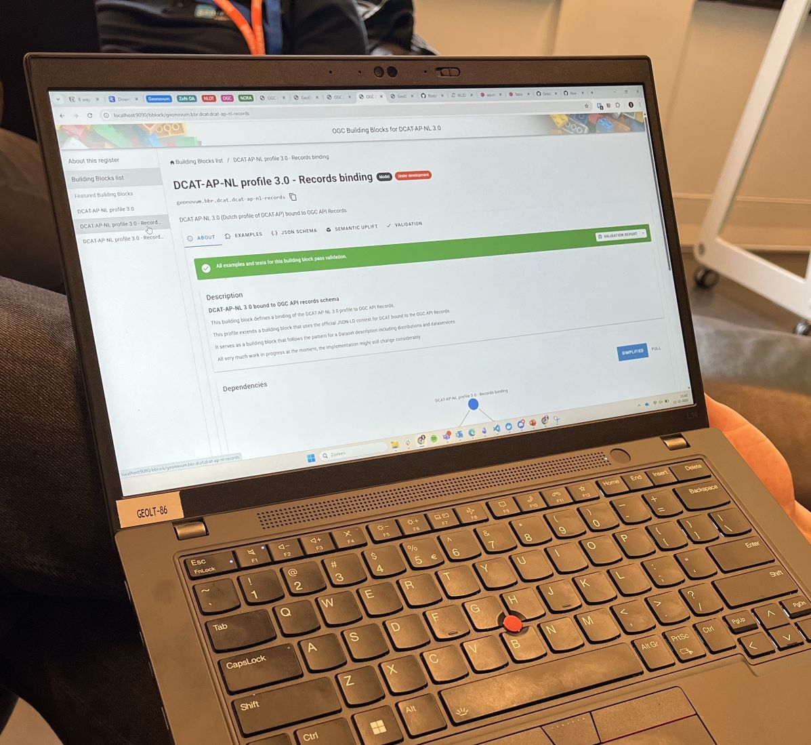

# OGC code sprint @ Rotterdam

Het [Open Geospatial Consortium](https://ogc.org) (OGC) is een internationale standaardenorganisatie. Hier komen onder andere de OGC API standaarden vandaan: gestandaardiseerde REST APIs die ervoor zorgen dat geodata op een universele manier geserveerd en gebruikt kan worden. Regelmatig organiseert het OGC code sprints: hackathons van drie dagen waar standaarden-experts en ontwikkelaars de OGC standaarden implementeren in software. De OGC standaarden die geimplementeerd worden zijn dan meestal nog in draft; wel stabiel, maar nog niet officieel goedgekeurd. Op basis van de feedback van ontwikkelaars kunnen OGC standaarden-experts meteen de standaarden verbeteren en aanvullen. Zo wordt het ontwikkelen van standaarden net iets meer agile. 

<!-- truncate -->

Geonovum en de gemeente Rotterdam hebben de OGC code sprint naar Nederland gehaald. Het is een fysiek evenement van 20 tot en met 22 oktober 2025 in Rotterdam, maar ook online doen mensen mee. Bezoekers van de code sprint komen vanuit de hele wereld, waaronder Japan, Canada en Europa. Het mooie eraan is dat de experts, die de OGC standaarden geschreven hebben, aanwezig zijn (fysiek of online) en je daardoor een  heel kort lijntje hebt naar de bedenker van een standaard. Als je een implementatie aan het maken bent en je loopt ergens tegenaan, zoals een foutje of onduidelijkheid in de standaarden, dan kun je daar meteen hulp bij krijgen. Vaak leidt dit ook meteen tot een oplossing in de standaard zelf. Ook ideeën voor improvements op standaarden worden vaak geboren tijdens OGC code sprints en daarna doorontwikkeld tot een nieuwe uitbreiding van een van de OGC standaarden.  

Geonovum is al vaker naar OGC code sprints toegeweest, daar is onder andere de [ogc checker](https://github.com/Geonovum/ogc-checker/) uit geboren, een linter voor OGC standaarden. Dit keer gaan we ook weer werken aan de linter, maar daarnaast ook aan een DCAT profiel voor OGC API Records en een implementatie van OGC API Joins.

*Deelnemers aan het werk*

## Geonovum's Standards Checker - aka 'the Linter'
De eerste versie van de linter hadden we destijds in drie dagen aan de praat. De standaard waarvoor we toen checks geïmplementeerd hebben was [JSON-FG](https://github.com/opengeospatial/ogc-feat-geo-json/), een uitbreiding voor GeoJSON. De linter is een tool waarmee je kan checken of een JSON document voldoet aan de standaard. De linter heettte officieel 'OGC checker' en hebben we tijdens deze code sprint hernoemd naar 'Standards Checker', omdat we de core van de tool hebben losgetrokken van het deel dat checks voor specifieke standaarden implementeert. Daardoor is het een framework geworden waarin je ook checks voor niet-OGC standaarden kunt implementeren. Het plan is om de linter nu ook als basis van de ADR checker te gaan gebruiken. 

De linter ondersteunt nu de volgende OGC standaarden: 
- JSON-FG (was v0.1, nu v0.3)
- OGC API Features [part 1](https://docs.ogc.org/is/17-069r3/17-069r3.html) + [part 2](https://docs.ogc.org/is/18-058/18-058.html)
- OGC API Records [part 1](https://docs.ogc.org/is/20-004r1/20-004r1.html)
- OGC API Processes [v2 part 1](https://docs.ogc.org/DRAFTS/18-062r3.html)

Tijdens de code sprint hebben we de JSON-FG implementatie geupdate naar de nieuwste versie van de standaard, die net is goedgekeurd en binnenkort gepubliceerd wordt door OGC. Eerder ondersteunden we nog een oude consultatieversie. 

Verder hebben we, zoals gezegd, de code uitgesplitst naar twee aparte github projecten. De [standards-checker](https://github.com/Geonovum/standards-checker) is de 'core', de kern van het checker framework. De [ogc-checker](https://github.com/Geonovum/ogc-checker) bevat de rulesets voor OGC standaarden. 

*De web interface van de OGC Checker* 

Verder hebben we aan de core een CLI interface toegevoegd. Tot nu toe draaide de checker alleen als web interface, waarbij je het te testen bestand of via een URL of in een tekstveld kan opgeven. Met de komst van de CLI interface kan je de checker ook vanaf de command line aanroepen en dus bijvoorbeeld integreren in je eigen ontwikkelworkflow of als een API beschikbaar stellen. 

## DCAT in een OGC API 
Mijn Geonovum collega Niels was op de code sprint aanwezig om uit te zoeken hoe je de metadatastandaard DCAT kan gebruiken in combinatie met OGC API Records. OGC API Records is een gestandaardiseerde API voor dataset catalogi. Je kan er op een gestandaardiseerde manier metadata, oftewel datasetbeschrijvingen, mee serveren, en met een client daarin zoeken, zien wat er allemaal beschikbaar is en informatie over een dataset opvragen. Elk datasetbeschrijving item is een metadata 'record', vandaar de naam van de API. Vergeleken met bijvoorbeeld een OGC API Features endpoint zitten er in een record item meer (potentieel veel meer) beschrijvende elementen over een dataset. Alles wat je wilt weten om te kunnen beoordelen of een dataset geschikt is voor jouw use case, kun je erin vinden. 

Nu is in Europa overheidsland de belangrijkste standaard om datasets te beschrijven de standaard DCAT. Deze standaard is gebaseerd op RDF en staat zeer uitgebreide beschrijvingen van datasets toe. Maar hoe gebruik je nu DCAT in combinatie met OGC API Records, een REST API waar je normaal gesproken JSON payloads in verwacht? Dit is niet heel eenvoudig. Een record item in OGC API Records is veel beperkter dan wat je in DCAT kan doen. Je kan via content negotiation specifiek om DCAT vragen, maar hiervoor moet je wel specifiek om het DCAT 'profile' vragen - een methode die nog niet altijd even gemakkelijk werkt. 

Niels heeft tijdens de code sprint uitgewerkt hoe dit zit. Uitgaande van het 'find and bind' principe is het logisch dat een gebruiker die informatie over een dataset opvraagt, in eerste instantie een compacte beschrijving in JSON krijgt. Dit is wat OGC API Records standaard teruggeeft, maar OGC API Records maakt maar enkele properties verplicht. Niels heeft in JSON schema een uitbreiding hierop gespecificeerd zodat je de belangrijkste DCAT-AP-NL properties meteen terugkrijgt in je eerste request. Als je meer wilt weten, of RDF wilt hebben, kun je vervolgens een request doen met het juiste media type en de juiste profile parameter.  

Het JSON Schema heeft Niels gemaakt als "DCAT-AP-NL profile - OGC API Records binding" binnen het OGC building blocks framework, waarin je kunt testen en valideren of de DCAT-AP-NL structuur ook conform DCAT-AP, DCAT v3 en GeoDCAT is. 

*Het DCAT-AP-NL profiel als OGC building block*

## OGC API Joins
Een andere collega, Pieter, was er ook en stortte zich op een nieuweling in de OGC API familie: OGC API Joins. Met deze API kun je administratieve, tabulaire data aan geo-data koppelen. Deze standaard is bijvoorbeeld interessant om statistische gegevens, zoals gegevens van het CBS, te koppelen aan gebieden (wijken, buurten, enz) in Nederland. Als je de gegevens in CSV op een URL beschikbaar stelt, kun je ze met deze API gemakkelijk koppelen aan geo-objecten zoals je die bijvoorbeeld bij PDOK kunt vinden - bijvoorbeeld een OGC API Features. 

Het koppelen gebeurt door het matchen  van overeenkomstige gegevens die zowel in de tabulaire data (CSV of GeoJSON) als in de geo-data aanwezig zijn. Zo krijg je een ‘join’: de API combineert beide datasets op basis van het overeenkomstige gegeven. 

OGC API Joins is momenteel in publieke consultatie en dus is de tijd rijp om een implementatie te maken. Nu kunnen opgespoorde fouten nog meteen gemeld en opgelost worden. Pieter maakt de implementatie samen met ontwikkelaar Sander die we voor de gelegenheid mee hebben genomen en met Pekka, één van de schrijvers van de standaard. Aan het eind van de eerste dag meldde Pieter trots dat het aantal issues in de github repository, waar de standaard wordt beheerd, door zijn toedoen verdubbeld is, van 5 naar 10! En na dag twee waren er nog eens 5 issues bijgekomen. Gelukkig zien we op dag 3 dat er niet alleen issues zijn gemeld, maar ook een werkende OGC API Joins applicatie is gemaakt binnen het [pygeoapi](https://pygeoapi.io/) project. 

## Wat gebeurt er verder allemaal
Maar er gebeurde nog veel meer! Een aantal implementatie issues rond OGC standaarden werd uitgebreid besproken in discussiesessies, met name rond [content negotiation by profile](https://github.com/opengeospatial/ogcapi-features/issues/1025) en het opnemen van niet-geodata in een OGC API Features. Maar voornamelijk werkten verschillende teams aan implementaties van andere nieuwe OGC standaarden. 

Zo is er tijdens de code sprint een implementatie gemaakt van **SensorThings API Websub** die sensordata live kan ophalen. Nieuw element is de Websub component: daardoor kun je een abonnement op een sensor nemen en dan automatisch alle nieuwe waarden  binnenkrijgen in je dashboard. Als je wilt kan je daar ook een filter op zetten, zodat je bijvoorbeeld alleen waarden boven een bepaalde drempel binnenkrijgt. Voor de techneuten onder ons: dit werkt puur via HTTP, er zijn geen extra protocollen voor nodig. 

Een andere nieuwe standaard voor sensoren en andere connected apparaten, **OGC API connected systems** is tijdens de code sprint geïmplementeerd in [QGIS](https://qgis.org/) als een dialect van OGC API Features dat al door QGIS wordt ondersteund. Daarnaast is e roo keen nieuwe implementatie in pygeoapi gemaakt en eentje in camptocamp's [OGC client](https://github.com/camptocamp/ogc-client), een typescript libarry met support voor OGC standaarden. 

Naast coordinaatreferentiesystemen zijn grid systemen tegenwoordig een populaire manier om locaties op te slaan. Bedrijven zoals Über [maken hier gebruik van](https://medium.com/data-science/exploring-location-data-using-a-hexagon-grid-3509b68b04a2), omdat het een hele efficiente manier is om grote, wereldwijde collecties geodata op te slaan en er analyses mee te doen. Inmiddels is er ook een OGC standaard voor: **[Discrete Global Grid systems](https://www.ogc.org/nl/standards/dggs/) (DGGS)**. Tijdens de code sprint heeft een deelnemer de trajecten van Japanse schepen tussen Afrika en Japan vastgelegd met DGGS en dit laten zien in QGIS. 

Een ontwikkelaar was bezig met de verdere implementatie van **OGC API Records** in [GeoServer](https://geoserver.org/), dat nu Part 1 (goedgekeurd) en part 2 (draft) van de standaard ondersteunt en DCAT-AP als formaat voor dataset beschrijvingen. **JSON-FG** is in pygeoapi geïmplementeerd via [GDAL](https://gdal.org/). Verder was iemand bezig met gestandaardiseerde **styling van kaarten in QGIS**. And the list goes on... 

## Conclusie
Het was geweldig mooi om de wisselwerking te zien tussen mensen die standaarden schrijven en de software ontwikkelaars die ze implementeren. Door de korte lijntjes die ontstaan worden zowel de standaarden als de implementaties beter! Hierdoor kunnen wij weer stappen zetten om de OGC standaarden in Nederland verder geadopteerd te krijgen. 

Het [VONK innovatiecentrum](https://www.vonkrotterdam.nl/) van gemeente Rotterdam was zeer geschikt om zo'n evenement te houden. Goede wifi, een stimulerende innovatieve omgeving - waar je in je pauze even een 3D modelletje kunt printen of door het met OGC 3D Tiles gemaakte stadsmodel van Rotterdam kunt racen - kortom de perfecte plek voor de OGC code sprint 2025! 
