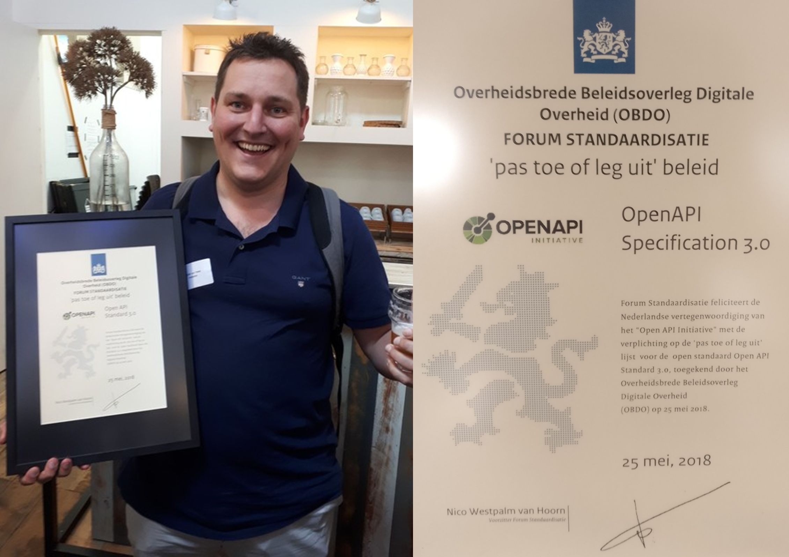
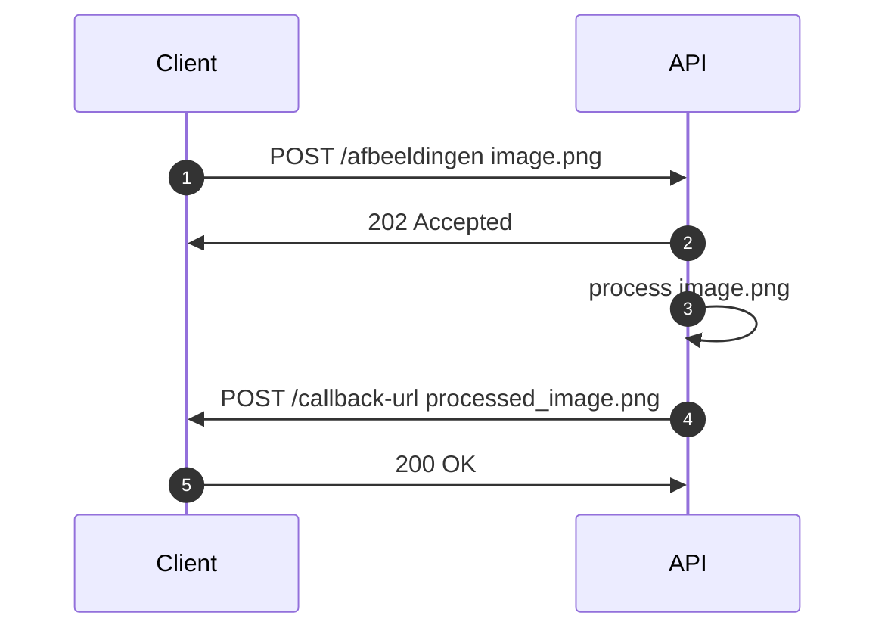
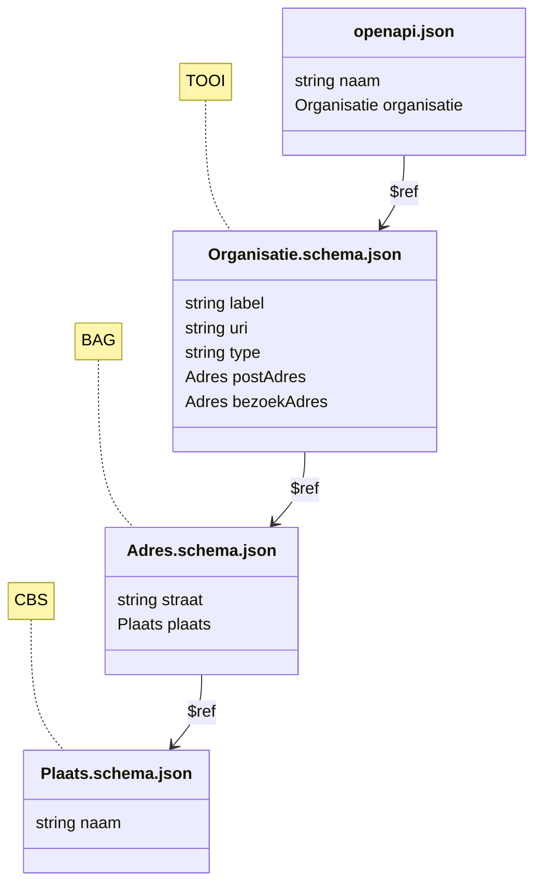

import { Blockquote } from "@rijkshuisstijl-community/components-react";

# OpenAPI 3.1 eindelijk in zicht: de voordelen op een rijtje

Ruim zeven jaar geleden werd het traject afgerond om de OpenAPI Specification (OAS) op de pas-toe-leg-uit-lijst van het Forum Standaardisatie te krijgen. Sindsdien is versie 3.0 de verplichte standaard voor overheids-API's. En dat bleef zo, ook toen opvolger 3.1 al lang beschikbaar was. Tot deze week. Het standaardisatieproces voor OpenAPI 3.1 is eindelijk hervat. In deze blogpost leggen we uit waarom dit een belangrijke stap is waar veel ontwikkelaars op hebben gewacht.


*Ondergetekende met het bewijs dat OpenAPI verplicht werd gesteld voor REST API's van de overheid, ruim zeven jaar geleden.*

<!-- truncate -->

## OpenAPI Specification

OAS is ontstaan uit een samenwerking tussen verschillende API Description Frameworks, zoals Swagger, RAML en API Blueprint, met als doel één standaard te creëren voor het machine-leesbaar beschrijven van REST API's. De eerste versie van OAS werd 3.0 genoemd, omdat het grotendeels voortbouwde op Swagger 2.x. In mei 2018 werd OpenAPI Specification 3.0 verplicht gesteld via de pas-toe-leg-uit lijst. In 2021 verscheen versie 3.1, die volgens het *semver*-principe een minor update zou moeten zijn, maar toch enkele breaking changes bevatte. Door beperkte ondersteuning in tooling besloot de expertgroep van het Forum Standaardisatie op 7 december 2022 de upgrade naar 3.1 tijdelijk te pauzeren. Inmiddels zijn we ruim twee jaar verder en is de situatie duidelijk veranderd. Deze week is dan ook besloten om het standaardisatieproces voor OpenAPI 3.1 opnieuw op te starten.

:::note[Semver]
Semver staat voor *Semantic Versioning*, een manier om versienummers van software op een gestructureerde manier op te bouwen. Het bestaat uit drie delen: `major.minor.patch`. Een verhoging van het eerste cijfer (`major`) betekent dat er mogelijk breaking changes zijn. Het tweede cijfer (`minor`) wordt verhoogd bij het toevoegen van nieuwe, compatibele functionaliteit. Het derde deel (`patch`) geeft kleine, backwards-compatibele bugfixes aan. Zo kun je aan het versienummer direct zien wat voor soort wijzigingen je kunt verwachten.
:::

## De wijzigingen in het kort

Voordat we dieper ingaan op de details, volgt hier alvast een overzicht van de belangrijkste nieuwe features in OpenAPI 3.1:

- **HTTP API's in plaats van REST API's**: verbreding van het toepassingsgebied van OAS
- **Webhooks**: maakt het beschrijven van asynchrone requests mogelijk
- **Meerdere voorbeelden**: responses kunnen nu meerdere voorbeelden bevatten via een `examples` array
- **Mutual TLS support**: ondersteuning voor beveiliging met Mutual TLS
- **Volledig JSON Schema compatible**: volledige compatibiliteit met de officiële JSON Schema standaard

Hieronder lichten we deze wijzigingen verder toe.

## Van "REST" naar "HTTP"

De termen REST, RESTful en REST-ish worden vaak door elkaar gebruikt, maar wat betekenen ze nu eigenlijk? Volgens de oorspronkelijke principes van Roy Fielding — de bedenker van **RE**presentational **S**tate **T**ransfer — moet een API strikt aan een aantal architectuureisen voldoen om écht REST te zijn. In de praktijk zijn er echter veel varianten. Zo is OData een goed voorbeeld van een *REST-ish* API: het is resource-gebaseerd en stateless, maar introduceert een eigen querytaal met parameters als `$filter` en `$expand`. Volg je de API Design Rules, dan is je API waarschijnlijk *RESTful*, omdat operaties zoals `/v1/gebouwen/_zoek` formeel geen REST zijn, ook al lijken ze er sterk op. Zelfs RPC-achtige patronen, zoals `POST /doeIets`, zijn te beschrijven in OAS.

<Blockquote
  attribution=" — OpenAPI 3.1 Specification"
  variation="pink-background"
>
"The OpenAPI Specification (OAS) defines a standard, programming language-agnostic interface description for HTTP APIs."
</Blockquote>

<br/>

Met de komst van OpenAPI 3.1 is het bovendien mogelijk om webhooks (HTTP callbacks) te beschrijven, waardoor het toepassingsgebied van OAS verder wordt verbreed. Daarom wordt er vanaf OAS 3.1 over **HTTP API's** gesproken in plaats van REST API's. GraphQL valt hier overigens buiten: hoewel het HTTP als transport gebruikt, volgt het niet het HTTP-model waarop OAS is gebaseerd. OpenAPI is bedoeld voor API's die zich gedragen volgens de principes van HTTP, niet alleen het protocol gebruiken.

## Webhooks

OpenAPI 3.1 introduceert het nieuwe element `webhooks`, waarmee je asynchrone HTTP callbacks kunt beschrijven die door de server worden getriggerd, bijvoorbeeld na een API-call. Hierdoor is het veld `paths` niet langer verplicht; je kunt nu ook alleen webhooks documenteren als je dat wilt. Een voorbeeldscenario is dat een client een afbeelding uploadt (1), de API direct (synchroon) met een `202 Accepted` bevestigt dat de afbeelding is ontvangen (2), vervolgens de afbeelding verwerkt (3) en na afronding (asynchroon) een callback naar de client stuurt (4). Afhankelijk van de *retry policy* is het tenslotte over het algemeen gebruikelijk om een ontvangen callback netjes te beantwoorden met een relevante status code (5):



De payload van deze callback wordt in OAS 3.1 beschreven met het `webhooks` element. In dit voorbeeld wordt het verwerkte bestand direct meegestuurd in de callback:

```yaml
webhooks:
  imageProcessed:
    post:
      requestBody:
        required: true
        content:
          image/png: # een schema is niet nodig voor dit content-type
```

## Mutual TLS

OAS 3.0 ondersteunt de beschrijving van de volgende security schemes:

- HTTP Authentication
- API Keys
- OAuth 2.0
- OpenID Connect

Wat ontbrak was Mutual TLS (mTLS): authenticatie op basis van certificaten. OAS 3.1 ondersteunt dit wél, waardoor ook HTTP API's van de overheid die op deze manier beveiligd zijn, dit in OAS 3.1 kunnen uitdrukken:

```yaml
security:
  type: mTLS
```

## Meerdere examples

Waar OAS 3.0 nog één `example` bij request en response velden accepteerde, ondersteunt OAS 3.1 meerdere `examples` in de vorm van een array. `example` wordt nog wel ondersteund, maar is *deprecated*. Dat betekent dat de ondersteuning hiervoor in een volgende versie zal verdwijnen. Met meerdere examples wordt het voor tooling, zoals bijvoorbeeld mocking services, makkelijker om realistische testdata te kunnen genereren:

```yaml
voornaam:
  type: string
  examples: [Dimitri, Frank, Jaap-Hein, Joost, Martin, Matthijs, Tom, Vivian]
```

## JSON Schema

Tijdens de totstandkoming van OAS 3.0 werd er nog volop gewerkt aan de JSON Schema standaard. Dat betekent dat de makers van OAS er niet vanuit konden gaan dat de toenmalige versie van JSON Schema stabiel zou zijn. Om echter wel vooruit te kunnen met OAS, is er besloten een eigen dialect van JSON Schema vast te stellen in OAS: het OpenAPI Schema. Na de lancering van OAS 3.0 lanceerde de JSON Schema werkgroep een stabiele versie (draft 2020) van JSON Schema. Helaas week deze af van het OAS 3.0 dialect, waardoor JSON Schema niet gebruikt kon worden in OAS. Immers, tooling die OAS ondersteunde, ging uit van het OAS dialect en niet van de JSON schema draft.

OAS 3.1 biedt wél volledige ondersteuning voor JSON Schema. Dit betekent dat alle tooling die er voor JSON Schema bestaat, ook gebruikt kan worden in combinatie met API designs. Zo wordt het mogelijk om federatief JSON Schema's te hergebruiken, zoals in het voorbeeld hieronder wordt geschetst. Een OAS kan dan bijvoorbeeld verwijzen naar een extern `Organisatie` schema dat reeds gedefinieerd is voor de API van TOOI, welke op haar beurt weer verwijst naar het schema van een `Adres` dat eerder al door de BAG API is vormgegeven, etc.



Op deze manier wordt herbruikbaarheid een stuk eenvoudiger en hoeft niet iedereen na te denken over de structuur van een schema; daar is immers al over nagedacht door iemand anders. Uiteraard betekent dit wel dat er afspraken gemaakt zullen moeten worden over hoe om te gaan met versionering, caching, enzovoorts, maar een upgrade naar OAS 3.1 zorgt er in ieder geval voor dat het technisch mogelijk is om de volledige JSON Schema standaard op deze manier te benutten.

Dit kan betekenen dat er, naast de API Design Rules, ook zoiets als "JSON Schema Design Rules" moeten komen. Wij zijn in ieder geval voornemens om alvast een voorzet te doen door goed naar het JSON Schema register van onze Engelse collega's van de "Driver & Vehicle Licensing Agency" te kijken, die eerder deze interessante blogpost schreven over hoe zij het beste uit JSON Schema in combinatie met OpenAPI 3.1 haalden: [https://careers.dft.gov.uk/dvla-software-developers-behind-the-screens](https://careers.dft.gov.uk/dvla-software-developers-behind-the-screens).

## Impact analyse

Uit een impact analyse op alle API's in het huidige API-register blijkt dat 15% gebruikmaakt van het keyword `nullable`. Dit moet worden aangepast voor volledige compatibiliteit met OpenAPI 3.1, maar veroorzaakt geen breaking change in de meeste tooling. Daarnaast gebruikt 3% van de API's het keyword `exclusiveMaximum`, wat bij een upgrade wel tot breaking changes kan leiden en dus aangepast moet worden. Gelukkig is het mogelijk om deze aanpassingen automatisch door te voeren met de tool [openapi-format](https://www.npmjs.com/package/openapi-format):

```sh
openapi-format openapi-3.0.json -o openapi-3.1.json --convertTo "3.1"
```

In het [nieuwe API-register](https://developer.overheid.nl/blog/2025/06/18/het-nieuwe-api-register) zullen wij deze conversie standaard toepassen, zodat alle API's probleemloos kunnen overstappen naar OpenAPI 3.1 en iedereen direct profiteert van de vele voordelen van deze nieuwe versie. Wij zullen er in ieder geval alles aan doen om de expertgroep van Forum Standaardisatie ervan te overtuigen dat het tijd is om de volgende stap te zetten.
