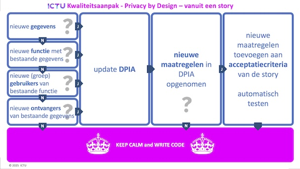
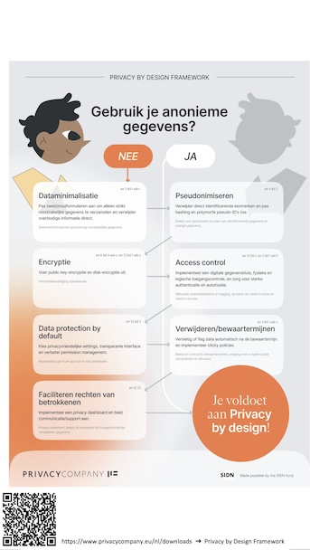
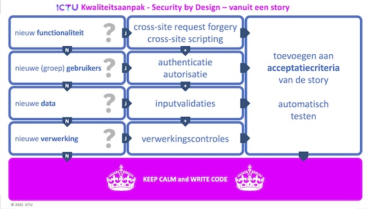
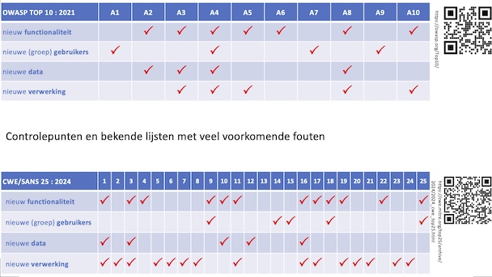

# Privacy by Design en agile ontwikkelen, kan dat?

Ken je dat? Je gaat aan een nieuw project beginnen en dan vraagt iemand
‘Doen jullie wel _Privacy by Design_?’

<!-- truncate -->

Uiteraard is het belangrijk om bij de bouw van nieuwe software meteen te
denken aan privacy – en ook aan security, toegankelijkheid en mogelijk meer.
Maar hoe past dat binnen een moderne, agile werkwijze?

In vroeger tijden, toen complete, gedetailleerde ontwerpen werden gemaakt
nog voor er een letter geprogrammeerd was, konden die ontwerpen vooraf aan
al deze eisen getoetst worden. In theorie dan, want onder tijdsdruk kwam het
daar veel te vaak niet of onvoldoende van. Of de wereld was alweer veranderd
tegen de tijd dat de software in productie ging.

## Dat moet toch beter kunnen, zou je denken

Bij ICTU ontwikkelen we software voor opdrachtgevers binnen de overheid. We
hanteren daarvoor een agile werkwijze, maar we beginnen niet direct met
programmeren. Eerst zorgen we dat voor duidelijk is wat het probleem van de
opdrachtgever is, hoe de oplossing er uit zou kunnen zien, zodat we in grote
lijnen weten welke technieken en expertise nodig zijn om de oplossing te
realiseren. Het meeste hoeft niet 100% af te zijn en wordt ook niet in beton
gegoten. Het is een beginpunt.

Eén beginpunt is de beroemde en beruchte Data Protection Impact Analyse (DPIA).
Daarin wordt vastgelegd welke persoonsgegevens waarom en hoe verwerkt worden
door de organisatie (geduld, toelichting volgt). Ook beschrijft het wat de
organisatie doet voor de rechten van de betrokken personen en welke beschermende
maatregelen getroffen worden. En daar zit het haakje naar softwareontwikkeling.
Want wat de organisatie doet vraagt mogelijk om functionaliteit en ook
maatregelen laten zich vaak (deels) naar functionaliteit vertalen.

## We hebben dus een beginpunt voor _Privacy by Design_. Hoe nu verder?

Gedurende het hele ontwikkelproject worden stories opgesteld en uitgewerkt
voordat er software gemaakt wordt. Elke story is niet alleen een stapje in de
groei van de programmatuur, maar mogelijk ook een doorontwikkeling van ons
beginpunt. Je zult je tijdens het uitwerken (refinen) van een story moeten
afvragen: ‘Heeft dit privacy-gevolgen?’ Is het antwoord ‘ja’, dan is er werk
aan de winkel.

En nu komt het: privacy moet in het proces van de organisatie (daar is ie) geborgd
zijn. De organisatie zal dus moeten kiezen hoe privacy-borging vorm krijgt. Soms
zal daarvoor ondersteuning vanuit de applicatie nodig zijn. Zo wordt privacy
geleidelijk vertaald naar functionele eisen en wensen. Als ontwikkelaars bevinden
we ons dan weer op bekend terrein.

## Blijft de vraag over: ‘Hoe weet je als ontwikkelaar of iets privacy-gevolgen heeft?’

En hier zit de verrassing, want met een paar vragen kom je al heel ver. Bij ICTU
hebben we daarvoor een ‘spiekbriefje’ gemaakt. Hierop staan niet alleen de vragen,
maar ook de eventuele actie(s). Door tijdens een refinement dit briefje als checklist
te hanteren, beperken we de actie tot wat nodig is. Zo groeit de privacy-inspanning
mee met de software en het proces dat ermee wordt ondersteund. Als extraatje hebben
we op de achterkant de beslisboom van het _Privacy by Design framework_ overgenomen
(met bronvermelding, uiteraard).

Voor _Security by Design_ hebben we net zoiets, met op de achterkant verwijzingen naar
de OWASP Top Ten en de SANS 25.

(Een printbare versie van deze 'Story Cards' is [hier](./img/ictu-2025-storycards.pdf) te downloaden)

## Hoe doe jij dat?

Ik ben benieuwd hoe je in jouw projecten _XXX by Design_ vormgeeft. Waar begin je en
met welke hulpmiddelen werk je? Is de (organisatie achter de) product owner erbij
betrokken?

Daarnaast ben ik benieuwd of iemand een idee heeft hoe je _Accessibility by Design_
(toegankelijkheid) op soortgelijke of totaal andere wijze kunt inbedden in de werkwijze.
Laat het weten me op [Mastodon](https://mastodon.nl/@e_r_nie) of beter nog:
[schrijf ook een blog](https://developer.overheid.nl/contributing/gastblog-schrijven).

