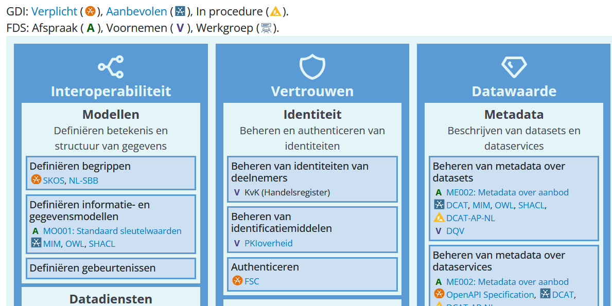

# De softe kant van standaarden

Standaarden zijn vaak technisch van aard.
Ze zorgen voor interoperabele oplossingen die technisch op elkaar kunnen aansluiten.
Als we kijken naar adoptie van standaarden, dan is dat vaak een soft verhaal: "Wat heb ik hieraan?", "Is het verplicht?", "Doen anderen het ook?".
Dit soort vragen worden door verschillende persona's gesteld en elke persona vereist een andere aanpak om te overtuigen van het nut van een standaard.

Bij het bevorderen van adoptie van standaarden is het van groot belang dat de softe kant op orde is.
De keuze om een standaard te implementeren heeft grotere impact als een bestuurder die maakt, dan één individuele developer.
Zelf doe ik mee aan de werkgroep ["Adoptie van standaarden"](https://realisatieibds.nl/groups/view/0056c9ef-5c2e-44f9-a998-e735f1e9ccaa/federatief-datastelsel/wiki/view/794e40b9-9b98-494c-9242-6380409088e5/werkgroep-adoptie-standaarden) binnen het [Federatief Datastelsel](https://realisatieibds.nl/page/view/564cc96c-115e-4e81-b5e6-01c99b1814ec/de-ontwikkeling-van-het-federatief-datastelsel) (FDS), om te analyseren welke activiteiten nuttig zijn om adoptie te bevorderen.

<!-- truncate -->

## Het verkopen van "nee"

Standaardisatie is in essentie de kunst van het verkopen van "nee".
Voorheen was elke gekozen oplossingsrichting mogelijk, met een standaard worden daar keuzes in gemaakt.
Dit is per definitie restrictief: eerst mocht je alles en nu niet meer.
Onbewust is dat ook het eerste signaal wat mensen ontvangen: "Nu moet ik het op deze specifieke manier doen, waarom dan?".

Bij het bevorderen van standaardisatie is het cruciaal om te realiseren dat restricties nooit fijn zijn.
Elk mens waardeert de (persoonlijke) keuzevrijheid, zeker in het federatieve overheidslandschap van honderden overheidsorganisaties die grotendeels autonoom beslissingen willen maken.
Daarom is in mijn optiek de focus op "nu kan je dit niet meer" geen handige tactiek.
Je staat al 1-0 achter voordat het gesprek begint.

De focus verleggen naar "als we dit afspreken, dan kan je ineens X-Y-Z" is een positievere boodschap.
Door af te spreken van alle mogelijke waarden die uitgewisseld kunnen worden in formaat F vast te leggen, is het bijvoorbeeld mogelijk om efficiëntere aansluitingen te realiseren.
De voordelen bij gegevensuitwisseling zijn er voor beide partijen:

1. de afnemer weet dat het altijd er vanuit kan gaan dat het in formaat F is vastgelegd, zodat elke uitwisseling op dezelfde manier verloopt
1. de aanbieder heeft baat bij makkelijker aansluiten omdat de afnemer de code al had geschreven bij de integratie met een vorige aanbieder

Hier hebben beide partijen baat, ook al mogen ze nu minder dan wat voorheen toegestaan was.
Restricties leveren in dit geval wel degelijk waarde op.

## Hoe krijgen we de focus op de positieve kant?

De uitdaging bij standaardisatie is om de focus van restricties te verleggen naar de positieve kant.
Dit is het gespreksonderwerp van de werkgroep "Adoptie van standaarden" bij het FDS.
Vanaf de eerste werksessie werd de focus gelegd op de softe kant, iets waar ik positief verrast door was.
"Fijn dat er gelijkgestemden hier bijeenkomen die realiseren hoe belangrijk die softe kant is" dacht ik toen.

Het was wel nog zoekende hoe we deze softe kant kunnen belichten.
We vroegen ons af wie de belanghebbenden zijn bij de keuze voor standaarden en wat zijn hun beweegredenen.
Hiervoor hebben we enkele persona's uitgewerkt, om structuur te kunnen geven aan de discussies.

De persona's waar we voor nu op focusen zijn:

1. Programmamanager bij een overheidsorganisatie
1. Architect bij een overheidsorganisatie
1. Developers (bij een leverancier)

Elke persona heeft andere wensen, eisen en bewegingsruimte.
Tevens heeft de ene persona meer invloed dan de andere op bepaalde gebieden.
Hierbij is het belangrijk om te weten "wie er aan welke tafel zit" om te bepalen waar het gesprek over een standaard plaats vindt.

## De bestuurlijke hoek die bepaalt

Voor de bestuurlijke hoek is het van belang om te begrijpen wat er speelt en hoe een oplossing daaraan bijdraagt.
Vaak wordt op dit niveau nagedacht over prioriteit, tijd en geld.
Met standaarden is het dus van belang om duidelijk te krijgen hoe een standaard bijvoorbeeld tijd of geld bespaart, waardoor het prioriteit verdient.

Er is ingezet om een overzicht te krijgen op welke gebieden bepaalde standaarden de meeste waarde realiseren.
Hieruit is een overzichtsplaat voortgekomen die laat zien voor welke stelselfuncties binnen het FDS welke standaarden passen:

 _Deel van de overzichtsplaat zoals gepubliceerd op [de website van FDS](https://federatief.datastelsel.nl/kennisbank/stelselfuncties/#de-technische-stelselfuncties) (geraadpleegd op 2026-04-01)_

Zo'n overzicht is te printen om op een banner te zetten, of makkelijk toe te voegen aan presentatie.
Dat is ook de werkomgeving van de bestuurlijke hoek: overleggen met anderen wat er gedaan moet worden.
Hierbij is een overzicht nuttig om te laten zien wat er mogelijk is en dat er al analyses zijn gedaan welke standaard het beste toepasbaar is.

:::success[Vind de verbinding]
Aansluiten bij de werkomgeving van de persona is van belang om het juiste bericht te kunnen versturen.
Persona's die opereren in de bestuurlijke hoek hebben baat bij informatie in een overzichtelijk formaat.
:::

## Architecten als sturing

Bestuurders vragen zich ook vaak af: "Oke, maar is dit wel uit te voeren in mijn organisatie?"
Hierbij is het noodzakelijk om het technische landschap van een organisatie te kennen en hier een visie op te hebben.
Daar komt de rol van een architect bij kijken, waarbij het voor standaarden belangrijk is dat een architect begrijpt hoe zo'n standaard past in het totaalplaatje.

Om dit duidelijker te krijgen zijn er handreikingen geschreven.
De eerste versie van de handreikingen staan inmiddels [online op NORA](https://www.noraonline.nl/wiki/Standaarden_in_het_Federatief_Datastelsel).

:::tip
Op dit moment zijn we op zoek naar feedback op deze handreikingen.
Laat feedback achter op NORA met concrete verbeteringen en suggesties
:::

De handreikingen gaan meer in detail ten opzichte van de overzichtsplaat.
Ze bevatten generieke informatie over de standaard, de impact die het heeft, maar ook de relaties tot andere standaarden.
Dat sluit mooi aan op de originele vraagstukken waar een architect aan werkt: hoe past in het geheel?

Mogelijk valt het ook op hoe de handreikingen focusen op de positieve toon.
Er wordt aangegeven wat er mogelijk is als de standaard wordt geimplementeerd en aan welke architectuurprincipes ze invulling geven.
Daarnaast wordt er ook ingegaan op impact, want er zullen altijd ook andere consequenties zijn waar rekening mee moet worden gehouden.

:::success[Begrijp de technische eisen]
Zorg ervoor dat een standaard compatibel is met bestaande oplossingen.
Maak duidelijk hoe de technische relaties er uit zien.
:::

## Developers als de doeners

Als een bestuurder het nut in ziet en een architect de mogelijkheden, is het nog wel de zaak dat het ook uitvoerbaar is.
Hier komt de doelgroep van developers (al dan niet in-house of werkzaam bij een leverancier) in beeld.
Developers willen graag concrete instructies hoe een standaard toe te passen is en hoe het mogelijk is om te checken of daaraan wordt voldaan.

Deze vraagstukken worden dan bij uitstek hier in de kennisbank op https://developer.overheid.nl beantwoord.
Bijvoorbeeld voor [Logboek Dataverwerkingen](https://logius-standaarden.github.io/logboek-dataverwerkingen/) zijn er [concrete codevoorbeelden](https://developer.overheid.nl/kennisbank/data/standaarden/logboek-dataverwerkingen/implementaties/jakarta) en links naar [referentie-implementaties](https://developer.overheid.nl/kennisbank/data/standaarden/logboek-dataverwerkingen/implementaties/go) die inspiratie kunnen bieden aan de doeners.

Om te checken of er wordt voldaan aan een standaard kunnen validators worden gebruikt.
De [OAS checker](https://developer-overheid-nl.github.io/oas-checker/#/adr-21) is gebouwd om geautomatiseerd te valideren of een OpenAPI specificatie voldoet aan de [REST API Design Rules](https://gitdocumentatie.logius.nl/publicatie/api/adr/).
Validators worden steeds belangrijker, zeker in een tijdperk waarin code genereren met behulp van AI wordt toegepast.

:::success[Zet in op validatie]
Developers vinden het fijn om duidelijke doelen te krijgen en concluderen dat ze er aan voldoen.
Zet in op validatie-technieken en automatisering van testen om het einddoel te bepalen.
:::

## De crux van adoptie zit in de gelaagdheid

Elk van deze persona's heeft invloed op de (mogelijke) adoptie van een standaard.
Als op een van de lagen het nut niet wordt gezien, het onduidelijk is hoe het past in het geheel of dat het niet uit uit te voeren is, resulteert dat vaak in het wegblijven van adoptie.
Het scherp hebben van de eisen van een doelgroep helpt in het positief positioneren van een standaard.

Focus niet op maar één persona in de hoop dat het balletje dan vanzelf gaat rollen.
Analyseer of een standaard iets mist aan communicatie op een bepaalde laag en focus daar op.
Mijn hoop is dat de werkgroep later met nog meer informatie komt hoe dit aan te pakken.
