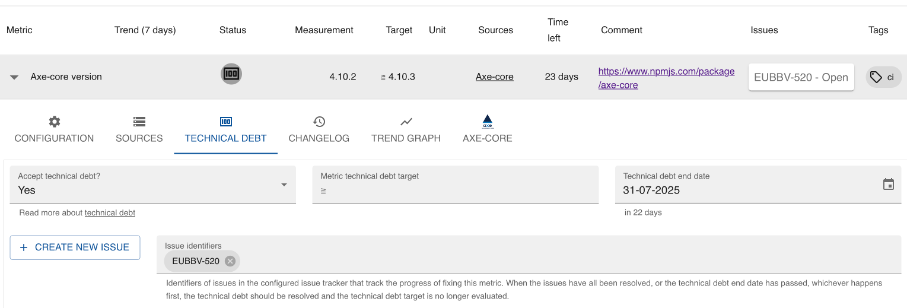

# Technische schuld - onvermijdelijk maar niet onbeheersbaar

Je kijkt naar je broncode en denkt: als ik had geweten wat ik nu weet, had ik het anders aangepakt. Een typisch voorbeeld van technische schuld. Wat is het, hoe kun je het voorkomen (niet dus) en hoe pak je het aan?

<!-- truncate -->

## Een financiële metafoor

De term technische schuld werd gemunt door Ward Cunningham om aan zijn baas [uit te leggen](https://wiki.c2.com/?WardExplainsDebtMetaphor) waarom de software waaraan hij werkt moest worden aangepast . Het doel van de aanpassingen was de software zodanig te herschrijven dat het zou lijken alsof alles wat Cunningham tijdens de ontwikkeling had geleerd al aan het begin bekend was. Omdat het ging om financiële software, gebruikte Cunningham een financiële analogie in het gesprek met zijn baas: de schuldmetafoor. Hij legde uit dat als de software niet zou worden aangepast aan wat op dat moment de juiste manier was om over het domein na te denken, het team voortdurend misverstanden zou hebben. En daardoor langzamer zou werken; alsof er rente over een lening moest worden betaald.

Cunningham wilde trouwens niet suggereren dat het idee is dat je slechte code schrijft en dit dan later herstelt. Het idee is dat je een imperfect begrip hebt van het op te lossen probleem en daar desondanks zo goed mogelijk software voor maakt. Zodanig dat het makkelijk is deze later aan te passen aan wat je hebt geleerd over het probleem.

## Breed toepasbaar

Wat ik interessant vind aan de technische schuld metafoor is dat deze zo breed toepasbaar is. Elke verandering in je project kan een nieuwe bron van technische schuld zijn:

- Een nieuwe functionele eis van je opdrachtgever: als je had geweten dat de gebruikers willen kunnen tijdreizen had je het datamodel anders vormgegeven.
- Een nieuwe niet-functionele eis van je opdrachtgever: als je had geweten dat je software niet alleen Nederlands maar ook andere talen in de user interface moet ondersteunen, had je de strings in je user interface direct vertaalbaar gemaakt.
- Een nieuwe randvoorwaarde: als je had geweten dat de aansluitvoorwaarden voor eHerkenning zouden worden veranderd, had je die direct meegenomen in je koppelvlak.

Maar ook zonder veranderingen in je eigen project kan er nieuwe technische schuld ontstaan. Veranderingen in de omgeving leiden ook tot technische schuld:

- Een nieuwe versie van een gebruikte bibliotheek: als deze versie aan het begin van je project beschikbaar was geweest had je die direct gebruikt en had je nu je code niet aan de nieuwe API hoeven aan te passen.
- Een nieuw ontdekte beveiligingskwetsbaarheid in één van de bibliotheken die je gebruikt. Als je van de kwetsbaarheid had geweten had je maatregelen in je code genomen, een andere bibliotheek gebruikt of de benodigde code zelf ontwikkeld.

Trouwens, niet alleen in de broncode van de software zelf kan technische schuld aanwezig zijn. Ook je ontwikkelomgeving kan technische schuld oplopen. Denk aan oude versie van linters, trage unit tests, of ongebruikte jobs in Jenkins.

## Onvermijdbaar

Mijn ervaring is dat technische schuld onvermijdelijk is. Je hoeft maar met je ogen te knipperen of er is een nieuwe versie van één van de bibliotheken die je software gebruikt. De vraag is dus zozeer niet hoe je technische schuld kunt voorkomen, maar hoe je er mee omgaat als het vroeg of laat optreedt. Want niets doen is geen optie als je software nog een tijdje mee moet.

## Aanpakken

Omdat technische schuld op veel verschillende manieren kan ontstaan en veel verschillende verschijningsvormen kent, hebben we bij mijn werkgever, [ICTU](https://www.ictu.nl), niet één manier om met technische schuld om te gaan. Er zijn verschillende aanpakken:

- Veel van onze projecten reserveren in ieder geval tijd om aan technische schuld te werken. Veelal hanteren we 10% van de velocity als vuistregel.
- Updates van gebruikte bibliotheken laten we vaak uitvoeren door tools als Dependabot of Renovatebot. Deze tools zien dat er een nieuwe versie beschikbaar is, maken een pull request en starten de geautomatiseerde build en geautomatiseerde tests. Als alle tests slagen en een review van de wijzigingen geen issues oplevert kan de pull request gemerged worden. Randvoorwaarde is wel dat de testsuite een hoge testdekking heeft.
- Nieuwe kwetsbaarheden in gebruikte bibliotheken die door tools als de OWASP Dependency Check worden gerapporteerd leiden tot een risicoanalyse door de ontwikkelaars: wat is het risico? Is onze software überhaupt kwetsbaar? Kan de bibliotheek worden bijgewerkt? Zo ja, hoe snel moet dat gebeuren? Afhankelijk van de antwoorden op deze vragen repareert het team direct, zet het een taak op de backlog of accepteert het risico.
- Wijzigingen aan de software die makkelijker zouden gaan als de software eerst wordt voorbereid nemen we normaal gesproken mee in de story. Als de refactoring erg groot is, doen we dat in een aparte (sub)taak om het reviewen te vergemakkelijken.
- Is de technische schuld groot dan wordt dit een apart subproject binnen het project. Eén van onze langlopende projecten is een paar jaar geleden overgestapt van Subversion naar Git als versiebeheersysteem. Voor een dergelijke grote activiteit plannen we apart tijd en menskracht in, buiten de reguliere backlog om.
- Is de technische schuld te groot om realistisch gezien op te lossen dan kan er gekozen worden om een systeem te herbouwen. Omdat herbouw altijd meer tijd kost dan je denkt, besluiten we hiertoe niet graag.

Bij elkaar zorgen bovenstaande aanpakken dat technische schuld niet onbeheersbaar groeit en de software onderhoudbaar blijft.

## Blijven volgen

Vaak kun of wil je technische schuld niet direct oplossen. In ons kwaliteitssysteem [Quality-time](https://developer.overheid.nl/kennisbank/infra/tools/quality-time) legt de kwaliteitsmanager vast dat er technische schuld is en hoe we hebben afgesproken daarmee om te gaan. Inclusief één of meer linkjes naar de bijbehorende issues in Jira. Dat ziet er bijvoorbeeld dan zo uit:

Hier zie je dat de gebruikte versie van Axe-core in de pijplijn van het project achterloopt. Er is een issue gemaakt in Jira om de versie bij te werken. Dit issue is nog niet opgepakt (status “Open”). De kwaliteitsmanager heeft in de tussentijd het achtergelopen geaccepteerd als technische schuld tot 31 juli 2025.

## Hoe doe jij dat?

Ik ben benieuwd hoe je in jouw projecten omgaat met technische schuld! Welke tools en processen gebruik je? Is er een rol als kwaliteitsmanager die het specifiek in de gaten houdt? Hoe leg je de gemaakte afspraken vast en hoe bewaak je die? Hoe overtuig je je product owner technische schuld de juiste prioriteit te geven? Laat het me weten op [Mastodon](https://fosstodon.org/@Fniessink) of beter nog: [schrijf ook een blog](https://developer.overheid.nl/contributing/gastblog-schrijven).
