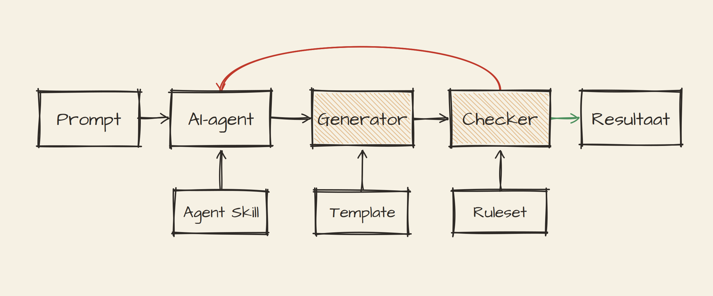
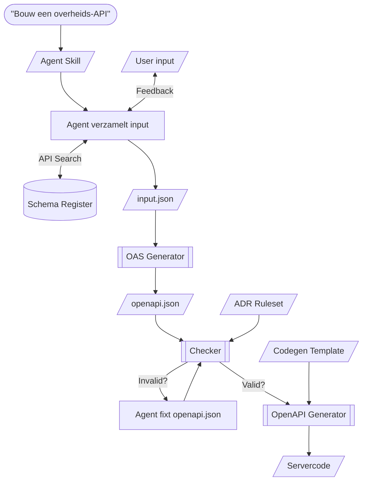
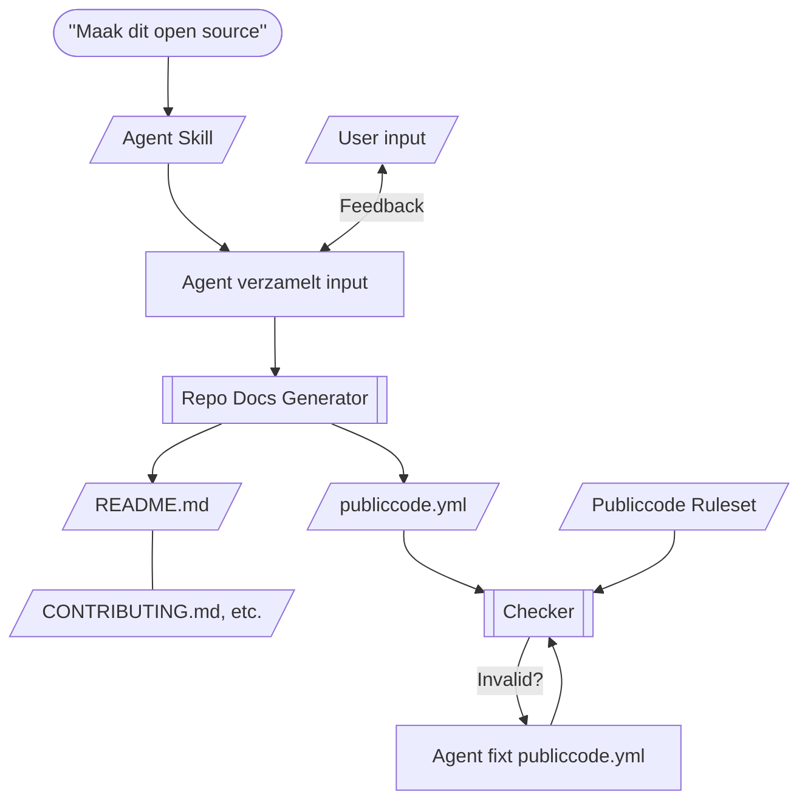

# Tools in the loop: "human in the loop" krijgt hulp

"Human in the loop" is inmiddels het standaardantwoord op bijna elke zorg rond
AI. Maar voor wie AI inzet om overheidssoftware te bouwen, is het verstandig om
naast de mens ook _tools_ in de loop houden: generators die het zware werk doen
en validators die de regels bewaken. Zo verschuift het naleven van standaarden
van de oplettendheid van een mens en de welwillendheid van AI naar tooling die
je kunt vertrouwen. Hoe dat samenwerkt, en aan welk arsenaal aan skills,
generators, validators en andere tools we werken, lees je in deze post.

<!-- truncate -->

:::success[TL;DR]

Als je AI gebruikt om software te bouwen, houd dan naast de mens ook onze
_tools_ in de loop:

- **Generators** doen het zware, repetitieve werk (boilerplate,
  projectstructuur) en zijn deterministisch.
- **Validators** beantwoorden de waarheidsvraag "Voldoet dit aan de regels?".
  Niet het model, maar een tool met een vaste set regels.
- De **command line** is de natuurlijke interface voor agents: de agent itereert
  op exit codes tot de checker `valid` teruggeeft.
- AI is zo een hulpmiddel voor de input, niet het orakel dat de waarheid
  bepaalt.

Dit valt of staat met **standaarden**: elke afspraak is een stukje waarheid dat
je in betrouwbare tooling stopt zodat AI het niet zelf hoeft te verzinnen.

:::

## Validators en generators worden steeds belangrijker

Je zou kunnen denken dat in een wereld waarin een AI-agent "gewoon de code
schrijft" de behoefte aan generators en validators afneemt. Het
tegenovergestelde is waar. Juist omdat een taalmodel plausibel-ogend werk
produceert dat tóch fout kan zijn, wordt het werk dat je níet aan het model wilt
overlaten belangrijker dan ooit.

Dat werk bestaat uit twee soorten. Het zware, repetitieve werk, zoals het
genereren van boilerplates en het opzetten van een projectstructuur, dat kun je
een generator laten doen. Die is deterministisch en doet elke keer hetzelfde. En
de waarheidsvraag, "Voldoet dit aan de regels die wij hanteren?", kun je door
een validator laten beantwoorden. Niet AI, niet de mens, maar een tool met een
vaste set regels.

Bovendien hoeft AI zo minder zelf te "bedenken". Dat scheelt hallucinaties en
het verbrandt geen onnodige tokens. Het model doet waar het goed in is, namelijk
taal en intentie interpreteren, en de tools doen waar zij goed in zijn.

## CLI als natuurlijke interface voor AI-agents

Agents leven op de command line. Ze roepen tools aan, lezen de output, en
bepalen op basis daarvan hun volgende stap. Dat maakt een CLI de meest
natuurlijke interface die je een agent kunt aanbieden: deterministisch,
scriptbaar, aan elkaar te knopen, en met een exit code en gestructureerde output
waar een agent direct op kan itereren.

Daarom hebben onze tools sinds kort allemaal een command line interface
gekregen, van de generators tot de checkers. Een invalid output uit onze checker
is daarmee een exit status: de agent leest het, ziet wat er mis is, past het aan
en draait de checker opnieuw. Daar draait de hele validatieloop op, zonder dat
er een mens tussen hoeft te zitten.

## Hoe alles samenwerkt

Vanuit developer.overheid.nl bieden we de volgende features (deels al, deels
binnenkort) aan. De rolverdeling:

- **Schema Register.** Een register van herbruikbare JSON schema's waar straks
  niet alleen mensen, maar ook agents uit kunnen putten. In plaats van schema's
  te verzinnen, verwijst de agent naar wat er al is. Met de komende upgrade naar
  [OpenAPI 3.1](/blog/2025/07/10/openapi-31-in-zicht) zijn deze schema's direct
  te gebruiken in OAS-documenten. Dit register is momenteel in ontwikkeling; we
  verwachten dit snel te kunnen lanceren.
- **[Agent Skills](https://github.com/developer-overheid-nl/skills-marketplace).**
  Hiermee geven we agents instructies mee: welke tool, op welk moment, in welke
  volgorde. De skill is wat de agent dwingt om onze tooling te gebruiken in
  plaats van zelf te improviseren. Deze zijn in beta en nog volop in onderzoek,
  dus gebruiken op eigen risico! Eerder schreven we al over
  [hoe je standaarden in je AI-assistant laadt](/blog/2026/03/25/skills).
- **[OAS Generator](https://developer-overheid-nl.github.io/oas-generator).**
  Genereert een boilerplate OpenAPI-document op basis van een `input.json`. Die
  boilerplate is al ADR-conform van opzet, dus de agent begint niet van scratch
  maar met een correct startpunt.
- **[Checker](https://developer-overheid-nl.github.io/don-checker).** Onze
  linter/validator die een document toetst aan een ruleset, bijvoorbeeld de
  ADR-ruleset voor een OAS of de publiccode-ruleset voor
  [`publiccode.yml`](/kennisbank/open-source/standaarden/publiccode-yml). Bij
  `valid` mag de pijplijn door, bij `invalid` moet er opnieuw geïtereerd worden.
  Dit is de spil waar de hele kwaliteitsborging om draait.
- **[Codegen Templates](https://github.com/developer-overheid-nl/codegen-templates).**
  Eigen [OpenAPI Generator](https://openapi-generator.tech/) templates, zodat de
  gegenereerde servercode voor API's aansluit op de API Design Rules en andere
  overheidsstandaarden. Momenteel hebben we een aantal smaken in de aanbieding,
  waaronder voor Java, Go, Node.js, Rust en Python.
- **[Repo Docs Generator](/kennisbank/open-source/tutorials/tutorial-repo-docs-generator).**
  Genereert de standaard repo-documentatie: een `README.md`, `CONTRIBUTING.md`,
  `CODE_OF_CONDUCT.md`, `LICENSE`, `SECURITY.md`, `CHANGELOG.md` en een
  `publiccode.yml`. In één keer nette, consistente templates in plaats van
  handmatig samengeraapte bestanden.

De AI doet in dit geheel maar twee dingen: de `input.json` vullen, een vast
formaat dat het model kent, en via dialoog met de gebruiker die input compleet
maken. Pas als de input volledig is, wordt er daadwerkelijk gegenereerd.

## Generator en checker zijn complementair

Een terechte vraag is: als de generator al een boilerplate maakt conform de
[API Design Rules (ADR)](/kennisbank/api-ontwikkeling/standaarden/api-design-rules),
en de agent borduurt voort op wat er al staat, heb je die checker dan überhaupt
nog nodig?

Het antwoord is ja, en het waarom is meteen het sterkste argument vóór deze
opzet. Het klopt dat een agent geneigd is om voort te borduren op een bestaand,
intern consistent document. Een schone boilerplate werkt als voorbeeld: de agent
ziet hoe wij naar het register verwijzen, hoe we fouten modelleren, welke naming
we hanteren, en trekt dat door. Dat is precies waarom je met een goede
boilerplate begint. Het vernauwt de output, scheelt tokens en verkleint de kans
op afwijkingen.

Maar het is geen garantie. Naarmate een document groeit, valt de oorspronkelijke
boilerplate buiten het effectieve aandachtsvenster van het model. Voeg je
functionaliteit toe waar geen voorbeeld voor in het document staat, dan valt het
model terug op zijn trainingsdata, en die is niet ADR-conform. En over meerdere
bewerkingen heen kunnen kleine afwijkingen zich opstapelen.

Daarom zijn de generator en de checker geen overlap maar complementair. De
generator-boilerplate zorgt dat de checker bijna altijd meteen `valid`
teruggeeft. De checker is er voor de keren dat dat niet zo is, of als er na de
generatie nog wijzigingen aan de OAS doorgevoerd worden. Denk aan extra
endpoints, filters, etc. De checker handhaaft de harde grens die een taalmodel
statistisch nooit kan garanderen.

## Een overheids-API bouwen

Tijd om te laten zien hoe die loop er in de praktijk uitziet. De onderstaande
flowchart toont het hele proces in één oogopslag; daaronder lopen we de stappen
langs.

De gebruiker geeft de prompt "bouw een overheids-API". De juiste skill wordt
getriggerd en stuurt de agent door een vast proces. Eerst verzamelt de agent
input: deels door vragen te stellen aan de gebruiker, deels door het
schema-register te doorzoeken naar bruikbare, herbruikbare schema's. Het
resultaat is een complete `input.json`.

Die input gaat de OAS Generator in, die er een boilerplate `openapi.json` van
maakt. Vervolgens komt de Checker om de hoek kijken. Deze toetst het document
tegen de ADR-ruleset. Is het `invalid`, dan gaat het terug: de agent fixt de OAS
en draait de checker opnieuw, net zo lang tot het klopt. Óók als het document na
de generatie nog gewijzigd wordt dus.

Het belangrijkste aan dit plaatje is de lus rond de checker. De agent _kan_ niet
langs de regels. Hij mag itereren, hij mag fouten maken, maar hij komt pas
verder als een deterministische tool groen licht geeft. De waarheid zit niet in
het model, maar in de checker.

## De code open source maken

Precies hetzelfde patroon keert terug voor een ander prompt. De flowchart
hieronder laat zien hoe:

"Maak dit open source" trapt een vergelijkbaar proces af: de juiste skill wordt
getriggerd, de agent verzamelt input en laat dat door de Repo Docs Generator
lopen. Die genereert in één keer de complete set repo-documentatie, van
`README.md` en `CONTRIBUTING.md` tot `CODE_OF_CONDUCT.md`, `LICENSE.md`,
`SECURITY.md`, `CHANGELOG.md` en een `publiccode.yml`. Vervolgens komt dezelfde
checker terug, nu met de publiccode-ruleset, die de `publiccode.yml` toetst. Is
het `invalid`, dan fixt de agent het bestand en draait de checker opnieuw, exact
dezelfde lus als bij het bouwen van de API. Saillant detail: als er reeds een
`README.md` is, zoals het geval is nadat je de OpenAPI-generator hebt gebruikt,
zal de agent deze aanpassen conform de template van de generator, welke de best
practices voor een `README.md` bevat.

In het geval van een bestaande codebase, instrueert de skill de agent om te
kijken naar de git remote, bestanden als `openapi.json` en het projectmanifest
(zoals een `package.json`, `pyproject.toml` of `pom.xml`) om daar de benodigde
input uit te halen. Doe je dit prompt vanuit de bestaande context, dan weet de
agent nog dingen uit de eerdere input. Denk hierbij bijvoorbeeld aan de
contactgegevens uit de zojuist gegenereerde OAS.

## Standaarden

Er zit een randvoorwaarde onder dit hele verhaal, en die verdient het om
expliciet genoemd te worden: standaarden. De templates, generators en validators
uit deze blog bestaan alleen omdat er standaarden onder liggen waar we ze
tegenaan kunnen bouwen, de ADR, de publiccode-standaard, herbruikbare schema's.
Zonder een vaste set regels is er niets om een boilerplate op te baseren of een
document tegenaan te toetsen.

Hoe meer er gestandaardiseerd wordt, hoe nauwkeuriger we onze templates,
generators en validators kunnen maken. Elke afspraak die we vastleggen is een
stukje waarheid dat we uit het model kunnen halen en in deterministische tooling
kunnen stoppen. Standaardisatie is de fundering die betrouwbaar bouwen met AI
mogelijk maakt. Hoe steviger die fundering, hoe meer je met een gerust hart aan
de tools kunt overlaten.

## Conclusie

Het resultaat is een proces dat reproduceerbaar en controleerbaar is. Dezelfde
input levert dezelfde output, en wat eruit komt voldoet aantoonbaar aan onze
regels, niet omdat een model toevallig goed gemutst was of een reviewer scherp
oplette, maar omdat een tool het heeft afgedwongen.

De rolverdeling is daarmee helder. Het taalmodel is de orkestrator die intentie
vertaalt naar input en tools aanroept, niet het orakel dat de waarheid bepaalt.
Generators doen het zware werk, validators bewaken de grenzen. En de mens blijft
gewoon in de loop, maar op het niveau waar menselijk oordeel telt: keuzes,
context, akkoord. Niet op het naleven van regels die een machine beter onthoudt.

Of je AI inzet is aan jou. Maar áls je het doet, houd dan niet alleen de mens in
de loop, maar óók beschikbare tools.
