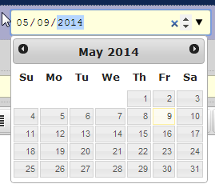
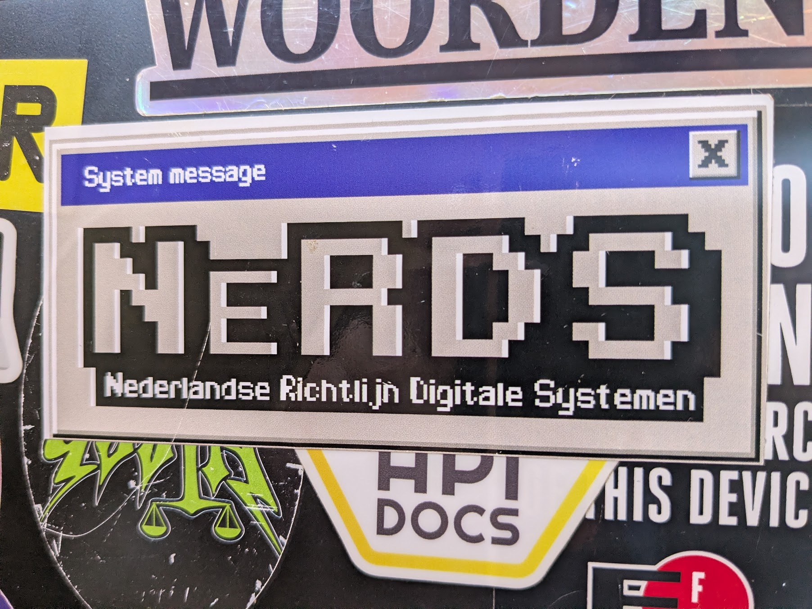

import { Alert, Heading, Paragraph } from
'@rijkshuisstijl-community/components-react';

# "Vraag niet wat je land voor jou kan doen – vraag wat jij voor je land kunt doen."

Toegegeven, het is een beetje een melodramatische quote. Maar ik vond hem
toepasselijk voor het thema van deze blogpost. Deze blogpost gaat namelijk over
effectief bijdragen aan een betere digitale overheid. De originele quote is van
niemand minder dan J.F. Kennedy en komt uit zijn inauguratie-speech uit 1961.
Met recht een andere tijd en plaats.

Mijn inspiratie voor deze blogpost kreeg ik toen ik een paar weken terug mijn
zoontje de fles aan het geven was op een nachtelijk uurtje, en me de volgende
vraag overviel:

**"Aannemende dat ik mijn werkdag start met het ultieme doel om de digitale
overheid beter te maken. Hoe doe ik dat dan zo effectief mogelijk?"**

<!-- truncate -->

Die vraag probeer ik te beantwoorden in deze blogpost.

 **John F. Kennedy op
September 12, 1962**

:::success[TL;DR]

Wil je als IT'er effectief bijdragen aan een betere digitale overheid? Er zijn
drie routes: (1) draag bij aan open source projecten met breed bereik, zoals NL
Design System of OpenKAT; (2) deel kennis via events en meetups; (3) zet
praktijkervaring om in standaarden zoals de API Design Rules of NeRDS. Zet dus
in op kennisdeling met maximaal bereik.

:::

<Alert type="ok">
  <Heading level={3}>Heading</Heading>
  <Paragraph>Lorem ipsum dolor sit amet, consectetur ad * isicing elit, sed do eiusmod *</Paragraph>
</Alert>

### Verschillende routes

Het eerste idee dat bij mij kwam bovendrijven was
dat als ik veel positieve impact wil maken, het belangrijk is om bij te dragen aan
projecten met een groot bereik. Het liefst zijn dat dus projecten die overheidsbreed gebruikt kunnen worden.

Nog een route zou kunnen zijn via kennisdeling. Als ik waardevolle kennis heb
over mijn vakgebied, kan ik die het beste delen zodat de kwaliteit van
dienstverlening als geheel beter wordt.

Ik kwam op een aantal verschillende routes:

## 1. Door middel van open source

Een open source project starten of eraan bijdragen kan een slimme manier zijn om
jouw kennis toepasbaar te maken en deze verder te verspreiden.

**Praktische voorbeelden**

Een paar voorbeelden van wat je als ICT'er bij de overheid allemaal kan bereiken
door je kennis te vertalen naar een concreet open source project.

### 1.1 Als front-end developer; een datepicker met goede A11Y

Stel je voor. Je bent een front-end developer en hebt aan veel verschillende
projecten gewerkt waarbij het nodig was een custom datepicker te bouwen die ook
nog eens moesten voldoen aan de WCAG richtlijnen. Als je dit wel eens gedaan
hebt dan weet je dat dit een aardige klus is (en dat is een understatement). Wat
als je zou besluiten deze opgedane kennis om te zetten in iets herbruikbaars,
namelijk een datepicker component (bij voorkeur binnen NL Design-System).

Elke keer als de datepicker weer wordt geïnstalleerd via NPM heb je winst
behaald voor de overheid, omdat er nu ergens in een applicatie een beter
bruikbare datepicker zit.

Ook als andere developers de datepicker niet gebruiken maar als inspiratie
gebruiken heb je winst, ze kunnen namelijk zo de kunst afkijken.

**Kennen jullie hem nog, de JQuery UI Datepicker?**

### 1.2 Als DevOps engineer; jouw Kubernetes-kennis beschikbaar stellen via Haven+

Dan weer een andere rol. Stel je bent een DevOps engineer met ambitie en je
helpt jouw organisatie door toe te werken naar een situatie waarin je
Kubernetesclusters ook kunnen draaien zonder leverancierspecifieke componenten.
Dan kan je hier andere organisaties ook wellicht mee helpen.

#### Meewerken aan Haven+

In dit geval is er al een project dat zich bezig houdt met het standaardiseren
van een leverancier-agnostische Kubernetes opzet. Dit project heet Haven en
heeft met Haven+ een standaard configuratie opgezet. De opzet is verkrijgbaar in
zowel [Flux](https://gitlab.com/commonground/haven/havenplus/gitops-flux) als
[ArgoCD](https://gitlab.com/commonground/haven/havenplus/gitops-argocd). Beide
implementaties kunnen nog wel wat contributers gebruiken.

### 1.3 Als CISO; deel jouw security-kennis met de mensen van OpenKAT

Als chief information security officer (CISO) is het belangrijk op de hoogte te
zijn van ontwikkelingen in de security-wereld. Daarbij kan het van pas komen om
een goed netwerk te hebben waardoor je weet wat er bij andere organisaties
speelt. Het deelnemen aan een open source project zoals OpenKAT (Kwetsbaarheden
Analyse Tool) kan je dat netwerk opleveren. Door te investeren in het product en
de mensen erachter te leren kennen begeef je je vanzelf in deze wereld en bouw
je een netwerk op.

#### Laat collega's tijd spenderen aan open source

Als jouw rol CISO is, is er een gerede kans dat je collega's in je team hebt die
je ook de ruimte kan geven om bij te dragen aan iets als OpenKAT. Als je als
organisatie gebruik maakt van een open source project is het slim om personeel
de kans te geven te investeren in dat project, zodat je in verbinding staat met
het project en de mogelijkheid hebt een beetje bij te sturen. Zo heb je een
stoel aan tafel, en het komt het project ten goede.

### Begin met inner source

Niet in elke organisatie kan je (helaas) direct een open source project
beginnen. Of je voelt je er simpelweg nog niet klaar voor. In dat geval kan je
jouw idee of component ook eerst als **inner source** project aanbieden en
promoten. Waarschijnlijk heb je veel kennis van wat jouw organisatie nodig heeft
en daardoor is de kans dat het project aan slaat groter dan dat je het direct
een overheidsbrede insteek geeft.

### Contribueren is niet altijd makkelijk

Het gaat zeker even duren voordat jij effectief kan bijdragen aan het open
source project van jouw keuze. Contribueren aan een groot open source project
gaat altijd vele malen complexer zijn dan gewoon code pushen naar een interne
repository waar niet veel mensen iets vinden van wat jij toevoegt. Toch is het
het proberen waard, als je immers bijdraagt, creëer je veel meer waarde.

Zie het als een skill die je jezelf eigen maakt, of een spier die je traint.

## 2. Werk aan bruikbare (technische) standaarden

Ook is het nuttig om jouw praktijkervaring om te zetten in technische
standaarden en validators. Voorbeelden van hoe bepaalde rollen kunnen bijdragen
aan standaarden:

### 2.1 Als beleidsmedewerker of architect; richtlijnen opstellen via NeRDS

Niet iedereen die wil bijdragen aan een betere digitale overheid is developer.
Stel je bent beleidsmedewerker of architect en hebt de afgelopen jaren veel
ervaring opgebouwd met het inkopen of beoordelen van digitale systemen. Je weet
welke vragen je moet stellen, welke valkuilen er zijn bij aanbestedingen en
welke eisen vaak ontbreken in programma's van eisen.

Die kennis kan jij aandragen door middel van een bijdrage aan
[**NeRDS**](https://minbzk.github.io/NeRDS/Over-NeRDS/) — de Nederlandse
Richtlijn Digitale Systemen. NeRDS bundelt richtlijnen en praktische handvatten
voor het verantwoord ontwerpen, ontwikkelen en inkopen van digitale systemen bij
de overheid. Het project werkt open source en verwelkomt actief bijdragen: van
feedback op bestaande richtlijnen tot het voorstellen van nieuwe.

Elke richtlijn die jij bijdraagt of verbetert op basis van jouw praktijkervaring
helpt andere organisaties betere keuzes te maken — bij elke nieuwe aanbesteding,
elk nieuw systeem.

**NeRDS is een project met potentie. Waar je ook rondloopt in de publieke
sector, je ziet deze stickers steeds vaker.**

### 2.2 Als backend developer; API-kennis vastleggen in de API Design Rules

Stel je bent een backend developer en hebt de afgelopen jaren tientallen REST
API's gebouwd voor verschillende overheidsorganisaties. Je weet inmiddels uit
ervaring welke fouten er steeds opnieuw worden gemaakt: inconsistente
naamgeving, ontbrekende paginering, slecht gebruik van HTTP-statuscodes.

Die kennis kun je omzetten in een concrete bijdrage aan de
[API Design Rules](https://github.com/Logius-standaarden/API-Design-Rules/issues).
Elke regel die jij toevoegt of verbetert, zorgt ervoor dat andere developers die
onze tools draaien automatisch gewaarschuwd worden voor dezelfde valkuilen. Je
kennis wordt zo een geautomatiseerde kwaliteitscheck voor de hele overheid.

## 3. Organiseer events tbv kennisdeling

Nog een mooie manier om de overheid te verbeteren is events te organiseren waar
kennisdeling centraal staat. Een aantal voorbeelden van wat je zou kunnen doen:

- Organiseer een hackathon
- Organiseer een demo-middag met borrel
- Organiseer een faalcafé met positieve insteek. Laat seniors vertellen over
  gemaakte fouten om te laten zien dat fouten maken iets menselijks is, en een
  kans om te leren
- Schrijf blogs voor het intranet en probeer discussies aan te zwengelen

Je zult gesprekken hebben met echte mensen. En erachter komen dat je heel veel
dingen nog niet wist. Namen van projecten te weten komen die relevant zijn voor
je werkveld.

Meetups waarop gelijkgestemenden rondlopen zijn een ding waar ik zelf veel
energie van krijg. Het gevoel ingebed te zijn, onderdeel van een groter geheel,
en samen iets goeds te doen — dat is lastig te evenaren.

## Mijn motivatie

In een wereld waarin de democratie onder druk staat denk ik dat het belangrijk
is dat we een overheid hebben die haar digitalisering op orde heeft. Op dit
moment is digitalisering nog te vaak de bottleneck als het gaat om uit te voeren
beleid.

Thema's als beveiliging, privacy, toegankelijkheid en digitale soevereiniteit
zijn wat mij betreft minimale randvoorwaarden voor overheidsdiensten. Het zorgt
ervoor dat burgers applicaties veilig kunnen gebruiken en dat er niemand wordt
buiten gesloten. De overheid is voor kennis over die thema's afhankelijk van
professionals. Ik ben zo'n professional, en ik wil die kennis graag inzetten.

## Conclusie

De vraag waarmee ik begon — hoe maak ik mijn werkdag zo effectief mogelijk voor
de digitale overheid — kan je natuurlijk op verschillende manieren beantwoorden.
Maar er zijn wel duidelijke routes te onderscheiden: draag bij aan open source
projecten met breed bereik, deel kennis via events en meetups, en zet
praktijkervaring om in standaarden die anderen verder helpen.

Wat ze gemeen hebben: het gaat altijd om kennisdeling en bereik. Een fix in een
gedeelde component, een richtlijn in NeRDS, een regel in de API Design Rules —
het zijn investeringen die zich keer op keer terugbetalen bij elke organisatie
die er gebruik van maakt.

Je hoeft niet alles tegelijk te doen. Kies de route die past bij waar jij goed
in bent, en begin klein.
