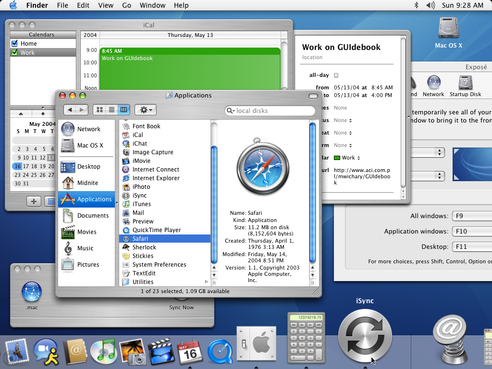

import { Blockquote } from "@rijkshuisstijl-community/components-react";

# "Vraag niet wat je land voor jou kan doen – vraag wat jij voor je land kunt doen."

Toegegeven, het is een beetje een melodramatische quote. Maar ik vond hem
toepasselijk voor het thema van deze blogpost. Deze blogpost gaat namelijk over
effectief bijdragen aan een betere digitale overheid. De originele qoute is van
niemand minder dan J.F. Kennedy en komt uit zijn inaugratie-speech uit 1961. Met
recht een andere tijd en plaats.

Mijn inspiratie voor deze blogpost kreeg ik toen ik een paar weken terug mijn
zoontje de fles aan het geven was op een nachtelijk uurtje, en me de volgende
vraag overviel:

<!-- truncate -->

<Blockquote
  variation="pink-background"
>
"Aannemende dat ik mijn werkdag start met het ultieme doel om de digitale
overheid beter te maken. Hoe doe ik dat dan zo effectief mogelijk?"
</Blockquote>

### Verschillende routes

Het eerste idee dat bij mij kwam boven drijven was
dat als ik impact wil maken, dat het dan belangrijk is om bij te dragen aan
projecten met een groot bereik. Het liefst dus projecten met een overheidsbreed bereik.

Nog een route zou kunnen zijn via kennisdeling. Als ik waardevolle kennis heb
over mijn vakgebied, kan ik die het beste delen zodat de kwaliteit van
dienstverlening als geheel beter wordt.

Ik kwam op een aantal verschillende routes:

## Manier 1; draag bij aan open source

Een open source project kan een slimme manier zijn om jouw kennis toepasbaar te
maken en deze verder te verspreiden. Maar waarom is open source daarvoor zo
geschikt?

Een inzicht dat ik opdeed tijdens het luisteren naar de
[podcast](https://podcast.publiccode.net/e/9-bastien-guerry-etalab/) van de
Foundation voor Publiccode biedt hier denk ik een antwoord op. In een aflevering
waarin Bastien Guery (Open Source adept, Franse overheid) beschrijft waarom hij
open source samenwerken zo interessant vindt, zegt hij het volgende:

<Blockquote
  attribution="— Bastien Guery"
  variation="pink-background"
  style={{marginBottom:'1em'}}
>

[13:13–13:25] I mean, for the usual people, software is just inward machinery
and it's something obscure. But for me software is knowledge. When you share
software, you share knowledge and if you don't have access to software then
someone is preventing you to understand things.

</Blockquote>

### Kennis tijdens ontstaan van software

Ik zie dit zelf in het licht van het proces waarin software tot stand komt. Elke
feature die wordt toegevoegd aan een codebase is gebaseerd op kennis van de
onderliggende processen en de organisatie(s) waarvoor de software bedoelt is.
Elke button, checkbox of dropdown staat op een bepaalde plek, in een bepaalde
stap van een workflow, die (hopelijk) voortvloeit uit de kennis die opgedaan is
over de eindgebruiker. Alle beslissingen borduren voort op eerdere beslissingen.

De software bevat dus praktijkkennis die vergaard is en belichaamd deze.

_Een voorbeeld, software verandert constant door opgedane kennis; MacOS ziet er
vandaag behoorlijk anders uit dan in 2003. Alhoewel, die glossy scrollbars
hadden ook wel wat he?_

Dit aannemende is het slim dat als ik kennis opdoe terwijl ik mijn werkzaamheden
voor de overheid ontplooi dit consolideer in een stuk software. En het liefst
dan in een stukje software die _hergebruikt_ kan worden, **buiten** mijn
organisatie, voor de **hele** overheid. Zo'n stuk software noem je een **Open
Source Component**. Iets wat elke overheidsorganisatie kan installeren om er de
vruchten van te plukken, betere producten te bouwen, met een hogere kwaliteit.
Mooie voorbeelden zijn:

- NL Design System
- Haven
- ~

Dan is het waarschijnlijk een slim idee om de kennis die ik heb, bijvoorbeeld
van hoe ik goed en kwalitatief een Kubernetes cluster inricht, toe te voegen aan
een plek waar andere developers binnen de overheid dit kunnen hergebruikt. Zoals
Frank Niessink zijn kennis over code kwaliteit nu aan het conslideren is in
richtlijnen op onze kennisbank, om later te toetsen.

Afijn, als het mijn doel is die overheid efficiënter te laten werken is het denk
ik een slimme keuze om bij te dragen aan een Open Source project, die een
component kan vormen om die gehele overheid beter te laten werken. Elk uur die
ik besteed aan het verbeteren van dat component heeft een veel grotere impact
dan dat ik binnen mijn organisatie iets verbeter. Of in mijn eigen codebaseje.

## Open source componenten, als magneet voor convergentie en kwaliteit

Door dingen makkelijk te maken voor developers en ze waarde te bieden bied je ze
een aantrekkelijke prospect. Als een open source project groot wordt binnen de
overheid zorgt dit voor convergentie, iedereen gaat op die manier werken. Zowel
technisch als organisatorisch.

### Technisch (Haven+)

Iedereen bouwt kubernetes op middels 1 manier met de haven+ componenten. Ja dit
is utopisch. Maar geweldig. Convergentie.

### Organisatorisch (NL-Design-System)

Zoals het estafettemodel van NL-Design-System. Met bijbehorende cultuur.

## Klopt; dat is niet makkelijk

Het gaat zeker even duren voordat jij effectief kan bijdragen aan het open
source project van jouw keuze. Contribueren aan een groot open source project
gaat altijd vele malen complexer zijn dan gewoon code pushen naar een interne
repository waar niemand iets vind van wat jij toevoegt. Toch is het het proberen
waard, als je immers bijdraagt, creëer je veel meer waarde.

## Een open source project bestaat nog niet

Het kan zijn dat jij een geniaal idee hebt waar de overheid nog geen OS
component voor heeft, dit zou kunnen. Echter zou het ook kunnen dat jij een
probleem gaat oplossen dat al veel mensen met veel moeite hebben proberen
oplossen. Door verschillende uiteenlopende redenen (organisatorisch/ technisch/
cultureel) kan het dat een dergelijke oplossing nooit voet aan de grond heeft
gekregen.

## Voorbeeld 2

- Ik ben een front-ender en leg mijn kennis over hoe a11y en handige UX zou
  moeten zijn vast in NL-Design-System componenten.

## Voorbeeld 1

Dev-ops/ K8s/ Haven

## Manier 2; organiseer kennisdeling in jouw organisatie

Nog een mooie manier om de overheid te verbeteren is door kennis te delen. En
dan dus niet door middel van mooie open source projecten maar gewoon als mensen
onder elkaar. Dit kan praktisch gezien door middel van verschillende manieren:

- Organiseer een interne hackathon
- Doe meer met een fieldlab van Digilab
- Organiseer een presentatie/ borrel moment binnen je organisatie.

Je zult gesprekken met echte mensen. En erachter komen dat je heel veel dingen
nog niet wist. Namen van project te weten komen die relevant zijn voor je
werkveld.

Bovendien is dit zelf een ding waar ik zelf veel energie van krijg. Borrelen met
gelijkgestemden, synergie voelen.

## Open deur; doe waar je goed in bent

## Call to action; probeer het een keer

En om af te sluiten met een handelingsperspectief. Probeer het gewoon een keer,
als je een typo ziet. Of een slecht geschreven paragraaf in de documentatie.
Maak een pull request aan met een verbetering. Open source samenwerken is niet
iets wat je in een weekje kan leren, het is een manier van werken/ denken en het
vraagt dikwijls om een handreiking. Maar daarom is het goed er vandaag mee te
beginnen, en ermee te gaan oefenen.
