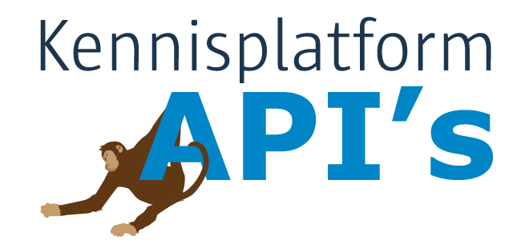

# Kennisplatform API's

Geonovum is samen met Bureau Forum Standaardisatie, Kamer van Koophandel, VNG Realisatie, Logius en het Kadaster het Kennisplatform API's gestart. Gezien de ontwikkeling naar een digitale samenleving waar veel digitale diensten eenvoudig met elkaar moeten kunnen samenwerken, geloven wij dat de Nederlandse overheid baat heeft bij een Kennisplatform API's, waarin we gezamenlijk kijken naar strategische en tactische vraagstukken rond het ontwikkelen van API's door de overheid en gebruik van deze APIs buiten en binnen de overheid.

## Waarom een kennisplatform API's?

Het Kennisplatform API's wil API's beter bij de vraag aan laten sluiten, kennis over het toepassen van API's uitwisselen en de aanpak bij verschillende organisaties op elkaar afstemmen en waar nodig standaardiseren. In het Kennisplatform verkennen we in werkgroepen de verschillende aspecten rond het gebruik en toepassing van API's door de overheid.

## API Strategie

De API strategie bestaat uit een een inleidend document, verschillende normatieve documenten (NL GOV standaarden) en meerdere modulen die voor verschillende functionele of technische situaties kunnen worden ingezet. Onderdelen van de API Strategie staan op de lijst met verplichte open standaarden van het Forum Standaardisatie.

De verschillende onderdelen van de NL API Strategie bevatten de volgende documenten:

| Onderdeel | Documentnaam & Verwijzing naar de gepubliceerde versie |
|----------|----------|
| Algemeen | [Inleiding NL API Strategie](https://geonovum.github.io/KP-APIs/API-strategie-algemeen/Inleiding/) |
| Algemeen | 	[Architectuur NL API Strategie](https://geonovum.github.io/KP-APIs/API-strategie-algemeen/Architectuur/) |
| Algemeen | [Gebruikerswensen NL API Strategie](https://geonovum.github.io/KP-APIs/API-strategie-algemeen/Gebruikerswensen/) |
| Normatief | [API Design Rules (ADR)](https://gitdocumentatie.logius.nl/publicatie/api/adr/) |
| Normatief | [Open API Specification (OAS)](https://forumstandaardisatie.nl/open-standaarden/openapi-specification) |
| Normatief | [NL GOV OAuth profiel](https://gitdocumentatie.logius.nl/publicatie/api/oauth/) |
| Normatief | [Digikoppeling REST API koppelvlak specificatie](https://gitdocumentatie.logius.nl/publicatie/dk/restapi/) |
| Functionele module | [GEO module](https://docs.geostandaarden.nl/api/API-Strategie-mod-geo/) |
| Technische module | [Transport Security module](https://geonovum.github.io/KP-APIs/API-strategie-modules/transport-security/) |
| Technische module | [Access control module](https://geonovum.github.io/KP-APIs/API-strategie-modules/access-control/) |

Het meest actuele overzicht van de API documentatie vind je op de [Github pagina van het Kennisplatform](https://github.com/geonovum/kp-apis#readme).

## Intentieverklaring API Strategie

Verschillende overheidsorganisaties hebben al een intentieverklaring ondertekend waarmee zij zich ervoor uitspreken om API’s te structureren conform de afspraken in de API Strategie. Deze intentieverklaring is opgesteld om samenwerking tussen partijen die binnen de overheid met API’s en standaarden werken te bevorderen.

[Meer informatie over de Intentieverklaring API Strategie](intentieverklaring)

## Gouden API's

**In 2019, 2021, 2023 en 2024 heeft het Kennisplatform API's Gouden API's uitgereikt. De Gouden API is een award voor vooruitstrevende API initiatieven.**

Met de uitreiking van de gouden API brengen we de maatschappelijke toegevoegde waarde van API's onder de aandacht èn zetten we de organisatie waar deze is ontwikkeld extra in het zonnetje. De jury kijkt naar maatschappelijke relevantie van de API, technisch gebruiksgemak en de kwaliteit van de API.

In 2024 ging de Gouden API naar de CPA Register API. In 2023 heeft het Kennisplatform API's een Gouden API Award uitgereikt aan de Open Onderwijs-API van de Samenwerkende Universitaire Reken Faciliteiten (SURF). In 2021 ontving de Rijksdienst voor Identiteitsgegevens een Gouden API voor hun Haal Centraal BRP API. En in 2019 kreeg Kadaster een Gouden API voor hun BAG-API.

## Masterclasses

Om kennis te delen over het maken en gebruiken van APIs, publiceren we Masterclasses. Deze Masterclasses zijn na de live uitzending ook nog online te bekijken.

- Sessie Kennisplatform API met [op minuut 18.17 de Masterclass 'Van UML Model naar API Specificatie'](https://youtu.be/B98638Aa27Q) door de Johan Boer (VNG) en het Koos Boersma (Informatiehuis Water) en op [1.27 uur de Masterclass 'Studentmobiliteit met Emrex'](https://youtu.be/B98638Aa27Q) met Gerald Groot Roessink, Jan Joost Norder en Pieter Zeeuw van DUO.
- [Transport Operator, Mobility as a service Provider API](https://youtu.be/wWf8w6NfDRI) - Bon Bakermans, Ministerie van Infrastructuur en Waterstaat
- [De Blauwe Knop](https://youtu.be/uqXbB6Igz2w) - Kiske de Leest en Timen Olthof, VNG Realisatie
- [Haal Centraal BRP-API](https://youtu.be/mv4afTdxyH0)- Mel Raboen de Sánchez Pacheco | RvIG, Bob te Riele | RvIG en Cathy Dingemanse | VNG Realisatie, Haal Centraal
- [Veilig Samenwerken met API's](https://www.youtube.com/watch?v=ZUuEsquzMPw) - Pascal de Haan, Politie
- [KPN API Store](https://vimeo.com/fixvision/review/485974071/90e4ba80ed?sort=lastUserActionEventDate&amp;direction=desc) - Wouter van Schaik, KPN
- [Implementatie API managementplatform bij Logius](https://vimeo.com/fixvision/review/484431070/e38eddced0?sort=lastUserActionEventDate&amp;direction=desc) - Paul van Gent, Logius
- [API en Microservice beveiliging | Hoe API beveiliging wordt toegepast bij Machtigen](https://vimeo.com/fixvision/review/484360046/b0852767c4?sort=lastUserActionEventDate&amp;direction=desc) - Frank van Es
- [De beste API Style voor jouw missie kies je zo!](https://vimeo.com/fixvision/review/484047083/2468ea9c81?sort=lastUserActionEventDate&amp;direction=desc) - Joost Farla en Cathy Dingemanse, Kennisplatform API's
- [Casus derdenbeslag | Toepassing API strategie, regie op gegevens, mens centraal](https://vimeo.com/fixvision/review/484068253/4d70aaf0c3?sort=lastUserActionEventDate&amp;direction=desc) - Steven Gort en Bert Lukkien
- [Developer.overheid.nl | voor het vinden en delen van APIs van de overheid](https://vimeo.com/fixvision/review/486399728/1d0fe094b7?sort=lastUserActionEventDate&amp;direction=desc) - Eelco Hotting
- [Bekijk de API Talkshow](https://www.youtube.com/watch?v=cbV_Kn4At-8) van december 2020 waarin gasten uit binnen- en buitenland vertelden over actuele ontwikkelingen

## Meedoen?

Het Kennisplatform API's is een open platform waar overheden, marktpartijen, gebruikers en aanbieders samen werken aan een Nederlandse API strategie en alles wat daar verder bij komt kijken. Wil je meedoen?

[Meld je aan voor de werkgroep(en)](https://www.formdesk.com/geonovum/KennisplatformAPI)

## Blijf op de hoogte

Wil je door ons op de hoogte worden gehouden? Met enige regelmaat brengen wij een nieuwsbrief uit met daarin het laatste nieuws over het Kennisplatform, uitnodigingen voor bijeenkomsten en meer.

[Abonneer je op de nieuwsbrief](https://laposta.nl/f/sszgbp9vquln)
