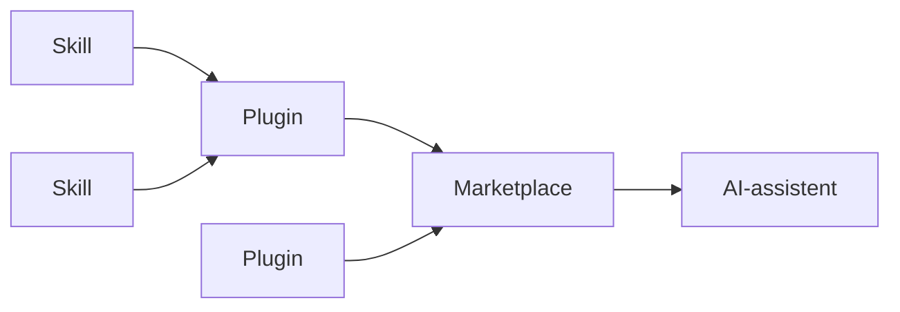

# Skills, plugins en marketplaces

Deze drie termen worden door elkaar gebruikt, ook door leveranciers onderling.
Ze staan voor drie lagen die op elkaar stapelen.

## Skill

Een **skill** is een instructie die je aan een AI-assistent meegeeft,
opgeschreven in markdown. Hij beschrijft hoe je een bepaalde taak aanpakt en,
minstens zo belangrijk, wanneer de assistent hem moet inzetten.

Het idee erachter is progressive disclosure: de korte omschrijving staat altijd
in het geheugen van de assistent, de volledige tekst wordt pas gelezen als de
taak erom vraagt. Zo kun je veel kennis beschikbaar stellen zonder dat het
contextvenster vol loopt.

Een skill is dus geen code die draait. Het is tekst die het gedrag van het model
stuurt.

## Plugin

Een **plugin** bundelt een of meer skills rond één onderwerp, met een
manifestbestand dat naam, versie en inhoud beschrijft. Een plugin kan naast
skills ook commando's en agents bevatten.

Je installeert een plugin per project of voor al je werk. Daarmee is het de
eenheid van distributie: je deelt geen losse markdownbestanden, je deelt een
plugin.

## Marketplace

Een **marketplace** is een catalogus van plugins: een bestand dat opsomt welke
plugins er zijn en waar ze vandaan komen. Je voegt de catalogus één keer toe aan
je assistent en installeert daarna wat je nodig hebt.

Een marketplace is geen appstore met een keuringsdienst. Wie de catalogus
beheert, bepaalt wat erin komt en welke eisen daarbij gelden. Dat maakt het
onderscheid tussen catalogusbeheer en inhoudelijke goedkeuring belangrijk: die
twee liggen lang niet altijd bij dezelfde partij.

## Hoe het samenhangt

## Waarom dit voor de overheid uitmaakt

Een standaard staat in een specificatie die niemand tijdens het programmeren
openslaat. Een skill brengt die kennis naar het moment waarop de code wordt
geschreven.

Dat is de belofte, en meteen het risico: een skill is een samenvatting, en een
samenvatting kan verouderen of afwijken van de standaard waarop hij is
gebaseerd. Daarom hoort bij elke skill te staan wie hem beheert en of de
beheerder van de onderliggende standaard hem heeft beoordeeld.

## Verder lezen

- [Beschikbare plugins](./plugins.md): de catalogus en hoe je installeert
- [Verantwoording en voorbehouden](./verantwoording.md): wat je er wel en niet
  van mag verwachten
- [Bouw zelf een AI-plugin](../tutorials/bouw-een-plugin.md)
