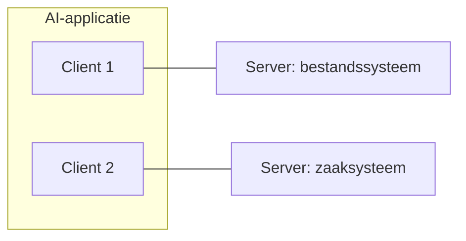

# Model Context Protocol (MCP)

Het Model Context Protocol is een open standaard voor het koppelen van
AI-applicaties aan externe systemen: databases, bestanden, zoekmachines, API's.
Zonder zo'n protocol schrijft elke leverancier zijn eigen koppelvlak en bouw je
dezelfde integratie opnieuw voor elke assistent.

De vergelijking die de specificatie zelf gebruikt: MCP is de USB-C-poort voor
AI-applicaties. Je bouwt de koppeling één keer en gebruikt hem overal.

Voor de overheid is dat een bekend patroon. Je publiceert je API één keer
volgens een standaard, in plaats van per afnemer een eigen koppeling te maken.
MCP doet hetzelfde voor de laag tussen model en systeem.

## MCP en je API

De vraag die hierna altijd komt: vervangt dit mijn API? Nee. Een MCP-server zet
er een laag bovenop, en in de praktijk is die server zelf een afnemer van je
API.

Het verschil zit in wie de aanroeper is en wat die vooraf weet. Een API
veronderstelt een programmeur die de documentatie heeft gelezen en weet wat hij
wil. Het contract staat vast, de aanroep staat in code, en als het contract
wijzigt breekt die code. Een MCP-server praat met een model dat vooraf niet weet
wat er te halen valt. Daarom vraagt de client bij het begin welke tools er zijn
en wat ze doen, en kiest het model er dan een.

|                   | API                                 | MCP-server                                 |
| ----------------- | ----------------------------------- | ------------------------------------------ |
| Aanroeper         | een programma dat het contract kent | een model dat het contract opvraagt        |
| Ontdekken         | vooraf, uit de OAS                  | tijdens het gesprek, via `tools/list`      |
| Wie kiest         | de programmeur, in code             | het model, per vraag                       |
| Beschrijving      | documentatie voor mensen            | onderdeel van de prompt                    |
| Bij een wijziging | de aanroepende code breekt          | het model kiest anders, zonder foutmelding |

Die laatste twee rijen zijn de reden om hier anders naar te kijken dan naar een
gewone integratie. De omschrijving van een tool is geen documentatie maar invoer
voor het model: zij bepaalt of en wanneer de tool wordt gekozen. Een
onduidelijke omschrijving is dus geen documentatieprobleem maar een functioneel
probleem. En waar een contractwijziging bij een API een harde fout geeft,
verandert bij MCP stilletjes het gedrag.

Praktisch betekent dit drie dingen:

- **Bouw de API eerst.** Zonder API heeft een MCP-server niets te ontsluiten. De
  verplichtingen blijven staan: de
  [API Design Rules](/kennisbank/api-ontwikkeling/standaarden), een OAS, het
  API-register
- **Zet de MCP-server ernaast, niet ervoor.** Andere afnemers blijven de API
  gebruiken. Een server die de enige weg naar je data wordt, maakt een
  AI-assistent een verplichte schakel
- **Een MCP-server is geen dunne doorgeefluik.** Een API ontworpen voor
  programma's geeft vaak te veel terug in te veel aanroepen. Een bruikbare
  server bundelt dat tot een paar tools met een duidelijke taak

## De rollen

| Rol        | Wat het is                                            |
| ---------- | ----------------------------------------------------- |
| **Host**   | De AI-applicatie waar de gebruiker mee werkt          |
| **Client** | De verbinding binnen de host, één per server          |
| **Server** | Het programma dat context of functionaliteit aanbiedt |

Een host onderhoudt een aparte client per server. Wie een systeem ontsluit,
bouwt een **server**.

## Wat een server aanbiedt

Een server kan drie soorten dingen aanbieden:

- **Tools**: functies die de assistent kan aanroepen om iets te doen: een query
  uitvoeren, een record aanmaken, een berekening laten draaien
- **Resources**: gegevens die als context dienen: de inhoud van een bestand, een
  schema, het antwoord van een API
- **Prompts**: herbruikbare sjablonen voor een interactie

Het onderscheid tussen tools en resources is het bekende verschil tussen een
actie en een gegeven. Een tool verandert iets of berekent iets; een resource is
er alleen om gelezen te worden.

De client ontdekt wat er is via `tools/list`, `resources/list` en
`prompts/list`, en voert uit via `tools/call`. Onderliggend is het gewoon
JSON-RPC 2.0, waarbij elk verzoek op zichzelf staat: de versie en de
mogelijkheden van de client reizen mee per verzoek, in plaats van eenmalig bij
het opzetten van een verbinding.

Omgekeerd kan de client ook iets aanbieden aan de server. Vandaag is dat
**elicitation**: de server vraagt tijdens het uitvoeren om aanvullende
informatie, en de client legt die vraag bij de gebruiker neer.

Naast het kernprotocol staan er optionele **extensies**, die beide kanten
expliciet moeten ondersteunen:

- **Tasks** voor bewerkingen die lang duren, met een handle waarop je later
  terugkomt
- **Skills over MCP** voor het aanbieden van werkinstructies via MCP, in plaats
  van als bestanden; zie
  [Skills, plugins en marketplaces](/kennisbank/ai/skills-plugins-en-marketplaces)
- **MCP Apps** voor interactieve elementen zoals een formulier of een grafiek in
  het gesprek

## Transport

Er zijn twee transportmechanismen:

- **stdio**: de server draait als lokaal proces op dezelfde machine en
  communiceert via standaard in- en uitvoer. Geen netwerk, dus ook geen
  netwerkrisico
- **Streamable HTTP**: de server draait ergens anders en is bereikbaar over
  HTTP, met optioneel Server-Sent Events voor streaming. Authenticatie via de
  gebruikelijke HTTP-mechanismen; de specificatie beveelt OAuth aan

Voor een koppeling binnen je eigen omgeving is stdio het eenvoudigst. Zodra
meerdere gebruikers of systemen dezelfde server benaderen, is Streamable HTTP de
route.

## Aandachtspunten voor de overheid

**Autorisatie is jouw werk.** Het protocol regelt hoe er wordt gepraat, niet wie
wat mag. Een MCP-server die een zaaksysteem ontsluit, heeft dezelfde
autorisatievragen als elke andere integratie. Least privilege, een eigen
serviceaccount en logging horen erbij.

**Alles wat binnenkomt kan gedrag sturen.** De inhoud die een server teruggeeft,
komt in de context van het model terecht. Staat er in een veld een instructie
gericht aan de assistent, dan kan die worden opgevolgd. Behandel de output van
een server dus als onvertrouwde invoer, niet als data die alleen gelezen wordt.

**Het protocol beweegt snel.** De huidige versie is `2026-07-28`. Daarin is de
`initialize`-handshake vervallen en kan een server geen verzoeken meer naar de
client sturen; implementaties van voor die versie werken anders en de
specificatie beschrijft hoe je daarop terugvalt. Controleer bij het bouwen welke
versie je tegenover je hebt.

## Meer weten

- [modelcontextprotocol.io](https://modelcontextprotocol.io/): documentatie en
  SDK's
- [Specificatie](https://modelcontextprotocol.io/specification/latest)
- [Referentie-implementaties](https://github.com/modelcontextprotocol/servers)
