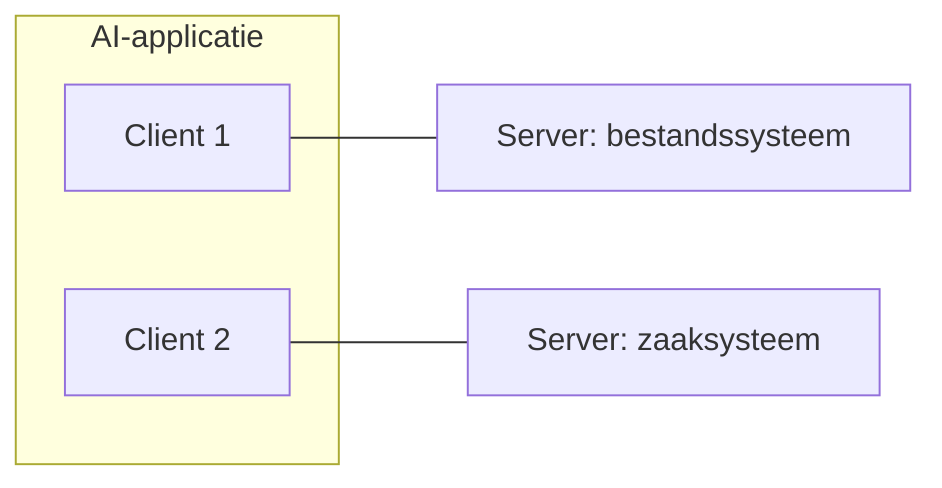

# Model Context Protocol (MCP)

Het Model Context Protocol is een open standaard voor het koppelen van
AI-applicaties aan externe systemen: databases, bestanden, zoekmachines, API's.
Zonder zo'n protocol schrijft elke leverancier zijn eigen koppelvlak en bouw je
dezelfde integratie opnieuw voor elke assistent.

De vergelijking die de specificatie zelf gebruikt: MCP is de USB-C-poort voor
AI-applicaties. Je bouwt de koppeling één keer en gebruikt hem overal.

Voor de overheid is dat een bekend patroon. Je publiceert je API één keer
volgens een standaard, in plaats van per afnemer een eigen koppeling te maken.
MCP doet hetzelfde voor de laag tussen model en systeem.

## De rollen

| Rol        | Wat het is                                            |
| ---------- | ----------------------------------------------------- |
| **Host**   | De AI-applicatie waar de gebruiker mee werkt          |
| **Client** | De verbinding binnen de host, één per server          |
| **Server** | Het programma dat context of functionaliteit aanbiedt |

Een host onderhoudt een aparte client per server. Wie een systeem ontsluit,
bouwt een **server**.

## Wat een server aanbiedt

Een server kan drie soorten dingen aanbieden:

- **Tools**: functies die de assistent kan aanroepen om iets te doen: een query
  uitvoeren, een record aanmaken, een berekening laten draaien
- **Resources**: gegevens die als context dienen: de inhoud van een bestand, een
  schema, het antwoord van een API
- **Prompts**: herbruikbare sjablonen voor een interactie

Het onderscheid tussen tools en resources is het bekende verschil tussen een
actie en een gegeven. Een tool verandert iets of berekent iets; een resource is
er alleen om gelezen te worden.

De client ontdekt wat er is via `tools/list`, `resources/list` en
`prompts/list`, en voert uit via `tools/call`. Onderliggend is het gewoon
JSON-RPC 2.0.

## Transport

Er zijn twee transportmechanismen:

- **stdio**: de server draait als lokaal proces op dezelfde machine en
  communiceert via standaard in- en uitvoer. Geen netwerk, dus ook geen
  netwerkrisico
- **Streamable HTTP**: de server draait ergens anders en is bereikbaar over
  HTTP, met optioneel Server-Sent Events voor streaming. Authenticatie via de
  gebruikelijke HTTP-mechanismen; de specificatie beveelt OAuth aan

Voor een koppeling binnen je eigen omgeving is stdio het eenvoudigst. Zodra
meerdere gebruikers of systemen dezelfde server benaderen, is Streamable HTTP de
route.

## Aandachtspunten voor de overheid

**Autorisatie is jouw werk.** Het protocol regelt hoe er wordt gepraat, niet wie
wat mag. Een MCP-server die een zaaksysteem ontsluit, heeft dezelfde
autorisatievragen als elke andere integratie. Least privilege, een eigen
serviceaccount en logging horen erbij.

**Alles wat binnenkomt kan gedrag sturen.** De inhoud die een server teruggeeft,
komt in de context van het model terecht. Staat er in een veld een instructie
gericht aan de assistent, dan kan die worden opgevolgd. Behandel de output van
een server dus als onvertrouwde invoer, niet als data die alleen gelezen wordt.

**Het protocol beweegt snel.** De versie van dit schrijven is `2026-07-28`, en
onderdelen die eerder in de specificatie stonden zijn inmiddels vervallen.
Controleer bij het bouwen welke versie je tegenover je hebt.

## Meer weten

- [modelcontextprotocol.io](https://modelcontextprotocol.io/): documentatie en
  SDK's
- [Specificatie](https://modelcontextprotocol.io/specification/latest)
- [Referentie-implementaties](https://github.com/modelcontextprotocol/servers)
