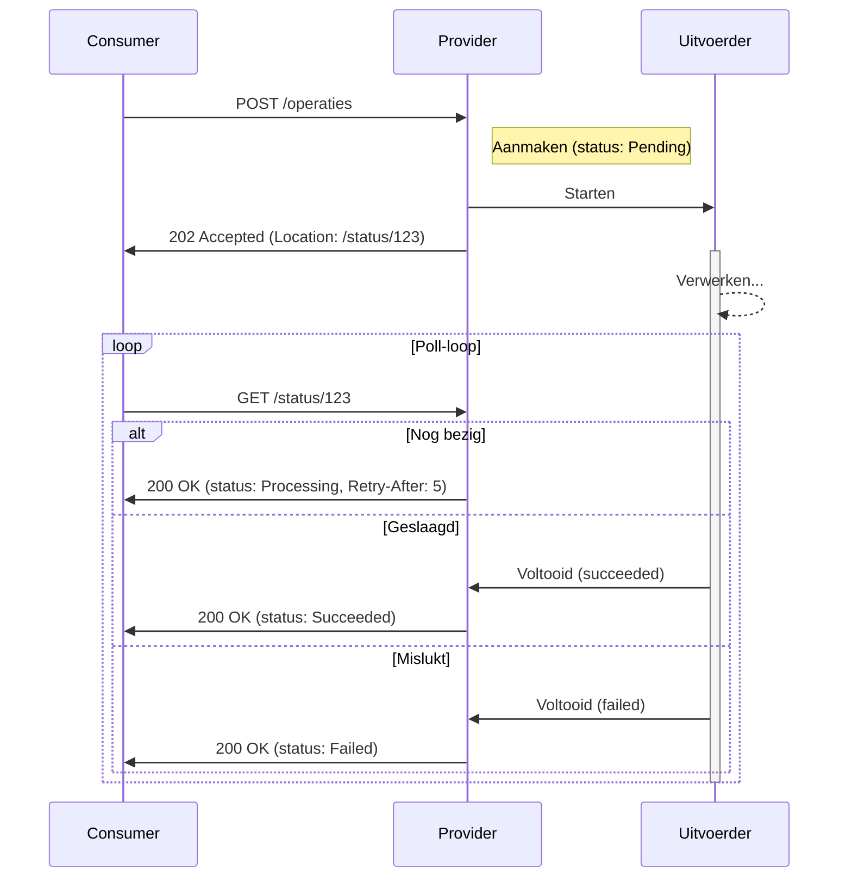

# Asynchronous Request-Reply Pattern

Het Asynchronous Request-Reply pattern is ideaal voor operaties die lang duren,
onvoorspelbaar zijn qua tijdsduur of verloop, óf waarbij de provider een
vervolgactie teruglegt bij de consumer. Denk aan het genereren van rapportages,
batch-updates, of processen waarbij de provider direct een verwijzing teruggeeft
— zoals een URL waarnaar de consumer asynchroon een bestand moet uploaden.

## Problemen bij synchrone verwerking

Wanneer een consumer een langdurige of onvoorspelbare operatie start (zoals
documentverwerking of batch-updates) en synchroon wacht op het resultaat, kunnen
timeouts optreden. Het verhogen van de timeout-limiet is hierbij een _bad
practice_, omdat dit resources aan de providerkant onnodig lang bezet houdt.
Bovendien zijn timeouts vaak afhankelijk van de netwerkverbinding en
tussenliggende infrastructuur, wat de limiet arbitrair maakt en geen
succesgarantie biedt. De consumer blijft dan in onzekerheid over de status, wat
leidt tot onbetrouwbaarheid en potentieel dubbele verwerking bij retries. Dit
resulteert in een slechte gebruikerservaring en mogelijke data-inconsistentie.

## Asynchroon verwerken

Het Asynchronous Request-Reply pattern lost dit op door het request los te
koppelen van de verwerking. De provider accepteert de operatie en geeft
onmiddellijk een bevestiging, waarna de verdere afhandeling asynchroon
plaatsvindt. De consumer wordt via een statusendpoint op de hoogte gehouden van
de voortgang.

### Werking

Het verloop is als volgt:

1. **Request**: De consumer stuurt een `POST`-request om een operatie te
   starten. Zie ook
   [Veilige retries met volledige idempotency](./retries-met-volledige-idempotency.md)
   voor veilige retries. Leg de geaccepteerde operatie duurzaam vast voordat je
   `202 Accepted` retourneert, zodat deze intern niet verloren kan gaan.
2. **Acceptatie**: De provider valideert de aanvraag en stuurt direct een
   [`202 Accepted`](https://www.rfc-editor.org/rfc/rfc9110#name-202-accepted)
   response met een `Location` header naar het statusendpoint. De response body
   kan aanvullende informatie bevatten, zoals een upload-URL of referenties naar
   gerelateerde (vervolg)acties voor de consumer.
3. **Status opvragen**: De consumer pollt het statusendpoint met `GET`-requests.
   De provider kan een advies meegeven over het volgende pollmoment,
   bijvoorbeeld met een
   [`Retry-After`](https://www.rfc-editor.org/rfc/rfc9110#name-retry-after)
   header. Voor directe updates zonder polling zijn Server-Sent Events (SSE) of
   Webhooks geschikter (zie [Event-Driven Architecture](./eda.md)).
4. **Statusupdate**: Het statusendpoint geeft de huidige status (bijv.
   "Processing"), eventueel met een voortgangspercentage of schatting van de
   resterende tijd.
5. **Voltooiing**: Bij voltooiing meldt het endpoint "Succeeded" met een link
   naar of inhoud van het resultaat, of "Failed" met bijvoorbeeld
   [Problem Details](./problem-details.md). Als alternatief kan het
   statusendpoint bij succesvolle voltooiing antwoorden met een `303 See Other`
   redirect naar de URL van het uiteindelijke resultaat.

Hieronder het sequentiediagram voor de polling-variant van "Status opvragen".



## Voorbeeld in OpenAPI

Hieronder een deel van een voorbeeld van hoe je dit patroon in een OpenAPI
specificatie kunt vastleggen, met de start van de operatie en een apart
statusendpoint.

```yaml
paths:
  /operaties:
    post:
      summary: Start een asynchrone operatie
      parameters:
        - name: Idempotency-Key
          in: header
          # ...
      requestBody:
        required: true
        content:
          application/json:
            schema:
              $ref: "#/components/schemas/MijnAanvraag"
      responses:
        "202":
          description: Aanvraag geaccepteerd en asynchroon in verwerking genomen
          headers:
            Location:
              description: URL van het statusendpoint voor deze operatie.
              schema:
                type: string
                format: uri
          content:
            application/json:
              schema:
                $ref: "#/components/schemas/OperatieStatus"
  /status/{operatieId}:
    get:
      summary: Vraag de status van een operatie op
      parameters:
        - name: operatieId
          in: path
          required: true
          schema:
            type: string
            format: uuid
      responses:
        "200":
          description: Huidige status van de operatie
          headers:
            Retry-After:
              description:
                Aanbevolen wachttijd in seconden voor de volgende poll, indien
                de operatie nog niet voltooid is.
              schema:
                type: integer
          content:
            application/json:
              schema:
                $ref: "#/components/schemas/OperatieStatus"
        "404":
          description: Operatie niet gevonden

components:
  schemas:
    OperatieStatus:
      type: object
      required:
        - status
      properties:
        status:
          type: string
          enum:
            - Pending
            - Processing
            - Succeeded
            - Failed
        resultaatUrl:
          type: string
          format: uri
          description:
            URL van het uiteindelijke resultaat zodra de operatie is voltooid.
```

### Voordelen

- **Verbeterde gebruikerservaring**: De consumer krijgt direct feedback en hoeft
  niet te wachten op voltooiing.
- **Betrouwbaarheid**: Timeouts aan de consumerkant worden voorkomen; de status
  is altijd opvraagbaar.
- **Minder domeinkennis bij de consumer**: Vervolgstappen komen vanuit de
  provider; de consumer hoeft de volgorde van stappen niet vooraf te kennen.
  Denk aan domein-specifieke afhankelijkheden waarbij de ene resource eerst
  aangemaakt moet zijn vóórdat een andere aangemaakt kan worden — en waarbij die
  volgorde per type object kan verschillen. Zonder dit patroon moet de consumer
  die volgorde per situatie kennen en zelf de juiste resources en acties in de
  juiste volgorde aanroepen. Met dit patroon geeft de provider na acceptatie de
  benodigde vervolgacties terug — bijvoorbeeld als links in de status response
  body — zodat de consumer het proces stap voor stap kan doorlopen zonder die
  domeinkennis zelf te bevatten.

### Nadelen

- **Meer technische complexiteit bij de consumer**: In plaats van één
  request-response-cyclus moet de consumer de afhandeling van asynchrone
  statussen implementeren — via polling, SSE of webhooks — inclusief
  retry-afhandeling en statusinterpretatie.
- **Persistente toestand bij de provider**: De provider moet operatiestatus
  opslaan en na verloop van tijd opschonen.
