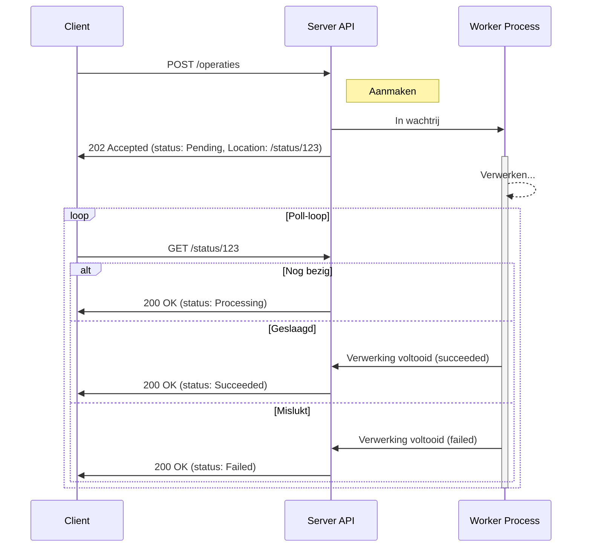

# Asynchronous Request-Reply Pattern

Het Asynchronous Request-Reply pattern is van toepassing bij operaties die
langer duren dan een paar seconden, of waarvan de duur onvoorspelbaar is — zoals
het genereren van rapportages, batch-updates, of het uploaden van bestanden via
een externe opslagdienst.

## Timeouts bij langdurige operaties

Wanneer een client een langdurige operatie start (zoals documentverwerking of
batch-updates) en synchroon wacht op het resultaat, kunnen timeouts optreden.
Het verhogen van de timeout-limiet is hierbij een _bad practice_, omdat dit
serverbronnen onnodig lang bezet houdt. Bovendien zijn timeouts vaak afhankelijk
van de netwerkverbinding en tussenliggende infrastructuur, wat de limiet
arbitrair maakt en geen succesgarantie biedt. De client blijft dan in
onzekerheid over de status, wat leidt tot onbetrouwbaarheid en potentieel
dubbele verwerking bij retries. Dit resulteert in een slechte gebruikerservaring
en mogelijke data-inconsistentie.

## Asynchroon verwerken

Het Asynchronous Request-Reply pattern lost dit op door de aanvraag los te
koppelen van de verwerking. De server accepteert de operatie, geeft onmiddellijk
een bevestiging en handelt de taak op de achtergrond af.

### Werking

Het verloop is als volgt:

1. **Request**: De client stuurt een `POST`-request om een langdurige operatie
   te starten. Om te voorkomen dat de operatie bij een retry (bijvoorbeeld na
   een timeout) dubbel wordt uitgevoerd, moet dit initiële request idempotent
   zijn. Zie ook
   [Veilige retries met volledige idempotency](./retries-met-volledige-idempotency.md).
2. **Acceptatie**: De server valideert de aanvraag, slaat de operatie op (status
   "Pending") en stuurt direct een
   [`202 Accepted`](https://www.rfc-editor.org/rfc/rfc9110#name-202-accepted)
   response. De `Location` header verwijst naar een statusendpoint waar de
   voortgang gevolgd kan worden.
3. **Status opvragen**: De client pollt het statusendpoint met `GET`-requests.
   Om te voorkomen dat de client te frequent pollt, kan de server een
   [`Retry-After`](https://www.rfc-editor.org/rfc/rfc9110#name-retry-after)
   header meesturen met de aanbevolen wachttijd tot de volgende poll. Voor
   directe statusupdates zonder polling-vertraging kunnen ook Server-Sent Events
   (SSE) of Webhooks ingezet worden. Zie ook
   [Event-Driven Architecture](./eda.md).
4. **Statusupdate**: De response toont de huidige status (bijv. "Processing") en
   eventueel een voortgangspercentage of schatting van de resterende tijd.
5. **Voltooiing**: Bij voltooiing meldt het endpoint "Succeeded" (met een link
   naar of inhoud van het resultaat) of "Failed" (met foutdetails). De client
   kan dan indien nodig het resultaat ophalen.

Hieronder het sequentiediagram voor de polling-variant van "Status opvragen".



## Voorbeeld in OpenAPI

Hieronder een deel van een voorbeeld van hoe je dit patroon in een OpenAPI
specificatie kunt vastleggen, met de start van de operatie en een apart
statusendpoint.

```yaml
paths:
  /operaties:
    post:
      summary: Start een langdurige operatie
      parameters:
        - name: Idempotency-Key
          in: header
          # ...
      requestBody:
        required: true
        content:
          application/json:
            schema:
              $ref: "#/components/schemas/MijnAanvraag"
      responses:
        "202":
          description: Aanvraag geaccepteerd en asynchroon in verwerking genomen
          headers:
            Location:
              description: URL van het statusendpoint voor deze operatie.
              schema:
                type: string
                format: uri
          content:
            application/json:
              schema:
                $ref: "#/components/schemas/OperatieStatus"
  /status/{operatieId}:
    get:
      summary: Vraag de status van een operatie op
      parameters:
        - name: operatieId
          in: path
          required: true
          schema:
            type: string
            format: uuid
      responses:
        "200":
          description: Huidige status van de operatie
          headers:
            Retry-After:
              description:
                Aanbevolen wachttijd in seconden voor de volgende poll, indien
                de operatie nog niet voltooid is.
              schema:
                type: integer
          content:
            application/json:
              schema:
                $ref: "#/components/schemas/OperatieStatus"
        "404":
          description: Operatie niet gevonden

components:
  schemas:
    OperatieStatus:
      type: object
      required:
        - status
      properties:
        status:
          type: string
          enum:
            - Pending
            - Processing
            - Succeeded
            - Failed
        resultaatUrl:
          type: string
          format: uri
          description:
            URL van het uiteindelijke resultaat zodra de operatie is voltooid.
```

### Voordelen

- **Verbeterde gebruikerservaring**: De client krijgt direct feedback en wordt
  niet gedwongen om lang te wachten.
- **Betrouwbaarheid**: Het risico op client-side timeouts wordt geëlimineerd. De
  client kan de status van de operatie betrouwbaar opvragen.
- **Schaalbaarheid**: De server kan langdurige operaties onderbrengen bij een
  aparte worker-pool, waardoor de API-laag beschikbaar blijft voor nieuwe
  verzoeken.
