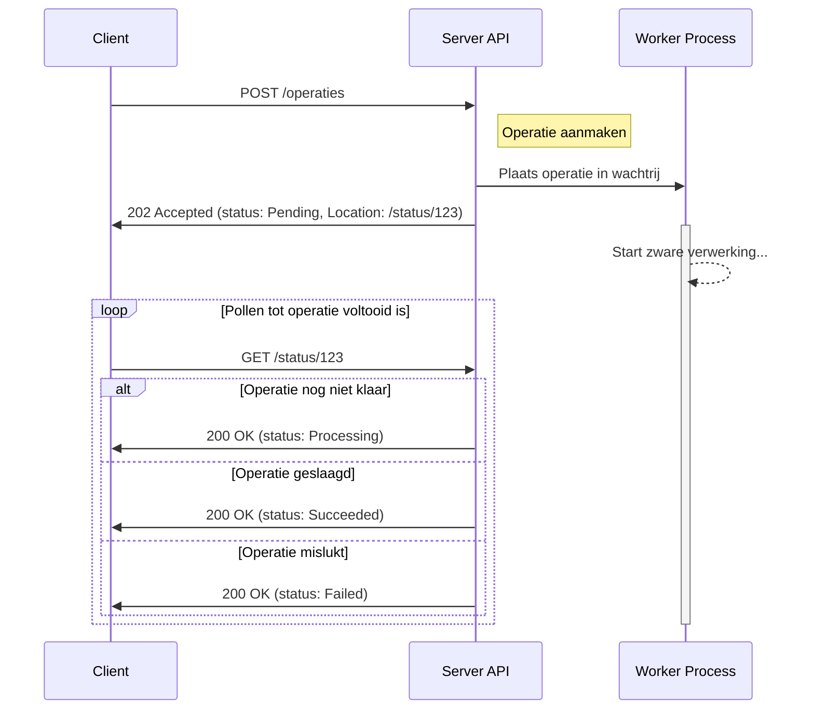

# Asynchronous Request-Reply Pattern

Bij het ontwerpen van API's is het cruciaal om rekening te houden met operaties
die lang kunnen duren. Een synchrone aanpak, waarbij een client wacht op de
volledige verwerking van een request, is in zulke gevallen niet geschikt.

## Timeouts bij langdurige operaties

Wanneer een client een langdurige operatie start (zoals documentverwerking of
batch-updates) en synchroon wacht op het resultaat, kunnen timeouts optreden.
Het verhogen van de timeout-limiet is hierbij een _bad practice_, omdat dit
serverbronnen onnodig lang bezet houdt. Bovendien zijn timeouts vaak afhankelijk
van de netwerkverbinding en tussenliggende infrastructuur, wat de limiet
arbitrair maakt en geen succesgarantie biedt. De client blijft dan in
onzekerheid over de status, wat leidt tot onbetrouwbaarheid en potentieel
dubbele verwerking bij retries. Dit resulteert in een slechte gebruikerservaring
en mogelijke data-inconsistentie.

## Asynchroon verwerken

Het Asynchronous Request-Reply pattern lost dit op door de aanvraag los te
koppelen van de verwerking. De server accepteert de operatie, geeft onmiddellijk
een bevestiging en verwerkt de taak op de achtergrond.

### Werking

Het verloop is als volgt:

1. **Request**: De client stuurt een `POST`-request om een langdurige operatie
   te starten. Om te voorkomen dat de operatie bij een retry (bijvoorbeeld na
   een timeout) dubbel wordt uitgevoerd, moet dit initiële request idempotent
   zijn. Zie ook
   [Veilige retries met volledige idempotency](./retries-met-volledige-idempotency.md).
2. **Acceptatie**: De server valideert de aanvraag, slaat de operatie op (status
   "Pending") en stuurt direct een
   [`202 Accepted`](https://www.rfc-editor.org/rfc/rfc7231#section-6.3.3)
   response. De `Location` header verwijst naar een statusendpoint waar de
   voortgang gevolgd kan worden.
3. **Status opvragen**: De client pollt het statusendpoint met `GET`-requests.
   Alternatief kan gebruik gemaakt worden van Server-Sent Events (SSE) of
   Webhooks om statuswijzigingen direct te ontvangen zonder te pollen. Zie ook
   [Event-Driven Architecture](./eda.md).
4. **Statusupdate**: De response toont de huidige status (bijv. "Processing") en
   eventueel een schatting van de resterende tijd.
5. **Voltooiing**: Bij voltooiing meldt het endpoint "Succeeded" (met een link
   naar of inhoud van het resultaat) of "Failed" (met foutdetails). De client
   kan dan indien nodig het resultaat ophalen.



## Voorbeeld in OpenAPI

Hieronder een deel van een voorbeeld van hoe je dit patroon in een OpenAPI
specificatie kunt vastleggen, met de start van de operatie en een apart
statusendpoint.

```yaml
paths:
  /rapportages:
    post:
      summary: Start het genereren van een rapportage
      parameters:
        - name: Idempotency-Key
          ...
      requestBody:
        required: true
        content:
          application/json:
            schema:
              $ref: "#/components/schemas/MijnZwareAanvraag"
      responses:
        "202":
          description: Aanvraag geaccepteerd en asynchroon in verwerking genomen
          headers:
            Location:
              description: URL van het statusendpoint voor deze operatie.
              schema:
                type: string
                format: uri
          content:
            application/json:
              schema:
                $ref: "#/components/schemas/OperatieStatus"
  /rapportages/operaties/{operatieId}:
    get:
      summary: Vraag de status van een rapportage-operatie op
      parameters:
        - name: operatieId
          in: path
          required: true
          schema:
            type: string
            format: uuid
      responses:
        "200":
          description: Huidige status van de operatie
          content:
            application/json:
              schema:
                $ref: "#/components/schemas/OperatieStatus"
        "404":
          description: Operatie niet gevonden

components:
  schemas:
    OperatieStatus:
      type: object
      properties:
        status:
          type: string
          enum:
            - Pending
            - Processing
            - Succeeded
            - Failed
        resultaatUrl:
          type: string
          format: uri
          description:
            URL van het uiteindelijke resultaat zodra de operatie is voltooid.

```

### Voordelen

- **Verbeterde gebruikerservaring**: De client krijgt direct feedback en wordt
  niet gedwongen om lang te wachten.
- **Betrouwbaarheid**: Het risico op client-side timeouts wordt geëlimineerd. De
  client kan de status van de operatie betrouwbaar opvragen.
- **Schaalbaarheid**: De server kan langdurige operaties onderbrengen bij een
  aparte worker-pool, waardoor de API-laag beschikbaar blijft voor nieuwe
  verzoeken.
