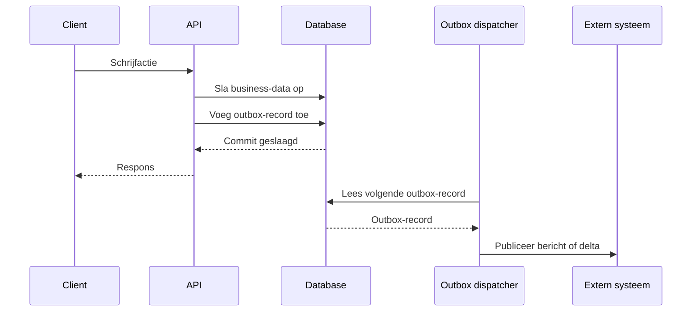

# Transactionele outbox

De transactionele outbox is een patroon voor systemen die wijzigingen aan hun
eigen data én uitgaande berichten atomair aan elkaar willen koppelen. Het doel
is dat een business-wijziging en de publicatie van die wijziging gebonden zijn
en niet uit elkaar kunnen lopen.

Dit patroon lost het _dual-write_ probleem op: een systeem moet zowel de eigen
database bijwerken als de informatie die naar een ander systeem gaat. Alhoewel
dit probleem veelal voorkomt in [Event-Driven Architecture](./eda.md), het is
daar niet toe beperkt. Het kan ook gebruikt worden als er een bericht, event of
delta beschikbaar gemaakt moet worden aan andere systemen.

De garantie die het biedt is _at-least once delivery_.

Als dit patroon niet gebruikt wordt, kunnen ze door een storing uit elkaar gaan
lopen.

## Probleem

Zonder transactionele outbox ontstaat een risico op inconsistentie:

- de business-data is wel aangepast, maar het uitgaande bericht is niet
  geregistreerd of verstuurd;
- het uitgaande bericht is al verstuurd, terwijl de business-transactie later
  alsnog faalt;
- de volgorde van wijzigingen is niet meer eenduidig vast te stellen.

Voor API's die betrouwbare notificaties, delta's of synchrone afgeleide
verwerking nodig hebben, is dat onacceptabel. Andere systemen kunnen dan een
wijziging missen of een wijziging zien die formeel nooit heeft bestaan.

## Het patroon

De kern van het patroon is eenvoudig:

1. Binnen één databasetransactie wordt zowel de business-data aangepast als een
   record toegevoegd aan een outbox-tabel.
2. Pas na een succesvolle commit zijn beide wijzigingen definitief opgeslagen.
3. Een apart proces leest de outbox uit en publiceert de records naar buiten.

Daardoor ontstaat één atomaire bron van waarheid voor zowel de business-data als
de uitgaande berichten.

## Werking

Een implementatie ziet er meestal als volgt uit:

- De outbox is een tabel in dezelfde database als de business-data.
- Elke relevante wijziging schrijft in dezelfde transactie een outbox-record
  weg.
- Een dispatcher leest periodiek of continu nieuwe outbox-records.
- Pas nadat publicatie is gelukt, markeert de dispatcher het record als verwerkt
  of verwijdert het dit op een later moment.

## Garanties

Een transactionele outbox biedt de volgende garanties:

- **Atomaire registratie**: business-wijziging en outbox-record bestaan samen,
  of allebei niet.
- **Betrouwbare publicatie achteraf**: als de transactie is gecommit, kan het
  bericht later alsnog gepubliceerd worden.
- **Herstelbaarheid**: na een crash kan de dispatcher verdergaan vanaf de nog
  niet verwerkte outbox-records.
- **Ordening**: met een strikt oplopend volgnummer kan de provider de volgorde
  van wijzigingen vastleggen.

## Wanneer toepassen

Gebruik dit patroon wanneer een provider:

- notificaties of events publiceert na schrijfacties;
- delta's opbouwt voor synchronisatie van resourcecollecties;
- afnemers heeft die geen wijzigingen mogen missen;
- de eigen database en uitgaande publicatie logisch aan elkaar moet koppelen.

## Implementatie-aandachtspunten

### Zelfde transactie, zelfde database

De business-wijziging en het outbox-record moeten in dezelfde lokale
databasetransactie worden opgeslagen. Als hiervoor verschillende databases of
externe systemen nodig zijn, verlies je de kern van het patroon.

### Strikt oplopend volgnummer

Voor veel use-cases is een strikt oplopend volgnummer op de outbox-records
belangrijk. Daarmee kun je:

- wijzigingen geordend publiceren;
- consumers laten hervatten vanaf een bekend punt;
- bepalen of een nieuw snapshot nodig is in plaats van alleen delta's.

### Bewaartermijn en opschoning

Outbox-records hoeven meestal niet eeuwig bewaard te blijven. Een provider kan
een beperkte bewaartermijn hanteren, bijvoorbeeld 24 uur. Als een consumer te
ver achterloopt, kan daarna een nieuw snapshot nodig zijn in plaats van een
complete historie van alle wijzigingen.

### Idempotente publicatie

De dispatcher moet er rekening mee houden dat publicatie opnieuw geprobeerd kan
worden. In de praktijk betekent dit dat afnemers of transportlagen dubbele
berichten veilig moeten kunnen verwerken.

## Afbakening

Dit document gaat alleen over de **outbox** aan de providerzijde. Een
transactionele inbox aan de consumerzijde is een verwant, maar apart patroon.

Ook lost de outbox op zichzelf geen end-to-end businessproces over meerdere
bronnen op. Voor zulke processen zijn aanvullende patronen nodig, zoals
idempotente operaties of saga's.

## Relatie met andere patronen

- Zie
  [Synchroniseren met snapshots en delta's](./consistent-overbrengen-van-resourcecollecties.md)
  voor een patroon dat vaak gebruik maakt van een outbox als bron voor delta's.
- Zie
  [Veilige retries met volledige idempotency](./retries-met-volledige-idempotency.md)
  voor het veilig opnieuw uitvoeren van clientrequests.

## Samengevat

De transactionele outbox zorgt ervoor dat een succesvolle business-wijziging en
de registratie van een uitgaand bericht niet uit elkaar kunnen lopen. Daarmee
vormt het patroon een eenvoudige en robuuste basis voor betrouwbare events,
delta's en synchronisatie.
