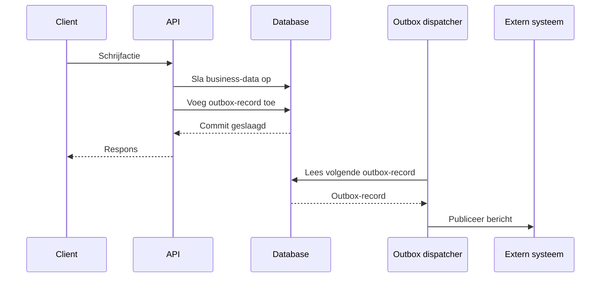

# Transactionele outbox

De transactionele outbox is een patroon dat een business-transactie en de
publicatie van een bijbehorend bericht atomair koppelt. Het lost het
_dual-write_ probleem op: zonder dit patroon kan een systeem dat zowel de eigen
database bijwerkt als een bericht naar buiten stuurt door een storing uit elkaar
lopen — de data is aangepast maar het bericht niet verstuurd, of andersom.

Dit patroon biedt de volgende garanties:

- **Atomaire registratie**: business-wijziging en outbox-record bestaan samen,
  of allebei niet.
- **Betrouwbare publicatie**: als de transactie is gecommit, wordt het bericht
  vroeg of laat gepubliceerd (_at-least once delivery_).
- **Herstelbaarheid**: na een crash hervat de dispatcher vanaf de nog niet
  verwerkte records.

Het patroon is niet exclusief voor [Event-Driven Architecture](./eda.md); het is
even goed toepasbaar bij webhooks, notificaties of andere vormen van uitgaande
publicatie.

## Werking

De werking van het patroon is als volgt:

1. Binnen één databasetransactie wordt zowel de business-data aangepast als een
   record toegevoegd aan een outbox-tabel.
2. Pas na een succesvolle commit zijn beide wijzigingen definitief opgeslagen.
3. Een dispatcher leest de outbox periodiek of continu uit en publiceert de
   records naar buiten. Pas nadat publicatie is gelukt, markeert de dispatcher
   het record als verwerkt.

## Zelfde transactie, zelfde database

Het patroon vereist een database die atomaire multi-statement transacties
ondersteunt: de twee schrijfacties — business-data én outbox-record — moeten als
één geheel slagen of falen (atomiciteit), en een commit moet een crash overleven
(duurzaamheid). De business-wijziging en het outbox-record moeten daarom in
dezelfde databasetransactie worden opgeslagen. Als de outbox in een andere
database staat dan de business-data, vervalt deze garantie.

## Idempotente publicatie

Omdat de dispatcher een bericht opnieuw kan publiceren — bijvoorbeeld na een
crash vóór het markeren van het record — moeten zowel de dispatcher als afnemers
en transportlagen dubbele berichten idempotent verwerken. Zie ook
[veilige retries met volledige idempotency](./retries-met-volledige-idempotency.md).

## Bewaartermijn en opschoning

Outbox-records hoeven niet eeuwig bewaard te blijven. Verwerkte records kunnen
periodiek worden verwijderd, bijvoorbeeld na 24 uur, om de tabel beheersbaar te
houden.

Een transactionele inbox — voor het betrouwbaar verwerken van inkomende
berichten — is een verwant, maar apart patroon.
