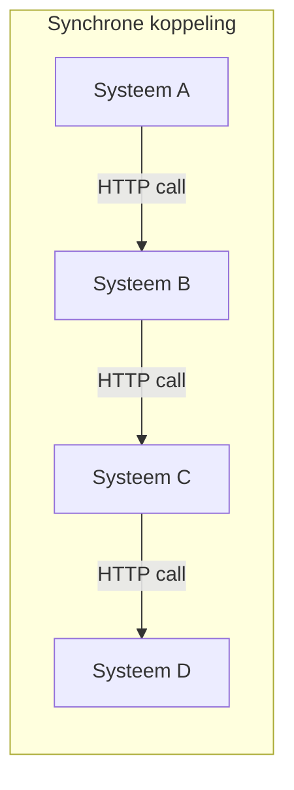
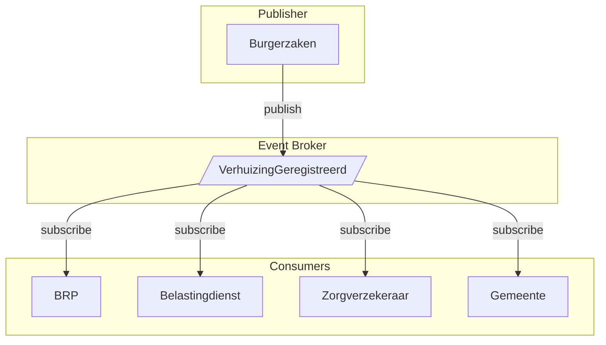

# Event Driven Architecture

Event Driven Architecture (EDA) is een architectuurpatroon waarbij systemen
communiceren door events te publiceren en te consumeren, in plaats van directe
synchrone aanroepen te doen. Dit maakt systemen losser gekoppeld en beter
schaalbaar.

## Het probleem

Bij traditionele synchrone API-communicatie ontstaan problemen wanneer systemen
groeien:



**Problemen:**

- **Tight coupling**: Systeem A moet weten dat B, C en D bestaan
- **Cascading failures**: Als D down is, faalt de hele keten
- **Schaalbaarheid**: Piekbelasting plant door naar alle systemen
- **Blocking**: A moet wachten tot D klaar is

### Voorbeeld: Verhuizing melden

Een burger meldt een verhuizing. Dit moet worden verwerkt door:

- BRP (registratie adres)
- Belastingdienst (aanpassen WOZ)
- Zorgverzekeraar (postcodegebied)
- Gemeente (afvalstoffenheffing)

Met synchrone calls moet de burgerzaken-applicatie al deze systemen kennen én
wachten tot ze allemaal klaar zijn.

## De oplossing

Met Event Driven Architecture publiceert de burgerzaken-applicatie één event, en
geïnteresseerde systemen reageren onafhankelijk:



**Voordelen:**

- **Loose coupling**: Burgerzaken weet niet wie er luistert
- **Resilience**: Als Belastingdienst down is, verwerken anderen gewoon door
- **Schaalbaarheid**: Elke consumer schaalt onafhankelijk
- **Non-blocking**: Burgerzaken is direct klaar na publiceren

## Kernconcepten

### Events

Een event beschrijft iets dat is gebeurd, in de verleden tijd:

```json
{
  "type": "nl.overheid.brp.VerhuizingGeregistreerd",
  "source": "/brp/burgerzaken",
  "id": "a1b2c3d4-e5f6-7890-abcd-ef1234567890",
  "time": "2024-01-15T10:30:00Z",
  "data": {
    "bsn": "123456789",
    "nieuwAdres": {
      "straat": "Voorbeeldstraat",
      "huisnummer": "1",
      "postcode": "1234AB",
      "woonplaats": "Amsterdam"
    },
    "ingangsdatum": "2024-02-01"
  }
}
```

### Event Broker

De broker ontvangt, bewaart en distribueert events:

| Broker         | Geschikt voor                           |
| -------------- | --------------------------------------- |
| MSK Serverless | Managed MSK, schaalbaar, MSK compatible |
| MSK            | Managed MSK on AWS                      |
| MSK on Lambda  | Event driven processing met Lambda      |
| MSK on ECS     | Containerized verwerking                |
| MSK on EC2     | Volledige controle                      |

### Producers en Consumers

- **Producer**: Systeem dat events publiceert
- **Consumer**: Systeem dat events verwerkt
- Een systeem kan beide zijn

## Wanneer gebruik je dit?

**Geschikt voor:**

- Processen met meerdere geïnteresseerde partijen
- Systemen die onafhankelijk moeten kunnen schalen
- Scenario's waar real-time niet kritiek is (eventual consistency)
- Integratie tussen verschillende organisaties/domeinen

**Niet geschikt voor:**

- Simpele request-response scenario's
- Wanneer directe feedback nodig is (bijv. validatie)
- Zeer kleine systemen zonder schaalbaarheidsbehoeften
- Transacties die ACID-garanties vereisen

## Best practices

- **Gebruik een standaard event-formaat**: CloudEvents is de
  aanbevolen standaard
- **Maak events immutable**: Events beschrijven wat er is gebeurd, niet wat er
  moet gebeuren
- **Ontwerp voor idempotency**: Consumers moeten hetzelfde event meerdere keren
  kunnen verwerken
- **Bewaar events**: Event sourcing maakt replay en audit mogelijk
- **Documenteer je events**: Gebruik een event catalog of AsyncAPI

## Implementatie-opties

| Optie          | Geschikt voor                           |
| -------------- | --------------------------------------- |
| MSK Serverless | Managed MSK, schaalbaar, MSK compatible |
| MSK            | Managed MSK on AWS                      |

## Gerelateerde patronen

- CloudEvents - standaard formaat voor events
- Webhooks - simpelere variant voor notificaties
- CQRS - vaak gecombineerd met EDA
- Saga Pattern - distributed transactions met events

## Bronnen

- [CloudEvents Specificatie](https://cloudevents.io/)
- [MSK Serverless](https://docs.aws.amazon.com/msk/latest/developerguide/serverless.html)
