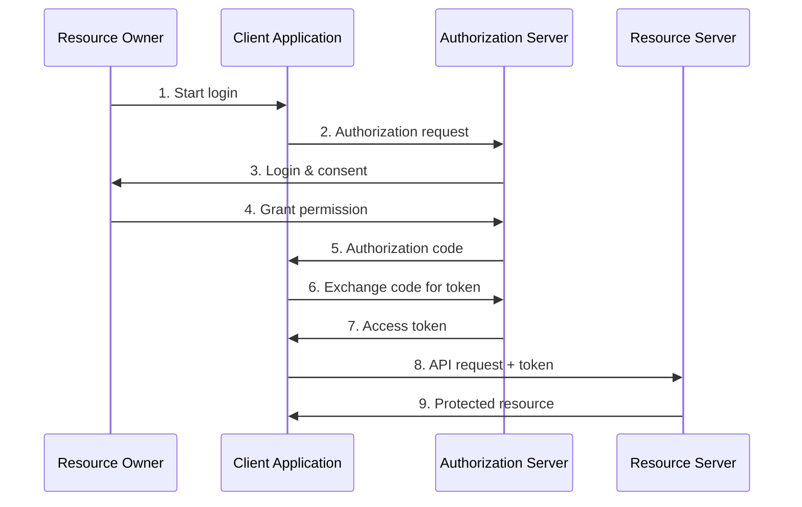

# OAuth 2.0

OAuth 2.0 is een open standaard voor autorisatie die het mogelijk maakt om
namens een gebruiker toegang te krijgen tot beschermde resources, zonder dat de
gebruiker zijn wachtwoord hoeft te delen met de applicatie die toegang vraagt.

De standaard wordt breed toegepast voor API-beveiliging en is de basis voor
OpenID Connect (OIDC), dat authenticatie toevoegt bovenop OAuth 2.0.

## Hoe werkt het?

OAuth 2.0 definieert vier rollen:

### Grant Types

| Grant Type                  | Gebruik                         |
| --------------------------- | ------------------------------- |
| Authorization Code          | Webapplicaties met backend      |
| Authorization Code + PKCE   | Single Page Apps, Mobile apps   |
| Client Credentials          | Machine-to-machine communicatie |
| ~~Implicit~~                | **Verouderd** - gebruik PKCE    |
| ~~Resource Owner Password~~ | **Verouderd** - niet gebruiken  |

## Toepassing in Nederland

### NL GOV Assurance Profile

Het
[NL GOV Assurance Profile for OAuth 2.0](https://forumstandaardisatie.nl/open-standaarden/nl-gov-assurance-profile-oauth-20)
is het Nederlandse profiel dat aanvullende beveiligingseisen stelt:

- Verplicht gebruik van PKCE
- Verplicht gebruik van TLS 1.2+
- Beperkte token levensduur
- Signed JWT access tokens (optioneel)

### Forum Standaardisatie Status

| Aspect                            | Status                      |
| --------------------------------- | --------------------------- |
| Lijst                             | Pas-toe-of-leg-uit          |
| Functioneel toepassingsgebied     | Autorisatie voor REST API's |
| Organisatorisch toepassingsgebied | Nederlandse overheid        |

## Wanneer gebruik je dit?

**Geschikt voor:**

- REST API's die namens een gebruiker worden aangeroepen
- Single Sign-On (SSO) implementaties (in combinatie met OIDC)
- Gedelegeerde toegang tot resources
- Mobile en Single Page Applications

**Niet geschikt voor:**

- Eenvoudige server-to-server authenticatie (overweeg mTLS)
- Interne microservices zonder gebruikerscontext
- Situaties waar eenvoudige API keys volstaan

## Gerelateerde standaarden

- OpenID Connect (OIDC) - authenticatie bovenop OAuth 2.0
- SAML 2.0 - alternatief voor enterprise SSO
- PKIoverheid - certificaten voor organisatie-identificatie

## Bronnen

### Officiële documentatie

- [RFC 6749 - OAuth 2.0 Framework](https://tools.ietf.org/html/rfc6749)
- [RFC 7636 - PKCE](https://tools.ietf.org/html/rfc7636)
- [NL GOV Assurance Profile](https://forumstandaardisatie.nl/open-standaarden/nl-gov-assurance-profile-oauth-20)

### Gerelateerde artikelen

- [DigiD](/kennisbank/security/authenticatie/digid) - Nederlandse
  authenticatievoorziening
- [API Design Rules](/kennisbank/api-ontwikkeling/standaarden/api-design-rules) - beveiligingsregels
  voor API's
