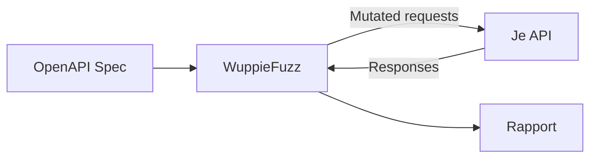

# WuppieFuzz

WuppieFuzz is een open source API fuzzer ontwikkeld door het Ministerie van
Justitie en Veiligheid. De tool test automatisch REST API's op
beveiligingsproblemen en onverwacht gedrag door willekeurige, ongeldige en
grensgevallen als input te sturen.

## Kenmerken

- **OpenAPI-driven**: Genereert automatisch testcases op basis van je OpenAPI
  specificatie
- **Slimme mutaties**: Past intelligente mutaties toe op basis van het datatype
- **CI/CD integratie**: Draait in pipelines met exit codes voor pass/fail
- **Rapportage**: Genereert HTML en JSON rapporten met gevonden issues
- **Geschreven in Rust**: Snel en memory-safe

## Hoe werkt het?

WuppieFuzz analyseert je OpenAPI specificatie en genereert automatisch requests:



### Voorbeeld output

```
╭──────────────────────────────────────────────────────╮
│ WuppieFuzz Security Report                           │
├──────────────────────────────────────────────────────┤
│ Target: https://api.example.com                      │
│ Endpoints tested: 12                                 │
│ Requests sent: 4,521                                 │
│ Issues found: 3                                      │
╰──────────────────────────────────────────────────────╯

[HIGH] SQL Injection possible in /users/{id}
  → Input: ' OR '1'='1
  → Response: 500 Internal Server Error

[MEDIUM] Missing rate limiting on /auth/login
  → 1000 requests in 10 seconds succeeded

[LOW] Verbose error message in /orders
  → Stack trace exposed in response
```

## Aan de slag

### Vereisten

- Docker (aanbevolen) of Rust 1.70+
- OpenAPI 3.0+ specificatie van je API
- Netwerktoegang tot de te testen API

### Installatie / Gebruik

**Met Docker (aanbevolen):**

```bash
docker pull ghcr.io/minvws/wuppiefuzz:latest

docker run -v $(pwd):/work ghcr.io/minvws/wuppiefuzz \
  --spec /work/openapi.yaml \
  --target https://api.example.com \
  --output /work/report.html
```

**Met Cargo:**

```bash
cargo install wuppiefuzz

wuppiefuzz \
  --spec openapi.yaml \
  --target https://api.example.com \
  --output report.html
```

### CI/CD Integratie

```yaml
# GitHub Actions voorbeeld
- name: Run WuppieFuzz
  run: |
    docker run -v ${{ github.workspace }}:/work \
      ghcr.io/minvws/wuppiefuzz \
      --spec /work/openapi.yaml \
      --target ${{ env.API_URL }} \
      --fail-on high
```

## Waarom deze tool?

- **Nederlandse oorsprong**: Ontwikkeld door en voor de Nederlandse overheid
- **Open source**: Volledige transparantie, geen vendor lock-in
- **Specifiek voor API's**: Begrijpt OpenAPI en genereert relevante testcases
- **Actief onderhouden**: Regelmatige updates en community support

## Alternatieven

| Tool                                       | Wanneer kiezen                           |
| ------------------------------------------ | ---------------------------------------- |
| [OWASP ZAP](https://www.zaproxy.org/)      | Bredere webapplicatie security testing   |
| [Burp Suite](https://portswigger.net/burp) | Commercieel, uitgebreide features        |
| [Dredd](https://dredd.org/)                | Contract testing (niet security-focused) |

## Bronnen

- [GitHub Repository](https://github.com/minvws/wuppiefuzz)
- [Documentatie](https://github.com/minvws/wuppiefuzz/wiki)
- OpenKAT - Complementaire tool voor vulnerability scanning
