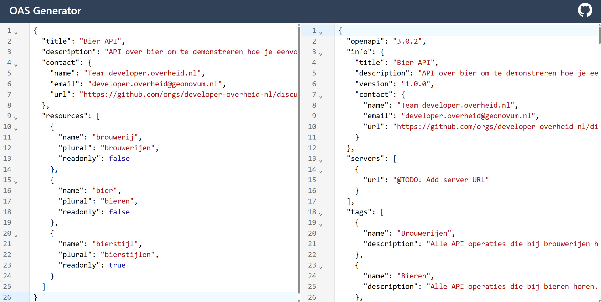

# 1. Genereer boilerplate OAS

In deze stap gebruiken we de
[OAS Generator](https://developer-overheid-nl.github.io/oas-generator) om een
basis OpenAPI Specification te genereren. We voeren wat metadata en resources
in, en de generator maakt een complete OAS die al voldoet aan de API Design
Rules zodra we later in deze tutorial de server URL hebben ingevuld.

## Verplichte metadata

De titel, omschrijving en contactgegevens van de API zijn verplicht volgens
respectievelijk de OpenAPI Specification en de API Design Rules. Zonder deze
waarden kan er geen valide OAS gegenereerd worden, dus we hebben deze nodig als
input voor de generator. Voor de titel van deze API nemen we "Bier API". Verder
vullen we een korte omschrijving in waarin staat waar je deze API voor kunt
gebruiken. Het contact object bestaat uit de verplichte properties `name`,
`email` en `url`. De API Design Rules schrijven voor dat je hier refereert naar
bruikbare contactinformatie, dat wil zeggen: contactgegevens waar een consumer
met technische vragen over de API terecht kan. Idealiter is dit het team dat
verantwoordelijk is voor de API en niet een persoon (deze kan uit dienst gaan)
of een algemene helpdesk (deze kan vaak geen technische vragen over de API
beantwoorden). Als contact URL is het verstandig om te verwijzen naar een pagina
waar men direct in contact kan komen met dit team, bijvoorbeeld een issue
tracker of discussieforum. Onze JSON komt er dan zo uit te zien:

```json
{
  "title": "Bier API",
  "description": "API over bier om te demonstreren hoe je eenvoudig een API kunt ontwikkelen.",
  "contact": {
    "name": "Team developer.overheid.nl",
    "email": "developer.overheid@geonovum.nl",
    "url": "https://github.com/orgs/developer-overheid-nl/discussions"
  }
}
```

:::warning Versie van de API

De versie van de API wordt uitgedrukt in de `version` property in OAS. De
generator zet deze standaard op `1.0.0`. Hoewel deze property eigenlijk gaat om
de versie van de OAS zélf (stel: de beschrijving verandert dan zou dit een
versie omhoog gaan), is in de ADR afgesproken dat we dit veld gebruiken voor de
versie van de API.

:::

## Operaties en resources

Vervolgens bepalen we de operaties en resources die onze API moeten ondersteunen.
We willen verschillende bieren, bierstijlen en brouwerijen kunnen ontsluiten
(`GET`). Bieren en brouwerijen kunnen toegevoegd (`POST`), verwijderd (`DELETE`)
en gewijzigd (`PUT`) worden, terwijl de bierstijlen in ons voorbeeld door een
redactie bepaald worden en derhalve alleen opgehaald kunnen worden. Om deze
operaties correct in de OAS te krijgen, stoppen we een JSON array in de
`resources` property. De array bestaat uit de drie verschillende resources:
brouwerijen, bieren, bierstijlen. De generator verwacht een enkelvoud `name`, de
schrijfwijze van het meervoud van de resource (`plural`) en of het `readonly` is
of niet. Zodra het `readonly` is, worden er alleen `GET` operaties voor de
collectie en individuele resource gegenereerd. In ons geval krijgen we dan deze
array:

```json
[
  {
    "name": "brouwerij",
    "plural": "brouwerijen",
    "readonly": false
  },
  {
    "name": "bier",
    "plural": "bieren",
    "readonly": false
  },
  {
    "name": "bierstijl",
    "plural": "bierstijlen",
    "readonly": true
  }
]
```

Nadat we deze hebben toegevoegd aan `resources` ziet onze JSON er als volgt uit:

```json
{
  "title": "Bier API",
  "description": "API over bier om te demonstreren hoe je eenvoudig een API kunt ontwikkelen.",
  "contact": {
    "name": "Team developer.overheid.nl",
    "email": "developer.overheid@geonovum.nl",
    "url": "https://github.com/orgs/developer-overheid-nl/discussions"
  },
  "resources": [
    {
      "name": "brouwerij",
      "plural": "brouwerijen",
      "readonly": false
    },
    {
      "name": "bier",
      "plural": "bieren",
      "readonly": false
    },
    {
      "name": "bierstijl",
      "plural": "bierstijlen",
      "readonly": true
    }
  ]
}
```

## OAS Generator

We kunnen deze input nu aan de OAS Generator geven:

1. Kopieer de JSON hierboven.
2. [Open de OAS Generator](https://developer-overheid-nl.github.io/oas-generator).
3. Plak de JSON aan de linkerkant.
4. Kopieer de gegenereerde openapi.json aan de rechterkant.

 _De OAS Generator met links onze JSON input en
rechts de openapi.json output_

### Uitleg gegenereerde OAS

De volgende zaken zijn nu automatisch gegenereerd:

```text
openapi
info
servers
tags
paths
components
  schemas
  parameters
```

| Onderdeel               | Uitleg                                                                                                                                                                                                                                                                                                                   |
| ----------------------- | ------------------------------------------------------------------------------------------------------------------------------------------------------------------------------------------------------------------------------------------------------------------------------------------------------------------------ |
| `openapi`               | De gebruikte OpenAPI-versie. De generator zet deze standaard op `3.0.2`.                                                                                                                                                                                                                                                 |
| `info`                  | Metadata over de API, waaronder titel, omschrijving, contactgegevens en versie.                                                                                                                                                                                                                                          |
| `servers`               | De server URL. De generator vult hier eerst een `@TODO` placeholder in. In stap 4 vervangen we die door een URL met major versie, bijvoorbeeld `/v1`.                                                                                                                                                                    |
| `tags`                  | Voor elke resource wordt een tag gegenereerd. Hiermee worden operaties gegroepeerd per resourcetype.                                                                                                                                                                                                                     |
| `paths`                 | Voor elke resource worden paden gegenereerd. Volgens de ADR wordt hier de meervoud schrijfwijze voor gebruikt; bijvoorbeeld `/bieren` voor de collectie en `/bieren/{id}` voor een individuele resource.                                                                                                                |
| Operaties               | Per `path` worden de correcte operaties toegevoegd. Voor een readonly resource zijn dit alleen `GET` operaties, anders worden ook de juiste `POST`, `PUT` en `DELETE` operaties gegenereerd.                                                                                                                            |
| `responses`             | Per operatie worden de juiste responses gegenereerd. Succesresponses bevatten statuscodes, headers en verwijzingen naar schemas. Foutresponses verwijzen direct naar standaardresponses in `https://static.developer.overheid.nl/adr/components.yaml`.                                                                    |
| `headers`               | Per succesresponse worden de juiste headers gegenereerd. `API-Version` is de verplichte response header voor API requests. Voor lijstoperaties wordt ook de `Link` header teruggegeven, die gebruikt kan worden voor paginering. Deze headers komen uit `https://static.developer.overheid.nl/adr/components.yaml`.       |
| Errors                  | Voor 4XX statuscodes zoals `400` en `404` wordt verwezen naar standaard `application/problem+json` responses uit `https://static.developer.overheid.nl/adr/components.yaml`.                                                                                                                                             |
| `components.schemas`    | Hier worden de bijbehorende schemas gegenereerd. Deze bevatten standaard een `id` property omdat een leeg schema niet valid is. In de volgende stap gaan we deze schemas aanpassen naar onze behoeften.                                                                                                                 |
| `components.parameters` | Hier worden herbruikbare parameters gegenereerd, zoals de `id` path parameter voor individuele resources.                                                                                                                                                                                                                |

:::tip Handmatige verbeteringen

De generator levert een prima startpunt, maar er zijn nog wat zaken die
handmatig verbeterd moeten worden. De `servers[0].url` staat bijvoorbeeld nog op
een `@TODO` placeholder. Die moeten we invullen voordat de OAS volledig voldoet
aan de API Design Rules. Ook staan er `@TODO` placeholders in sommige
omschrijvingen. Voor de structuur van deze tutorial maakt dit niet uit, maar in
een echte API wil je natuurlijk alles nalopen en van correcte omschrijvingen
voorzien.

:::

## Wat hebben we geleerd?

- Hoe we de **OAS Generator** gebruiken om snel een basis OpenAPI Specification
  te maken
- Welke **metadata** verplicht is volgens de ADR (titel, omschrijving,
  contactgegevens)
- Hoe we **resources** definiëren met enkelvoud/meervoud en readonly-opties
- Welke **operaties** automatisch gegenereerd worden (GET, POST, PUT, DELETE)

## Volgende stap

We hebben nu een basis OAS. De server URL vullen we later in, en de schemas
bevatten nu alleen een `id` property. In de volgende stap gaan we de schemas
uitbreiden met alle velden die we nodig hebben voor onze Bier API.

[Ga naar stap 2: Modelleer de schemas](./2-modelleer-schemas.md)
