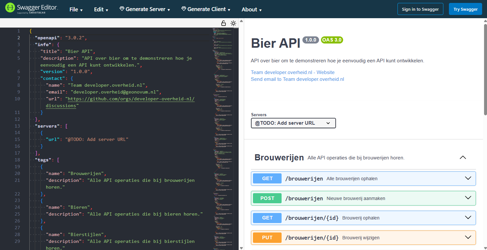

# 2. Modelleer de schemas

Nu we een _boilerplate_ OAS hebben, kunnen we deze gaan uitbreiden voor onze
eigen specifieke usecase. Eerst gaan we de schemas van de resources modelleren,
daarna voegen we extra functionaliteit toe en tenslotte checken we of alles nog
aan de API Design Rules voldoet.

## OAS wijzigen

Er zijn verschillende manieren om de OAS te wijzigen, maar voor deze tutorial
gebruiken we de gratis webversie van Swagger Editor. Hiermee worden aanpassingen
aan de OAS direct gevalideerd en gevisualiseerd.

1. [Open Swagger editor](https://editor.swagger.io).
2. Plak de OAS uit de vorige stap aan de linkerkant van de Swagger editor.

Hier zien we de Swagger Editor met links de OAS-code en rechts de interactieve
documentatie.

 _Swagger editor met links de geplakte input en
rechts de visualisatie van de OAS_

## Schemas uitbreiden

Zoals gezegd hebben de gegenereerde schemas nu enkel een `id` property in het
`uuid` format. Laten we deze gaan uitbreiden met meer informatie.

import Tabs from "@theme/Tabs"; import TabItem from "@theme/TabItem";

### Tabel

<Tabs queryString groupId="schemas">
  <TabItem value="bier" label="Bier">

| Eigenschap        | Type                                                 | Formaat  | Verplicht | Omschrijving      |
| ----------------- | ---------------------------------------------------- | -------- | --------- | ----------------- |
| id                | `string`                                             | `uuid`   | Ja        | Unieke identifier |
| naam              | `string`                                             |          | Ja        | Naam              |
| alcoholPercentage | `number`                                             | `double` | Ja        | Alcoholpercentage |
| bierstijl         | [`Bierstijl`](?schemas=bierstijl#schemas-uitbreiden) |          | Ja        | Bierstijl         |
| brouwerij         | [`Brouwerij`](?schemas=brouwerij#schemas-uitbreiden) |          | Nee       | Brouwerij         |

  </TabItem>
  <TabItem value="bierstijl" label="Bierstijl">

| Eigenschap | Type     | Formaat | Verplicht | Omschrijving      |
| ---------- | -------- | ------- | --------- | ----------------- |
| id         | `string` | `uuid`  | Ja        | Unieke identifier |
| naam       | `string` |         | Ja        | Naam              |

  </TabItem>
  <TabItem value="brouwerij" label="Brouwerij">

| Eigenschap | Type                                         | Formaat | Verplicht | Omschrijving                          |
| ---------- | -------------------------------------------- | ------- | --------- | ------------------------------------- |
| id         | `string`                                     | `uuid`  | Ja        | Unieke identifier                     |
| naam       | `string`                                     |         | Ja        | Naam                                  |
| grootte    | `string`                                     | `enum`  | Ja        | Grootte brouwerij (hobby/micro/groot) |
| adres      | [`Adres`](?schemas=adres#schemas-uitbreiden) |         | Nee       | Adres                                 |

  </TabItem>
  <TabItem value="adres" label="Adres">

| Eigenschap | Type     | Formaat | Verplicht | Omschrijving             |
| ---------- | -------- | ------- | --------- | ------------------------ |
| straat     | `string` |         | Ja        | Straat van het adres     |
| huisnummer | `number` |         | Ja        | Huisnummer van het adres |
| postcode   | `string` |         | Ja        | Postcode van het adres   |
| plaats     | `string` |         | Ja        | Plaats van het adres     |

  </TabItem>
</Tabs>

:::note Fictieve schemas

Oplettende lezers zien dat ons `Adres` schema behoorlijk versimpeld is. Zo
missen we bijvoorbeeld een huisnummertoevoeging. Een écht adresschema bij de
overheid is aanzienlijk complexer. Maar dat is nu precies waarom we voor een
Bier API hebben gekozen: zo kunnen we ons focussen op het leren van de
concepten, zonder te verdwalen in domeinspecifieke complexiteit.

:::

### OpenAPI Schema

<Tabs queryString groupId="schemas">

  <TabItem value="bier" label="Bier">

    ```json
    {
      "properties": {
        "id": {
          "type": "string",
          "format": "uuid",
          "description": "Unieke identifier",
          // highlight-next-line
          "example": "046b6c7f-0b8a-43b9-b35d-6489e6daee92"
        },
        "naam": {
          "type": "string",
          "description": "Naam",
          // highlight-next-line
          "example": "Weizen Tripel"
        },
        "alcoholPercentage": {
          "type": "number",
          "format": "double",
          "description": "Alcoholpercentage",
          // highlight-next-line
          "example": 7.6
        },
        "bierstijl": {
          "$ref": "#/components/schemas/Bierstijl"
        },
        "brouwerij": {
          "$ref": "#/components/schemas/Brouwerij"
        }
      },
      "required": ["id", "naam", "alcoholPercentage", "bierstijl"]
    }
    ```

  </TabItem>
  <TabItem value="bierstijl" label="Bierstijl">

    ```json
    {
      "description": "Bierstijl",
      "properties": {
        "id": {
          "type": "string",
          "format": "uuid",
          "description": "Unieke identifier",
          // highlight-next-line
          "example": "046b6c7f-0b8a-43b9-b35d-6489e6daee91"
        },
        "naam": {
          "type": "string",
          "description": "Naam",
          // highlight-next-line
          "example": "Quadrupel"
        }
      },
      "required": ["id", "naam"]
    }
    ```

  </TabItem>
  <TabItem value="brouwerij" label="Brouwerij">

    ```json
    {
      "description": "Brouwerij",
      "properties": {
        "id": {
          "type": "string",
          "format": "uuid",
          "description": "Unieke identifier",
          // highlight-next-line
          "example": "046b6c7f-0b8a-43b9-b35d-6489e6daee93"
        },
        "naam": {
          "type": "string",
          "description": "Naam",
          // highlight-next-line
          "example": "Brouwtoren"
        },
        "grootte": {
          "type": "string",
          "enum": ["hobby", "micro", "groot"],
          "description": "Grootte brouwerij (hobby/micro/groot)",
          // highlight-next-line
          "example": "micro"
        },
        "adres": {
          "$ref": "#/components/schemas/Adres"
        }
      },
      "required": ["id", "naam", "grootte"]
    }
    ```

  </TabItem>
  <TabItem value="adres" label="Adres">

    ```json
    {
      "description": "Adres",
      "properties": {
        "straat": {
          "type": "string",
          "description": "Straatnaam",
          // highlight-next-line
          "example": "Waldeck Pyrmontsingel"
        },
        "huisnummer": {
          "type": "number",
          "description": "Huisnummer",
          // highlight-next-line
          "example": 12
        },
        "postcode": {
          "type": "string",
          "description": "Postcode",
          // highlight-next-line
          "example": "6521 BC"
        },
        "plaats": {
          "type": "string",
          "description": "Plaats",
          // highlight-next-line
          "example": "Nijmegen"
        }
      },
      "required": ["straat", "huisnummer", "postcode", "plaats"]
    }
    ```

  </TabItem>
</Tabs>

:::tip Voeg voorbeeldwaarden toe

Voeg voorbeeldwaarden toe voor betere Developer Experience. In de uitgelichte
regels zie je hoe we dit hebben gedaan.

:::

:::warning OpenAPI Schema is niet hetzelfde als JSON Schema

Hoewel bovenstaande schemas heel erg lijken op JSON Schema, is het niet 100%
hetzelfde. Dit komt doordat OAS 3.0 ouder is dan de officiele release van JSON
Schema. Vanaf OAS 3.1 wordt JSON Schema volledig ondersteund, maar deze versie
is nog niet goedgekeurd door de Nederlands overheid. Het traject om de
verplichte standaard te updaten naar OAS 3.1 loopt momenteel. Zodra OAS 3.1 de
nieuwe standaard is zullen we deze tutorial updaten met JSON Schema voorbeelden.

:::

### Update de OAS met de schemas

Kopieer elk schema hierboven naar het corresponderende schema in de Swagger
editor. `Adres` bestaat nog niet, dus die moeten we zelf aanmaken.

<details>
  <summary>De spec zou er op dit moment zo uit moeten zien</summary>

```json
{
  "openapi": "3.0.2",
  "info": {
    "title": "Bier API",
    "description": "API over bier om te demonstreren hoe je eenvoudig een API kunt ontwikkelen.",
    "version": "1.0.0",
    "contact": {
      "name": "Team developer.overheid.nl",
      "email": "developer.overheid@geonovum.nl",
      "url": "https://github.com/orgs/developer-overheid-nl/discussions"
    }
  },
  "servers": [
    {
      "url": "@TODO: Add server URL"
    }
  ],
  "tags": [
    {
      "name": "Brouwerijen",
      "description": "Alle API operaties die bij brouwerijen horen."
    },
    {
      "name": "Bieren",
      "description": "Alle API operaties die bij bieren horen."
    },
    {
      "name": "Bierstijlen",
      "description": "Alle API operaties die bij bierstijlen horen."
    }
  ],
  "paths": {
    "/brouwerijen": {
      "get": {
        "operationId": "listBrouwerijen",
        "description": "Endpoint om alle brouwerijen op te halen. @TODO: Voeg hier eventueel extra informatie toe over het filteren, pagineren, etc.",
        "summary": "Alle brouwerijen ophalen",
        "tags": ["Brouwerijen"],
        "responses": {
          "200": {
            "headers": {
              "API-Version": {
                "$ref": "https://static.developer.overheid.nl/adr/components.yaml#/headers/API-Version"
              },
              "Link": {
                "$ref": "https://static.developer.overheid.nl/adr/components.yaml#/headers/Link"
              }
            },
            "description": "OK",
            "content": {
              "application/json": {
                "schema": {
                  "type": "array",
                  "items": {
                    "$ref": "#/components/schemas/Brouwerij"
                  }
                }
              }
            }
          }
        }
      },
      "post": {
        "operationId": "createBrouwerij",
        "description": "Nieuwe brouwerij aanmaken",
        "summary": "Nieuwe brouwerij aanmaken",
        "tags": ["Brouwerijen"],
        "responses": {
          "201": {
            "headers": {
              "API-Version": {
                "$ref": "https://static.developer.overheid.nl/adr/components.yaml#/headers/API-Version"
              }
            },
            "description": "Created",
            "content": {
              "application/json": {
                "schema": {
                  "$ref": "#/components/schemas/Brouwerij"
                }
              }
            }
          },
          "400": {
            "$ref": "https://static.developer.overheid.nl/adr/components.yaml#/responses/400"
          }
        }
      }
    },
    "/brouwerijen/{id}": {
      "parameters": [
        {
          "$ref": "#/components/parameters/id"
        }
      ],
      "get": {
        "operationId": "retrieveBrouwerij",
        "description": "Brouwerij ophalen",
        "summary": "Brouwerij ophalen",
        "tags": ["Brouwerijen"],
        "responses": {
          "200": {
            "headers": {
              "API-Version": {
                "$ref": "https://static.developer.overheid.nl/adr/components.yaml#/headers/API-Version"
              }
            },
            "description": "OK",
            "content": {
              "application/json": {
                "schema": {
                  "$ref": "#/components/schemas/Brouwerij"
                }
              }
            }
          },
          "404": {
            "$ref": "https://static.developer.overheid.nl/adr/components.yaml#/responses/404"
          }
        }
      },
      "put": {
        "operationId": "editBrouwerij",
        "description": "Brouwerij wijzigen",
        "summary": "Brouwerij wijzigen",
        "tags": ["Brouwerijen"],
        "responses": {
          "200": {
            "headers": {
              "API-Version": {
                "$ref": "https://static.developer.overheid.nl/adr/components.yaml#/headers/API-Version"
              }
            },
            "description": "OK",
            "content": {
              "application/json": {
                "schema": {
                  "$ref": "#/components/schemas/Brouwerij"
                }
              }
            }
          },
          "400": {
            "$ref": "https://static.developer.overheid.nl/adr/components.yaml#/responses/400"
          }
        }
      },
      "delete": {
        "operationId": "removeBrouwerij",
        "description": "Brouwerij verwijderen",
        "summary": "Brouwerij verwijderen",
        "tags": ["Brouwerijen"],
        "responses": {
          "204": {
            "$ref": "https://static.developer.overheid.nl/adr/components.yaml#/responses/204"
          },
          "404": {
            "$ref": "https://static.developer.overheid.nl/adr/components.yaml#/responses/404"
          }
        }
      }
    },
    "/bieren": {
      "get": {
        "operationId": "listBieren",
        "description": "Endpoint om alle bieren op te halen. @TODO: Voeg hier eventueel extra informatie toe over het filteren, pagineren, etc.",
        "summary": "Alle bieren ophalen",
        "tags": ["Bieren"],
        "responses": {
          "200": {
            "headers": {
              "API-Version": {
                "$ref": "https://static.developer.overheid.nl/adr/components.yaml#/headers/API-Version"
              },
              "Link": {
                "$ref": "https://static.developer.overheid.nl/adr/components.yaml#/headers/Link"
              }
            },
            "description": "OK",
            "content": {
              "application/json": {
                "schema": {
                  "type": "array",
                  "items": {
                    "$ref": "#/components/schemas/Bier"
                  }
                }
              }
            }
          }
        }
      },
      "post": {
        "operationId": "createBier",
        "description": "Nieuwe bier aanmaken",
        "summary": "Nieuwe bier aanmaken",
        "tags": ["Bieren"],
        "responses": {
          "201": {
            "headers": {
              "API-Version": {
                "$ref": "https://static.developer.overheid.nl/adr/components.yaml#/headers/API-Version"
              }
            },
            "description": "Created",
            "content": {
              "application/json": {
                "schema": {
                  "$ref": "#/components/schemas/Bier"
                }
              }
            }
          },
          "400": {
            "$ref": "https://static.developer.overheid.nl/adr/components.yaml#/responses/400"
          }
        }
      }
    },
    "/bieren/{id}": {
      "parameters": [
        {
          "$ref": "#/components/parameters/id"
        }
      ],
      "get": {
        "operationId": "retrieveBier",
        "description": "Bier ophalen",
        "summary": "Bier ophalen",
        "tags": ["Bieren"],
        "responses": {
          "200": {
            "headers": {
              "API-Version": {
                "$ref": "https://static.developer.overheid.nl/adr/components.yaml#/headers/API-Version"
              }
            },
            "description": "OK",
            "content": {
              "application/json": {
                "schema": {
                  "$ref": "#/components/schemas/Bier"
                }
              }
            }
          },
          "404": {
            "$ref": "https://static.developer.overheid.nl/adr/components.yaml#/responses/404"
          }
        }
      },
      "put": {
        "operationId": "editBier",
        "description": "Bier wijzigen",
        "summary": "Bier wijzigen",
        "tags": ["Bieren"],
        "responses": {
          "200": {
            "headers": {
              "API-Version": {
                "$ref": "https://static.developer.overheid.nl/adr/components.yaml#/headers/API-Version"
              }
            },
            "description": "OK",
            "content": {
              "application/json": {
                "schema": {
                  "$ref": "#/components/schemas/Bier"
                }
              }
            }
          },
          "400": {
            "$ref": "https://static.developer.overheid.nl/adr/components.yaml#/responses/400"
          }
        }
      },
      "delete": {
        "operationId": "removeBier",
        "description": "Bier verwijderen",
        "summary": "Bier verwijderen",
        "tags": ["Bieren"],
        "responses": {
          "204": {
            "$ref": "https://static.developer.overheid.nl/adr/components.yaml#/responses/204"
          },
          "404": {
            "$ref": "https://static.developer.overheid.nl/adr/components.yaml#/responses/404"
          }
        }
      }
    },
    "/bierstijlen": {
      "get": {
        "operationId": "listBierstijlen",
        "description": "Endpoint om alle bierstijlen op te halen. @TODO: Voeg hier eventueel extra informatie toe over het filteren, pagineren, etc.",
        "summary": "Alle bierstijlen ophalen",
        "tags": ["Bierstijlen"],
        "responses": {
          "200": {
            "headers": {
              "API-Version": {
                "$ref": "https://static.developer.overheid.nl/adr/components.yaml#/headers/API-Version"
              },
              "Link": {
                "$ref": "https://static.developer.overheid.nl/adr/components.yaml#/headers/Link"
              }
            },
            "description": "OK",
            "content": {
              "application/json": {
                "schema": {
                  "type": "array",
                  "items": {
                    "$ref": "#/components/schemas/Bierstijl"
                  }
                }
              }
            }
          }
        }
      }
    },
    "/bierstijlen/{id}": {
      "parameters": [
        {
          "$ref": "#/components/parameters/id"
        }
      ],
      "get": {
        "operationId": "retrieveBierstijl",
        "description": "Bierstijl ophalen",
        "summary": "Bierstijl ophalen",
        "tags": ["Bierstijlen"],
        "responses": {
          "200": {
            "headers": {
              "API-Version": {
                "$ref": "https://static.developer.overheid.nl/adr/components.yaml#/headers/API-Version"
              }
            },
            "description": "OK",
            "content": {
              "application/json": {
                "schema": {
                  "$ref": "#/components/schemas/Bierstijl"
                }
              }
            }
          },
          "404": {
            "$ref": "https://static.developer.overheid.nl/adr/components.yaml#/responses/404"
          }
        }
      }
    }
  },
  "components": {
    "schemas": {
      "Brouwerij": {
        "description": "Brouwerij",
        "properties": {
          "id": {
            "type": "string",
            "format": "uuid",
            "description": "Unieke identifier",
            "example": "046b6c7f-0b8a-43b9-b35d-6489e6daee93"
          },
          "naam": {
            "type": "string",
            "description": "Naam",
            "example": "Weizen Tripel"
          },
          "grootte": {
            "type": "string",
            "enum": ["hobby", "micro", "groot"],
            "description": "Grootte brouwerij (hobby/micro/groot)",
            "example": "micro"
          },
          "adres": {
            "description": "Adres",
            "properties": {
              "straat": {
                "type": "string",
                "description": "Straatnaam",
                "example": "Waldeck Pyrmontsingel"
              },
              "huisnummer": {
                "type": "number",
                "description": "Huisnummer",
                "example": 12
              },
              "postcode": {
                "type": "string",
                "description": "Postcode",
                "example": "6521 BC"
              },
              "plaats": {
                "type": "string",
                "description": "Plaats",
                "example": "Nijmegen"
              }
            },
            "required": ["straat", "huisnummer", "postcode", "plaats"]
          }
        },
        "required": ["id", "naam", "grootte"]
      },
      "Bier": {
        "properties": {
          "id": {
            "type": "string",
            "format": "uuid",
            "description": "Unieke identifier",
            "example": "046b6c7f-0b8a-43b9-b35d-6489e6daee92"
          },
          "naam": {
            "type": "string",
            "description": "Naam",
            "example": "Weizen Tripel"
          },
          "alcoholPercentage": {
            "type": "number",
            "format": "double",
            "description": "Alcoholpercentage",
            "example": 7.6
          },
          "bierstijl": {
            "$ref": "#/components/schemas/Bierstijl"
          },
          "brouwerij": {
            "$ref": "#/components/schemas/Brouwerij"
          }
        },
        "required": ["id", "naam", "alcoholPercentage", "bierstijl"]
      },
      "Bierstijl": {
        "description": "Bierstijl",
        "properties": {
          "id": {
            "type": "string",
            "format": "uuid",
            "description": "Unieke identifier",
            "example": "046b6c7f-0b8a-43b9-b35d-6489e6daee91"
          },
          "naam": {
            "type": "string",
            "description": "Naam",
            "example": "Quadrupel"
          }
        },
        "required": ["id", "naam"]
      }
    },
    "parameters": {
      "id": {
        "name": "id",
        "in": "path",
        "description": "id",
        "required": true,
        "schema": {
          "type": "string"
        }
      }
    }
  }
}
```

</details>

In Swagger editor zien we nu aan de rechterkant de geüpdatete documentatie. In
de voorbeeldresponses zien we bovendien waarom we zojuist overal
voorbeeldwaarden hebben toegevoegd.

## Wat hebben we geleerd?

- Hoe we de **Swagger Editor** gebruiken om een OAS te bewerken en te
  visualiseren
- Hoe we **schemas** definiëren met properties, types en formats
- Hoe we **`$ref`** gebruiken om naar andere schemas te verwijzen (zoals
  `Bierstijl` en `Brouwerij` in `Bier`)
- Waarom **voorbeeldwaarden** belangrijk zijn voor een goede Developer
  Experience

## Volgende stap

Onze schemas zijn nu compleet. In de volgende stap gaan we functionaliteit
toevoegen aan de API, zoals het filteren van brouwerijen op grootte.

[Ga naar stap 3: Voeg functionaliteit toe](./3-voeg-functionaliteit-toe.md)
