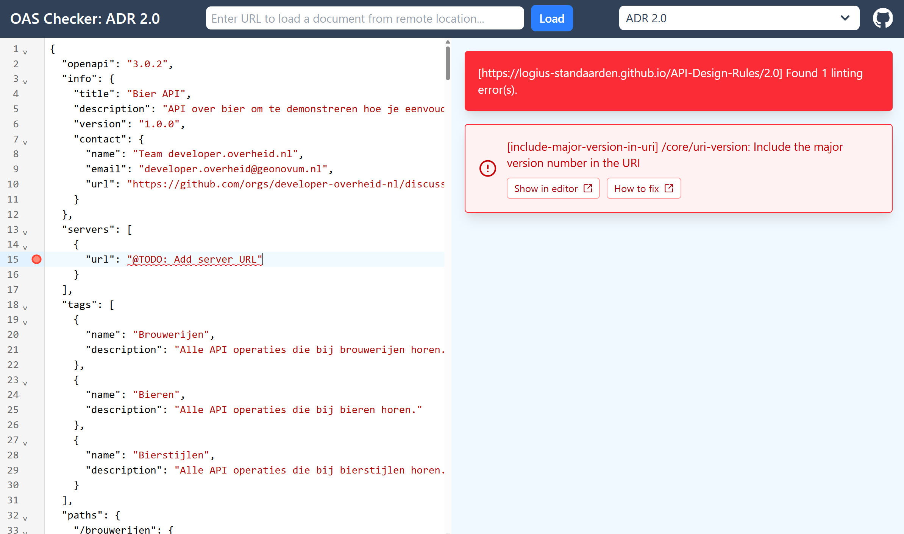

# 4. Valideer de OAS

Voordat we code gaan genereren, is het belangrijk om te controleren of onze
OpenAPI Specification voldoet aan de API Design Rules (ADR). Hiervoor gebruiken
we onze OAS Checker.

## OAS Checker

De [OAS Checker](https://developer-overheid-nl.github.io/oas-checker) is een
online tool om een OAS te valideren tegen de API Design Rules. Onder de motorkap
gebruikt de OAS Checker dezelfde Spectral ruleset als de ADR Linter.

1. [Open de OAS Checker](https://developer-overheid-nl.github.io/oas-checker).
2. Kopieer de volledige OAS uit de Swagger Editor.
3. Plak de OAS in het invoerveld.
4. De validatie start automatisch en toont de resultaten.

 _De OAS Checker met links onze JSON input en
rechts de validatie output_

## Fouten oplossen

Onze OAS bevat, zoals je kunt zien, één fout die in strijd is met de API Design
Rules:

> [include-major-version-in-uri] /core/uri-version: Include the major version
> number in the URI

Met de knop "How to fix" lees je meer over deze foutmelding en hoe je het kunt
oplossen. Er staat niet voor niks `@TODO` in de boilerplate, dus de server URL
moet nog ingevoerd worden. Voor deze tutorial gaan we het endpoint op
`https://api.bieren.nepdomein` draaien. Omdat de validator valt over het
versienummer en we bezig zijn met versie 1.0 van de API, plakken we `/v1`
erachter. De waarde van de server `url` wordt dus:
`https://api.bieren.nepdomein/v1`. Zodra je dit hebt aangepast meldt de checker:

> [https://logius-standaarden.github.io/API-Design-Rules/2.0] No violations
> found.

<details>
  <summary>De spec zou er op dit moment zo uit moeten zien</summary>

```json
{
  "openapi": "3.0.2",
  "info": {
    "title": "Bier API",
    "description": "API over bier om te demonstreren hoe je eenvoudig een API kunt ontwikkelen.",
    "version": "1.0.0",
    "contact": {
      "name": "Team developer.overheid.nl",
      "email": "developer.overheid@geonovum.nl",
      "url": "https://github.com/orgs/developer-overheid-nl/discussions"
    }
  },
  "servers": [
    {
      "url": "https://api.bieren.nepdomein/v1"
    }
  ],
  "tags": [
    {
      "name": "Brouwerijen",
      "description": "Alle API operaties die bij brouwerijen horen."
    },
    {
      "name": "Bieren",
      "description": "Alle API operaties die bij bieren horen."
    },
    {
      "name": "Bierstijlen",
      "description": "Alle API operaties die bij bierstijlen horen."
    }
  ],
  "paths": {
    "/brouwerijen": {
      "get": {
        "operationId": "listBrouwerijen",
        "description": "Endpoint om alle brouwerijen op te halen. @TODO: Voeg hier eventueel extra informatie toe over het filteren, pagineren, etc.",
        "summary": "Alle brouwerijen ophalen",
        "tags": ["Brouwerijen"],
        "parameters": [
          {
            "name": "grootte",
            "in": "query",
            "required": false,
            "schema": {
              "type": "string",
              "enum": ["hobby", "micro", "groot"]
            }
          }
        ],
        "responses": {
          "200": {
            "headers": {
              "API-Version": {
                "$ref": "https://static.developer.overheid.nl/adr/components.yaml#/headers/API-Version"
              },
              "Link": {
                "$ref": "https://static.developer.overheid.nl/adr/components.yaml#/headers/Link"
              }
            },
            "description": "OK",
            "content": {
              "application/json": {
                "schema": {
                  "type": "array",
                  "items": {
                    "$ref": "#/components/schemas/Brouwerij"
                  }
                }
              }
            }
          }
        }
      },
      "post": {
        "operationId": "createBrouwerij",
        "description": "Nieuwe brouwerij aanmaken",
        "summary": "Nieuwe brouwerij aanmaken",
        "tags": ["Brouwerijen"],
        "responses": {
          "201": {
            "headers": {
              "API-Version": {
                "$ref": "https://static.developer.overheid.nl/adr/components.yaml#/headers/API-Version"
              }
            },
            "description": "Created",
            "content": {
              "application/json": {
                "schema": {
                  "$ref": "#/components/schemas/Brouwerij"
                }
              }
            }
          },
          "400": {
            "$ref": "https://static.developer.overheid.nl/adr/components.yaml#/responses/400"
          }
        }
      }
    },
    "/brouwerijen/{id}": {
      "parameters": [
        {
          "$ref": "#/components/parameters/id"
        }
      ],
      "get": {
        "operationId": "retrieveBrouwerij",
        "description": "Brouwerij ophalen",
        "summary": "Brouwerij ophalen",
        "tags": ["Brouwerijen"],
        "responses": {
          "200": {
            "headers": {
              "API-Version": {
                "$ref": "https://static.developer.overheid.nl/adr/components.yaml#/headers/API-Version"
              }
            },
            "description": "OK",
            "content": {
              "application/json": {
                "schema": {
                  "$ref": "#/components/schemas/Brouwerij"
                }
              }
            }
          },
          "404": {
            "$ref": "https://static.developer.overheid.nl/adr/components.yaml#/responses/404"
          }
        }
      },
      "put": {
        "operationId": "editBrouwerij",
        "description": "Brouwerij wijzigen",
        "summary": "Brouwerij wijzigen",
        "tags": ["Brouwerijen"],
        "responses": {
          "200": {
            "headers": {
              "API-Version": {
                "$ref": "https://static.developer.overheid.nl/adr/components.yaml#/headers/API-Version"
              }
            },
            "description": "OK",
            "content": {
              "application/json": {
                "schema": {
                  "$ref": "#/components/schemas/Brouwerij"
                }
              }
            }
          },
          "400": {
            "$ref": "https://static.developer.overheid.nl/adr/components.yaml#/responses/400"
          }
        }
      },
      "delete": {
        "operationId": "removeBrouwerij",
        "description": "Brouwerij verwijderen",
        "summary": "Brouwerij verwijderen",
        "tags": ["Brouwerijen"],
        "responses": {
          "204": {
            "$ref": "https://static.developer.overheid.nl/adr/components.yaml#/responses/204"
          },
          "404": {
            "$ref": "https://static.developer.overheid.nl/adr/components.yaml#/responses/404"
          }
        }
      }
    },
    "/bieren": {
      "get": {
        "operationId": "listBieren",
        "description": "Endpoint om alle bieren op te halen. @TODO: Voeg hier eventueel extra informatie toe over het filteren, pagineren, etc.",
        "summary": "Alle bieren ophalen",
        "tags": ["Bieren"],
        "responses": {
          "200": {
            "headers": {
              "API-Version": {
                "$ref": "https://static.developer.overheid.nl/adr/components.yaml#/headers/API-Version"
              },
              "Link": {
                "$ref": "https://static.developer.overheid.nl/adr/components.yaml#/headers/Link"
              }
            },
            "description": "OK",
            "content": {
              "application/json": {
                "schema": {
                  "type": "array",
                  "items": {
                    "$ref": "#/components/schemas/Bier"
                  }
                }
              }
            }
          }
        }
      },
      "post": {
        "operationId": "createBier",
        "description": "Nieuwe bier aanmaken",
        "summary": "Nieuwe bier aanmaken",
        "tags": ["Bieren"],
        "responses": {
          "201": {
            "headers": {
              "API-Version": {
                "$ref": "https://static.developer.overheid.nl/adr/components.yaml#/headers/API-Version"
              }
            },
            "description": "Created",
            "content": {
              "application/json": {
                "schema": {
                  "$ref": "#/components/schemas/Bier"
                }
              }
            }
          },
          "400": {
            "$ref": "https://static.developer.overheid.nl/adr/components.yaml#/responses/400"
          }
        }
      }
    },
    "/bieren/{id}": {
      "parameters": [
        {
          "$ref": "#/components/parameters/id"
        }
      ],
      "get": {
        "operationId": "retrieveBier",
        "description": "Bier ophalen",
        "summary": "Bier ophalen",
        "tags": ["Bieren"],
        "responses": {
          "200": {
            "headers": {
              "API-Version": {
                "$ref": "https://static.developer.overheid.nl/adr/components.yaml#/headers/API-Version"
              }
            },
            "description": "OK",
            "content": {
              "application/json": {
                "schema": {
                  "$ref": "#/components/schemas/Bier"
                }
              }
            }
          },
          "404": {
            "$ref": "https://static.developer.overheid.nl/adr/components.yaml#/responses/404"
          }
        }
      },
      "put": {
        "operationId": "editBier",
        "description": "Bier wijzigen",
        "summary": "Bier wijzigen",
        "tags": ["Bieren"],
        "responses": {
          "200": {
            "headers": {
              "API-Version": {
                "$ref": "https://static.developer.overheid.nl/adr/components.yaml#/headers/API-Version"
              }
            },
            "description": "OK",
            "content": {
              "application/json": {
                "schema": {
                  "$ref": "#/components/schemas/Bier"
                }
              }
            }
          },
          "400": {
            "$ref": "https://static.developer.overheid.nl/adr/components.yaml#/responses/400"
          }
        }
      },
      "delete": {
        "operationId": "removeBier",
        "description": "Bier verwijderen",
        "summary": "Bier verwijderen",
        "tags": ["Bieren"],
        "responses": {
          "204": {
            "$ref": "https://static.developer.overheid.nl/adr/components.yaml#/responses/204"
          },
          "404": {
            "$ref": "https://static.developer.overheid.nl/adr/components.yaml#/responses/404"
          }
        }
      }
    },
    "/bierstijlen": {
      "get": {
        "operationId": "listBierstijlen",
        "description": "Endpoint om alle bierstijlen op te halen. @TODO: Voeg hier eventueel extra informatie toe over het filteren, pagineren, etc.",
        "summary": "Alle bierstijlen ophalen",
        "tags": ["Bierstijlen"],
        "responses": {
          "200": {
            "headers": {
              "API-Version": {
                "$ref": "https://static.developer.overheid.nl/adr/components.yaml#/headers/API-Version"
              },
              "Link": {
                "$ref": "https://static.developer.overheid.nl/adr/components.yaml#/headers/Link"
              }
            },
            "description": "OK",
            "content": {
              "application/json": {
                "schema": {
                  "type": "array",
                  "items": {
                    "$ref": "#/components/schemas/Bierstijl"
                  }
                }
              }
            }
          }
        }
      }
    },
    "/bierstijlen/{id}": {
      "parameters": [
        {
          "$ref": "#/components/parameters/id"
        }
      ],
      "get": {
        "operationId": "retrieveBierstijl",
        "description": "Bierstijl ophalen",
        "summary": "Bierstijl ophalen",
        "tags": ["Bierstijlen"],
        "responses": {
          "200": {
            "headers": {
              "API-Version": {
                "$ref": "https://static.developer.overheid.nl/adr/components.yaml#/headers/API-Version"
              }
            },
            "description": "OK",
            "content": {
              "application/json": {
                "schema": {
                  "$ref": "#/components/schemas/Bierstijl"
                }
              }
            }
          },
          "404": {
            "$ref": "https://static.developer.overheid.nl/adr/components.yaml#/responses/404"
          }
        }
      }
    }
  },
  "components": {
    "schemas": {
      "Brouwerij": {
        "description": "Brouwerij",
        "properties": {
          "id": {
            "type": "string",
            "format": "uuid",
            "description": "Unieke identifier",
            "example": "046b6c7f-0b8a-43b9-b35d-6489e6daee93"
          },
          "naam": {
            "type": "string",
            "description": "Naam",
            "example": "Weizen Tripel"
          },
          "grootte": {
            "type": "string",
            "enum": ["hobby", "micro", "groot"],
            "description": "Grootte brouwerij (hobby/micro/groot)",
            "example": "micro"
          },
          "adres": {
            "description": "Adres",
            "properties": {
              "straat": {
                "type": "string",
                "description": "Straatnaam",
                "example": "Waldeck Pyrmontsingel"
              },
              "huisnummer": {
                "type": "number",
                "description": "Huisnummer",
                "example": 12
              },
              "postcode": {
                "type": "string",
                "description": "Postcode",
                "example": "6521 BC"
              },
              "plaats": {
                "type": "string",
                "description": "Plaats",
                "example": "Nijmegen"
              }
            },
            "required": ["straat", "huisnummer", "postcode", "plaats"]
          }
        },
        "required": ["id", "naam", "grootte"]
      },
      "Bier": {
        "properties": {
          "id": {
            "type": "string",
            "format": "uuid",
            "description": "Unieke identifier",
            "example": "046b6c7f-0b8a-43b9-b35d-6489e6daee92"
          },
          "naam": {
            "type": "string",
            "description": "Naam",
            "example": "Weizen Tripel"
          },
          "alcoholPercentage": {
            "type": "number",
            "format": "double",
            "description": "Alcoholpercentage",
            "example": 7.6
          },
          "bierstijl": {
            "$ref": "#/components/schemas/Bierstijl"
          },
          "brouwerij": {
            "$ref": "#/components/schemas/Brouwerij"
          }
        },
        "required": ["id", "naam", "alcoholPercentage", "bierstijl"]
      },
      "Bierstijl": {
        "description": "Bierstijl",
        "properties": {
          "id": {
            "type": "string",
            "format": "uuid",
            "description": "Unieke identifier",
            "example": "046b6c7f-0b8a-43b9-b35d-6489e6daee91"
          },
          "naam": {
            "type": "string",
            "description": "Naam",
            "example": "Quadrupel"
          }
        },
        "required": ["id", "naam"]
      }
    },
    "parameters": {
      "id": {
        "name": "id",
        "in": "path",
        "description": "id",
        "required": true,
        "schema": {
          "type": "string"
        }
      }
    }
  }
}
```

</details>

:::tip Lokale validatie

Voor grotere projecten is het handig om de validatie te integreren in de
development workflow. De ADR Linter kan ook via CLI, in de IDE, of in CI/CD
pipelines draaien. Zie de
[ADR Linter documentatie](/kennisbank/api-ontwikkeling/tools/api-design-rules-linter)
voor meer informatie.

:::

## Wat hebben we geleerd?

- Hoe we de **OAS Checker** gebruiken om de specificatie te valideren
- Hoe we fouten oplossen die de checker meldt

## Volgende stap

Onze OAS is gevalideerd en voldoet aan de API Design Rules. Nu is het tijd om
daadwerkelijk code te genereren en onze API tot leven te brengen.

[Ga naar stap 5: Genereer API code](./5-genereer-api-code.md)
