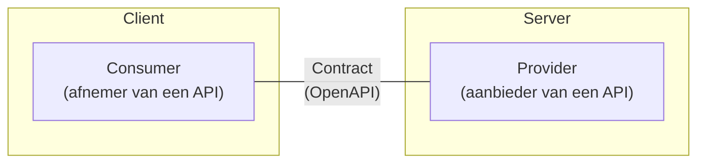

import { Card } from "@rijkshuisstijl-community/components-react";

import Grid from "../../src/components/Grid";

# API's

Overheidsorganisaties ontwikkelen API's om allerlei data snel, efficiënt en op een gestandaardiseerde manier te delen met andere overheidsorganisaties en andere partijen die met de overheid werken.

API's (Application Programming Interfaces) zijn handig omdat ze interactie tussen verschillende softwaretoepassingen mogelijk maken. Ze dienen als een tussenlaag die applicaties of systemen met elkaar laat communiceren, zonder dat ze direct toegang tot elkaars broncode of onderliggende infrastructuur nodig hebben.

## REST API's

Het meest gebruikte type API wordt een REST API genoemd. Het gebruik van REST API's is om de volgende redenen populair geworden:

- REST API's maken gebruik van HTTP-methoden zoals `GET`, `POST`, `PUT` en `DELETE`, die standaard zijn in webtechnologieën. Hierdoor kunnen ontwikkelaars eenvoudig met een REST API werken zonder uitgebreide training.
- REST API's werken over HTTP, wat betekent dat ze kunnen worden gebruikt door verschillende soorten clients, zoals webapplicaties, mobiele apps en IoT-apparaten, ongeacht het onderliggende platform.
- REST API's maken het mogelijk om onderdelen van een systeem los te koppelen. Front-end en back-end kunnen onafhankelijk van elkaar worden ontwikkeld, wat onderhoud en innovatie vergemakkelijkt. REST API's zijn een logisch onderdeel van een microservices architectuur.

### Consumers en providers

Binnen een API landschap zijn de **consumer** (of client) en de **provider** (of server) de belangrijkste spelers. Tussen hen wordt een communicatiecontract
gesloten, dat we vastleggen in een **OpenAPI specificatie**. 

Zoals de namen al weggeven, is de consumer de afnemer en de provider de aanbieder van een API. Een provider is autoritatief over de informatie die
het ontsluit. In diagrammen wordt de consumer meestal links getekend en de provider rechts. 
Dit volgt de conventie waarbij we beginnen bij de initiatiefnemer: een verzoek stroomt van links naar rechts, een antwoord van rechts naar links.

## Bronnen

- [Kennisplatform API's](/communities/kennisplatform-apis/)

## Aan de slag!
<Grid>
  <Card
    appearance="default"
    description="Test je API op onvoorziene resultaten met WuppieFuzz en voorkom data breaches."
    heading="Test je API met fuzzing"
    href="./tools/wuppiefuzz"
    linkLabel="Naar de tutorial"
  />
</Grid>

 
 

