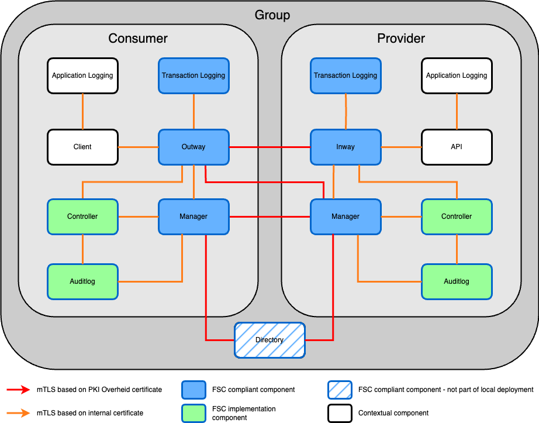
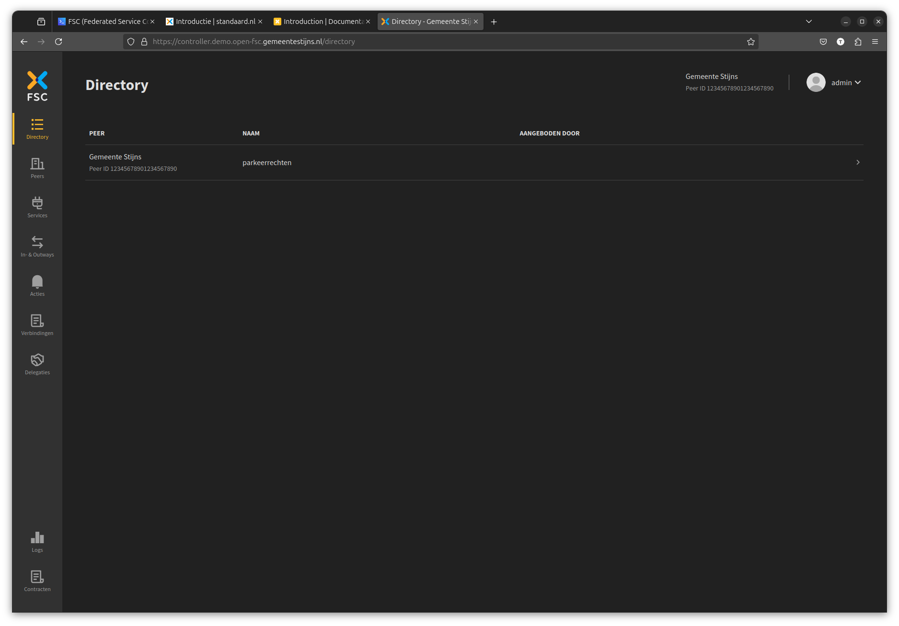
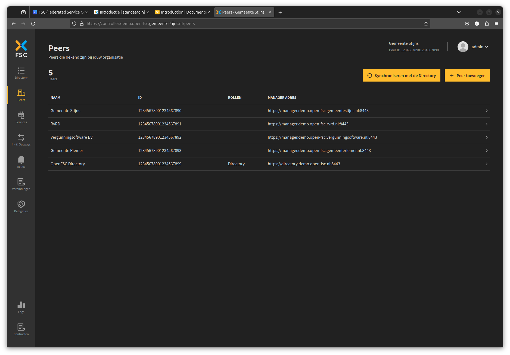
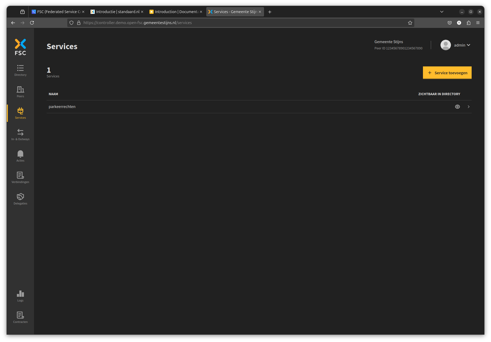
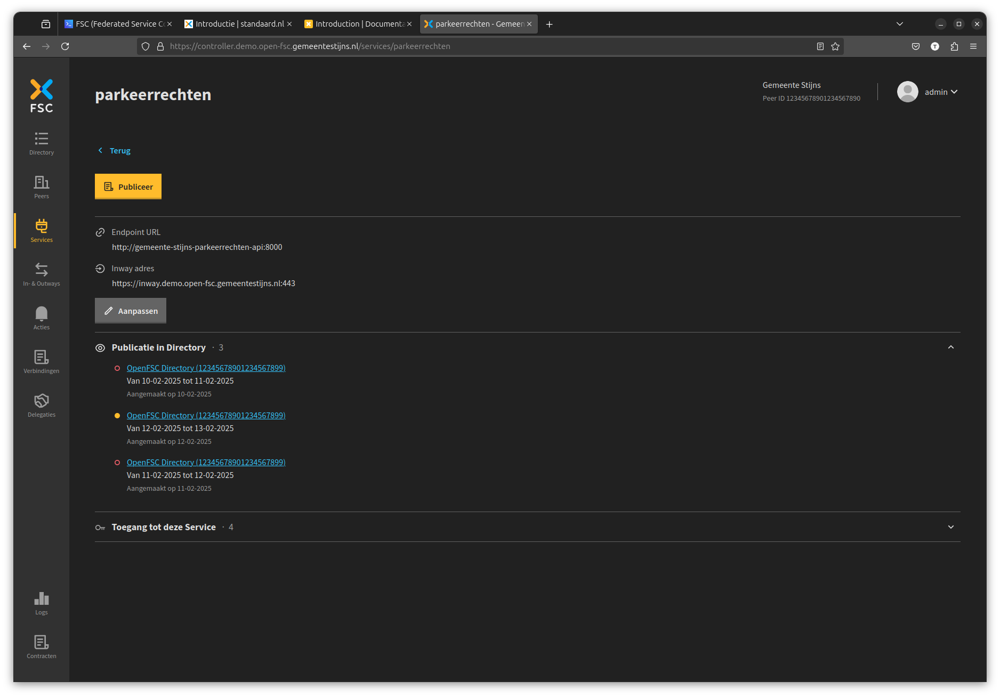
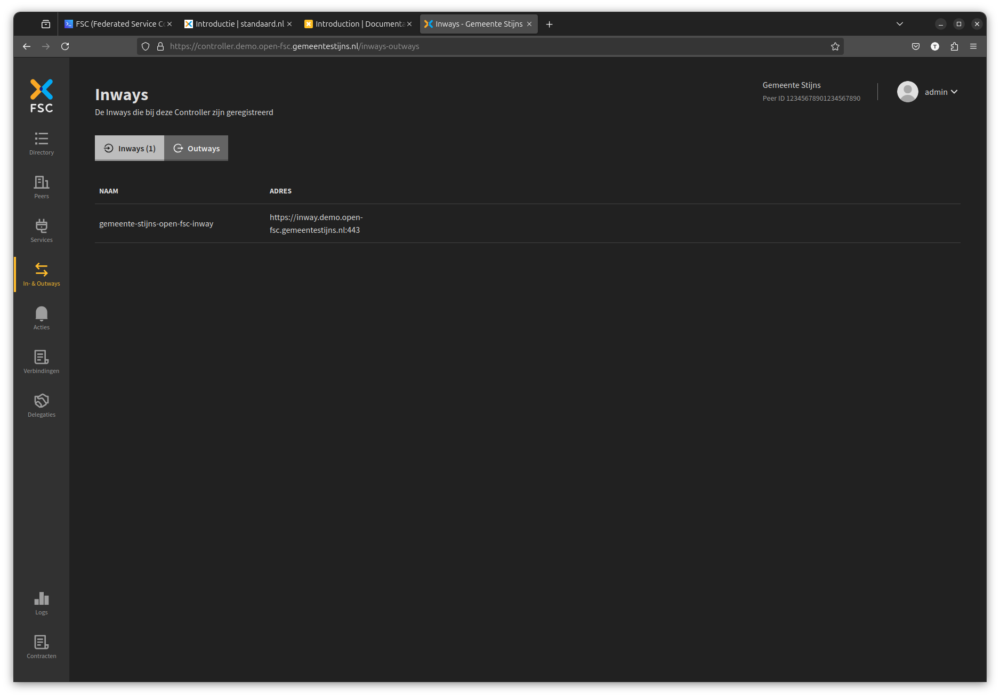
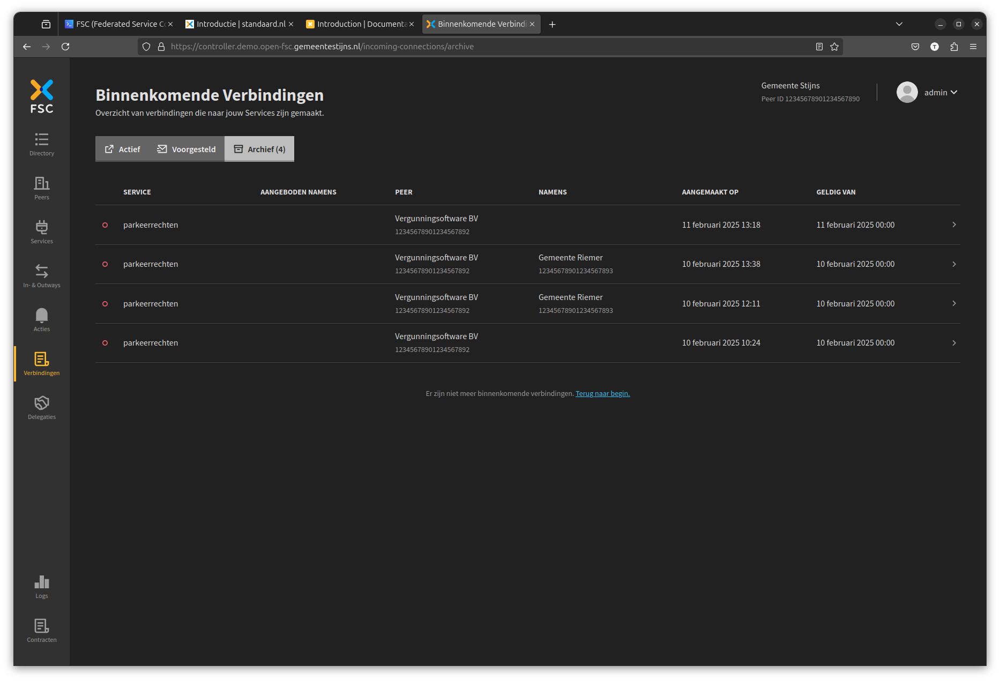
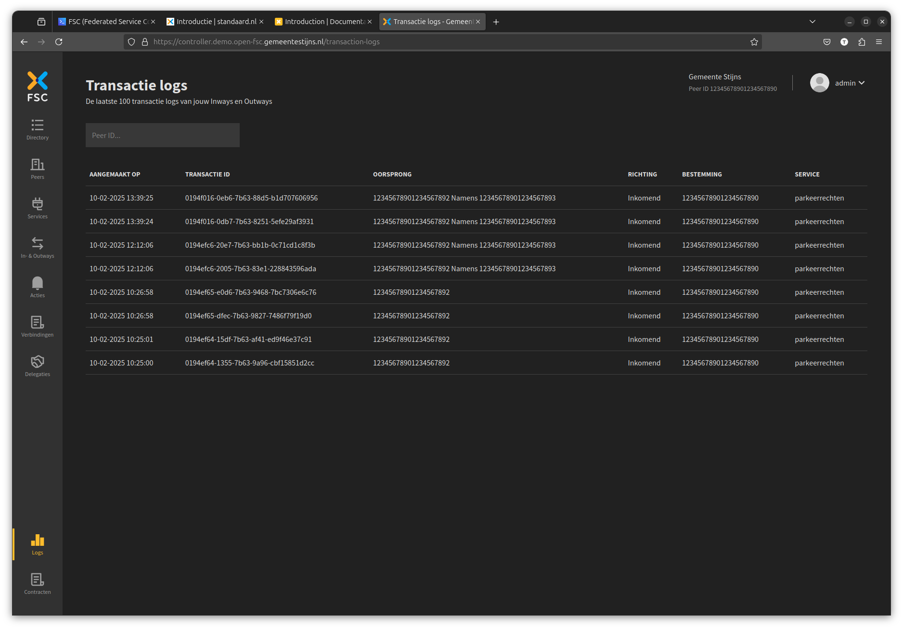
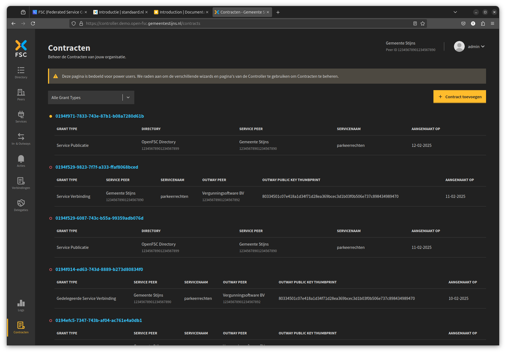

---
tags:
  - "fsc"
  - "gegevensuitwisseling"
  - "digikoppeling"
  - "privacy"
  - "data-bij-de-bron"
title: "FSC (Federated Service Connectivity)"
---

:::info[**TL;DR**]

De [FSC-standaard](https://fsc-standaard.nl) beschrijft hoe koppelingen voor gegevensuitwisseling moeten worden gerealiseerd om ze beheersbaar, veilig en betrouwbaar te houden. [OpenFSC](https://docs.open-fsc.nl/) is de bijbehorende technische referentie-implementatie die je direct lokaal kan draaien.

:::

## Standaardisatie in gegevensuitwisseling

Een grote uitdaging voor de overheid is het standaardiseren van gegevensuitwisseling. Volgens het principe **Data bij de Bron** moeten organisaties die verantwoordelijk zijn voor data deze op een bruikbare manier beschikbaar stellen. Wanneer de aanbieder de data op een gestandaardiseerde wijze ontsluit, kan de afnemende partij deze eenvoudig in haar processen gebruiken. Dit vermindert de noodzaak om de data lokaal te kopiëren.

De FSC standaard helpt je op het gebied van de volgende thema's:

- **Logging**: door middel van transactielogging heb je op een gestandaardiseerde manier inzicht in welke gegevens er zijn ingezien.
- **Security**: de FSC standaard schrijft voor dat aanbieder en afnemer van de data communiceren middels een [PKIoverheid](https://www.logius.nl/domeinen/toegang/pkioverheid) beveiligingscertificaat.
- **Autorisatie**: in de beheeromgeving zie je per service welke organisaties er toegang tot hebben, en heb je de mogelijkheid om nieuwe organisaties toegang te geven.
- **Beheerbaarheid**: de beheeromgeving bevat een zogenaamde "directory" waarin je kan zien welke services er allemaal beschikbaar zijn.

 

## Aan de slag

Er zijn twee manieren om lokaal OpenFSC te draaien, via Docker Compose en door het gebruik van Helm.

### Met Docker Compose

In deze tutorial leer je hoe je een lokale testomgeving opzet, met als doel om API's te ontsluiten door middel van een FSC "group". Vervolgens kan je de Controller web-interface gebruiken om je FSC componenten te beheren.

- [Naar de tutorial voor Docker Compose](https://docs.open-fsc.nl/try-fsc/docker/introduction)

### Met Helm

In deze tutorial bouw je met Helm een omgeving op van waaruit je een API ofwel service kan aanbieden op de FSC-manier.

- [Naar de tutorial voor Helm](https://docs.open-fsc.nl/try-fsc/helm/introduction)

## Screenshots

Beheeromgeving: directory view

Beheeromgeving: peers view

Beheeromgeving: services view

Beheeromgeving: services detail page

Beheeromgeving: inways view

Beheeromgeving: verbindingen view

Beheeromgeving: logs view

Beheeromgeving: contracten view

## Externe links

- [Website FSC](https://fsc-standaard.nl/)
- [Technische docs OpenFSC](https://docs.open-fsc.nl)
