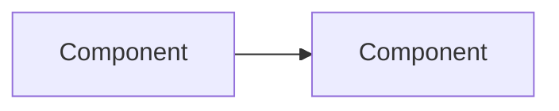

# Content Type Sjablonen

Dit document bevat de sjablonen voor de verschillende content types in de kennisbank.

## Overzicht Content Types

| Type | Gebruik voor | Voorbeeld |
|------|--------------|-----------|
| `standaard` | Specificaties, protocollen, formaten | OAuth, DCAT, ADR |
| `tool` | Software, validators, editors | WuppieFuzz, OpenKAT |
| `tutorial` | Stapsgewijze handleidingen | Bouw een API |
| `architectuur` | Patronen en concepten | EDA, Webhooks |
| `richtlijn` | NeRDS leidraad content | Principes 1-13 |

---

## Sjabloon: Standaard

````markdown
---
title: "[Naam van de standaard]"
content_type: standaard
tags:
  - [relevante-tag]
---

# [Naam van de standaard]

*Korte beschrijving (1-2 alinea's): Wat is deze standaard en wat lost het op?*

## Hoe werkt het?

*Beschrijf de kernconcepten en werking. Gebruik diagrammen of voorbeelden.*

## Toepassing in Nederland

*Beschrijf het Nederlandse profiel of specifieke toepassing binnen de overheid.
Link naar NL GOV profielen, Forum Standaardisatie, etc.*

## Wanneer gebruik je dit?

**Geschikt voor:**
- Use case 1
- Use case 2

**Niet geschikt voor:**
- Situatie waar een alternatief beter past

## Gerelateerde standaarden

- [Standaard A](link) - voor X
- [Standaard B](link) - alternatief voor Y

## Bronnen

### Officiële documentatie
- [Officiële specificatie](link)
- [NL GOV profiel](link)

### Gerelateerde artikelen
- [Kennisbank artikel](link)
````

---

## Sjabloon: Tool

````markdown
---
title: "[Naam van de tool]"
content_type: tool
tags:
  - [relevante-tag]
---

# [Naam van de tool]

*Korte beschrijving: Wat doet deze tool en voor wie?*

## Kenmerken

- Feature 1
- Feature 2
- Feature 3

## Hoe werkt het?

*Beschrijf de werking. Voeg screenshots of codevoorbeelden toe.*

## Aan de slag

### Vereisten

- Vereiste 1
- Vereiste 2

### Installatie / Gebruik

```bash
# Installatiecommando's of link naar online tool
```

## Waarom deze tool?

*Voordelen en relevantie voor overheidsontwikkelaars.*

## Alternatieven

| Tool | Wanneer kiezen |
|------|----------------|
| [Alternatief A](link) | Voor situatie X |

## Bronnen

- [GitHub / Website](link)
- [Documentatie](link)
````

---

## Sjabloon: Tutorial (single-page)

Voor korte tutorials die op één pagina passen.

````markdown
---
title: "[Titel in gebiedende wijs]"
content_type: tutorial
tags:
  - [relevante-tag]
---

# [Titel]

*Korte intro: Wat ga je leren?*

## Wat je gaat maken

*Beschrijf het eindresultaat.*

## Waarom?

*Korte motivatie.*

## Vereisten

- Vereiste 1
- Vereiste 2

## Stappen

### Stap 1: [Actie]

*Beschrijving.*

```bash
# Code indien nodig
```

### Stap 2: [Actie]

*Beschrijving.*

### Stap 3: [Actie]

*Beschrijving.*

## Resultaat

*Wat heeft de lezer bereikt?*

## Veelvoorkomende problemen

| Probleem | Oplossing |
|----------|-----------|
| Fout X | Doe Y |

## Bronnen

- [Verdieping](link)
- [Gerelateerde tutorial](link)
````

---

## Sjabloon: Tutorial (multi-page)

Voor uitgebreide tutorials die zijn opgesplitst in meerdere pagina's/stappen.

### Mappenstructuur

```
tutorials/
└── [tutorial-naam]/
    ├── index.md              (overzichtspagina)
    ├── 1-[eerste-stap].md
    ├── 2-[tweede-stap].md
    ├── 3-[derde-stap].md
    └── ...
```

### Overzichtspagina (index.md)

````markdown
---
title: "[Titel van de tutorial]"
content_type: tutorial
tags:
  - [relevante-tag]
sidebar_position: 0
---

# [Titel van de tutorial]

*Korte intro: Wat ga je leren in deze tutorial?*

## Wat je gaat maken

*Beschrijf het eindresultaat. Voeg een screenshot of diagram toe.*

## Waarom deze tutorial?

*Korte motivatie: waarom is dit nuttig?*

## Vereisten

Voordat je begint, zorg dat je het volgende hebt:

- Vereiste 1
- Vereiste 2
- Basiskennis van X

## Overzicht van de stappen

| Stap | Titel | Beschrijving |
|------|-------|--------------|
| 1 | [Eerste stap](./1-eerste-stap.md) | Korte beschrijving |
| 2 | [Tweede stap](./2-tweede-stap.md) | Korte beschrijving |
| 3 | [Derde stap](./3-derde-stap.md) | Korte beschrijving |

## Bronnen

- [Gerelateerde documentatie](link)
- [Externe resource](link)

---

**Klaar om te beginnen?**

[Start met stap 1: [Titel eerste stap] →](./1-eerste-stap.md)
````

### Tussenstap (2-[stap-naam].md)

````markdown
---
title: "Stap 2: [Titel van de stap]"
content_type: tutorial
tags:
  - [relevante-tag]
sidebar_position: 2
---

# Stap 2: [Titel van de stap]

*Korte intro (1-2 zinnen): Wat ga je in deze stap doen en waarom?*

## Wat je nodig hebt

Voordat je deze stap start, zorg dat je:

- [ ] Stap 1 hebt afgerond
- [ ] [Specifieke vereiste voor deze stap]
- [ ] [Bestand/tool/configuratie] klaar hebt staan

## [Hoofdsectie 1]

*Inhoud van de stap.*

```bash
# Code indien nodig
```

## [Hoofdsectie 2]

*Vervolg van de stap.*

## Wat hebben we geleerd?

In deze stap heb je:

- [Geleerd concept 1]
- [Geleerd concept 2]
- [Resultaat bereikt]

---

**Volgende stap**

Je bent klaar voor de volgende stap waarin je [korte preview van volgende stap].

[Ga naar stap 3: [Titel volgende stap] →](./3-volgende-stap.md)
````

### Eerste stap (1-[stap-naam].md)

````markdown
---
title: "Stap 1: [Titel van de stap]"
content_type: tutorial
tags:
  - [relevante-tag]
sidebar_position: 1
---

# Stap 1: [Titel van de stap]

*Korte intro (1-2 zinnen): Wat ga je in deze stap doen en waarom?*

## Wat je nodig hebt

Voordat je begint, zorg dat je het volgende hebt:

- [ ] [Vereiste 1]
- [ ] [Vereiste 2]
- [ ] [Software/tool geïnstalleerd]

## [Hoofdsectie 1]

*Inhoud van de stap.*

## [Hoofdsectie 2]

*Vervolg van de stap.*

## Wat hebben we geleerd?

In deze stap heb je:

- [Geleerd concept 1]
- [Resultaat bereikt]

---

**Volgende stap**

Je bent klaar voor de volgende stap waarin je [korte preview van volgende stap].

[Ga naar stap 2: [Titel volgende stap] →](./2-volgende-stap.md)
````

### Laatste stap ([n]-[stap-naam].md)

````markdown
---
title: "Stap [N]: [Titel van de stap]"
content_type: tutorial
tags:
  - [relevante-tag]
sidebar_position: [N]
---

# Stap [N]: [Titel van de stap]

*Korte intro (1-2 zinnen): Wat ga je in deze stap doen en waarom?*

## Wat je nodig hebt

Voordat je deze stap start, zorg dat je:

- [ ] Alle voorgaande stappen hebt afgerond
- [ ] [Specifieke vereiste voor deze stap]

## [Hoofdsectie 1]

*Inhoud van de stap.*

## [Hoofdsectie 2]

*Vervolg van de stap.*

## Wat hebben we geleerd?

In deze stap heb je:

- [Geleerd concept 1]
- [Geleerd concept 2]
- [Eindresultaat bereikt]

---

## Tutorial afgerond!

Gefeliciteerd! Je hebt de tutorial afgerond. Je hebt nu:

- [Samenvatting resultaat 1]
- [Samenvatting resultaat 2]
- [Wat je nu kunt]

### Volgende stappen

- [Verdieping / gerelateerde tutorial](link)
- [Documentatie](link)
- [Community / hulp](link)

### Feedback

Heb je feedback over deze tutorial? [Laat het ons weten](link-naar-feedback).
````

---

## Sjabloon: Architectuur

````markdown
---
title: "[Naam van het patroon]"
content_type: architectuur
tags:
  - [relevante-tag]
---

# [Naam van het patroon]

*Wat is dit patroon en welk probleem lost het op?*

## Het probleem

*Beschrijf het probleem met concrete voorbeelden.*

## De oplossing

*Hoe lost dit patroon het probleem op?*



## Kernconcepten

### Concept 1
*Uitleg*

### Concept 2
*Uitleg*

## Wanneer gebruik je dit?

**Geschikt voor:**
- Situatie 1
- Situatie 2

**Niet geschikt voor:**
- Situatie waar alternatief beter past

## Best practices

- Best practice 1
- Best practice 2

## Implementatie-opties

| Optie | Geschikt voor |
|-------|---------------|
| [Optie A](link) | Situatie X |
| [Optie B](link) | Situatie Y |

## Gerelateerde patronen

- [Patroon A](link) - vaak gecombineerd
- [Patroon B](link) - alternatief

## Bronnen

- [Externe resource](link)
````

---

## Sjabloon: Blog

````markdown
---
title: "[Titel van de blogpost]"
authors: [author-id]
tags:
  - [relevante-tag]
---

# [Titel]

*Inleiding: waar gaat dit artikel over?*

## [Hoofdsectie 1]

*Inhoud*

## [Hoofdsectie 2]

*Inhoud*

## Conclusie

*Samenvatting en call-to-action.*

## Bronnen

### Gerelateerde kennisbankartikelen
- [Artikel](link)

### Externe bronnen
- [Bron](link)
````

---

## Noot over Richtlijnen

Voor richtlijnen (NeRDS Leidraad) bestaat al een uitgebreid sjabloon:
[Richtlijnsjabloon v1](leidraad/richtlijnsjabloon-v1.md)
